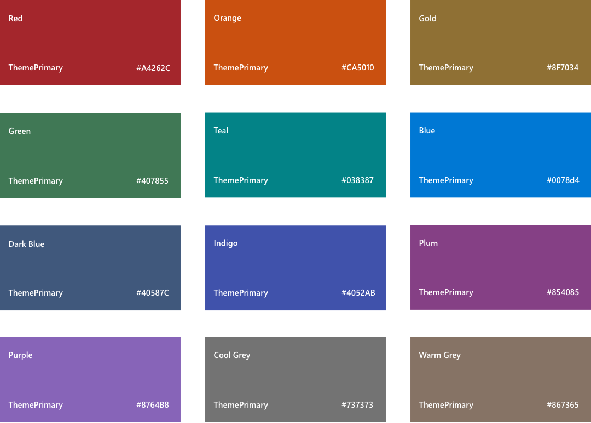

# SharePoint themes and colors

Like the Microsoft brand palette, the SharePoint themes are designed to build on the Microsoft brand, while at the same time allowing for flexibility to enliven our partnerships without dominating them. They reveal our shared goals and personality, and they reflect our diversity and ability to optimize the SharePoint experience.

## Main colors

The SharePoint color palette is now optimized for screens and devices. In addition, it is optimized to provide enough flexibility to ensure continuity with your brand. The SharePoint-provided colors also guarantee accessible and legible experiences.

## Neutral palette

Neutral colors recede into the background to let our products shine. They allow brand colors to pop when we need to draw attention to content. When coupling neutrals with brand colors, make sure there is suitable contrast between them.

## Shades and tints

After you select a color, light and dark shades of the accent color are created based on HSB values of color luminosity. Web parts and apps can use shade variations to create visual hierarchy and provide an indication of interaction.

## Dark themes

SharePoint includes a palette that supports dark themes. The SharePoint-provided colors guarantee accessible and legible experiences.

## Principles

The following design principles helped form the current SharePoint themes and color palette.

### Guided
Our theming system works at a global level so that updates can be made consistently across each site, allowing users to optimize their websites effortlessly. Our theming system operates in a controlled environment so that successful outcomes can be optimized quickly.

### Smart and efficient
Our theming system expedites the site creation process by using smart algorithms to generate options that maximize aesthetic choices.

### Professional
Our themes embody a professional look and feel that ensures coherency and conveys the brand of our enterprise audiences.

### Accessible
Our built-in accessibility checker ensures universal design at all levels of default themes. For users who decide to customize, we provide helpful guidelines to design for accessibility.

## See also

- [Accessibility](accessibility.md)
- [Designing great SharePoint experiences](design-guidance-overview.md)
