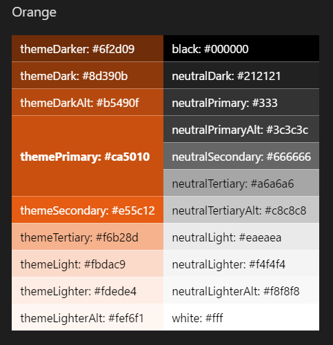

# SharePoint themes and colors

Like the Microsoft brand palette, the SharePoint themes are designed to build on the Microsoft brand, while at the same time allow for flexibility to enliven our partnerships without dominating them. They reveal our shared goals and personality and reflect our diversity and ability to optimize the SharePoint experience.

 

## Themes

The following design principles helped form the current SharePoint themes and color palette.

**Guided**. Our theming system works at a global level so that updates can be made consistently across each site, allowing users to optimize their websites effortlessly. Our theming system operates in a controlled environment so that successful outcomes can be optimized quickly.

**Smart and efficient**. Our theming system expedites the site creation process by using smart algorithms to generate options that maximize aesthetic choices.

**Professional**. Our themes embody a professional look and feel that ensures coherency and conveys the brand of our enterprise audiences.

**Accessible**. Our built-in accessibility checker ensures universal design at all levels of default themes. For users who decide to customize, we provide helpful guidelines to design for accessibility.

## Colors

The SharePoint color palette has been optimized for screens and devices, and to provide enough flexibility to ensure continuity with your brand. The SharePoint-provided colors also guarantee accessible and legible experiences.

### Red

 

### Orange

 

### Green

 

### Blue

 

### Purple

 

### Gray

 

## See also

- [Designing great SharePoint experiences](design-guidance-overview.md)
