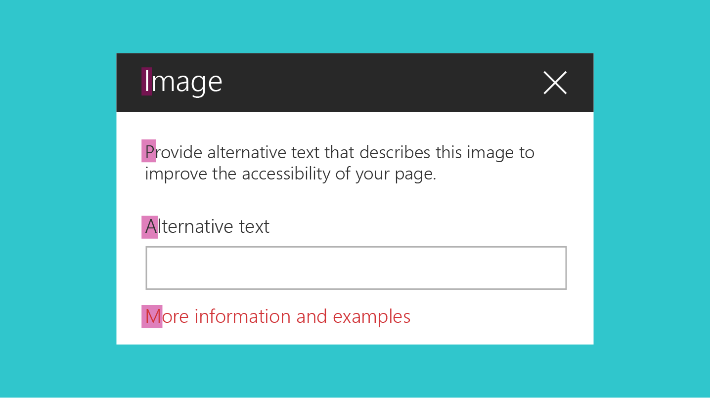
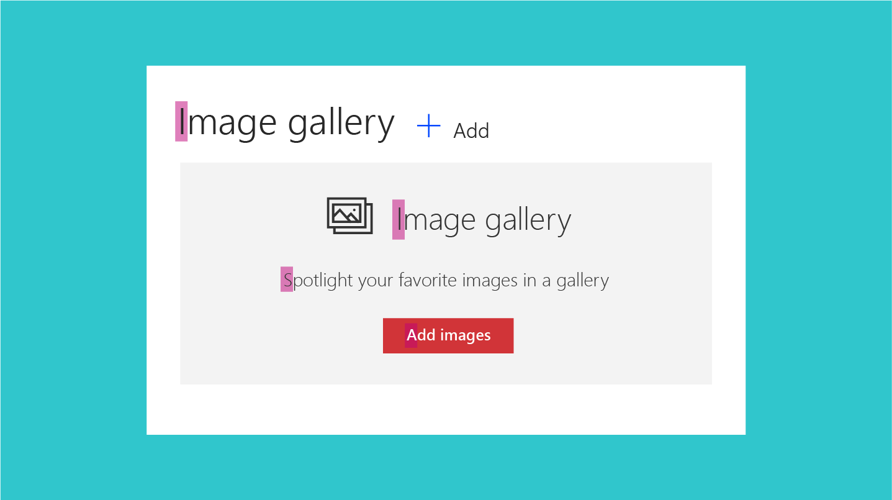
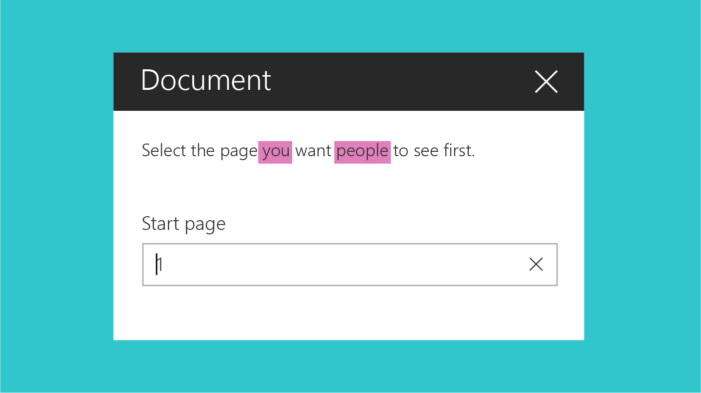
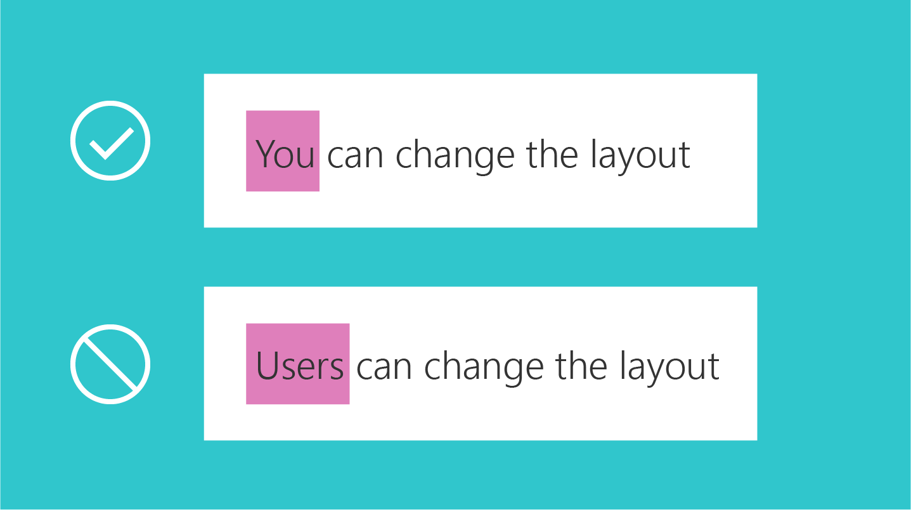
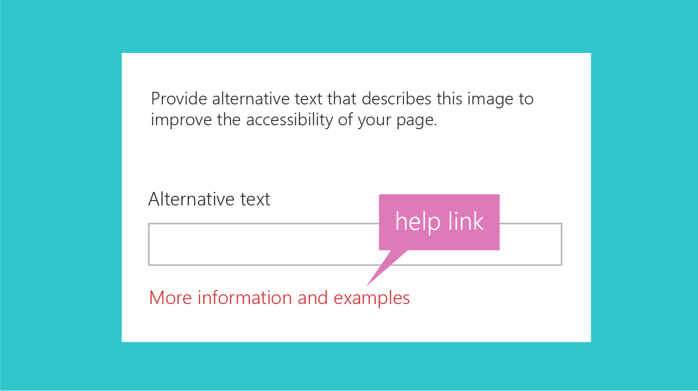
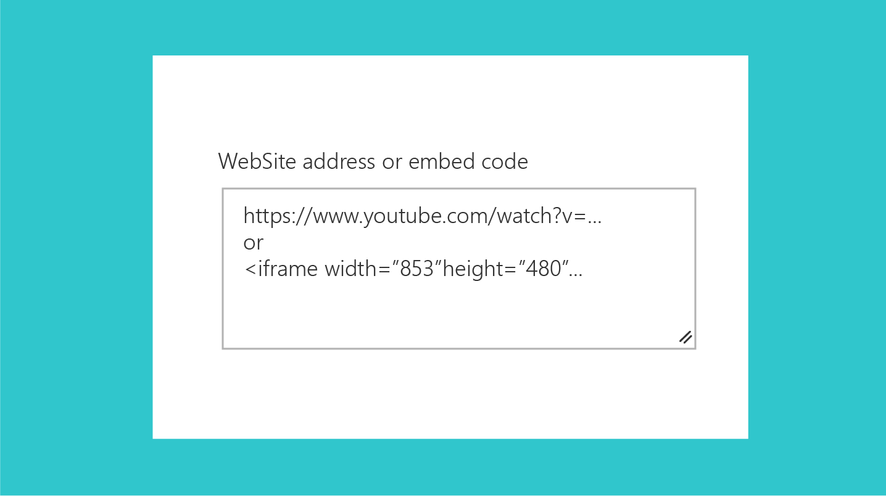

# UI text guidelines for SharePoint web parts
 
One aspect of creating effective web parts in SharePoint is to use simple, understandable, and concise UI text. By keeping your message clear and easy to understand, you ensure that customers move through your experiences quickly and can identify the content they are looking for. This article provides guidance for writing UI text for key areas within SharePoint web parts.

## Capitalization

Use sentence casing (first letter of first word is capitalized, the rest all lowercase) for all UI elements, including buttons, page titles, and control labels. 

Always capitalize:

- The first word of a new sentence.
- The word following a colon in a title or heading. For example, "Step 1: Begin by entering your account information."
- Proper nouns, such as the names of people, cities, and so on. 

 

## Punctuation

Follow the basic rules of punctuation to avoid grammatical errors in your experience. The following table provides guidance and reminders about what punctuation to use when, and why.

|Punctuation  |Guidance                                        |Example          |
|-------------|------------------------------------------------|-----------------|          
|Colons (:)  | Use colons if you are introducing a list in the web part description. Don't use colons in UI labels.| Choose one of the following: Cats, Dogs, Quokkas    |                        
|Commas (,)  | Use serial commas (including before the word "and").  |I like cats, birds, and dogs. |
|Ellipses (…)| Use ellipses to show truncation and for progress indicator strings. Don't use ellipses to indicate that the user must make further choices.|Truncation: Last modified by John Armstr… Progress indicator: Uploading… |  
|Periods (.) | Use periods as you normally would for descriptions. Don't use periods in titles, headings, or labels. Don't use periods for radio button options or check boxes. | Select the content that you want to highlight and how you want it displayed. Use a filter to narrow your selection. |

## Voice and tone

Crafting the right tone in your product communication is essential to building a strong, lasting relationship with your audience. Try to keep your words crisp and clear, warm and relaxed, and approachable. How you talk to your audience influences how they engage with your site and content, and how much value they derive from it.

**Do:**

- Use a casual, conversational tone in the UI. 
- Use contractions. For example, use "can't" instead of "cannot".
- Read your UI text out loud to test the tone. Does it sound like everyday language?
- Use simple words. 
- Remove technical details if they're not relevant to the user experience. 
- Use "Please" only if you are inconveniencing the user. Avoid overuse.
- Use "Sorry" only in error messages in SharePoint that result in serious problems for the customer. 

**Don't:**

- Clutter the UI text with unnecessary repetition. Make every word meaningful. 

## Pronouns

Avoid pronouns in UI elements if possible. If you can say something equally well without using a pronoun, don't use it.

If your design does warrant using pronouns, apply the following guidelines to make sure that you're using them correctly.

**Do:**

- Use second person ("you" or "your") when you're presenting something that belongs to the user. For example, "Your drafts" or "Your images".
- Use first person ("me" or "my") for UI in which the user instructs the service to do something. For example, "Alert me when someone responds to my post."
- Use "they" or "their" as a singular possessive modifier to avoid awkward "he/she" or "his/her" constructs. Ideally, rewrite the sentence as plural if possible.
- Avoid using "them"; instead, use words like "someone" or "people". For example, "Enter a user name and domain to give someone permission to use this PC."

 

**Don't:**

- Use third person references, as they sound impersonal and can create a disconnected customer experience. Instead of saying "Users can change the layout", use a phrase like "You can change the layout".

## Error messages

Error conditions are inherent in any software or service. Your error messages can affect the overall user satisfaction with the product. A good error message should do the following:

- Clearly identify what happened and why.
- Provide a workaround or resolution suggestions.
- Show empathy.

<!-- You might need to explain how to show empathy in an error message, without using "sorry". -->

The following is an example of an error message that occurs when a user tries to edit a page that's checked out by another user.

| You can't edit right now                                                |
|-------------------------------------------------------------------------|
| Another user is currently editing this page. Please try again in a few minutes. |

## Links to help articles

Make an effort to link strategically to help articles. Try to anticipate where the user might need help, and then include a link to the help article close to that UI element. The following are some key things to remember when you place help article links in your UI.

**Do:**

- Keep the in-product help links specific. Ensure that the target article is appropriate. When the user opens the article, they should be able to locate the information they need. 
- Use natural language for your hyperlinks.  

<!-- You might want to provide an example of "natural" language. -->

**Don’t:**

- Put a help article link next to every UI element. This results in visual noise.
- Include multiple links that go to the same target in the same UI.
- Use "click here" for the text for your hyperlink. 

## Hint text

Hint text, or ghost text, is the text element you display in a UI element, typically a text box, to help the user interact with the UI. The hint text gives information about what the user should enter. For example, it might mention field restrictions or show an example.

**Do:**

- Use hint text sparingly, and only if it helps the user. Not all UI elements require hint text. For some complex fields, hint text can help provide more context and clarity. For example, if you have a field that requires the user to enter a secured URL, the hint text https://www.example.com might be more helpful than the text **Enter secure URL here.**

**Don't**

- Repeat the label. For example, if you have a text box with the label **Name**, the hint text **Enter name** is redundant and potentially confusing.

The following hint text is for the embed web part. The text field can accept a secure website address or an iframe embed code. The text shows an example of both. 

## See also

- [Designing great SharePoint experiences](design-guidance-overview.md)