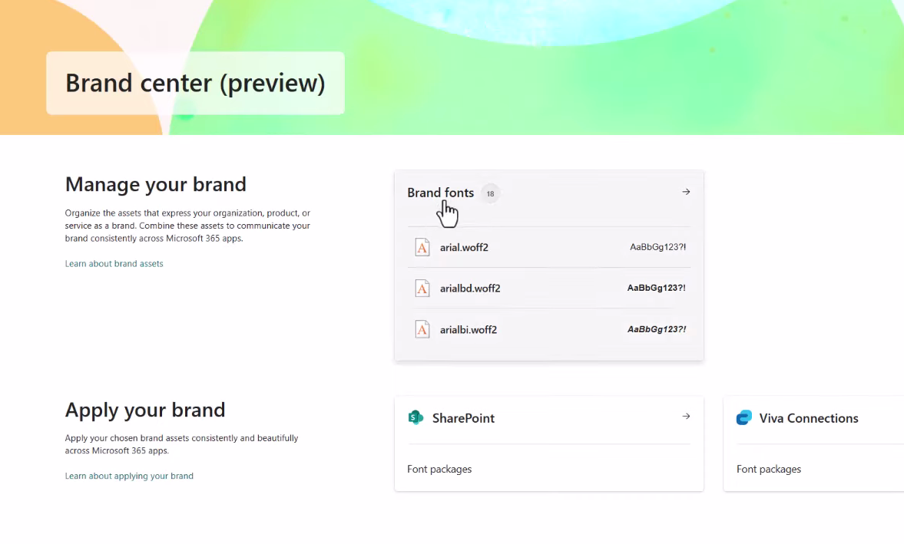
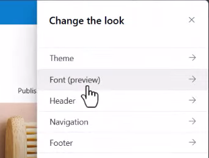
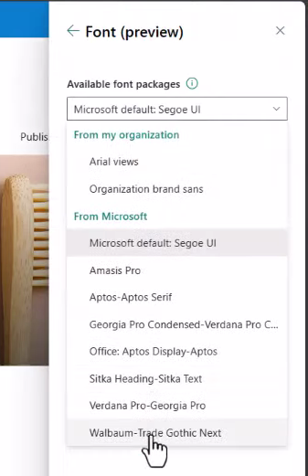
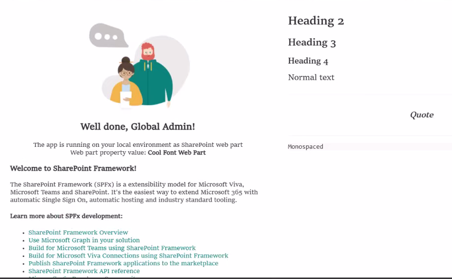

# Use SharePoint brand center fonts in SharePoint Framework solutions

The [SharePoint brand center](/sharepoint/brand-center-overview) offers a centralized branding management application that empowers your brand managers or designated brand owners to help your organization to customize the look and feel of their experiences. This brand asset management system allows customers to manage the colors, fonts, and images, and other assets all in one place.

Developers can use the fonts defined in Brand center in their SharePoint Framework (SPFx) components. This article demonstrates how you can use the fonts defined in the SharePoint brand center in your SPFx components.



In this article, learn how you can modify your SPFx components to use the same fonts set in the

## Use SharePoint brand center fonts in SPFx components

Start by creating a new SharePoint Framework component, such as a web part.

> [!TIP]
> To learn how to create your first SPFx web part, see [Build your first SharePoint client-side web part (Hello World part 1)](../spfx/web-parts/get-started/build-a-hello-world-web-part.md).

Within the web part, locate and open the **\*.module.scss** file in the project. For example, if you created a web part named *Hello World", the file will be found in the following location in the project: **./src/webparts/helloWorld/HelloWorldWebPart.module.scss**.

This file contains the styles for the SPFx component.

All fonts defined within Brand center are referenced using variables following the naming convention `--fontFamilyCustomFont###`. All start with the prefix `--fontFamily` followed by the *font slot* name.

For example, to change the primary font in your web part, add the following style to the `.helloWorld` class:

```css
font-family: var(--fontFamilyCustomFont100, var(--fontFamilyBase));
```

This tells the web part to use the value defined in the SharePoint styling context with the variable `--fontFamilyCustomFont100`, but if that value isn't set, it will default to the `--fontFamilyBase` slot.

The resulting class will now look like this:

```css
.helloWorld {
  font-family: var(--fontFamilyCustomFont100, var(--fontFamilyBase));
  overflow: hidden;
  padding: 1em;
  color: "[theme:bodyText, default: #323130]";
  color: var(--bodyText);
  &.teams {
    font-family: $ms-font-family-fallbacks;
  }
}
```

Next, repeat this step for any other classes in our style where you want to apply these changes. For example, in the default web part, you'd update the `.welcome` and `.links.a` styles as well, so the resulting **\*.scss** file will look like the following:

```css
@import '~@microsoft/sp-office-ui-fabric-core/dist/sass/SPFabricCore.scss';

.helloWorld {
  font-family: var(--fontFamilyCustomFont100, var(--fontFamilyBase));
  overflow: hidden;
  padding: 1em;
  color: "[theme:bodyText, default: #323130]";
  color: var(--bodyText);
  &.teams {
    font-family: $ms-font-family-fallbacks;
  }
}

.welcome {
  text-align: center;
  font-family: var(--fontFamilyCustomFont100, var(--fontFamilyBase));
}

.welcomeImage {
  width: 100%;
  max-width: 420px;
}

.links {
  a {
    font-family: var(--fontFamilyCustomFont100, var(--fontFamilyBase));
    text-decoration: none;
    color: "[theme:link, default:#03787c]";
    color: var(--link); // note: CSS Custom Properties support is limited to modern browsers only

    &:hover {
      text-decoration: underline;
      color: "[theme:linkHovered, default: #014446]";
      color: var(--linkHovered); // note: CSS Custom Properties support is limited to modern browsers only
    }
  }
}
```

### Test the web part

To test the web part, start the local web browser, but don't launch a browser to the hosted workbench.

1. Run the command **gulp serve** from the root of the project and include the **--nobrowser** argument:

    ```console
    gulp serve --nobrowser
    ```

    > [!IMPORTANT]
    > The SharePoint hosted workbench does not support custom fonts defined in the SharePoint brand center. To test your web parts, you'll need to test them on a page in a SharePoint site.

1. In the console, the **gulp serve** command will output a line that looks similar to the following:

    ```text
    [spfx-serve] To load your scripts, use this query string: ?debug=true&noredir=true#debugManifestsFile=https://localhost:4321/temp/manifests.js
    ```

1. Open the browser and navigate to a page that you have permission to add a web part to the page.
1. Add the query string from the preceding console message to the URL and load the page.

    When prompted in the **Allow debug scripts** dialog, select **Load debug scripts**.

1. Next, put the page into edit mode and add your sample web part to the page.
1. Finally, publish the changes.

With the web part on the page, select one of the custom fonts from the Brand center site:

1. Select the gear icon in the top right of the Microsoft 365 suite bar, then select **Change the look**.

    

1. On the **Change the look** panel, select **Font**.

    

1. On the **Font** panel, select one of the fonts to view the changes on your web part.

    

    Notice the fonts on the page will change, including those in our custom web part:

    

## Brand central font slot reference

The following table lists all the available font slots from SharePoint brand center that developers can use in their custom SPFx components:

|  Font slot  | Custom Font Token |   Fluent Design Token    |  Short Description  |                                                       Used in Product Location                                                       |
| ----------- | ----------------- | ------------------ | ------------------- | ------------------------------------------------------------------------------------------------------------------------------------ |
| Body        | CustomFont100     | caption2          | Caption small       |                                                                                                                                      |
| Body        | CustomFont200     | caption2Strong    | Caption medium      | News Badge, Image caption, Site WP activity, Avatar Role/Job, Hero Badge                                                             |
| Body        | CustomFont300     | caption1          | Caption large       | Image Overlay                                                                                                                        |
| Interactive | CustomFont400     | caption1Strong    | Label small         | Avatar link                                                                                                                          |
| Interactive | CustomFont500     | caption1Stronger  | Label medium        | Footer links, Top Navigation links, Hub navigation links, Left navigation, Hero button                                               |
| Interactive | CustomFont600     | body1             | Label large         | Button                                                                                                                               |
| Body        | CustomFont700     | body1Strong       | Paragraph small     | Quick links description, News sub description, Site web part information, Site web part description, Avatar name, Avatar description |
| Body        | CustomFont800     | body1Stronger     | Paragraph medium    | News description, RTE Normal, RTE Table Cell, Hero Description                                                                       |
| Body        | CustomFont900     | body2             | Paragraph large     |                                                                                                                                      |
| Headline    | CustomFont1000    | subtitle2         | Heading extra small | News subtitle, RTE H4, RTE Table Header, RTE, Table Column, Site WP site title, Call to action text, Hero call to action             |
| Headline    | CustomFont1100    | subtitle2Stronger | Heading small       | Quick Links title, News title, Footer title, RTE H3, RTE Pull quote, Section heading, Hero title, Hero small tile title              |
| Headline    | CustomFont1200    | subtitle1         | Heading medium      | RTE H2, Hero title large                                                                                                             |
| Headline    | CustomFont1300    | title3            | Heading large       | Web part title, Hero tile title                                                                                                      |
| Headline    | CustomFont1400    | title2            | Heading extra large |                                                                                                                                      |
| Title       | CustomFont1500    | title1            | Title small         | Hub title                                                                                                                            |
| Title       | CustomFont1600    | largeTitle        | Title medium        | Page title, Site title                                                                                                               |
| Title       | CustomFont1700    | display           | Title large         |                                                                                                                                      |

> [!TIP]
> Don't forget to include the `--fontFamily` prefix when using one of the custom font slot tokens in your style sheets.

## See also

- Video: [Using SharePoint Brand center font settings in custom SPFx solutions](https://www.youtube.com/watch?v=IP19PeHb0Zg)
