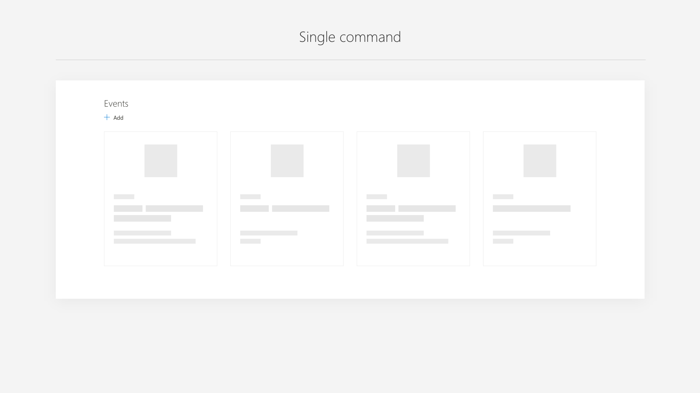
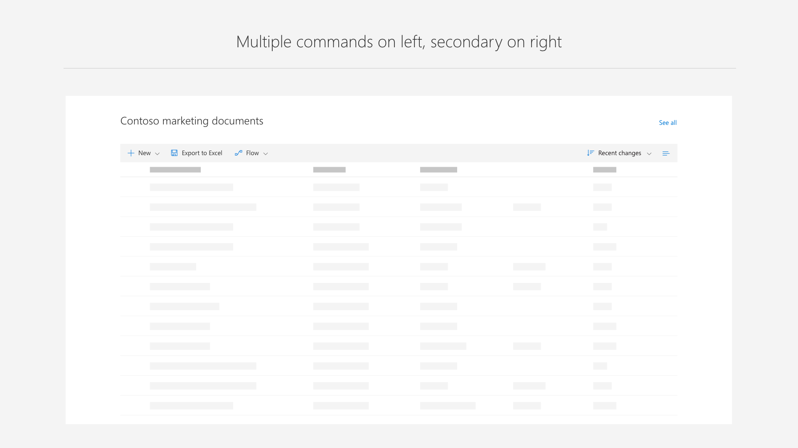
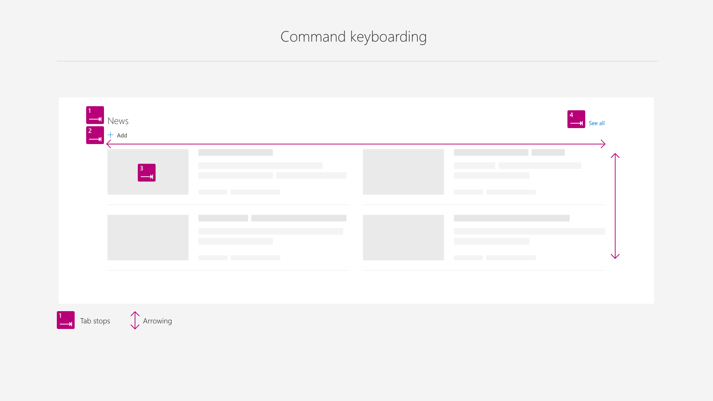

# Commanding within a web part

The commanding with in a web part consists of a single line of commands which sit below the web part title. These commands contain and icon and text, for example the <b>+ plus</b> icon and the text <b>Add</b>. The command bar can be extended to support multiple commands but be aware of overloading the web part with too many commands and how they reflow when the web part is placed in different columns or when the page reflows to smaller screen sizes.

# See all

Many web part may need to support the overflow of content to a secondary page such as the case with News and Events. As well, only specific layouts within the web part may need to support the overflow. The recommended pattern is to place a See all command on the far right corner. This command should be last in the tab order of the web part to support keyboard navigation.

# Command bar states

A common command is Add for many web part that require content to be created. In the case of News and Event the Add command is only enabled in read mode as it takes user to a new page or form to create content. The desired web part user experience should determine if commands are active in both read and edit modes, only edit, or only read. Most likely this will be driven by whether or not the web part is designed to be configured by the author of the page and static to the viewer or if the viewer/reader can interact with the web part.

# Placement and accessibility of commands

Core commands, even when the webpart has only 1 command such as Add, should sit below the Title to create consistancy, discoverability and support easy reflow across all column sizes. Long web part Titles should wrap to two lines but not interfere with the placement of the commands.

Here is an example of a web part with a simple set of commands that follow the placement guidance. Follow the guide below when deciding how to make your web part accessible to suppot keyboard navigation and screen reader lables. [To learn more about accessibility!](https://docs.microsoft.com/en-us/sharepoint/dev/design/accessibility)

