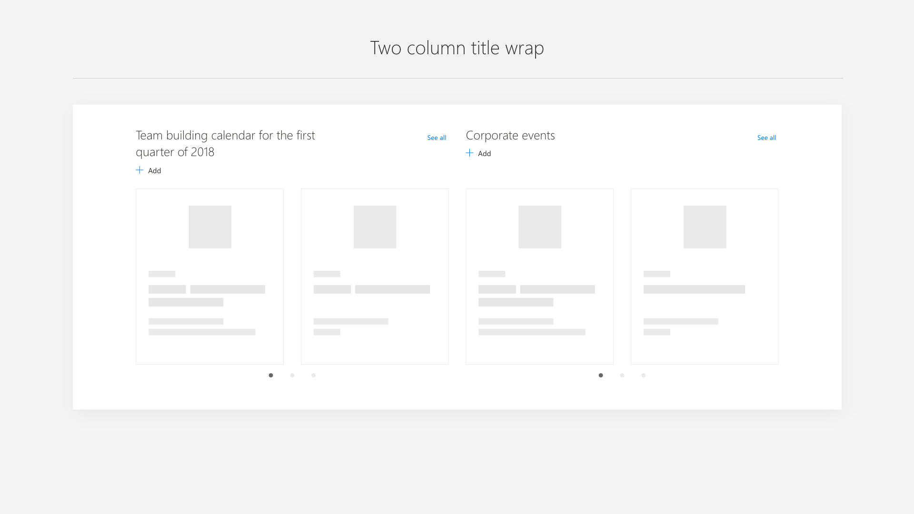
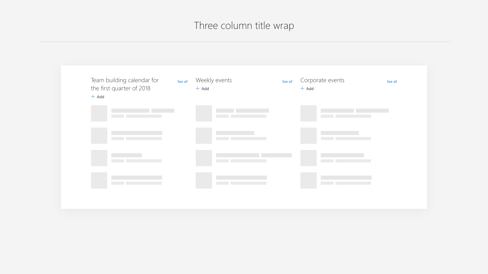

# Commanding within a web part

Commanding within a web part consists of a single line of commands that sits under the web part title. These commands contain an icon and text, for example the `+` (plus) icon and the text **Add**. The command bar can be extended to support multiple commands. However, be aware of overloading the web part with too many commands. Also, note how the commands reflow when the web part is placed in different columns, or when the page reflows to smaller screen sizes.

 

## See all

Many web parts may need to support the overflow of content to a secondary page (for example, in News and Events web parts). In addition, only specific layouts within the web part may need to support the overflow. The recommended pattern is to place a **See all** command in the far-right corner. To support keyboard navigation, this command should be last in the tab order of the web part.

## Command bar states

A common command is **Add** for many web parts that require content to be created. In the case of News and Events, the **Add** command is only enabled in read mode because it takes the user to a new page or form to create content. The desired web part user experience should determine if commands are active in both read and edit modes, only edit, or only read. Most likely this is driven by whether the web part is designed to be configured by the author of the page and static to the viewer, or if the viewer/reader can interact with the web part.

## Placement and accessibility of commands

Core commands, even when the web part has only one command such as **Add**, should sit under the title to create consistency and discoverability, and to support easy reflow across all column sizes. Long web part titles should wrap to two lines, but not interfere with the placement of the commands.

 

Following is an example of a web part with a simple set of commands that follow the placement guidance. Follow this guide when deciding how to make your web part accessible to support keyboard navigation and screen reader labels. To learn more about accessibility, see [Accessibility in SharePoint web part design](accessibility.md).

