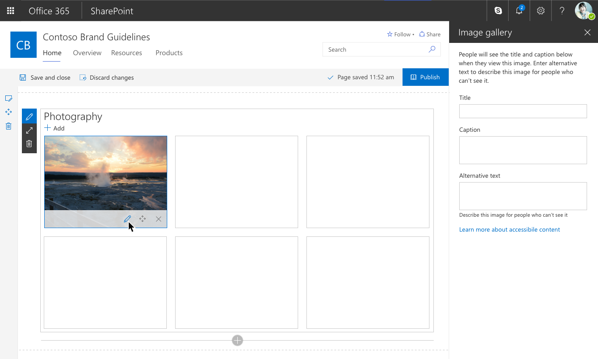

# SharePoint web part levels

When designing a SharePoint web part, you sometimes need to have a secondary interaction level; for example, an item in a list or an individual photo in a gallery. This article explains how to use secondary state toolbars, default commands, scale, and interaction states to select an individual item.

Secondary web part configurations and toolbars follow the same patterns as single state web parts, such as an image or file viewer. Second-level items can have their own toolbars and respective property pane, to make it easy for authors to configure the web part with meaningful content and data. Keep in mind that there should be a clear separation between configuration options in web parts that have two levels. We recommend that you keep the Source, Filtering, and Layout configuration, as well as any additional options that affect the web part as a whole, at the first level. 

The following are some web part examples to use as reference:

- Image gallery
- Quick links

## Secondary toolbars

Secondary toolbars are used on individual items in a web part layout that need to support item-level configuration in the property pane - and other commands like move - to rearrange items in a layout, or to remove/delete an item. You can also add custom commands in this toolbar that fit the needs of your web part.

## Selection states

Second-level toolbars within a web part have three core commands: Edit, Move, and Remove. It's important to consider the implementation of the selection states when building a web part with a secondary level. 

The second-level toolbar should only display when the author selects (clicks/taps) an individual item. Do not show all the second-level toolbars for every items at once, as this can overwhelm the user. Additionally, do not have the toolbar appear on hover, as this might cause usability issues with devices that support touch.

The bounding box and/or outline of each second-level item should change from its default state to the primary color on hover and remain the primary color on selection. It is important that the bounding box and icons keep their active states so the user understands what item is selected when using the property pane or while re-arranging items.

Below is an example from an individual 2nd level item in the Image gallery web part:

Edit Item Level – opens the property pane with specific item level configuration options. Note that the bounding box stays in the active/selected state.

Move – The transparency of the item drops to 65% and a drop shadow surrounds the item.

Remove – When the X Remove icon is selected the toolbar hides and the item fades out making room for the specific layout to reflow.

## Property panes

Property panes work the same on the 2nd item level of a web part as they do when first selecting the entire web part. The focus on the 1st level shifts to the second level selection and allows the author to configure and individual item.

In the example below the 1st level is the Image source and Layout configuration for the Image gallery web part. When the user selects an individual image they can configure the Title, Caption and Alternative text on the 2nd level property pane.

## See also

- [Designing great SharePoint experiences](design-guidance-overview.md)
