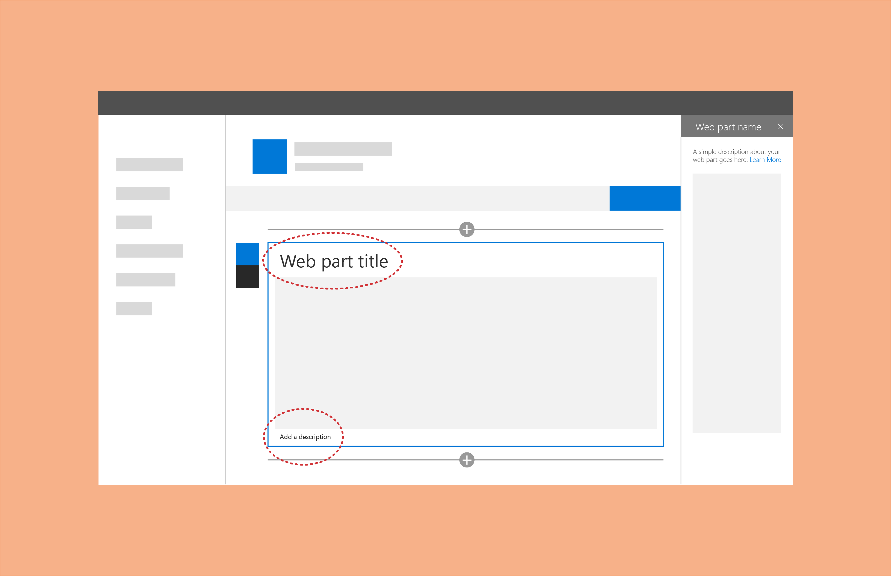
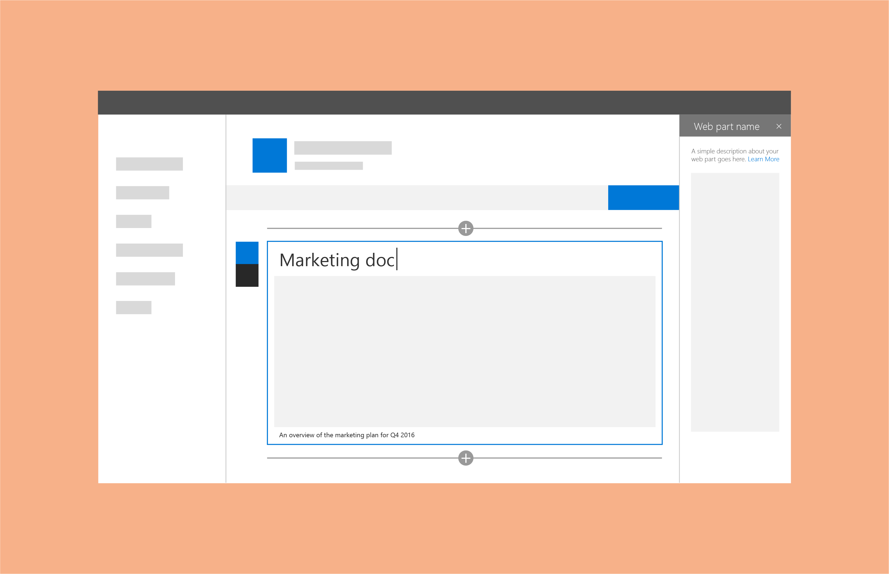

# Titles and descriptions for SharePoint web parts

You can add titles and descriptions to web parts to help users understand their purpose. This is helpful when a page contains a range of web parts. Some web parts (like image web parts) might not need a title, but might need a description before or after the content area. Don't assume that users will understand the context of the web part without either a title or a description, and don't assume that users will include titles or descriptions themselves. 
 
One option is to connect the title and description to the configuration properties of your web part. This ensures that your web parts are prepopulated with content that makes the most sense based on the configuration. 
 
For example, if you have a web part that queries a document library based on recently added items, you might want to use "Recent documents" for the default title.

For both the title and description, the author of the page can override the default placeholder text and customize them based on what makes the most sense for the page they're creating. 

