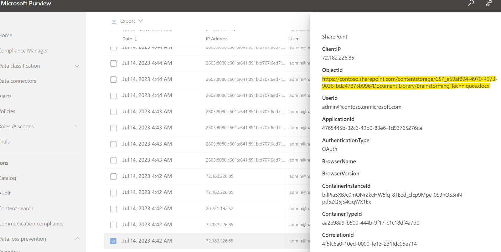
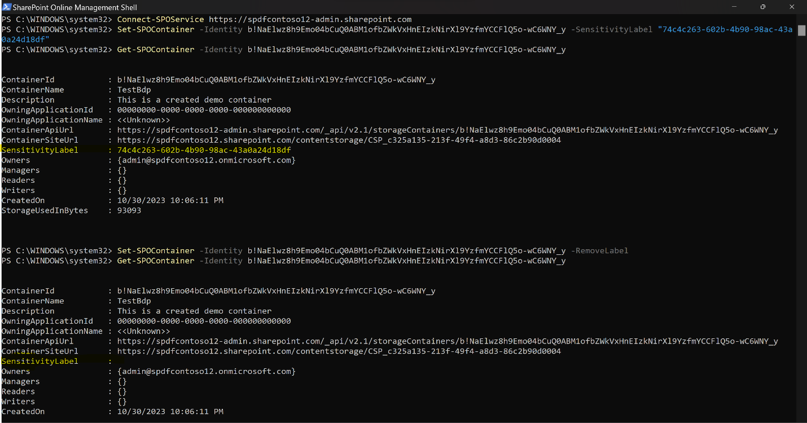
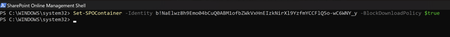
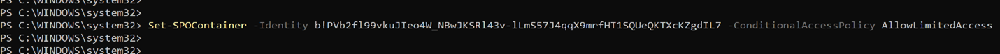
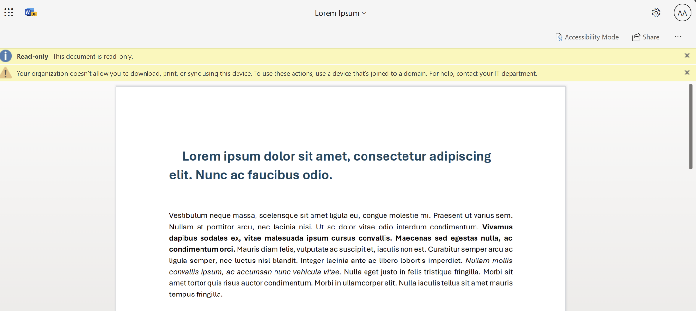
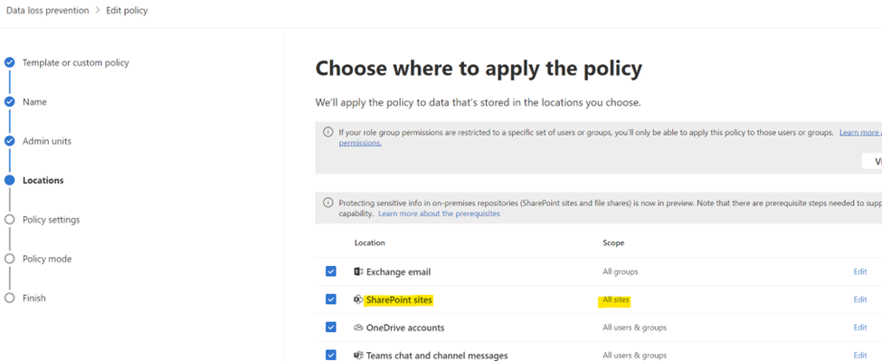
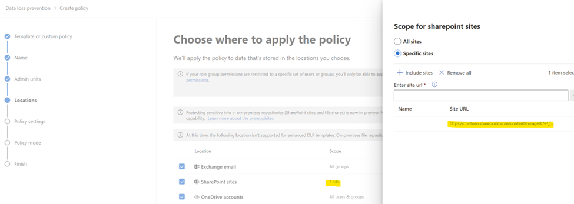

# Apply Security and Compliance Controls

**Applies to:** Consuming tenant admin — Compliance admin / Security admin / SharePoint admin

<!-- agent:
task_type: how-to
audience: compliance
outcome: Apply supported Microsoft Purview and SharePoint controls to SharePoint Embedded containers and content.
next: ../reference/troubleshooting.md
-->

Apply security and compliance controls to SharePoint Embedded content by using Microsoft Purview and supported SharePoint administration features.
SharePoint Embedded uses Microsoft 365 compliance and data governance capabilities so organizations can protect, govern, and investigate content stored by embedded applications.

Some compliance scenarios require the owning application to provide the end-user experience because SharePoint Embedded is API-only and doesn't have its own user interface.

> [!IMPORTANT]
> Coordinate compliance controls with the SharePoint Embedded app owner.
> A policy can protect content, but app behavior must be implemented by the owning app to handle the effects of those policies.

## Before you begin

Confirm these prerequisites.

- You can access Microsoft Purview with the required compliance role.
- You can access SharePoint administration tools when container details are needed.
- You can identify the SharePoint Embedded application and containers in scope.
- You can retrieve container site URLs for targeted policies.
- App owners understand the policy impact on their user experience.
- Legal, records management, and security stakeholders approve the control design.

For supported controls, see [Plan Security, Compliance, and Governance](../plan/security-compliance-governance.md).

## Get container details for policy scope

Many compliance tasks need a container URL or container identifier.
Use PowerShell to retrieve application and container details.

1. View SharePoint Embedded applications registered in the tenant.

   ```powershell
   Get-SPOApplication
   ```

1. Retrieve containers for an application.

   ```powershell
   Get-SPOContainer -OwningApplicationId <OwningApplicationID>
   ```

1. Retrieve details for a container.

   ```powershell
   Get-SPOContainer -OwningApplicationId <ApplicationID> -Identity <ContainerID>
   ```

Use the container site URL to target policies at specific SharePoint Embedded containers.
For cmdlet details, see [Get-SPOContainer](/powershell/module/sharepoint-online/get-spocontainer).

## Apply audit controls

Audit capabilities for SharePoint Embedded mirror existing SharePoint audit capabilities. User and admin operations performed in SharePoint Embedded applications are captured in the unified audit log.

Use Microsoft Purview audit to search activity and investigate file, user, app, and admin operations.



For audit review steps, see [Review audit events](review-audit-events.md). For a detailed list of container type and container type registration audit events, see [SharePoint Embedded audit log events](../reference/audit-events.md).

## Apply eDiscovery

Compliance admins can use Microsoft Purview eDiscovery to search, hold, and export content hosted in SharePoint Embedded.

To search all SharePoint Embedded content with SharePoint content:

1. Open the eDiscovery experience in Microsoft Purview.
1. Configure the search.
1. Select **All** SharePoint sites for the SharePoint workload.
1. Run the search.
1. Review results according to your eDiscovery process.



To limit the search to selected SharePoint Embedded containers:

1. Retrieve the container site URL.
1. In the SharePoint sites workload, choose specific sites.
1. Add the container URL.
1. Run and validate the search.



For product guidance, see [Microsoft Purview eDiscovery solutions](/purview/ediscovery).

## Apply retention and holds

SharePoint Embedded supports retention and hold policies on content stored in applications through Microsoft Purview.
Use these scoping options:

| Scope | Effect |
| --- | --- |
| All SharePoint sites | Applies to SharePoint sites and SharePoint Embedded containers. |
| Selected locations | Applies to specific SharePoint locations, including selected SharePoint Embedded container URLs. |

Use broad scope when a policy applies to all SharePoint and SharePoint Embedded content.
Use selected container URLs when a policy applies only to specific data.





> [!NOTE]
> SharePoint Embedded doesn't provide a native end-user interface for retention label interactions.
> If users need to apply or respond to retention labels in an app, the owning app must provide that experience.

For Microsoft Purview Data Lifecycle Management, see [Learn about Microsoft Purview Data Lifecycle Management](/purview/data-lifecycle-management).

## Apply DLP policies

Use Microsoft Purview Data Loss Prevention (DLP) to identify, monitor, and automatically protect sensitive items stored in SharePoint Embedded applications.

To apply DLP broadly:

1. Create or edit a DLP policy in Microsoft Purview.
1. Choose the SharePoint sites workload.
1. Select **All sites** when the policy should include all SharePoint sites and SharePoint Embedded containers.
1. Configure rules, actions, and alerts.
1. Test and then enable the policy according to your rollout process.

To apply DLP to selected SharePoint Embedded containers:

1. Retrieve the container URLs.
1. Configure the DLP policy for selected SharePoint locations.
1. Add the container URLs.
1. Validate policy behavior with the app owner.





Some DLP scenarios require user interaction, such as business justification for override or policy tips.
Because SharePoint Embedded doesn't provide a native user interface, the client app must implement the required user experience, often by using Microsoft Graph where applicable.

For DLP details, see [Learn about data loss prevention](/purview/dlp-learn-about-dlp).

## Apply sensitivity labels to containers

Global Administrators and SharePoint Embedded Administrators can set or remove sensitivity labels on SharePoint Embedded containers with SharePoint PowerShell.

Set a label:

```powershell
Set-SPOContainer -Identity <ContainerID/ContainerSiteURL> -SensitivityLabel <SensitivityLabelGUID>
```

Remove a label by using the supported container label command documented in [Manage containers with PowerShell](manage-containers-powershell.md).

Before applying labels:

- Confirm the label is published.
- Confirm the label is appropriate for the container.
- Confirm app behavior with the app owner.
- Confirm compliance requirements with data owners.

For label concepts, see [Learn about sensitivity labels](/purview/sensitivity-labels).

## Apply block download policy

SharePoint Administrators and Global Administrators can block file downloads from SharePoint Embedded containers with the SharePoint site policy cmdlet.

```powershell
Set-SPOSite -Identity <ContainerSiteURL> -BlockDownloadPolicy $true
```

A SharePoint Advanced Management license is needed to enforce this policy.
Read the SharePoint documentation before enabling it in production.

For more information, see [Block download policy for SharePoint sites and OneDrive](/sharepoint/block-download-from-sites).

## Apply Conditional Access policy

SharePoint Embedded supports basic Conditional Access policy configurations.
The `ConditionalAccessPolicy` parameter supports these values:

- `AllowFullAccess`
- `AllowLimitedAccess`
- `BlockAccess`

Use this SharePoint PowerShell cmdlet:

```powershell
Set-SPOContainer -Identity <ContainerSiteURL> -ConditionalAccessPolicy <SPOConditionalAccessPolicyType>
```

Review tenant access policies before changing container access.
Test app behavior for web, desktop, and mobile clients.

For related guidance, see [Control access from unmanaged devices](/sharepoint/control-access-from-unmanaged-devices).

## Clarify responsibilities

Security and compliance controls often span multiple teams.

| Team | Responsibilities |
| --- | --- |
| Compliance admins | Configure Purview audit, eDiscovery, retention, DLP, and policy scope. |
| SharePoint Embedded admins | Retrieve container details and apply supported container settings. |
| SharePoint Embedded app owners | Implement app user experiences for policy tips, overrides, labels, and error handling. |
| Security admins | Review Conditional Access and access restrictions. |
| Legal or records teams | Approve holds, retention, and deletion decisions. |

Document the owner for each control before rollout.

## Validate policy behavior

After applying a control:

1. Confirm the policy is published or enabled.
1. Confirm the target container URL or all-sites scope is correct.
1. Ask the app owner to test common user workflows.
1. Review audit records for policy-related activity.
1. Review DLP alerts, eDiscovery results, or retention state as applicable.
1. Record the change in your compliance operations log.

> [!TIP]
> Pilot controls on a small set of containers before applying them broadly to all SharePoint sites and SharePoint Embedded containers.

## Related content

- [Review audit events](review-audit-events.md)
- [Manage containers with PowerShell](manage-containers-powershell.md)
- [Manage containers in SharePoint admin center](manage-containers-sharepoint-admin-center.md)
- [Plan Security, Compliance, and Governance](../plan/security-compliance-governance.md)
- [Troubleshooting](../reference/troubleshooting.md)

## Next steps
Review troubleshooting guidance in [Troubleshooting](../reference/troubleshooting.md).
