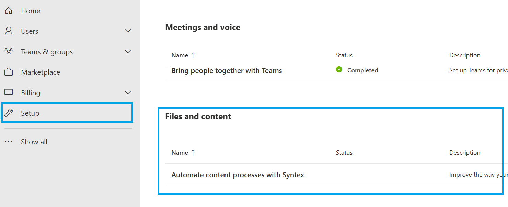
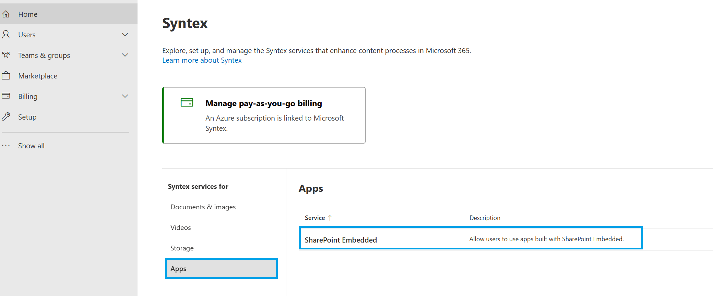

# Consuming tenant admin

**Applies to:** Consuming tenant admin — SharePoint Embedded admin / Global admin

> [!IMPORTANT]
> Assign the SharePoint Embedded Administrator role available in Microsoft 365 Admin Center or Microsoft Entra ID to execute SharePoint Embedded Container cmdlets mentioned in this article.
>
> Global Administrators can continue to execute SharePoint Embedded container cmdlets.
>
> A global administrator can assign a user the SharePoint Embedded administrator role to act as a consuming tenant admin for SharePoint Embedded.

Organizations that use SharePoint Embedded applications in their Microsoft 365 tenants are consuming tenants. The consuming tenant administrator manages these applications and the containers that hold content. Consuming tenant administrators can manage applications registered in their tenant, tenant-level configurations, and security and compliance settings. This article describes enterprise manageability features that consuming tenant administrators can use through PowerShell cmdlets or the SharePoint admin center.

<!-- agent:
task_type: concept
audience: administrator
outcome: Understand the consuming tenant administrator role and the admin tools available for SharePoint Embedded apps.
next: install-sharepoint-embedded-app.md
-->

## Consuming Tenant Admin Role

Microsoft 365 SharePoint Embedded Administrator serves as the consuming tenant admin. Global Administrators in Microsoft 365 can assign users the SharePoint Embedded Administrator role. The Global Administrator role already has all the permissions of the SharePoint Embedded Administrator role. The SharePoint Embedded Role is available in Microsoft Entra ID and Microsoft 365 Admin Center.

For information on the SharePoint Embedded Administrator role, see [Admin overview](admin-overview.md).

## Administration Tools

Consuming tenant admins can manage SharePoint Embedded applications with the following options:

### Microsoft Graph APIs

The [fileStorageContainerTypeRegistration](/graph/api/resources/filestoragecontainertyperegistration) resource represents the registration of a container type in a consuming tenant. To manage all container type registrations in the consuming tenant, the `FileStorageContainerTypeReg.Manage.All` delegated permission is required.

- [List container type registrations](/graph/api/filestorage-list-containertyperegistrations)
- [Get container type registrations](/graph/api/filestoragecontainertyperegistration-get)
- [Update container type registrations](/graph/api/filestoragecontainertyperegistration-update)
- [Delete container type registrations](/graph/api/filestorage-delete-containertyperegistrations)

### SharePoint Online Management Shell

On PowerShell, the SharePoint Embedded Admin can run the following cmdlets:

1. Enumerate applications in a tenant
1. Enumerate containers of an application in a tenant
1. Enumerate containers of an application sorted by storage basis storage
1. Enumerate archived containers of an application
1. Edit the sensitivity label on a container
1. Set the sharing capability configuration on a container

For information on consuming tenant admin in PowerShell, see [Manage containers with PowerShell](manage-containers-powershell.md).

### SharePoint Administrator Center

The SharePoint Embedded Admin can access the Active and Deleted containers page on SPAC and perform SharePoint Embedded application-level and container-level actions. This includes the following:

1. View the Active container page
1. View the Archived container page
1. View the Deleted container page
1. View the detailed information of a container
1. Archive and reactivate containers
1. Soft delete, restore, and purge deleted containers

For information on consuming tenant admin in SharePoint admin center, see [Manage containers in SharePoint admin center](manage-containers-sharepoint-admin-center.md).

## Security and compliance administration

SharePoint Embedded uses Microsoft’s comprehensive compliance and data governance solutions to help organizations manage risks, protect, and govern sensitive data, and respond to regulatory requirements. Security and compliance solutions work in a similar manner in the SharePoint Embedded platform as they do today in the Microsoft 365 platform, so that data is stored in a secure, protected way that meets customers’ business and compliance policies while making it easy for Compliance and SharePoint Administrators to enforce critical security and compliance policies on the content. For information on supported security and compliance capabilities, see [Plan security, compliance, and governance](../plan/security-compliance-governance.md).

## Set up billing for pass-through container type

To use a pass-through billing SharePoint Embedded app, the SharePoint Embedded admin needs to set up Microsoft Syntex billing in the [Microsoft 365 admin center](https://admin.microsoft.com/). No user can access any pass-through SharePoint Embedded apps before valid billing is set up for the SharePoint Embedded platform.

### [Meters](../reference/billing-meters.md)

SharePoint Embedded employs a pay-as-you-go (PAYG) billing model through an Azure subscription. Billing is determined by how much data in GB you store in SharePoint Embedded in active and archived states, transactions used to access and modify the container and container contents, and data that's egressed from the SharePoint Embedded platform. Each of these factors contributes to the overall cost, ensuring that you only pay for the resources and services you use. You can view this usage and billing details in the [Microsoft Cost Management](https://portal.azure.com/).

SharePoint Embedded has three billing meters, as shown. Refer to the [product page](https://adoption.microsoft.com/en-us/sharepoint/embedded/) for pricing details

| SharePoint Embedded Service Meters |   Meter Unit   |
| ---------------------------------- | -------------- |
| Storage                            | $/GB           |
| Archived Storage                   | $/GB           |
| API Transactions                   | $/Transactions |
| Egress                             | $/GB           |

### Set Up Guide

1. A valid Azure subscription is required. You can create one by following the steps here to [create an Azure subscription](/azure/cloud-adoption-framework/ready/azure-best-practices/initial-subscriptions).
1. A valid Azure resource group is required. You can create one by following the steps here to [create a resource group](/azure/azure-resource-manager/management/manage-resource-groups-portal).
1. In [Microsoft 365 admin center](https://admin.microsoft.com/), select **Setup**, and then view the **Files and Content** section. Select **Automate Content with Microsoft Syntex.**

    

1. Select **Go to Syntex settings**.
1. Select **Apps** under **Syntex services for**, select **SharePoint Embedded**

    

1. Follow the instructions on the **SharePoint Embedded** flyer to turn on SharePoint Embedded apps.

### [Billing management](monitor-usage-billing-cost.md)

The [Microsoft Cost Management portal](https://portal.azure.com/#view/Microsoft_Azure_CostManagement/Menu/~/overview/openedBy/AzurePortal) provides a comprehensive overview of your costs, allowing you to track and analyze your spending for the SharePoint Embedded application. This guide walks you through the steps to view your billing details and SharePoint Embedded consumption in the Microsoft Cost Management portal.

### Invalid Billing/Turn off SharePoint Embedded

If you turn off SharePoint Embedded or disconnect the linked Azure subscription, all users will immediately lose access to any application built on the service along with any read and write permissions.

## Next steps

- [Install a SharePoint Embedded app](install-sharepoint-embedded-app.md)
- [Manage containers in SharePoint admin center](manage-containers-sharepoint-admin-center.md)
