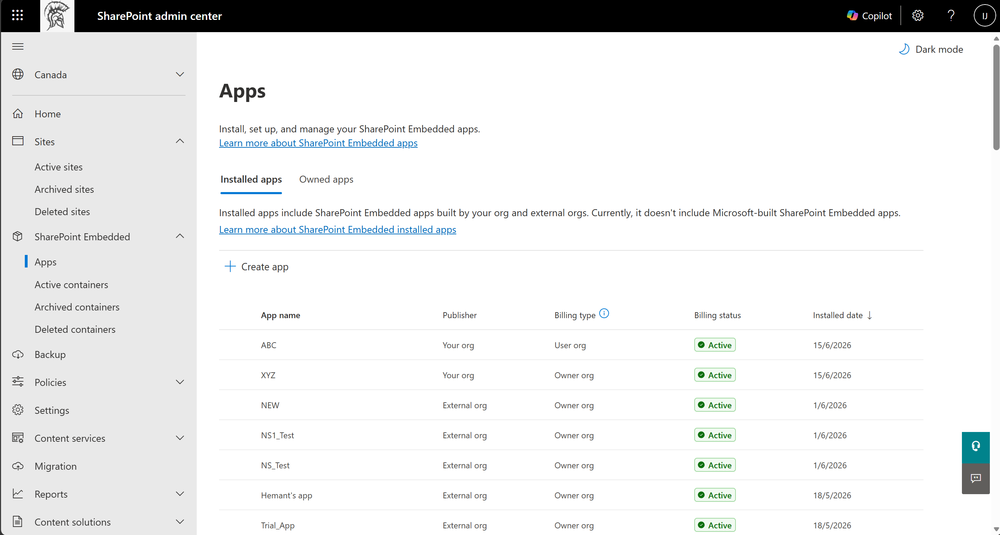
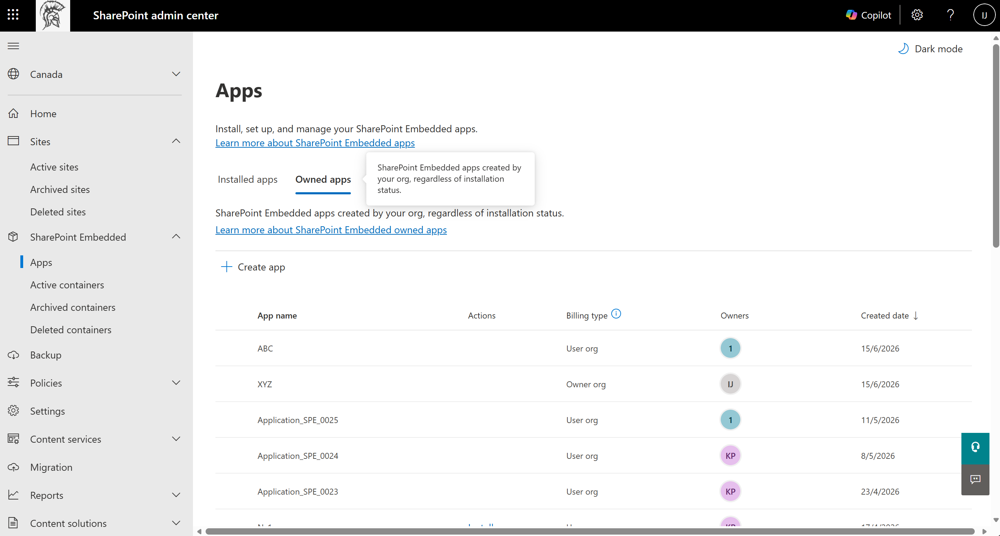
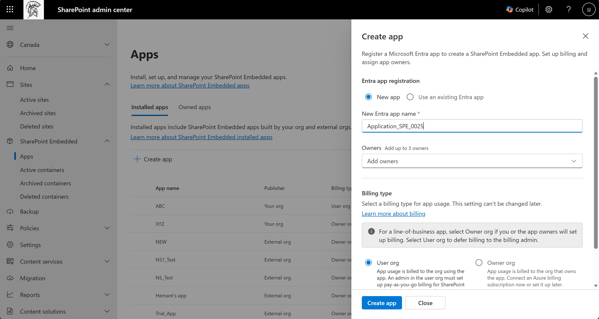
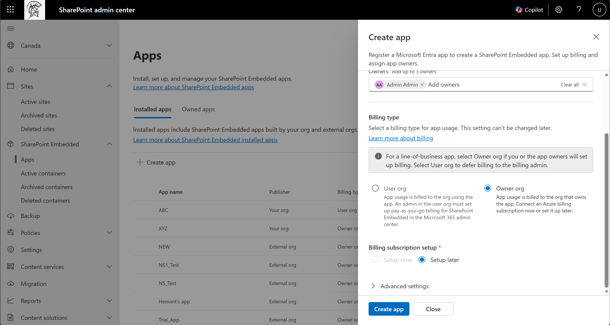

# Create apps in SharePoint admin center

**Applies to:** Developer tenant administrator — SharePoint Embedded admin / Global admin

<!-- agent:
task_type: how-to
audience: administrator
outcome: Create a SharePoint Embedded app from the SharePoint admin center and prepare it for installation and consent.
next: install-sharepoint-embedded-app.md
-->

Use the SharePoint admin center **Apps** experience to create a SharePoint Embedded app that your organization owns.
The create flow can register a new Microsoft Entra app or associate an existing Entra app with a new SharePoint Embedded app.

A **SharePoint Embedded Administrator** can complete this flow end to end. Creating a line-of-business app no longer depends on a Global Administrator granting consent first, so you can create an app and hand it off to developers quickly. You add up to three owners during creation, so developers you assign as owners can start building against the app right away.

This article explains the administrator flow and calls out where command or API details affect app readiness.

> [!IMPORTANT]
> You need the **SharePoint Embedded Administrator** role or Global Administrator privileges to create and manage SharePoint Embedded apps in the SharePoint admin center. For a line-of-business app, the SharePoint Embedded Administrator can create the app without Global Administrator consent.

## Before you begin

Confirm these prerequisites.

- Your tenant has SharePoint available.
- You can sign in to the [SharePoint admin center](https://admin.microsoft.com/sharepoint).
- You have the SharePoint Embedded Administrator role or Global Administrator role.
- You know whether to create a new Microsoft Entra app or use an existing app registration.
- You know which owners should manage the app.
- You know which billing type applies to the app.
- For owner organization billing, you have owner or contributor access to the Azure subscription used for billing.

For role details, see [SharePoint Embedded administrator](admin-overview.md).

## Understand the Apps page

In the SharePoint admin center, SharePoint Embedded apps are managed from **SharePoint Embedded** > **Apps**.
The page includes two app inventory views.

| Tab | Use it for |
| --- | --- |
| Installed apps | Review SharePoint Embedded apps installed in the tenant. The list includes apps built by your organization and by external organizations. It currently doesn't include Microsoft-built SharePoint Embedded apps. |
| Owned apps | Review SharePoint Embedded apps created by your organization, regardless of installation status. |

The **Installed apps** tab shows each app's publisher, billing type, billing status, and installed date.

*Figure 1: The Installed apps tab lists apps built by your organization and external organizations, with their publisher and billing status.*

The **Owned apps** tab shows each app's actions, billing type, owners, and created date.
Use it to verify app creation and to start installation when an app is ready.

*Figure 2: The Owned apps tab lists every app your organization created, regardless of installation status.*

> [!TIP]
> Use **Owned apps** as the tenant inventory for apps your organization builds.
> Use **Installed apps** as the tenant inventory for apps available in the tenant.

## Create an app

1. Sign in to the [SharePoint admin center](https://admin.microsoft.com/sharepoint).
1. In the left navigation, expand **SharePoint Embedded**.
1. Select **Apps**.
1. Select **+ Create app**.
1. Wait for the **Create app** panel to open.

*Figure 3: The Create app panel registers a Microsoft Entra app, assigns owners, and sets the billing type in a single flow.*

## Choose the Entra app registration option

In **Entra app registration**, choose one option.

| Option | Use it when |
| --- | --- |
| New app | You want the admin center flow to create a new Microsoft Entra application registration. |
| Use an existing Entra app | You already have a Microsoft Entra app and want to associate it with the SharePoint Embedded app. |

If you choose **New app**, enter the new Entra app name.

If you choose **Use an existing Entra app**, search by application ID or application name.

Don't create duplicate app registrations unless your app architecture requires them.

Use one owning application for the SharePoint Embedded app that owns its container type.

## Add app owners

Add up to three owners in the **Owners** field.

Owners can manage app settings and billing configuration.

Assign the developers who build the app as owners so you can hand the app off immediately after creation.

Choose durable administrative owners instead of individual temporary project members when an owner must persist beyond the initial project.

Record the owners in your internal operations documentation.

If an owner leaves the organization, update ownership before removing their account.

## Select billing type

Billing type determines who pays for SharePoint Embedded consumption.

Choose carefully because billing type can't be changed after app creation.

| Billing type | Meaning |
| --- | --- |
| User org | The organization using the app sets up pay-as-you-go billing in the Microsoft 365 admin center. |
| Owner org | Usage is billed to the organization that owns the app. |

Use **User org** for scenarios where each consuming tenant is responsible for billing.

Use **Owner org** when your organization owns the app and manages billing directly.

For billing concepts, see [Set up billing in Microsoft 365 admin center](setup-billing-microsoft-365-admin-center.md) and [Monitor usage, billing, and cost](monitor-usage-billing-cost.md).

## Configure owner organization billing

If you select **Owner org**, choose when to connect the Azure billing subscription in **Billing subscription setup**.

| Option | Result |
| --- | --- |
| Setup now | You provide the Azure subscription and resource group during app creation, and billing is attached when the app is created. |
| Setup later | The app is created without a billing subscription. You can attach billing later from the app details panel on the **Installed apps** tab. |

1. Select **Setup now** or **Setup later**.
1. If you select **Setup now**, provide the subscription information requested by the admin center.
1. Confirm that the subscription and resource group are valid.

*Figure 4: For Owner org billing, choose Setup now to attach an Azure subscription during creation, or Setup later to attach it from the app details panel afterward.*

> [!NOTE]
> **User org** billing isn't set up in this panel. For a User org app, a Global Administrator in the consuming tenant sets up billing in the Microsoft 365 admin center before users can access the app. Only a Global Administrator can set up billing.

## Configure advanced settings

Expand **Advanced settings** when you need optional settings.

The **Graph Explorer** toggle supports development and testing.

Turn it on only when administrators or developers need to explore Microsoft Graph requests for the app.

Turn it off when it isn't needed.

For Graph Explorer documentation, see [Use Graph Explorer to try Microsoft Graph APIs](/graph/graph-explorer/graph-explorer-overview).

## Submit the app

1. Review the Entra app registration selection.
1. Review the app owners.
1. Review billing type.
1. Review advanced settings.
1. Select **Create app**.

When you select **Create app**, the admin center completes these steps together:

- Registers the Microsoft Entra app, or associates the existing Entra app you selected.
- Creates the SharePoint Embedded app, which is also called the container type.
- Installs the app in your tenant.
- Attaches billing when you select **Owner org** and **Setup now**.

A successful create flow also installs the app, so the app appears on the **Installed apps** tab. If only the install step fails, the SharePoint Embedded app is created but not installed. In that case, install it later from the **Owned apps** tab. See [Install a SharePoint Embedded app](install-sharepoint-embedded-app.md).

The **Create app** button is available only after required fields are complete.

If you cancel the panel, no app is created.

## Validate app creation

After the app is created, validate it in the SharePoint admin center.

1. Return to **SharePoint Embedded** > **Apps**.
1. Open **Owned apps**.
1. Confirm that the app appears in the owned app inventory.
1. Confirm the owner list.
1. Confirm the billing type.
1. Check billing status.
1. If the app is also installed, confirm that it appears in **Installed apps**.

Use the billing status to decide the next action.

| Status | Action |
| --- | --- |
| Active | Continue with installation, consent, and operational validation. |
| Inactive | Complete billing setup or resolve the billing issue before production use. |

## Prepare for installation

App creation doesn't complete the consuming tenant setup by itself.

Depending on the app model, the tenant still needs installation, consent, and permission registration.

Continue with these tasks.

1. Install or register the app in the tenant.
1. Grant admin consent for requested permissions.
1. Register container type application permissions when the owning app requires it.
1. Set up pass-through billing if the consuming tenant pays for usage.
1. Verify containers after the app creates content.

## Troubleshoot app creation

Use these checks if creation fails or the app isn't usable.

- Confirm your account has the SharePoint Embedded Administrator role.
- Confirm the selected existing Entra app exists and is available in the tenant.
- Confirm owners resolve in the people picker.
- Confirm required billing fields are complete.
- Confirm owner organization billing uses a valid Azure subscription and resource group.
- If the app is inactive, complete or repair billing setup.
- If users can't access the app after creation, verify installation, admin consent, and container type permissions.

> [!WARNING]
> Don't treat app creation as proof that the app is ready for users.
> Users may still be blocked by missing installation, missing consent, or invalid billing.

## Related content

- [Admin overview](admin-overview.md)
- [Install a SharePoint Embedded app](install-sharepoint-embedded-app.md)
- [Grant admin consent and permissions](grant-admin-consent-permissions.md)
- [Set up billing in Microsoft 365 admin center](setup-billing-microsoft-365-admin-center.md)
- [Manage containers in SharePoint admin center](manage-containers-sharepoint-admin-center.md)

## Next steps

Install the app by using [Install a SharePoint Embedded app](install-sharepoint-embedded-app.md).
