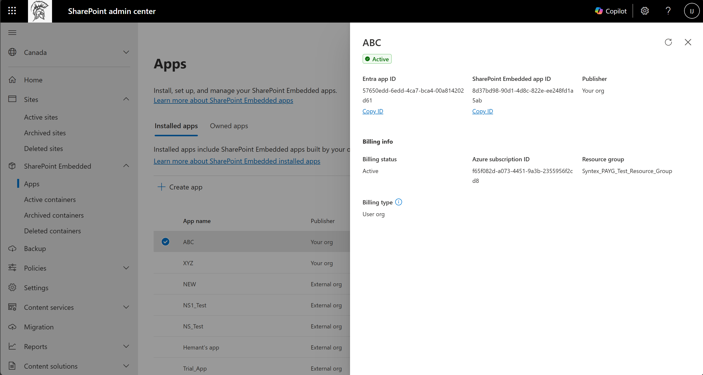

# Install a SharePoint Embedded App

**Applies to:** Consuming tenant admin — SharePoint Embedded admin / Global admin

<!-- agent:
task_type: how-to
audience: administrator
outcome: Install a SharePoint Embedded app in a tenant and identify the required follow-up tasks.
next: grant-admin-consent-permissions.md
-->

Install a SharePoint Embedded app when a consuming Microsoft 365 tenant needs to use the app.
Installation makes the app visible for tenant administration, but the tenant may still need admin consent, container type permission registration, and billing setup before users can access content.

This article focuses on the consuming-tenant administrator path in the SharePoint admin center.

> [!IMPORTANT]
> A consuming tenant admin is typically a user assigned the **SharePoint Embedded Administrator** role.
> Global Administrators can also perform SharePoint Embedded administration tasks.

Use this article with [Choose an App Model: Single-Tenant or Multitenant](../plan/choose-app-model.md) and the app creation guidance.
The app model determines who owns the app, who installs or onboards it, where containers are created, who pays, and which admins must consent or configure billing.

## Before you begin

Confirm these prerequisites.

- You can sign in to the consuming tenant.
- Your account has the SharePoint Embedded Administrator role or Global Administrator role.
- The SharePoint Embedded app exists in the owning tenant.
- You have the app identity or installation link provided by the app owner.
- You know whether billing is handled by the app owner or by the user organization.
- You know which permissions the app requests.
- You can complete admin consent if the installation flow requires it.
- You know whether the app is a single-tenant line-of-business app or a multitenant ISV app.

For role information, see [Admin overview](admin-overview.md).

## Understand the consuming tenant path

A consuming tenant is the Microsoft 365 tenant where users run the SharePoint Embedded app and where the app stores content in containers.
The consuming tenant admin manages the app and containers in that tenant.
For a single-tenant line-of-business app, the owning tenant and consuming tenant are usually the same.
For a multitenant ISV app, each customer tenant is a consuming tenant and customer files remain in the customer Microsoft 365 tenant boundary.

Consuming tenant administrators use two administration surfaces.

| Surface | Use it for |
| --- | --- |
| SharePoint admin center | View installed apps, active containers, deleted containers, and container details. |
| SharePoint Online Management Shell | Enumerate applications, enumerate containers, update labels, configure sharing, and manage lifecycle operations. |

Use the SharePoint admin center when you need guided installation and validation.
Use PowerShell for repeatable inventory and operations after installation.

## Install from the SharePoint admin center

Use the SharePoint Embedded **Apps** experience in the SharePoint admin center when the app is available to install.
The **Installed apps** tab lists SharePoint Embedded apps built by your organization and by external organizations. It currently doesn't include Microsoft-built SharePoint Embedded apps.

1. Sign in to the [SharePoint admin center](https://admin.microsoft.com/sharepoint).
1. In the left navigation, expand **SharePoint Embedded**.
1. Select **Apps**.
1. Review **Installed apps** to confirm whether the app is already installed.
1. If you own the app, review **Owned apps** and locate the app.
1. Select the available install action for the app.
1. Review the app name, publisher, and billing information.
1. Continue through the installation prompts.
1. Complete admin consent if the flow directs you to consent.
1. Finish the installation.

The exact installation prompts can vary by app ownership and billing model.
Don't continue if the app identity or publisher is unexpected.

> [!CAUTION]
> Install only apps that your organization trusts.
> A SharePoint Embedded app can create and access containers according to the permissions granted to it.

## Install an owned app that didn't install

A successful create flow installs the app automatically, so you don't usually install an owned app separately.
Only when the install step in the create flow fails is the SharePoint Embedded app created but not installed.
In that case, install the app from the **Owned apps** tab.

1. Go to **SharePoint Embedded** > **Apps**.
1. Open **Owned apps**.
1. Locate the app that isn't installed.
1. Select the install action for the app.
1. Complete the installation prompts.

After installation completes, the app appears on the **Installed apps** tab.

## Validate installation

After installation, validate the app inventory.

1. Return to **SharePoint Embedded** > **Apps**.
1. Open **Installed apps**.
1. Confirm that the app is listed.
1. Confirm the app name and publisher.
1. Confirm the billing type and billing status.
1. If the app is owned by your organization, open **Owned apps** and confirm ownership metadata.
1. Record the owning application ID for future PowerShell and permission review.

Select an app on the **Installed apps** tab to open its details panel. The panel shows the app's status, Entra app ID, SharePoint Embedded app ID, publisher, and billing information.



*Figure 1: The app details panel on the Installed apps tab shows identifiers and billing information, and lets you copy the Entra and SharePoint Embedded app IDs.*

If the app isn't visible, refresh the page and confirm that installation completed successfully.
If the app remains missing, contact the app owner and verify the app identity.

## Complete admin consent

Installation and consent are related but not always the same task.
The owning app must have a service principal installed in the consuming tenant and admin consent before it can register container type application permissions.

> [!NOTE]
> When you create the app in the SharePoint admin center, consent is granted as part of the create flow, so you don't complete the manual admin consent step in this section. Use this section when the app is created another way, such as an app that another organization owns or an app registered directly in Microsoft Entra.

Use [Grant admin consent and permissions](grant-admin-consent-permissions.md) to review the requested permissions and complete consent.

Admin consent may be requested through the Microsoft identity platform admin consent endpoint, for example:

```http
https://login.microsoftonline.com/{your-tenant-id}/v2.0/adminconsent?client_id={owning-app-clientid}&scope=https://graph.microsoft.com/.default&redirect_uri={spe-app-redirect-uri}
```

Use the exact client ID provided by the app owner.
Don't substitute a different application ID.

## Confirm billing requirements

SharePoint Embedded supports standard and pass-through billing models.
For pass-through billing, a Global Administrator in the consuming tenant must set up billing in the Microsoft 365 admin center before users can access the app. Only a Global Administrator can set up billing; the SharePoint Embedded Administrator role can't.

If billing is invalid or SharePoint Embedded is turned off, users can no longer create new containers, although existing containers and their content remain accessible.

### Attach or change billing from the details panel

If billing was skipped during app creation, you can attach it later from the app details panel on the **Installed apps** tab. For an **Owner org** app that your organization owns, you can also change the billing subscription that's already attached from the same panel.

1. Open **SharePoint Embedded** > **Apps** > **Installed apps**.
1. Select the app to open its details panel.
1. In **Billing info**, attach a billing subscription or update the existing one.

For a **User org** app, billing isn't attached from this panel. A Global Administrator in the consuming tenant sets up billing in the Microsoft 365 admin center. See [Set up billing in Microsoft 365 admin center](setup-billing-microsoft-365-admin-center.md).

Use [Set up billing in Microsoft 365 admin center](setup-billing-microsoft-365-admin-center.md) to configure billing for consuming-tenant scenarios.
Use [Monitor usage, billing, and cost](monitor-usage-billing-cost.md) to review ongoing cost.

## Verify containers after app use

The app may not create containers until users or app processes start using it.
After containers exist, validate them.

1. In the SharePoint admin center, go to **SharePoint Embedded** > **Active containers**.
1. Search or filter by application name.
1. Open a container details panel.
1. Review general metadata.
1. Review membership.
1. Confirm sensitivity label state if labels are required.
1. Review storage use.

For detailed steps, see [Manage containers in SharePoint admin center](manage-containers-sharepoint-admin-center.md).

## Validate with PowerShell

Use SharePoint Online Management Shell when you need a scripted check.
Install the latest SharePoint Online Management Shell and connect to SharePoint Online.
Then use the supported application inventory cmdlets.

```powershell
Get-SPOApplication
```

To view details for a specific application, use the owning application ID.

```powershell
Get-SPOApplication -OwningApplicationId <OwningApplicationId>
```

For command details, see [Manage containers with PowerShell](manage-containers-powershell.md) and [Get-SPOApplication](/powershell/module/sharepoint-online/get-spoapplication).

## Manage container type registrations with Microsoft Graph

Consuming tenant admins can also manage container type registrations programmatically. The [fileStorageContainerTypeRegistration](/graph/api/resources/filestoragecontainertyperegistration) resource represents the registration of a container type in a consuming tenant. Managing all registrations in the tenant requires the `FileStorageContainerTypeReg.Manage.All` delegated permission.

| Operation | API |
| --- | --- |
| List registrations | [List container type registrations](/graph/api/filestorage-list-containertyperegistrations) |
| Get a registration | [Get container type registration](/graph/api/filestoragecontainertyperegistration-get) |
| Update a registration | [Update container type registration](/graph/api/filestoragecontainertyperegistration-update) |
| Delete a registration | [Delete container type registration](/graph/api/filestorage-delete-containertyperegistrations) |

## Troubleshoot installation

Use these checks when installation doesn't complete.

- Confirm the administrator has the SharePoint Embedded Administrator role.
- Confirm the app identity and publisher.
- Confirm the app is available for your tenant.
- Confirm admin consent is granted for the correct application.
- Confirm the app has a service principal in the consuming tenant after consent.
- Confirm billing is active for pass-through apps.
- Confirm the app owner registered container type application permissions when required.
- Confirm users are assigned the required app roles or memberships.

> [!NOTE]
> Access denied errors after installation often indicate missing consent, missing container type permission registration, or app-level permission configuration rather than a container problem.

## Related content

- [Admin overview](admin-overview.md)
- [Create apps in SharePoint admin center](create-apps-sharepoint-admin-center.md)
- [Grant admin consent and permissions](grant-admin-consent-permissions.md)
- [Set up billing in Microsoft 365 admin center](setup-billing-microsoft-365-admin-center.md)
- [Manage containers in SharePoint admin center](manage-containers-sharepoint-admin-center.md)

## Next steps
Grant consent and verify permissions in [Grant admin consent and permissions](grant-admin-consent-permissions.md).
