# Manage containers in SharePoint admin center

**Applies to:** Consuming tenant admin — SharePoint Embedded admin / Global admin

<!-- agent:
task_type: how-to
audience: administrator
outcome: Manage SharePoint Embedded container inventory and lifecycle in the SharePoint admin center.
next: manage-containers-powershell.md
-->

Use the SharePoint admin center to manage SharePoint Embedded containers through a graphical experience.

The SharePoint Embedded container pages help consuming tenant admins view active containers, inspect details, manage membership, apply sensitivity labels, archive and reactivate containers, delete containers, restore deleted containers, and permanently delete containers.

> [!IMPORTANT]
> To manage SharePoint Embedded containers, assign the **SharePoint Embedded Administrator** role.
> A Global Administrator can also perform these tasks.

## Before you begin

Confirm these prerequisites.

- You can sign in to the [SharePoint admin center](https://admin.microsoft.com/sharepoint).
- Your account has the SharePoint Embedded Administrator role or Global Administrator role.
- The SharePoint Embedded app is installed in the tenant.
- Containers exist for the app.
- You understand the business impact before deleting or permanently deleting any container.

For role context, see [Admin overview](admin-overview.md).

## Open container management

1. Sign in to the [SharePoint admin center](https://admin.microsoft.com/sharepoint).
1. In the left navigation, expand **SharePoint Embedded**.
1. Select **Active containers** to view active containers.
1. Select **Archived containers** to view containers in the archived state.
1. Select **Deleted containers** to view containers in the deleted container collection.

A SharePoint Embedded Administrator sees only the SharePoint Embedded-specific pages that apply to the role.
The role doesn't expose general SharePoint **Active sites** or **Deleted sites** pages.

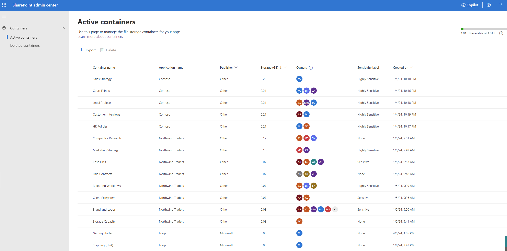

## View active containers

The **Active containers** page shows active containers in the tenant.

Use it for inventory, compliance review, and lifecycle decisions.

The **Active containers** page shows these container properties.

| Column or property | Meaning |
| --- | --- |
| Container name | Name provided by the container owner. |
| Application name | SharePoint Embedded application that the container belongs to. |
| Publisher | Organization that owns the application. |
| Ownership type | Tenant-owned, user-owned, or group-owned. |
| Principal owner | User or group whose lifecycle affects the container lifecycle, when applicable. |
| Storage | Storage used by files in the container. |
| Owners | Users assigned the owner role. |
| Owner count | Number of owners. |
| Sensitivity label | Label assigned to the container. |
| Created on | Date and time the container was created. |

Use these fields to identify stale, large, unlabeled, or ownership-risk containers.

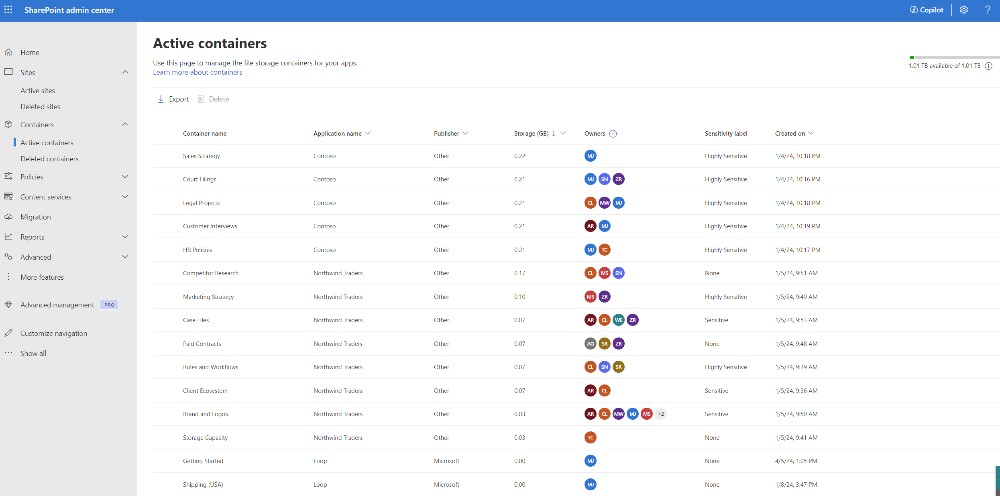

## Search, sort, and filter active containers

Use the active container page controls to narrow the inventory.

1. Search by container name.
1. Sort by supported columns such as storage or created date.
1. Filter by application name.
1. Filter by publisher.
1. Filter by ownership type.
1. Filter by principal owner.
1. Filter by owner count.
1. Filter by created date.

> [!NOTE]
> Filtering behavior on the **Active containers** page differs from the **Active sites** page in the SharePoint admin center.

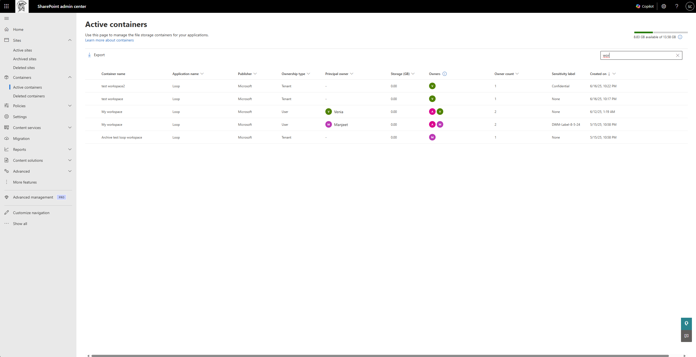

## Inspect container details

Open a container details panel when you need more information.

The details view includes two tabs.

| Tab | Use it for |
| --- | --- |
| General | Review container metadata, usage, and configuration settings. |
| Membership | Review and manage user permissions for roles associated with the container. |

Review the general tab before lifecycle operations.

Review membership before changing users or owner assignments.

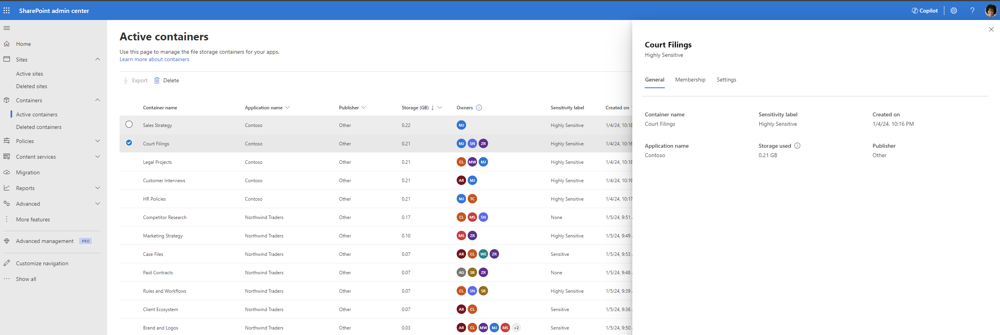

## Manage membership

The SharePoint Embedded platform supports four roles: Owner, Manager, Writer, and Reader.

An individual SharePoint Embedded application may not use all four roles and may display different role names in its own user experience.

In the SharePoint admin center membership panel, administrators can:

1. Add a user to a role.
1. Reassign a user from one role to another role.
1. Remove a user from a role.

Use membership changes to maintain access continuity when owners change roles or leave the organization.
Coordinate with app owners when the app has its own membership workflow.

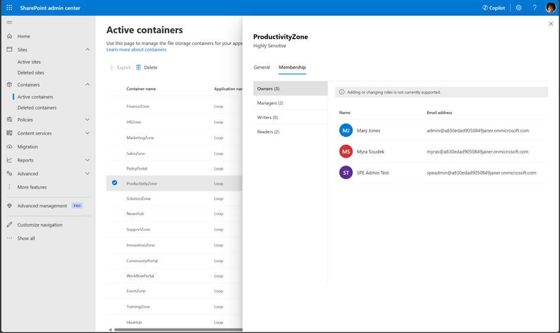

## Set a sensitivity label

Admins can set a sensitivity label on a container from the Active containers page.

Open the container details panel and use the settings area.

Before applying a label, confirm:

- The label exists and is published to the right administrators.
- The label is appropriate for the content and app scenario.
- The app owner understands any access or protection impact.
- Compliance administrators approve the labeling approach.

For broader controls, see [Apply security and compliance controls](apply-security-compliance-controls.md).

## Archive a container

Archive a container when it's no longer actively used but must be retained for legal, compliance, or business purposes. Documents in an archived container can't be accessed by any user or application until the container is reactivated.

> [!NOTE]
> Container archival relies on Microsoft 365 Archive, which is in preview for SharePoint Embedded. Validate tenant availability, billing, and API behavior before you archive production containers. For more information, see [Archive and restore containers](../build/archive-restore-containers.md).

1. Open **Active containers**.
1. Select the container.
1. Select **Archive**.
1. Review the side panel that explains the archival implications and reactivation options.
1. Select **Archive** to confirm, or cancel to return to active containers.

The container moves to the **Archived containers** page.

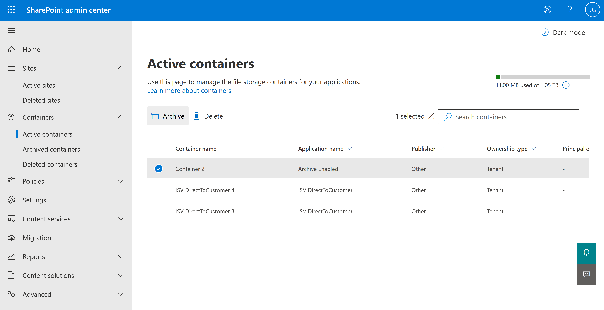

## View archived containers

The **Archived containers** page lists containers in the tenant's archived container collection. It shows the following metadata:

- Container name
- Application name
- Publisher
- Status
- Time archived
- Archived by
- Storage (GB)
- Ownership type
- Principal owner

Use this page to review archived containers, decide on reactivation timing, and manage their lifecycle. The Archived containers page also provides the same delete experience as active containers for selecting and deleting containers.

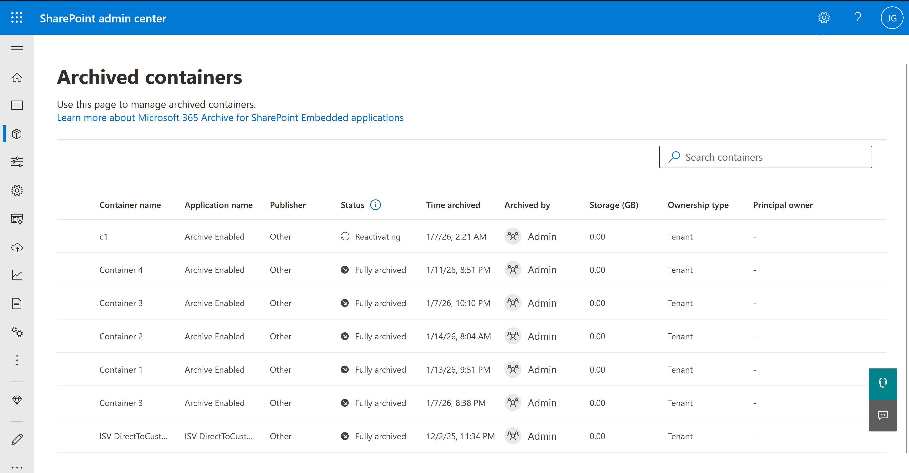

## Reactivate archived containers

Archived containers aren't accessible to users or applications until reactivated. Reactivation time depends on how long the container has been archived.

### Reactivate recently archived containers

Containers archived within the last seven days are in the **Recently archived** state and reactivate quickly.

1. Open **Archived containers**.
1. Select a Recently archived container.
1. Select **Reactivate**.
1. Review the side panel with reactivation timing.
1. Select **Reactivate** to confirm, or cancel to return.

The container moves to the **Active containers** page.

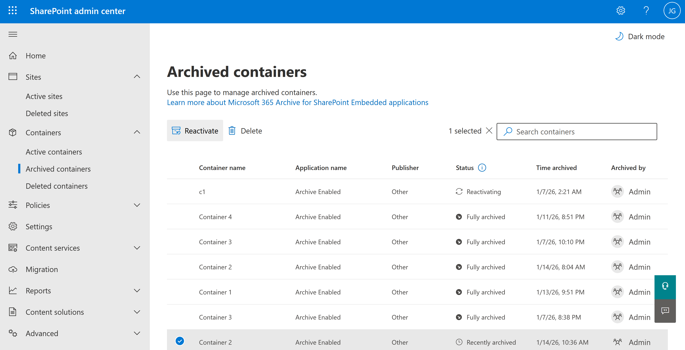

### Reactivate fully archived containers

Containers archived longer than seven days are in the **Fully archived** state and require a 24-hour reactivation window.

1. Open **Archived containers**.
1. Select a Fully archived container.
1. Select **Reactivate**.
1. Review the side panel that states the **24 hours** reactivation time.
1. Select **Reactivate** to submit the request, or cancel to return.

The request displays as "Reactivating" on the Archived containers page. After 24 hours, the container moves to the **Active containers** page.

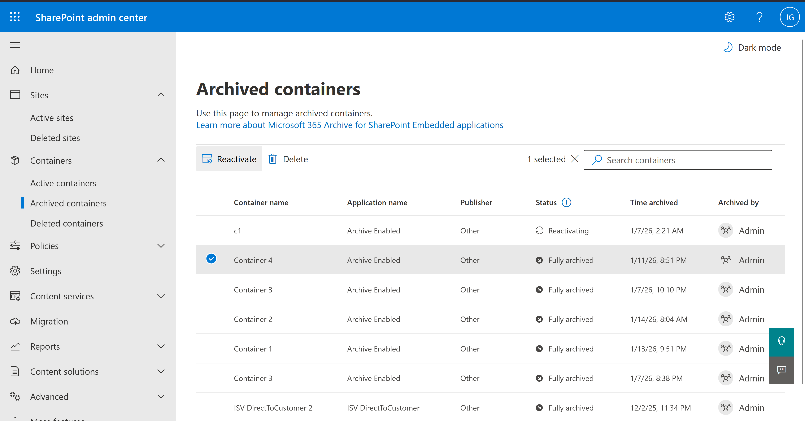

## Delete an active or archived container

Delete a container only when there's a clear business reason.

Container deletion can affect the SharePoint Embedded app that owns the container.

Potential impacts include:

- Content loss from the app experience.
- Broken links or references.
- Application errors if the app expects the container to exist.
- Permission or workflow disruption.

To delete a container:

1. Open **Active containers**.
1. Select the container.
1. Select the delete action when it becomes available.
1. Review the warning panel.
1. Confirm deletion only after validating business impact.

The container moves to the deleted container collection.

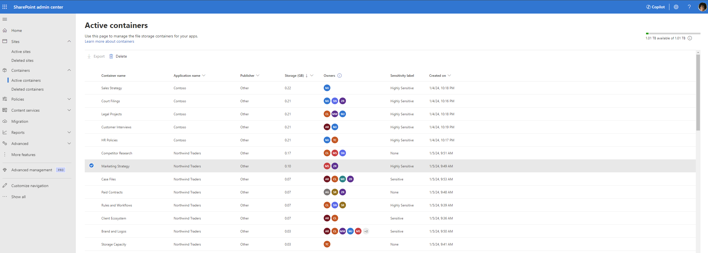

> [!WARNING]
> Deleting a container may interrupt the associated SharePoint Embedded application.
>
> Notify app owners before deleting containers.

## View deleted containers

The **Deleted containers** page lists containers in the tenant deleted container collection.
The **Deleted containers** page shows metadata similar to active containers and adds **Deleted on**.

Use the deleted container view to:

1. Confirm that a deleted container is recoverable.
1. Review storage and ownership.
1. Sort by supported columns such as storage, created date, or deleted date.
1. Filter by app, publisher, ownership type, principal owner, owner count, created date, or deleted date.
1. Decide whether to restore or permanently delete the container.

Deleted containers are permanently purged after 93 days unless a retention policy changes the outcome.

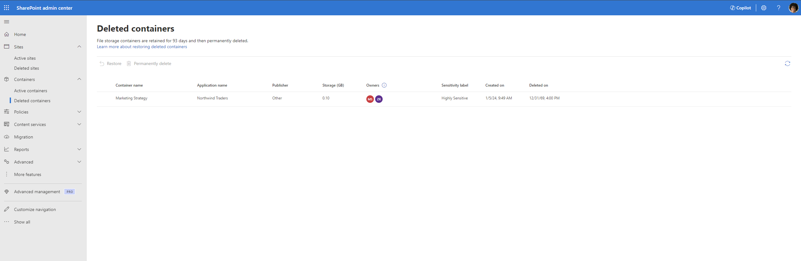

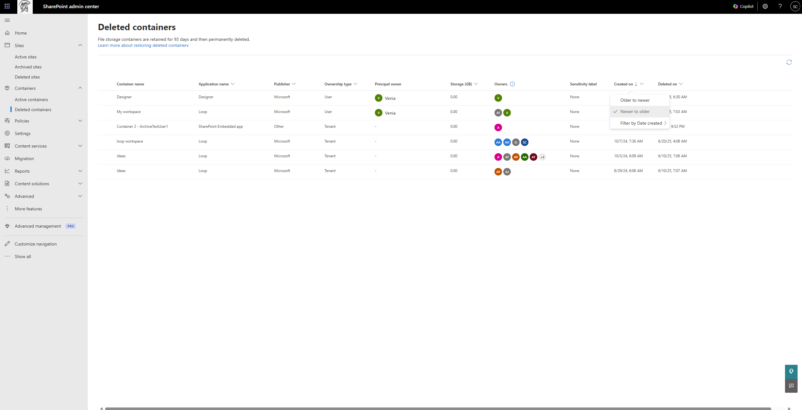

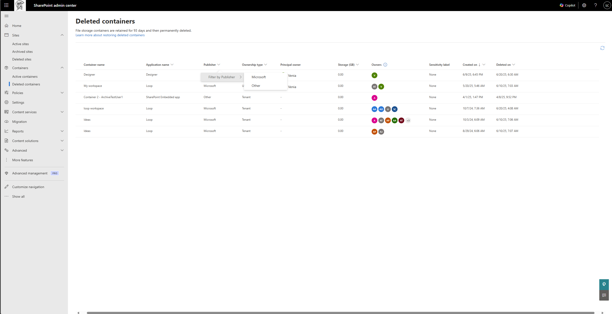

## Restore a deleted container

Restore a container when deletion was accidental or the app still needs the content.

1. Open **Deleted containers**.
1. Select the container.
1. Select **Restore**.
1. Wait for the background operation to complete.
1. Confirm the container appears on **Active containers**.
1. Ask the app owner to validate the app experience.

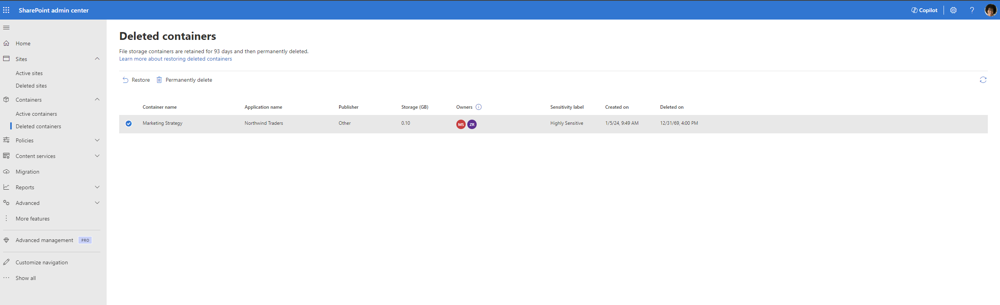

## Permanently delete a container

Permanently delete a container only when recovery is no longer required and retention policies allow deletion.

1. Open **Deleted containers**.
1. Select the container.
1. Select **Permanently delete**.
1. Review the confirmation warning.
1. Confirm the action only if the organization no longer needs the content.

After permanent deletion, the container is removed from the deleted container collection and can't be restored.

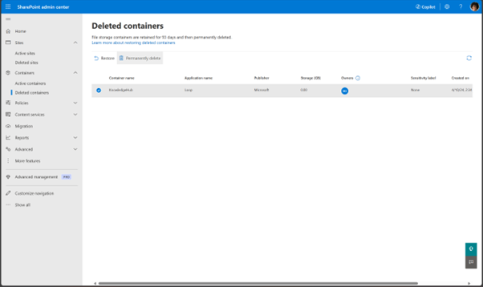

> [!CAUTION]
> Permanent deletion is irreversible.
> Confirm retention, legal hold, and app owner requirements before proceeding.

## When to use PowerShell instead

Use PowerShell when you need automation or repeatable reporting.

For example, use PowerShell to enumerate applications, list containers for an owning application, sort containers by storage, set sensitivity labels, delete containers, restore deleted containers, or permanently delete deleted containers.

Continue with [Manage containers with PowerShell](manage-containers-powershell.md).

## Related content

- [Admin overview](admin-overview.md)
- [Manage containers with PowerShell](manage-containers-powershell.md)
- [Monitor usage, billing, and cost](monitor-usage-billing-cost.md)
- [Apply security and compliance controls](apply-security-compliance-controls.md)

## Next steps

Automate container management in [Manage containers with PowerShell](manage-containers-powershell.md).
