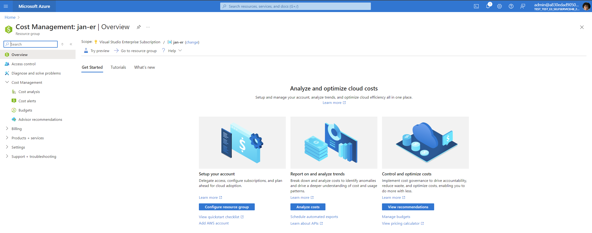
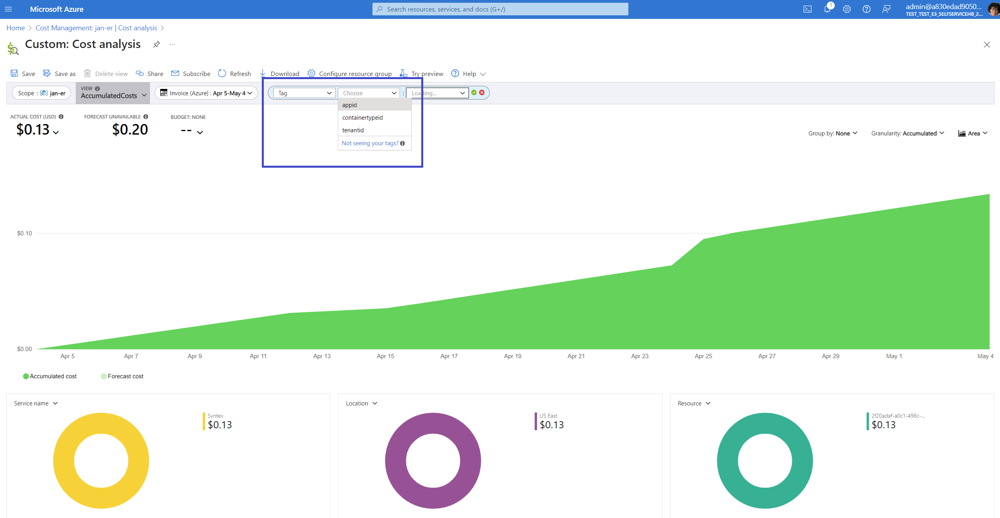
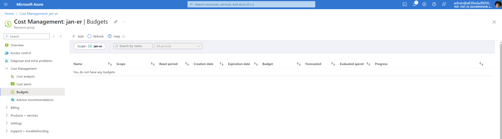

# Monitor Usage, Billing, and Cost

**Applies to:** Billing administrator

<!-- agent:
task_type: how-to
audience: administrator
outcome: Track SharePoint Embedded consumption, understand cost drivers, and configure cost controls.
next: review-audit-events.md
-->

Monitor SharePoint Embedded usage and cost after billing is configured.
SharePoint Embedded uses pay-as-you-go billing through an Azure subscription.
Cost is based on usage meters, so administrators should review storage, archived storage, API transactions, and egress regularly.

Use this article to understand cost drivers, review billing in Azure Cost Management, and establish operational controls.

> [!IMPORTANT]
> Admin actions taken through the SharePoint admin center or SharePoint PowerShell aren't charged as SharePoint Embedded API transactions according to the SharePoint Embedded billing meters.

## Before you begin

Confirm these prerequisites.

- SharePoint Embedded billing is configured for the app or tenant.
- You can access the Azure subscription linked to SharePoint Embedded billing.
- You can open [Azure Cost Management](https://portal.azure.com/#view/Microsoft_Azure_CostManagement/Menu/~/overview/openedBy/AzurePortal).
- You know the app IDs, tenant IDs, or container type IDs used for filtering when available.
- You can review container inventory in the SharePoint admin center or PowerShell.

For billing setup, see [Set up billing in Microsoft 365 admin center](setup-billing-microsoft-365-admin-center.md).

## Understand SharePoint Embedded meters

SharePoint Embedded uses these billing meters.
Both standard billing and pass-through billing container types use the same meters.

| Meter | Unit concept | Cost driver |
| --- | --- | --- |
| Storage | GB | Files, documents, metadata, versions, recycle bin content, and deleted container collection content. |
| Archived Storage | GB | Data in archived containers, held in a lower-cost cold storage tier. |
| API transactions | Transactions | Microsoft Graph calls made explicitly by the SharePoint Embedded application. |
| Egress | GB | Data downloaded from SharePoint Embedded to a customer's client device, subject to exemptions. |

For related details, see [SharePoint Embedded Billing Meters](../reference/billing-meters.md).

## Monitor storage

Storage consumption includes more than current visible files.
Storage includes files, documents, metadata, versions, recycle bin content, and deleted container collection content.

Use these actions to manage storage.

1. Review large containers in the SharePoint admin center.
1. Use PowerShell sorting to find containers by storage.
1. Review deleted containers that still contribute to storage.
1. Confirm whether retention policies require deleted content to remain.
1. Ask app owners to reduce unnecessary versions or obsolete content when appropriate.
1. Monitor storage growth after app releases or migrations.

To sort containers by storage with PowerShell, see [Manage containers with PowerShell](manage-containers-powershell.md).

## Monitor API transactions

Each Microsoft Graph call made explicitly by the SharePoint Embedded application counts as one transaction.
Calls made by internal services to containers aren't charged when the application has no control over those calls.

Nonchargeable transactions include:

- eDiscovery service queries that search container content for compliance or legal purposes.
- Admin actions taken by SharePoint Embedded Admins or Global Admins through SharePoint admin center or SharePoint PowerShell.

Use app telemetry from the owning application to correlate app releases, user activity, and transaction growth.
Work with app owners when transaction growth is unexpected.

## Monitor egress

Egress refers to data downloaded from SharePoint Embedded to a customer's client device. Some Microsoft service transfers are exempt.

Exempt transfers include:

- File downloads from the SharePoint Embedded application server to the customer's Office Desktop client.
- File downloads from the SharePoint Embedded application server to the Web Application Companion (WAC).

Review app download behavior when egress grows.
Large exports, sync-like patterns, or repeated downloads can increase egress.

## Open Azure Cost Management

1. Open the [Azure portal](https://portal.azure.com/).
1. Select **Cost Management + Billing**.
1. If you don't see it, search for **Cost Management + Billing**.
1. Select the subscription linked to SharePoint Embedded billing.
1. Open the subscription overview to review current spending, forecasted costs, and anomalies.

## Use Cost analysis

1. In **Cost Management + Billing**, open **Cost analysis**.
1. Select the date range to review.
1. Group or filter by meter when available.
1. Use filters such as app ID, tenant ID, or container type ID when available.
1. Save views that your operations team uses repeatedly.
1. Export data if your organization uses a separate reporting process.

Compare cost trends to app deployment dates and usage campaigns.
If cost increases suddenly, review storage, transaction volume, and egress separately.

## Download invoices

Use the **Invoices** area under Billing to view and download billing invoices for the billing period.
Store invoices according to your organization's finance and procurement processes.

If invoice values don't match expected usage, compare invoice periods with Cost analysis date ranges.

## Configure budgets and alerts

Use Azure Cost Management budgets to notify administrators before spend exceeds expected levels.

1. In **Cost Management**, select **Budgets**.
1. Create a budget for the linked subscription or billing scope.
1. Set the amount and time period.
1. Configure alerts for warning and critical thresholds.
1. Include app owners and billing owners in notifications.

> [!TIP]
> Create separate review views for storage-heavy apps and transaction-heavy apps.
> Different owners may need to respond to different cost drivers.

## Review app and container inventory

Billing review should include operational inventory.

1. In the SharePoint admin center, review **SharePoint Embedded** > **Apps**.
1. Confirm billing status for installed apps.
1. Review **Active containers** for high-storage containers.
1. Review **Deleted containers** for deleted content that may still contribute to storage.
1. Use PowerShell for repeatable exports.

For container management, see [Manage containers in SharePoint admin center](manage-containers-sharepoint-admin-center.md).

## Common cost questions

Use these checks during cost review.

- Which app generated the most consumption?
- Which meter increased since the last review?
- Did storage grow because of active content, versions, recycle bin content, or deleted containers?
- Did transaction volume increase after a feature release?
- Did egress increase after a new download workflow?
- Are budgets and alerts configured for the billing subscription?
- Are app owners aware of their cost drivers?

## Operational guidance

Establish a recurring review process.

- Review cost weekly during pilot or migration.
- Review cost monthly after steady state.
- Track app IDs and container type IDs in an admin inventory.
- Notify app owners before large lifecycle cleanup.
- Coordinate deleted container cleanup with retention and legal requirements.
- Include SharePoint Embedded in Azure subscription budget reviews.
- Validate billing status after subscription or resource group changes.

## Related content

- [Set up billing in Microsoft 365 admin center](setup-billing-microsoft-365-admin-center.md)
- [Manage containers in SharePoint admin center](manage-containers-sharepoint-admin-center.md)
- [Manage containers with PowerShell](manage-containers-powershell.md)
- [Review audit events](review-audit-events.md)
- [SharePoint Embedded Billing Meters](../reference/billing-meters.md)

## Next steps
Review compliance activity in [Review audit events](review-audit-events.md).
