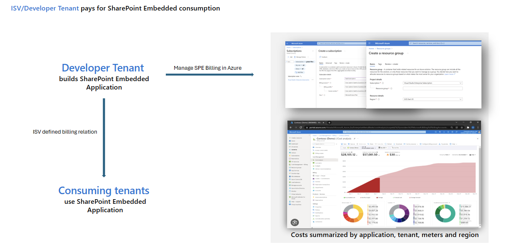
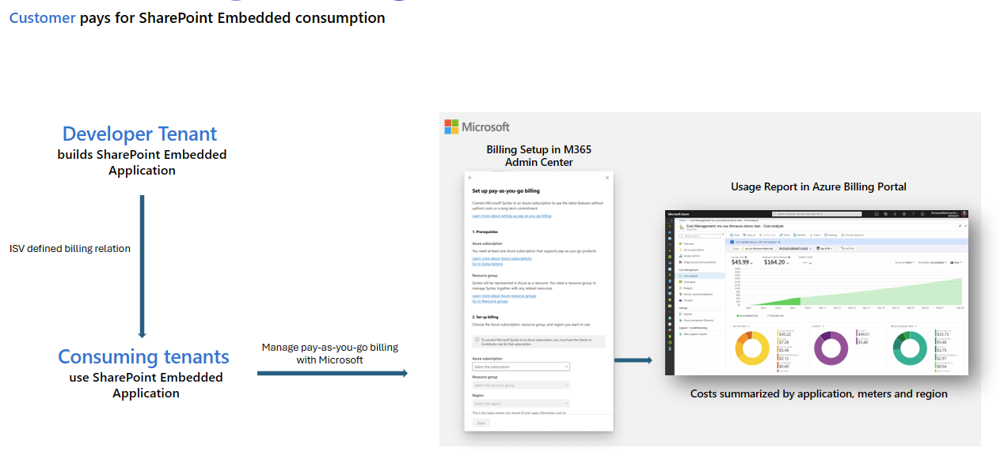

# Set Up Billing in Microsoft 365 Admin Center

**Applies to:** Consuming tenant admin — Billing admin / Global admin

<!-- agent:
task_type: how-to
audience: administrator
outcome: Set up billing for SharePoint Embedded apps that are billed to the consuming tenant.
next: manage-containers-sharepoint-admin-center.md
-->

Set up SharePoint Embedded billing in the Microsoft 365 admin center when your tenant uses an app with pass-through or user organization billing.
No user can access a pass-through SharePoint Embedded app before valid billing is configured for the SharePoint Embedded platform in the consuming tenant.

> [!IMPORTANT]
> Only a Global Administrator can set up SharePoint Embedded billing in the Microsoft 365 admin center. The SharePoint Embedded Administrator role can't configure billing.

SharePoint Embedded billing is pay-as-you-go through Azure.
Charges are based on supported meters such as storage, archived storage, API transactions, and egress.

> [!IMPORTANT]
> If SharePoint Embedded is turned off or the linked Azure subscription is disconnected, users can no longer create new containers. Existing containers and their content remain accessible.

## Before you begin

Confirm these prerequisites.

- You can sign in to the [Microsoft 365 admin center](https://admin.microsoft.com/).
- You have the Global Administrator role. Only a Global Administrator can set up billing in the Microsoft 365 admin center.
- You have owner or contributor permissions on the Azure subscription used for billing.
- You have an Azure subscription in the tenant.
- You have a resource group attached to the subscription.
- The SharePoint Embedded app is installed or ready to use in the consuming tenant.
- You understand whether the app uses pass-through billing.

For tenant role context, see [Admin overview](admin-overview.md).
For billing models, see [Choose a Billing Model](../plan/choose-billing-model.md).

## Understand billing models

SharePoint Embedded supports two billing models.

| Billing model | Who pays |
| --- | --- |
| Standard | The tenant that owns or develops the app is billed for consumption. |
| Pass-through | The tenant registered to use the app is billed for consumption. |

> [!NOTE]
> A container type's billing model is set when the container type is created and cannot be changed later. To switch billing models, the developer creates a new container type with the wanted model.

The following diagram shows standard billing, where consumption charges are billed to the tenant that owns or develops the app.

The following diagram shows pass-through billing, where consumption charges are billed to the consuming tenant that is registered to use the app.

For standard billing, a Global Administrator in the developer tenant sets up billing for the container type.
For pass-through billing, a Global Administrator in the consuming tenant sets up billing in the Microsoft 365 admin center.

This article focuses on the consuming tenant pass-through path.

## Understand cost meters

SharePoint Embedded uses a consumption-based model.
SharePoint Embedded uses four primary meters.

| Meter | What it measures |
| --- | --- |
| Storage | Data stored in files, documents, metadata, versions, recycle bin, and deleted container collection, in active and archived states. |
| Archived Storage | Storage consumed by archived containers. Archiving moves data to the cold storage tier, which costs less than active storage. |
| API transactions | Microsoft Graph calls made explicitly by the SharePoint Embedded application. |
| Egress | Data that exits SharePoint Embedded, such as documents downloaded to customer client devices or data transferred to customer-operated servers, subject to documented exemptions. |

For cost monitoring, see [Monitor usage, billing, and cost](monitor-usage-billing-cost.md).

## Open the billing setup experience

1. Sign in to the [Microsoft 365 admin center](https://admin.microsoft.com/).
1. Select **Setup**.
1. In **Files and Content**, select **Automate Content with Microsoft Syntex**.
1. Select **Go to Syntex settings**.
1. Under **Syntex services for**, select **Apps**.
1. Select **SharePoint Embedded**.
1. Follow the instructions on the **SharePoint Embedded** panel to turn on SharePoint Embedded apps.

The Microsoft 365 admin center **Files and Content** section provides the entry point. Select **Automate Content with Microsoft Syntex** to open Syntex settings.

In Syntex settings, under **Apps**, select **SharePoint Embedded** to open the panel that turns on SharePoint Embedded apps for the tenant.

Use this Microsoft 365 admin center path for consuming tenant billing setup.

> [!NOTE]
> The admin center user interface can change.
> If labels differ, search the Microsoft 365 admin center for Syntex or SharePoint Embedded billing settings.

## Select the billing profile

During setup, connect SharePoint Embedded billing to the appropriate Azure billing resources.

1. Select the Azure subscription approved for SharePoint Embedded usage.
1. Select or confirm the resource group.
1. Review the billing scope.
1. Confirm that the subscription is active.
1. Confirm that you have the required permissions.
1. Save the configuration.

Use the same internal controls you use for other pay-as-you-go Microsoft 365 connected services.

## Validate billing setup

After setup, validate that billing is active.

1. Return to the Microsoft 365 admin center SharePoint Embedded settings.
1. Confirm that SharePoint Embedded apps are turned on.
1. Confirm that the billing subscription remains connected.
1. Open the SharePoint admin center.
1. Go to **SharePoint Embedded** > **Apps**.
1. Confirm that the installed app does not show a billing issue.
1. Ask the app owner or a pilot user to validate app access.

If the app remains inactive, review the app billing model and the selected billing resources.

## Validate in Azure Cost Management

Use Azure Cost Management to confirm usage and prepare monitoring.

1. Open the [Azure portal](https://portal.azure.com/).
1. Go to **Cost Management + Billing**.
1. Select the subscription linked to SharePoint Embedded billing.
1. Open **Cost analysis**.
1. Filter or group costs using available dimensions such as meter, resource, app ID, tenant ID, or container type ID when available.
1. Save views or exports according to your operations process.

For detailed monitoring steps, see [Monitor usage, billing, and cost](monitor-usage-billing-cost.md).

## Common issues

Use these checks when setup fails.

- The admin does not have the Global Administrator role required to set up billing.
- The admin lacks owner or contributor permissions on the Azure subscription.
- The subscription is disabled or unavailable.
- No resource group is available for billing setup.
- The app uses pass-through billing but the consuming tenant has not turned on SharePoint Embedded apps.
- The app uses owner organization billing, so the app owner must resolve billing instead.
- Tenant policies restrict access to the Microsoft 365 admin center billing experience.

## Common access symptoms

Users may report access failures when billing is not valid.
Look for these symptoms.

- The SharePoint Embedded app is installed but inactive.
- Users cannot create new containers or store new content.
- The SharePoint admin center shows billing warnings for the app.
- Azure Cost Management shows no linked usage because setup has not completed.
- New container creation stops immediately after SharePoint Embedded is turned off or the subscription is disconnected, although existing containers remain accessible.

> [!WARNING]
> Do not disconnect the linked Azure subscription during business hours unless you intend to block new container creation for SharePoint Embedded apps. Existing containers stay accessible, but users can't create new containers until billing is valid again.

## Operational guidance

After setup, establish a billing operations process.

- Assign subscription owners who understand SharePoint Embedded usage.
- Create budgets and alerts in Azure Cost Management.
- Review storage growth for large containers.
- Review API transaction patterns after app releases.
- Review egress for download-heavy scenarios.
- Keep app owners informed when billing anomalies appear.
- Include SharePoint Embedded in tenant cost reviews.

## Related content

- [Grant admin consent and permissions](grant-admin-consent-permissions.md)
- [Manage containers in SharePoint admin center](manage-containers-sharepoint-admin-center.md)
- [Monitor usage, billing, and cost](monitor-usage-billing-cost.md)
- [Choose a Billing Model](../plan/choose-billing-model.md)
- [SharePoint Embedded Billing Meters](../reference/billing-meters.md)
- [Install a SharePoint Embedded app](install-sharepoint-embedded-app.md)

## Next steps
Manage containers in [Manage containers in SharePoint admin center](manage-containers-sharepoint-admin-center.md).
