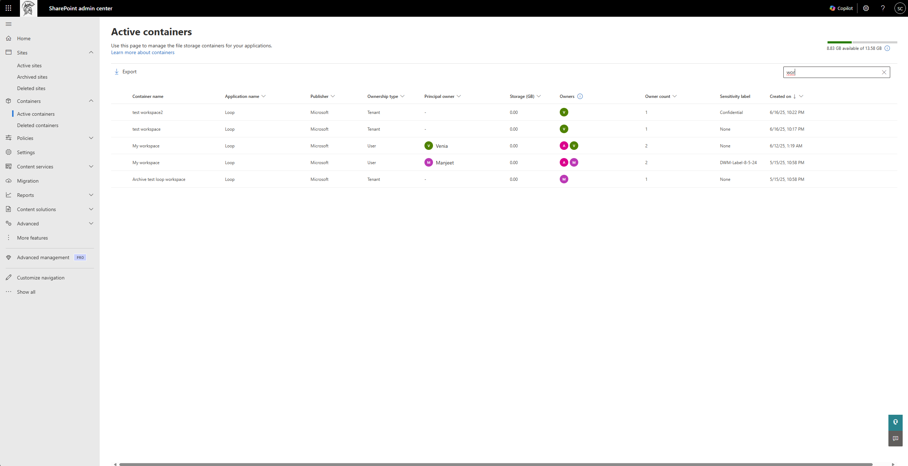
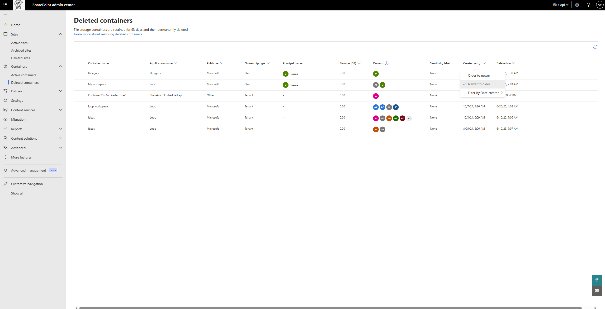
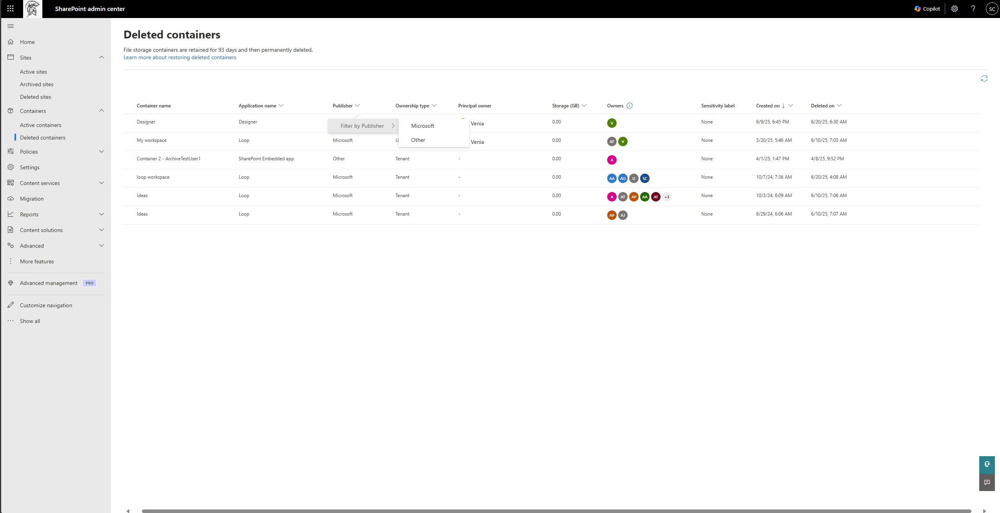

# Manage SharePoint Embedded containers in SharePoint Admin Center

The organizations that use the SharePoint Embedded applications on their Microsoft 365 tenants are the consuming tenants and the persona that is responsible for managing these applications on their Microsoft 365 tenancy is the consuming tenant administrator (CTA). Consuming tenant administrators can manage containers through a graphical user interface (GUI) using the [SharePoint Administrator Center](https://go.microsoft.com/fwlink/?linkid=2185219).

To manage SharePoint Embedded containers, the CTA needs to be assigned the SharePoint Embedded Administrator role.
For information on SharePoint Embedded Administrator role, see [SharePoint Embedded Admin](../adminrole.md).

The following actions are supported in SharePoint Admin Center:

1. View active containers in the tenant
1. View deleted containers in the tenant
1. View detailed information of a container
1. Delete a container
1. Restore a deleted container
1. Permanently deleted a container
2. Sort active containers in the tenant
3. Filter active containers in the tenant
4. Set sensitivity label on active containers
5. Add users to different roles on a container
6. Reassign users from existing roles on a container
7. Remove users from existing roles on a container

**SharePoint Embedded Administrator** will only see "Active containers" and "Deleted containers" page when they sign in to SharePoint Admin Center.

## Active Containers

The Active Containers page displays all the active containers within the tenant, providing a comprehensive overview and management capabilities. This page includes the following metadata for each container:

1. **Container name :** Name of the container provided by the container owner.
1. **Application name :** Name of the SharePoint Embedded application the container belongs to.
1. **Publisher :** The name of the organization that owns the application. For all publishers other than Microsoft, the value is currently stored as "Other"
2. **Ownership type :** Mentions whether the container is tenant-owned, user-owned or group-owned. 
3. **Principal owner :** The user whose lifecycle impacts the lifecycle of the container. There is no prinicipal owner for a tenant owned container while it is a user for a user owned container and a group for a group owned containers. 
1. **Storage :** The total storage of the files stored in the containers.
1. **Owners :** Users assigned the owner role on the container.
2. **Owner count :** The count of number of owners of the container.
1. **Sensitivity label :** Name of the label assigned to the container.
1. **Created on :** Date and time when the container was created.

### View details of a container

The detailed container view provides a deeper dive into container-specific metadata, organized under two tabs:

1. **General:** This panel displays all the general metadata about a container, usage, and configuration settings.

    

1. **Membership:** This panel shows the user permissions for different users associated with the container. The admin can manage the membership on a container through this panel. 

> [!IMPORTANT]
> The SharePoint Embedded platform supports four distinct [roles](../../development/sharing-and-perm.md): Owner, Manager, Writer, and Reader. The SharePoint Embedded application on your tenant may not utilize all four roles and might refer to these roles using different names.
>

## Deleted Containers

The deleted containers page lists all containers in the tenant's deleted container collection. It lists the following metadata:

1. Container name
1. Application name
1. Publisher
2. Ownership type
3. Principal owner
1. Storage
1. Owners
1. Sensitivity label
1. Created on
1. **Deleted on**: Date and time when the container was deleted.

## Delete a container

> [!WARNING]
> Deleting a container may cause unexpected issues for the SharePoint Embedded application it belongs to and may interrupt the application's usage. This action should only be performed by admins when absolutely necessary.

Deleting a container can have implications on the functionality of a SharePoint Embedded app, Here are some examples of the potential issues that an application can encounter when deleting a container.

1. **Data Loss:** Deleting a container removes all its content. If the SharePoint Embedded application relies on the data stored within the deleted container, the app might no longer function as expected or might lose access to critical information.
1. **Broken Links:** If the SharePoint Embedded application contains links or references to the deleted container, those links become broken, leading to errors or malfunctioning features within the app.

A container can be deleted from the Active containers page for any business reason by the CTA. By default, the delete button is deactivated. On selecting a container, the delete button is activated. The CTA can then select the delete button.

This opens a side panel that warns the user about the effect on the associated SPE application due to the deletion of a container and inform the user about the restoration policy. The CTA can at this stage either cancel the panel and go back to the active containers page or proceed further with the deleting by clicking on “Delete container”.

The selected container is successfully deleted and moved into the deleted containers page.

**Deleted containers are permanently purged after 93 days unless there is a retention policy applied to the containers**

## Restore a container

A container in the deleted container collection can be restored on the Deleted containers page by selecting the corresponding containers by selecting the "Restore" link

Restoration of the container happens in the background and the status of the same is displayed on the top-right corner of the page. Upon successful restoration, the container will be available in the Active Containers page.

## Permanently delete a container

> [!WARNING]
>
> Deleting a container may cause unexpected issues for the SharePoint Embedded application it belongs to and may interrupt the application's usage. This action should only be performed by admins when absolutely necessary.

The CTA can permanently delete a deleted container from the deleted container collection if they decide to.

The CTA selects the container to be permanently deleted. The “Permanently delete” button is enabled.

Upon clicking the button, a pop-up appears. warning the CTA on the action they're performing. If sure, the CTA can proceed and select on “Delete”. Otherwise the CTA can cancel the action.

Upon clicking Delete, the container is permanently deleted and the status of the same appears in the top-right corner of the page. Upon successful deletion, the container is permanently removed from the deleted container collection and can't be restored.

## Sorting on Active containers page

The CTA can perform their compliance and storage management tasks better through the use of sorting capabilities on the Active containers page. Currently, sorting is supported on the following columns:
1. Storage
2. Created on

## Filtering on Active containers page
The CTA can perform their compliance and storage management tasks better through the use of filtering capabilities on the Active containers page. Currently, filtering is supported on the following columns:
1. Application name : The filter provides the list of all Microsoft SharePoint Embedded applications along with all SharePoint Embedded applications published by other publishers that is registered in the tenant.
2. Publisher: Describes whether the application is Microsoft owned or published by an "Other" publisher. 
3. Ownership type: The filter provides the options of Tenant, User and Group irrespective of the type of containers present in the tenant. 
4. Principal owner: The filtering experience is a people picker experience.
5. Owner count: This filter provides a range of owner count for the administrator to choose from. 
6. Created on: This filter provides a range of dates for the administrator to choose from.
   
> [!IMPORTANT]
> The behaviour of the filtering experience on Active containers page differs from the experience on Active sites page in SharePoint Admin Center. 
>

## Searching on Active Containers Page

The search bar on the Active Containers Page can be used to search containers in the active state by their "container name".

## Editing sensitivity label of a container on Active containers page

The sensitivity label of a container can be set on the Active container page, on the detailed panel of a container. Under the settings panel, the administrator can set the sensitivity label from a list of available sensitivity label.

## Managing user membership of a container

The administrator can manage the membership of users of a container on the Active container page, on the detailed panel of a container. Under the membership panel, the administrator can view the four roles and the corresponding users in each role. The administrator can:

**Add a user to a role:** The administrator can navigate to the desired role using the left panel and click on the Add option. This opens up a picker, using which the administrator can select a user from the tenant and assign the role. In case the selected user is already assigned to a different role, the role is displayed when the role is selected and the operation changes from Add to Reassign. 

**Reassign user to another role:** The administrator can navigate to the desired user under a role using the left panel. On selecting the user, the Reassign option appears. On selecting the option, a drop-dowm menu appears and the administrator can select the role to which the user needs to be reassigned to. 

**Remove user from a role:** The administrator can navigate to the desired user under a role using the left panel. On selecting the user, the Remove option appears. On selecting the option, a pop-up screen appears and the administrator can confirm the removal of the user from the role. 

## Sorting on the Deleted Containers Page

Similar to the sorting experience on Active containers page, the CTA can use of sorting capabilities on the Deleted containers page. Currently, sorting is supported on the following columns:
1. Storage
2. Created on
3. Deleted on

## Filtering on Deleted containers page
The CTA can perform their compliance and storage management tasks better through the use of filtering capabilities on the Deleted containers page, on the following columns:
1. Application name : The filter provides the list of all Microsoft SharePoint Embedded applications along with all SharePoint Embedded applications published by other publishers that is registered in the tenant.
2. Publisher: Describes whether the application is Microsoft owned or published by an "Other" publisher. 
3. Ownership type: The filter provides the options of Tenant, User and Group irrespective of the type of containers present in the tenant. 
4. Principal owner: The filtering experience is a people picker experience.
5. Owner count: This filter provides a range of owner count for the administrator to choose from. 
6. Created on: This filter provides a range of dates for the administrator to choose from.
7. Deleted on: This filter provides a range of dates for the administrator to choose from.

## Upcoming features
1) Search on Deleted containers page
2) Sorting and filtering on Sensitivity Label column

