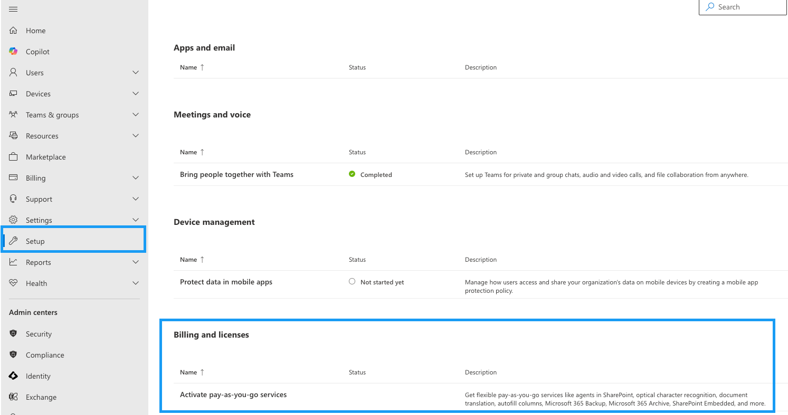
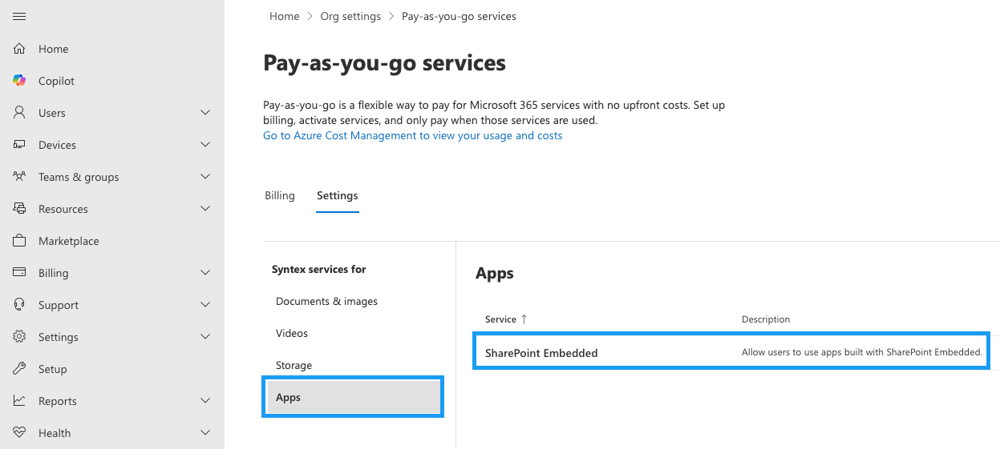

# Create and configure a container type
**Applies to:** Developer
<!-- agent:
task_type: how-to
audience: developer
outcome: Create a container type, connect it to an owning app, and choose the right billing configuration.
next: register-application-permissions.md
-->
Create a SharePoint Embedded container type for your application to create containers or store files. A container type defines access, billing accountability, and selected behaviors for containers created by your app.
If you're just starting, complete [Quickstart: Build your first app with VS Code](quickstart-vscode.md). Then use this article for trial, standard, and pass-through decisions.
To decide between single-tenant and multitenant models first, see [Choose an app model](../plan/choose-app-model.md).
## Understand the container type relationship
A container type is strongly coupled with one Microsoft Entra ID application, called the owning application.
SharePoint Embedded requires a one-to-one relationship between one owning application and one container type.
The container type ID is stored on each container as an immutable property.
The ID is used for access authorization, trial exploration, billing, and configurable behaviors.

> [!NOTE]
> The Microsoft Graph API — [Create fileStorageContainerType](/graph/api/filestorage-post-containertypes) — is delegated-only and can be called by any non-guest owning-tenant user. The caller doesn't need an administrator role and is automatically assigned as an owner of the new container type.

## Choose trial or production
Choose the container type purpose when you create it.
You can't convert a trial container type to production later.
You can't convert a standard billing type to pass-through billing later.

| Use case | Container type |
|---|---|
| Local proof of concept | Trial container type |
| App owner pays | Standard container type with billing profile |
| Customer tenant pays | Standard container type with pass-through billing |

> [!IMPORTANT]
> If you choose the wrong purpose or billing model, you must recreate the container type.

## Prerequisites
Before you create a container type, make sure you have:
- A Microsoft 365 tenant with SharePoint available.
- A Microsoft Entra ID app registration for the owning app.
- A non-guest member account in the owning tenant.
- For standard billing, an Azure subscription and resource group.
- For standard billing setup, owner or contributor permissions on the Azure subscription.

> [!NOTE]
> - Creating a container type through Microsoft Graph requires only the `FileStorageContainerType.Manage.All` delegated permission. Any non-guest user in the owning tenant can create one and is automatically assigned as an [owner of that container type](../plan/authentication-permissions.md#container-type-owners). For tenant-wide administrative operations, see [Create apps with PowerShell](../admin/create-apps-powershell.md).
> - Users who authenticate into containers must exist in Microsoft Entra ID as members or guests. An Office license isn't required to collaborate on Office documents stored in a container, except for documented exceptional experiences such as mentions.

## Create a trial container type
Use a trial container type for evaluation.
You can create one with the SharePoint Embedded Visual Studio Code extension or Microsoft Graph.
The Visual Studio Code path is fastest for a first app. See [Quickstart: Build your first app with VS Code](quickstart-vscode.md).
For Microsoft Graph, create the container type with the `trial` billing classification.
The following restrictions are applied to trial container types:

- The tenant can have up to five containers of the container type. This includes active containers and those in the recycle bin.
- Each container has up to 200 MB of storage space.
- The container type expires after 30 days, and access to any existing containers of that container type is then removed.
- The developer must permanently delete all containers of an existing container type in trial status to create a new container type for trial. This includes containers in the deleted container collection.
- The container type is restricted to work in the developer tenant. It can't be deployed in other consuming tenants.

## Create a standard container type with app-owner billing
Use standard billing when the developer or app owner tenant pays for consumption.
Each tenant can have up to 25 standard container types at a time.

1. Create or identify the owning Microsoft Entra ID application.
1. Create the container type with the `standard` billing classification.
1. Attach an Azure billing profile with the SharePoint Embedded Visual Studio Code extension or an administrator-managed billing flow.
1. Record the container type ID.
1. Continue to registration in the consuming tenant.

> [!NOTE]
> If billing setup fails with `SubscriptionNotRegistered`, wait several minutes and retry. The `Microsoft.Syntex` resource provider registration can take time.

## Create a pass-through billing container type
Use pass-through billing when the consuming tenant pays for consumption.

1. Create or identify the owning Microsoft Entra ID application.
1. Create the container type with the `directToCustomer` billing classification.
1. Register the container type in the consuming tenant.
1. Have the consuming tenant admin activate pay-as-you-go services.

> [!IMPORTANT]
> The consuming tenant must complete billing setup before a pass-through application can be used successfully.

The consuming tenant admin activates pay-as-you-go services in the Microsoft 365 admin center. In **Setup** > **Billing and licenses**, select **Activate pay-as-you-go services**.

Under **Syntex services for**, select **Apps**, then select **SharePoint Embedded** to enable billing for the app.

## Configure the owning Entra app
Configure the app so it can own exactly one container type.
Request Microsoft Graph permissions for SharePoint Embedded access.
Request Microsoft Graph `FileStorageContainerTypeReg.Selected` application permission for container type registration on consuming tenants.
Use redirect URIs that match your development and production clients.
Use credentials appropriate for delegated or app-only flows.
For auth details, see [Configure authentication and authorization](configure-authentication-authorization.md).
## Set basic properties

| Property | Guidance |
|---|---|
| Container type name | Use a durable name that maps to your workload. |
| Owning application ID | Use the app registration that owns this type. |
| Application redirect URL | Use the URL where files from this app should redirect. |
| Billing model | Choose trial, standard, or pass-through at creation time. |

> [!CAUTION]
> The container type ID and owning application ID can't be updated later.

## Configure container type behavior
Developers can configure selected behaviors after creation.
Available settings include:

- `ApplicationRedirectUrl`
- `DiscoverabilityDisabled`
- `SharingRestricted`

Use the Microsoft Graph [Update fileStorageContainerType](/graph/api/filestoragecontainertype-update) API for supported container type updates. For tenant-wide administrative settings, see [Create apps with PowerShell](../admin/create-apps-powershell.md).

> [!IMPORTANT]
> Updating settings on a container type can take up to **24 hours** to replicate to all consuming tenants. If a consuming tenant applied setting overrides, those overrides remain in place. Some settings apply only to new content, not to existing content.

## View and update container types
Use Microsoft Graph to list and update container types.
A non-administrator container type owner can update the container types they own.
You need owner or contributor access to billing subscriptions for billing changes.

### Manage container types with Microsoft Graph

You can also manage container types with the `fileStorageContainerType` Microsoft Graph APIs.

| Operation | API |
| --- | --- |
| Create a container type | [Create fileStorageContainerType](/graph/api/filestorage-post-containertypes) |
| List container types | [List fileStorageContainerType](/graph/api/filestorage-list-containertypes) |
| Update a container type | [Update fileStorageContainerType](/graph/api/filestoragecontainertype-update) |
| Delete a container type | [Delete fileStorageContainerType](/graph/api/filestorage-delete-containertypes) |

List results are filtered by ownership. Non-administrator users see only the container types they've been granted permission on, while SharePoint Embedded Administrators and Global Administrators see every container type in the tenant. For the settings you can configure, see [fileStorageContainerTypeSettings](/graph/api/resources/filestoragecontainertypesettings).

You can delete only trial container types; deletion of standard container types isn't yet supported. Before you delete a container type, remove every container of that type, including containers in the deleted container collection.
## Understand billing dependency
For app-owner billing, the developer tenant attaches an Azure subscription and resource group.
For pass-through billing, the consuming tenant activates pay-as-you-go services.
For details, see [SharePoint Embedded meters](../reference/billing-meters.md) and [SharePoint Embedded billing management](../admin/monitor-usage-billing-cost.md).
## Link to multitenant onboarding
A multitenant app usually has an owning tenant and one or more consuming tenants.
Use this sequence for each consuming tenant:
1. Create the container type in the owning tenant.
1. Ask the consuming tenant admin to grant admin consent.
1. Register container type application permissions.
1. Configure pass-through billing when the consuming tenant pays.
1. Validate container creation and access.
## Next steps
Register permissions in [Register application permissions](register-application-permissions.md).
