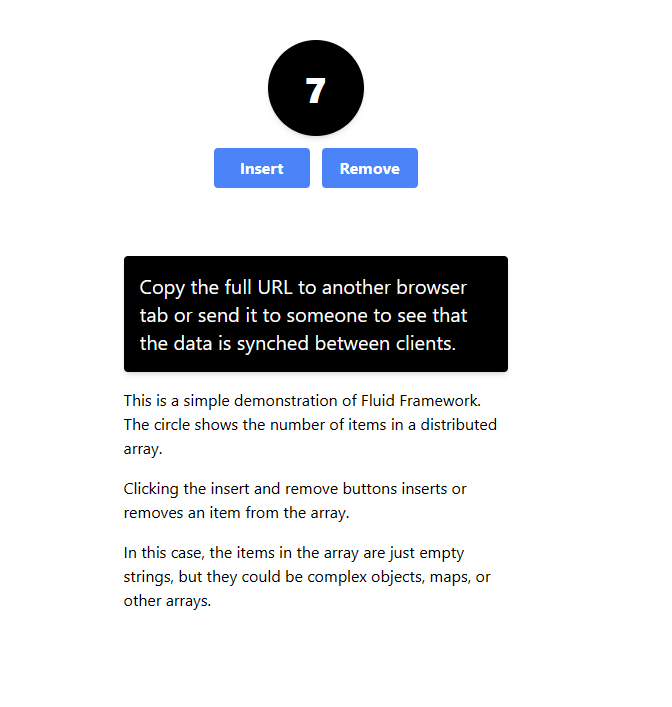

# Add real-time collaboration with Fluid Framework

**Applies to:** Developer

<!-- agent:
task_type: how-to
audience: developer
outcome: Run the Fluid item counter sample with a SharePoint Embedded app and container type.
next: agent-experiences.md
-->

Use Fluid Framework when your SharePoint Embedded app needs real-time shared state, such as collaborative controls, live counters, cursors, annotations, or multi-user form state. Fluid provides client libraries for distributing, synchronizing, and saving shared data.

## Prepare SharePoint Embedded

Create or identify a SharePoint Embedded application before you run the Fluid sample. You need admin credentials for a Microsoft 365 tenant, the application client ID, the container type ID, and at least one container created for that container type.

If you used the SharePoint Embedded Visual Studio Code extension, use the generated sample configuration to find `ContainerTypeId` and `ClientId`. You can also find the client ID in Microsoft Entra ID under **App registrations**.

To try SharePoint Embedded at no cost, create a trial container type. See [Create and configure a container type](create-container-type.md).

## Run the item counter sample

The `item-counter-spe` sample lives in the Fluid Examples repository.

```console
git clone https://github.com/microsoft/FluidExamples.git
cd FluidExamples\item-counter-spe
```

Create an empty `.env` file in the sample folder and add the SharePoint Embedded identifiers.

```text
SPE_CLIENT_ID=YOUR_CLIENTID
SPE_CONTAINER_TYPE_ID=YOUR_CONTAINERTYPE_ID
SPE_ENTRA_TENANT_ID=YOUR_ENTRA_TENANT_ID
```

Install packages and start the development server.

```console
npm install
npm run dev
```

After Webpack completes, open `https://localhost:8080`, sign in with tenant credentials, and grant admin consent for the app when prompted. Open the same URL in another browser tab or send it to another user in the same tenant. Changes to the item counter synchronize across connected clients.



## Decide what belongs in Fluid

Use Fluid for collaborative application state that benefits from low-latency synchronization. Store durable documents and files in SharePoint Embedded containers. Persist final business output to your own durable model or to SharePoint Embedded files when your scenario needs audit, retention, search, or reporting.

Treat Fluid shared objects as user-visible collaboration state. Don't place secrets, access tokens, SAS URLs, or privileged Graph responses in shared data structures.

## Handle identity and access

Your app still needs the SharePoint Embedded client ID and container type ID to acquire the correct tokens and access containers. Test the sample with one tab, two tabs for the same user, and two different users from the tenant. Verify behavior for users who can view the container but shouldn't edit the collaborative state.

## Move from sample to app design

Use the item counter sample to prove tenant setup, consent, and client connectivity. In your own app, plan reconnect behavior, token refresh, offline transitions, container switching, and cleanup for collaborative sessions that users abandon.

## Next steps

- [Set up SharePoint Embedded as a Foundry knowledge source](sharepoint-embedded-knowledge-source.md)
