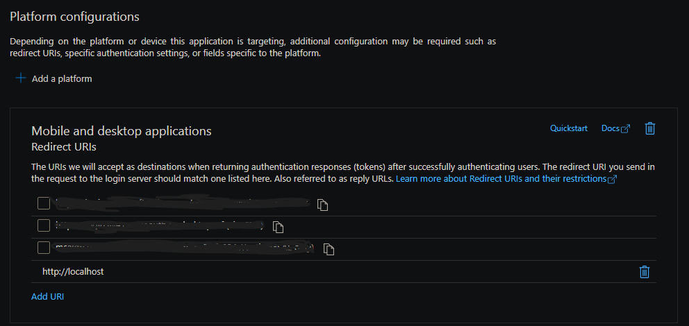

# Migrate from Azure Blob Storage

**Applies to:** Developer

<!-- agent:
task_type: how-to
audience: developer
outcome: Map blobs to SharePoint Embedded drive items and upload content with Graph sessions.
next: ../publish/prepare-customer-installation.md
-->

Use this guide when you move content from Azure Blob Storage to SharePoint Embedded. A C# migration app reads blobs with the Azure Storage SDK and uploads them to a SharePoint Embedded container with Microsoft Graph.

> [!TIP]
> For migrating from SharePoint or OneDrive sources, SharePoint Embedded also provides dedicated [migration APIs](/graph/api/resources/sharepointmigration-api-overview) that are generally available on the **v1.0** Microsoft Graph endpoint (November 2025). The manual sample in this article is best when copying from Azure Blob Storage specifically.

## Prepare authentication

For Azure Blob Storage, the sample uses a container-level shared access signature (SAS) URL with `Read` and `List` permissions.

```csharp
_containerClient = new BlobContainerClient(new Uri(_containerLevelSASUrl));
```

For SharePoint Embedded, the sample uses delegated Microsoft Graph scopes `User.Read` and `FileStorageContainer.Selected` with `InteractiveBrowserCredential`.

```csharp
string[] scopes = { "User.Read", "FileStorageContainer.Selected" };
InteractiveBrowserCredentialOptions options = new InteractiveBrowserCredentialOptions()
{
  ClientId = clientId,
  RedirectUri = new Uri("http://localhost"),
};
InteractiveBrowserCredential credential = new InteractiveBrowserCredential(options);
_graphClient = new GraphServiceClient(credential, scopes, null);
```

Because the sample uses `InteractiveBrowserCredential` with the `http://localhost` redirect URI, the Microsoft Entra ID app registration must include a **Mobile and desktop applications** platform that lists `http://localhost` as a redirect URI. Add this platform in the [Microsoft Entra admin center](https://entra.microsoft.com) under the app registration's **Authentication** page before you run the sample.




The consuming tenant must have the application and container type registered. The sample also requires a SharePoint Embedded container ID for the destination.

## Enumerate source blobs

List blob names from the Azure Blob Storage container before queuing migration work.

```csharp
var blobs = new List<string>();
await foreach (var blobItem in _containerClient.GetBlobsAsync())
{
  blobs.Add(blobItem.Name);
}
return blobs;
```

Azure Blob Storage uses a flat namespace. If blob names include `/`, parse those segments into SharePoint Embedded folders or decide to upload all files to the container root.

## Create destination folders

The sample creates a top-level folder named after the Azure Blob Storage container, then creates nested folders as it traverses each blob name. Check for an existing item before creating a folder.

```csharp
var item = await _graphClient.Drives[_containerId].Items[parentFolderId].ItemWithPath(itemPath).GetAsync();
```

Create a folder under the destination parent with conflict behavior set to `fail`.

```csharp
var folder = new DriveItem
{
  Name = folderName,
  Folder = new Folder(),
  AdditionalData = new Dictionary<string, object>()
  {
    { "@microsoft.graph.conflictBehavior", "fail" }
  }
};
var createdFolder = await _graphClient.Drives[_containerId].Items[parentFolderId].Children.PostAsync(folder);
```

## Upload files with Graph sessions

Download each blob to a stream, reset the stream position, create an upload session, and upload with `LargeFileUploadTask<DriveItem>`.

```csharp
BlobClient blobClient = _containerClient.GetBlobClient(blobName);
MemoryStream memoryStream = new MemoryStream();
await blobClient.DownloadToAsync(memoryStream);
memoryStream.Position = 0;
```

```csharp
int maxChunkSize = 320 * 1024;
var uploadSessionRequestBody = new CreateUploadSessionPostRequestBody()
{
  AdditionalData = new Dictionary<string, object>
  {
    { "@microsoft.graph.conflictBehavior", "fail" }
  }
};

var uploadSession = await _graphClient.Drives[_containerId]
    .Items[parentFolderId]
    .ItemWithPath(fileName)
    .CreateUploadSession
    .PostAsync(uploadSessionRequestBody);

var fileUploadTask = new LargeFileUploadTask<DriveItem>(uploadSession, memoryStream, maxChunkSize, _graphClient.RequestAdapter);
IProgress<long> progress = new Progress<long>(prog => Console.WriteLine($"Uploaded {fileName} {prog} bytes"));
var uploadResult = await fileUploadTask.UploadAsync(progress);
```

Use `fail` when duplicate files shouldn't be overwritten. Change the conflict behavior only after you define replacement, rename, and audit rules.

## Run the sample

The sample uses Microsoft Graph SDK 5.56.0, Azure.Identity 1.12.0, Azure.Storage.Blobs 12.21.0, CommandLineParser 2.9.1, and Newtonsoft.Json 13.0.3.

```console
dotnet run Program.cs -- --sasurl "<sas url>" --tenantid "<tenant id>" --clientid "<client id>" --containerid "<container id>" [ --blobfile "<file name>" --outputfile "<file name>" ]
```

Use the optional blob list file for controlled batches and the optional output file to capture failed blobs for reruns.

## Validate migrated content

Compare source blob counts with destination drive item counts. Check folder paths, file sizes, upload failures, duplicate handling, and required metadata. Open representative files through your SharePoint Embedded app, then validate search and metadata queries after indexing has had time to complete.

Don't delete source blobs until business owners approve the migration result and retention requirements are satisfied.

## Next steps

- [Prepare your app for customer installation](../publish/prepare-customer-installation.md)
