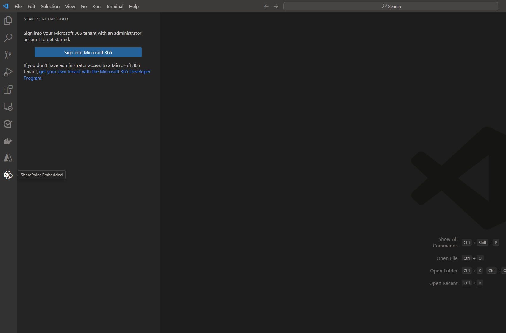
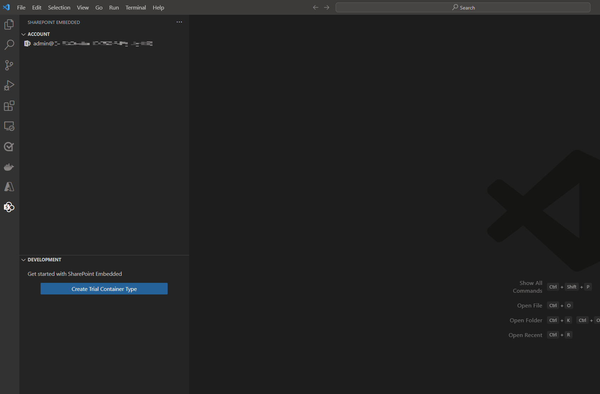
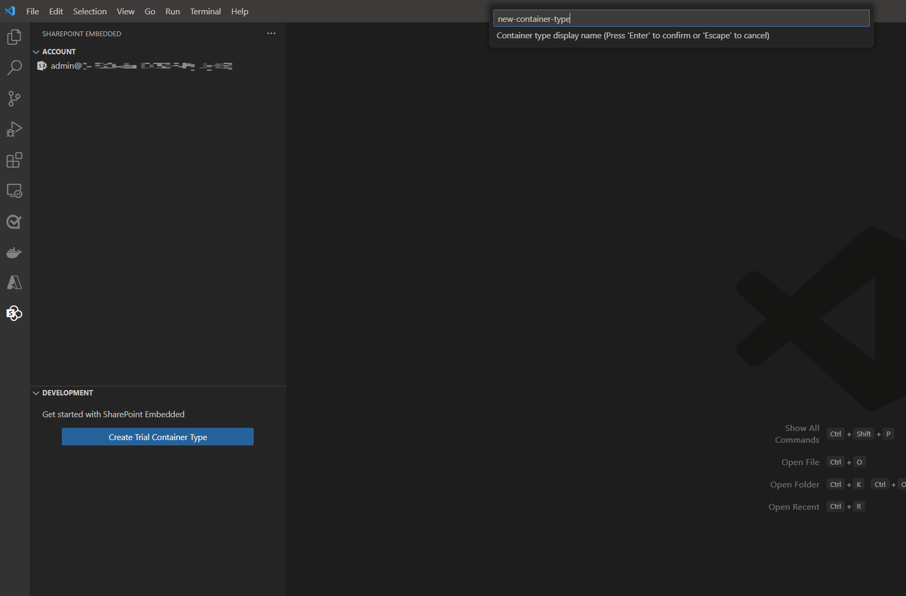
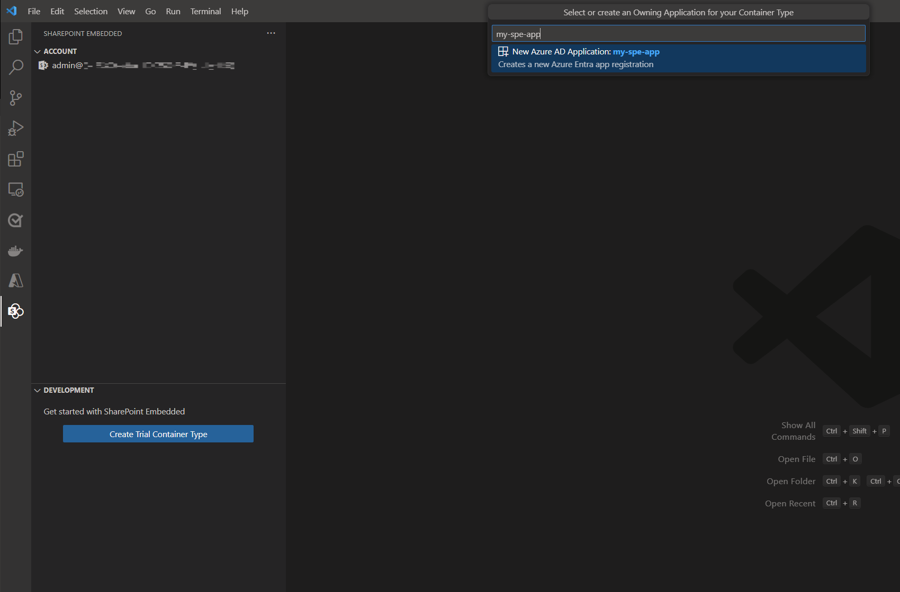
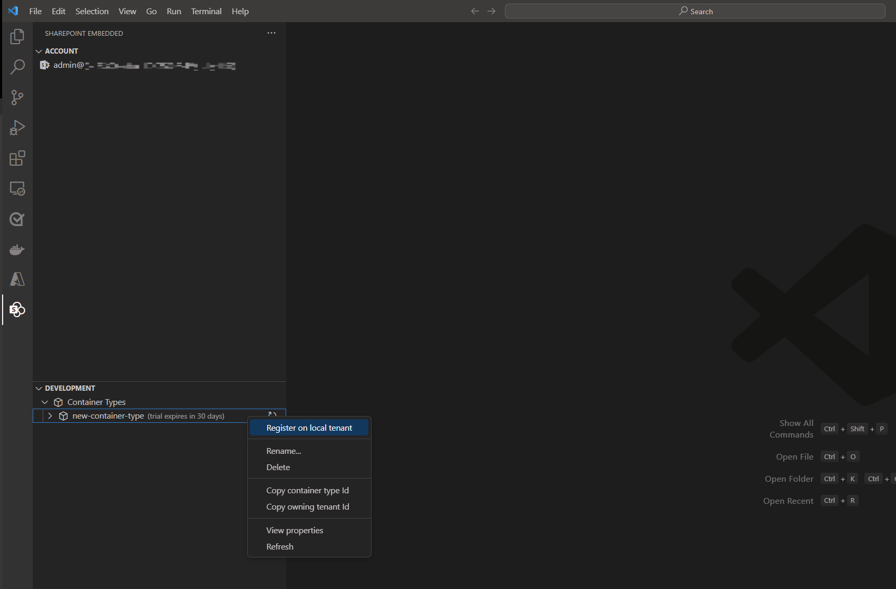
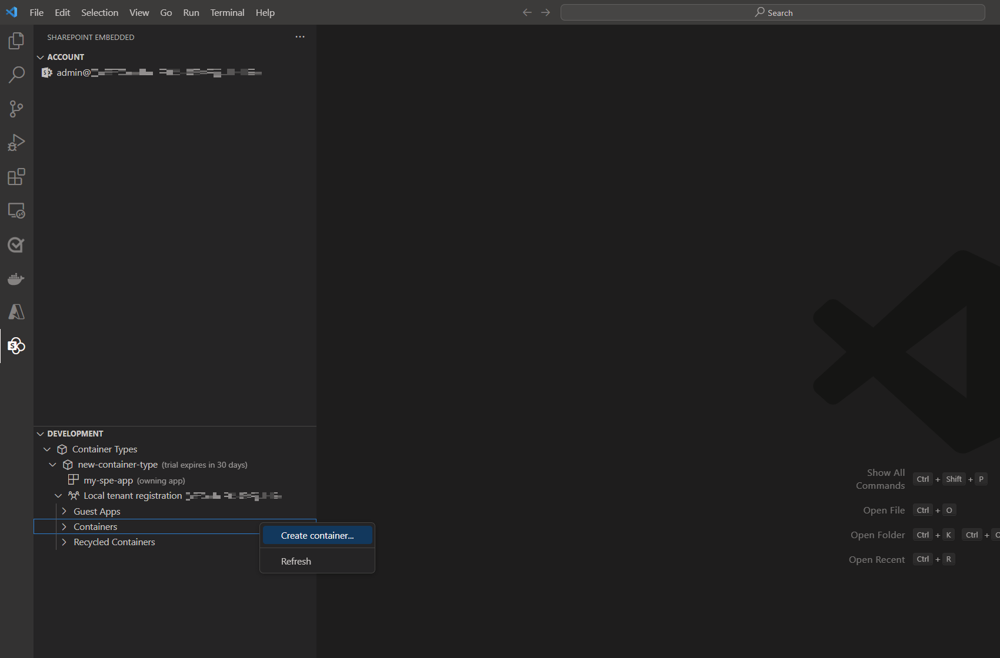
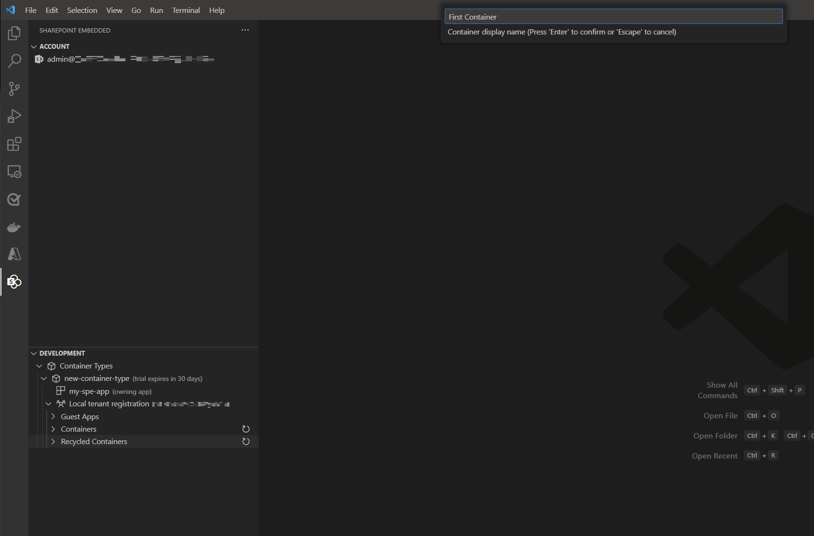
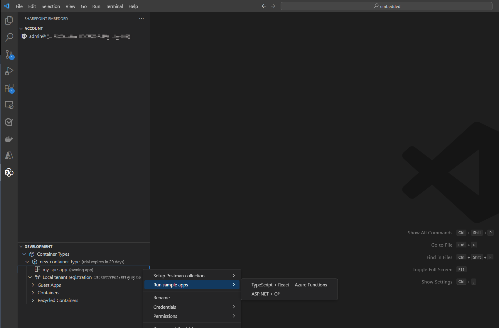

# Quickstart: Build your first app with VS Code
**Applies to:** Developer
<!-- agent:
task_type: quickstart
audience: developer
outcome: Create a standard container type, attach billing, register it locally, create a container, and run a sample app.
next: create-container-type.md
-->
Use the [SharePoint Embedded Visual Studio Code extension](https://marketplace.visualstudio.com/items?itemName=SharepointEmbedded.ms-sharepoint-embedded-vscode-extension) to create a standard container type for your first app. The extension also configures the owning app, attaches Azure billing, and registers the container type. Then you create a container and run a local sample app.
This article starts the build journey. For more billing guidance, see [Create and configure a container type](create-container-type.md).
## Prerequisites
Before you start, make sure you have:
- [Visual Studio Code](https://code.visualstudio.com/) installed.
- Administrative access to a Microsoft 365 tenant.
- A tenant with SharePoint available.
- An Azure subscription and resource group that your account can access.
- Owner or Contributor permissions on the Azure subscription.
- Node.js and npm installed for the sample app.
- Permission to grant admin consent in Microsoft Entra ID.
> [!IMPORTANT]
> You need administrative access to a Microsoft 365 tenant. If you don't have a tenant, use the Microsoft 365 Developer Program, Microsoft Customer Digital Experience, or a Microsoft 365 E3 trial.
## Install the extension
1. Open Visual Studio Code.
1. Open **Extensions** from the activity bar.
1. Search for **SharePoint Embedded**.
1. Select **Install**.
1. If the extension is already installed, update it.
1. Select the SharePoint Embedded icon in the activity bar.

## Sign in
1. In the SharePoint Embedded view, select the sign-in action.
1. Use a Microsoft 365 administrator account.
1. Complete authentication in the browser.
1. Review the requested permissions.
1. Select **Accept** to grant admin consent.
1. Return to Visual Studio Code when redirected.
> [!IMPORTANT]
> Review the consent prompt carefully. The extension needs tenant permissions to configure development resources.



After you sign in, the extension shows the SharePoint Embedded home view.



## Create a standard container type
A container type defines the relationship, access privileges, billing accountability, and selected behaviors for a set of SharePoint Embedded containers.
1. Select **Create Container Type**.
1. For the billing method, select **standard**.
1. Enter a container type name.
1. Follow the prompts until creation completes.



Use a standard container type when the organization that owns the app pays for SharePoint Embedded usage.
For evaluation, choose **trial**. For customer-tenant billing, choose the pass-through option, which uses the `directToCustomer` billing classification.

## Create or select the owning app
Every container type has one owning Microsoft Entra ID application.
1. Create a new Microsoft Entra ID application or select an existing application ID.
1. If you create a new application, enter its name.
1. Let the extension configure development settings.



> [!CAUTION]
> If you select an existing application, the extension updates that app's configuration. Don't use a production app for this quickstart.
For the model, see [SharePoint Embedded app architecture](../plan/app-tenant-architecture.md).
## Configure standard billing
Standard container types require Azure billing. The extension attaches billing by using an Azure subscription and resource group that your account can access.
1. Select an Azure subscription.
1. Select a resource group.
1. Wait for the extension to register the **Microsoft.Syntex** resource provider and attach billing.

If you skip billing setup or don't have the required Azure permissions, the tree shows **Billing not set up**. To finish setup later, right-click the container type. Then select **Attach billing**.

## Register the container type locally
You must register the container type in the consuming tenant before your app can create containers or access content.
1. After creation, follow the prompt to register the container type in the local tenant.
1. If the prompt isn't visible, right-click the container type and select **Register**.
1. Review the permissions.
1. Grant admin consent in the browser.
1. Return to Visual Studio Code.
Registration configures the permissions the owning app can use against containers of the container type.



## Create your first container
1. In the SharePoint Embedded tree, expand your container type.
1. Right-click **Containers**.
1. Select **Create container**.
1. Enter a container name.
1. Confirm the container appears in the tree.
A container is the basic storage unit and security boundary in SharePoint Embedded.





## Load a sample app
1. In the SharePoint Embedded view, select **Load Sample App**.
1. Choose a SharePoint Embedded sample.



1. Review the warning about local plain text secrets.
1. If prompted to create a client secret, select **OK** for local development.
1. Let the extension populate the runtime configuration file.
> [!IMPORTANT]
> The sample configuration is for development only. It stores authentication secrets in plain text on your local machine.
## Run the sample app
Open a terminal and run the sample app from the generated sample directory.
```console
cd [your-path]\SharePoint-Embedded-Samples\Custom Apps\boilerplate-typescript-react
npm run start
```
The sample starts:
- A React client application.
- An Azure Functions application server.
Wait for both console outputs to appear.
Then:
1. Open `http://localhost:8080`.
1. Sign in with the same Microsoft 365 administrator account.
1. Select **Containers** on the home page.
1. Create containers and upload files from the sample UI.

> [!NOTE]
> Initial startup can take several minutes while dependencies install and both applications build.
## Troubleshoot startup
| Symptom | Check |
|---|---|
| Port conflict | The app tries the next available port when port 8080 is in use. |
| Dependencies fail | Run `npm install`, then run `npm run start` again. |
| Authentication error | Confirm the Microsoft Entra ID app has the expected redirect URIs. |
| Access denied | Confirm registration and admin consent succeeded. |
| Billing not set up | Confirm you have Owner or Contributor permissions on the selected Azure subscription, then use **Attach billing**. |
## Clean up
When you're finished testing:
1. Remove test containers that you no longer need.
1. Review Azure billing resources that you created for this quickstart.
1. Remove local sample secrets that are no longer needed.
## Next steps
Learn more about container type options in [Create and configure a container type](create-container-type.md).
