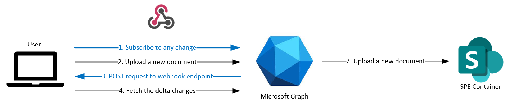
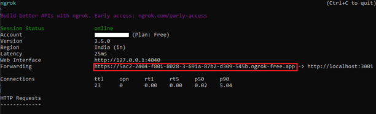

# Respond to file and container changes with webhooks

**Applies to:** Developer

<!-- agent:
task_type: how-to
audience: developer
outcome: Create Graph subscriptions and process SharePoint Embedded change notifications.
next: archive-restore-containers.md
-->

Use Microsoft Graph webhooks when your app must react to file changes in a SharePoint Embedded container. A subscription tells Microsoft Graph to call your HTTPS endpoint when the subscribed resource changes.



## Create a notification endpoint

Expose an HTTPS endpoint that accepts `POST` requests. During local development, use ngrok to tunnel requests to a local server.

```console
ngrok http 3001
```



When Microsoft Graph creates a subscription, it validates the endpoint by sending a `validationToken` query parameter. Return that token as plain text with HTTP 200.

```typescript
export const onReceiptAdded = async (req: Request, res: Response) => {
  const validationToken = req.query['validationToken'];
  if (validationToken) {
    res.send(200, validationToken, { "Content-Type": "text/plain" });
    return;
  }

  const driveId = req.query['driveId'];
  if (!driveId) {
    res.send(200, "Notification received without driveId, ignoring", { "Content-Type": "text/plain" });
    return;
  }

  console.log(`Received driveId: ${driveId}`);
  res.send(200, "");
}
```

Register the route in your API server and enable request body and query parsing before the route handles notifications.

```typescript
server.use(restify.plugins.bodyParser(), restify.plugins.queryParser());
server.post('/api/onReceiptAdded', async (req, res, next) => {
  try {
    const response = await onReceiptAdded(req, res);
    res.send(200, response);
  } catch (error: any) {
    res.send(500, { message: `Error in API server: ${error.message}` });
  }
  next();
});
```

## Subscribe to a container drive

Create the subscription with Microsoft Graph. In this pattern, the SharePoint Embedded container ID is the drive ID.

```http
POST https://graph.microsoft.com/v1.0/subscriptions
Content-Type: application/json
```

```json
{
  "changeType": "updated",
  "notificationUrl": "https://contoso.example/api/onReceiptAdded?driveId={container-id}",
  "resource": "drives/{container-id}/root",
  "expirationDateTime": "2026-06-25T03:58:34.088Z",
  "clientState": ""
}
```

Subscribe to changes under `drives/{container-id}/root` and append `driveId={container-id}` to the notification URL so the handler can identify the container.

## Calculate expiration

Drive item subscriptions have a maximum lifetime of 4,230 minutes. Use a pre-request script or backend scheduler to set the expiration time before creating the subscription.

```javascript
var now = new Date();
var duration = 1000 * 60 * 4230;
var expiry = new Date(now.getTime() + duration);
pm.environment.set("ContainerSubscriptionExpiry", expiry.toISOString());
```

Store the subscription ID, resource, container ID, and expiration time. Renew each subscription before it expires.

## Process notifications safely

Return quickly from the webhook request. Queue background work, fetch the current file or container state with Microsoft Graph, and make processing idempotent because notifications can be duplicated or delayed.

Use webhooks for actions such as document processing, index refresh, user notifications, or workflow triggers. Keep a periodic reconciliation job for missed notifications or expired subscriptions.

## Verify the flow

Create a subscription, upload or update a file in the container, and confirm your endpoint logs the expected drive ID. If validation fails, check the public HTTPS URL, the `validationToken` response content type, and whether your server parses query parameters before route execution.

## Next steps

- [Archive and restore containers](archive-restore-containers.md)
