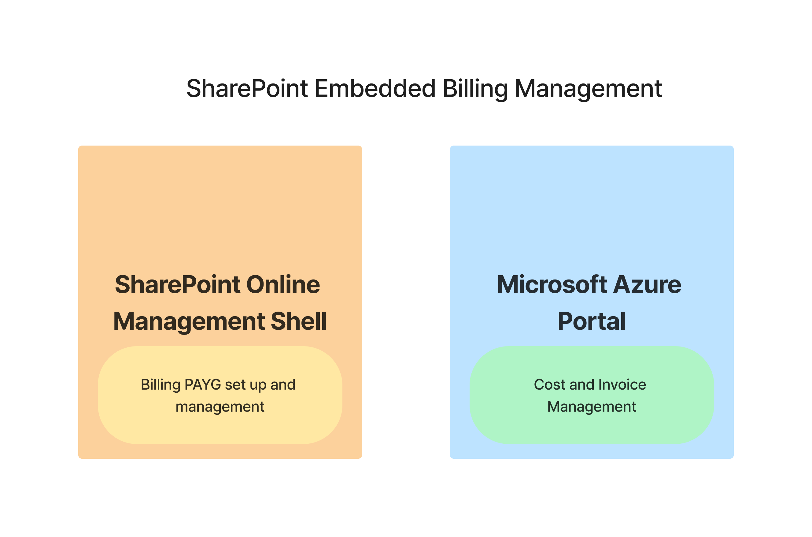
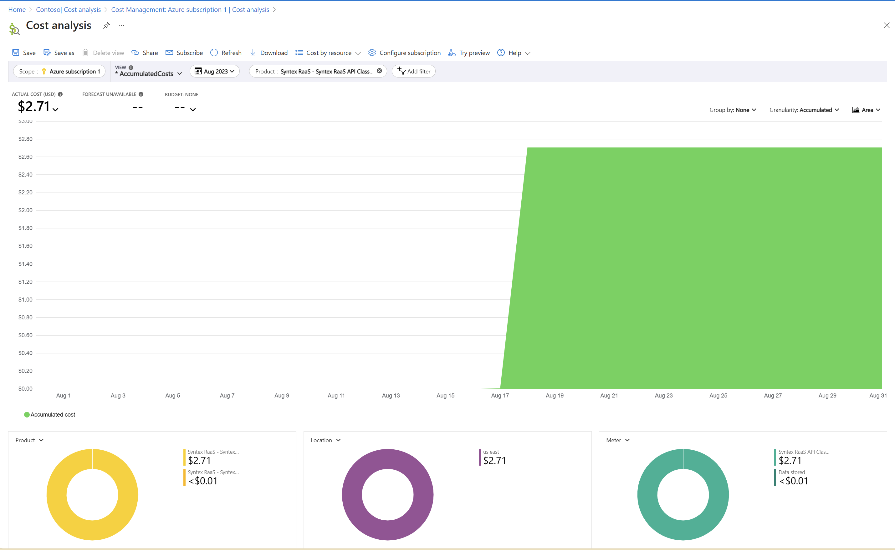
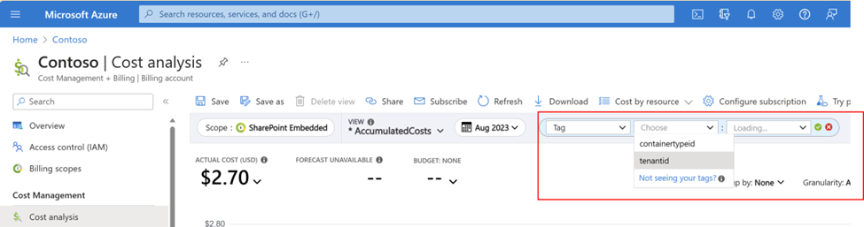

# SharePoint Embedded  Billing experience

This document outlines the steps an admin will have to follow to set up billing, evaluate actual and forecast costs, and pay invoices on SharePoint Embedded.

SharePoint Embedded  will be a consumption based PAYG (Pay-as-you-go) offering from SharePoint Online, which means you'll pay only for what you use. As a Developer admin for SharePoint Embedded, you'll set up billing on a container type using SharePoint Online Management Shell and manage forecast of actual costs and invoices in Microsoft Azure portal.



## Set up Pay-as-you-go (PAYG) for SharePoint Embedded

To enable PAYG on SharePoint Embedded, you need:

1. Existing SharePoint tenancy
1. An Azure subscription in the tenancy
1. A resource group attached to the Azure subscription

## Roles and Permissions

- Admin who will set up billing relationship for SharePoint Embedded  will need to have owner or contributor permissions on Azure subscription.
- Admin will need to have a SharePoint administrator role to operate billing cmdlets.

## Steps to establish billing

1. Download and install the [latest version of SharePoint Online Management Shell](https://www.microsoft.com/download/details.aspx?id=35588)
1. Open SharePoint Online Management Shell from **Start** screen, type **sharepoint**, and then select **SharePoint Online Management Shell**.
1. Connect to SPO service using `Connect-SPOService` cmdlet by providing admin credentials associated with tenancy. For information on [how to use Connect-SPOService](/powershell/module/sharepoint-online/connect-sposervice), refer the linked documentation.
1. Create container type using `New-SPOContainerType` cmdlet by providing an **azure subscription**, **resource group** associated with the subscription and a **region**.

   1. If you don't have an Azure subscription, you can create on by following steps here to [create an Azure subscription in your tenancy](/azure/cloud-adoption-framework/ready/azure-best-practices/initial-subscriptions)
   1. If you don't have a resource group, you can create on by following steps here to [create a resource group](/azure/azure-resource-manager/management/manage-resource-groups-portal)

```powershell
New-SPOContainerType -ContainerTypeName <ContainerTypeName>
                     -OwningApplicationId <OwningApplicationId>
                     -AzureSubscriptionId <AzureSubscriptionId>
                     -ResourceGroup <ResourceGroup>
                     -Region <Region>
```

## Applicable guidelines

1. Every container type must have an owning application.
1. A single owning app can only own one container type at a time.
1. An Azure subscription can be attached to any number of container types.

## View/Edit billing properties

View the properties of billing. You can view properties of a ContainerType and associated billing properties by using one of the two PowerShell cmdlets:

1. To see all Container Types and billing properties except associated region:

    ```powershell
    Get-SPOContainerType
    ```

1. To see billing properties associated with a container type including region:

    ```powershell
    Get-SPOContainerType -ContainerTypeId <ContainerTypeId>
    ```

1. Update Azure subscription or resource group associated with a container type:

    ```powershell
    Set-SPOContainerType -ContainerTypeId <ContainerTypeId> [-AzureSubscriptionId <AzureSubscriptionId>] [-ResourceGroup <ResourceGroup>]
    ```

## Pricing & PAYG meters

Review the Pricing and PAYG meters for SharePoint Embedded in the [terms of service](../../terms-of-service.md).

## Manage consumption and invoices in Azure portal

1. Sign in to **[Azure Portal](https://portal.azure.com/)**.
1. Search for **Cost Management + Billing**.
1. Select **Cost Analysis** to see:

    - **Actual cost**

      

    - Select '**+ Add Filter**' to see breakdown of cost by **containertypeid** and **tenantid**
        - Select **Tag**
        - In the key-value pair, select **containertypeid** or **tenantid** and select respective **containertypeid** and **tenantid**

        

1. Select **Billing** on the left navigation to see monthly invoices.
1. Set up **Budget alerts** on cost by following steps [here](/azure/cost-management-billing/costs/cost-mgt-alerts-monitor-usage-spending).
