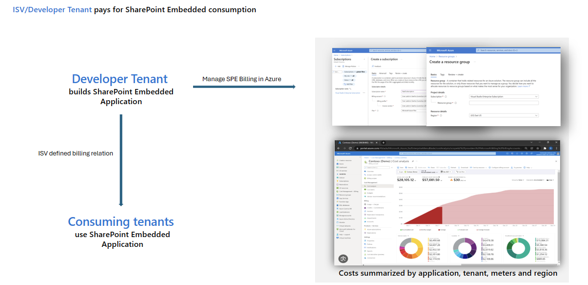
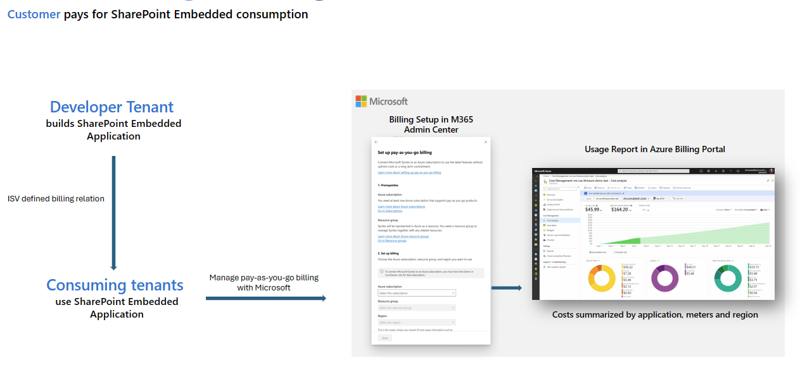
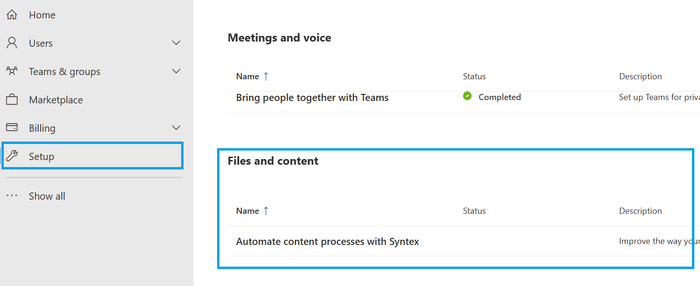
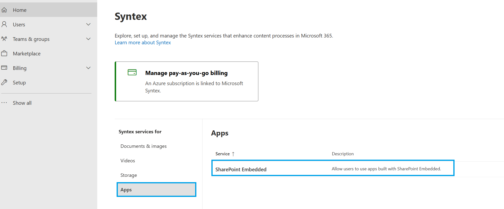

# SharePoint Embedded billing

SharePoint Embedded is a consumption-based Pay-as-you-go (PAYG) offering meaning you pay only for what you use. SharePoint Embedded provides two billing models that the tenant developing the SharePoint Embedded application can select for respective container types, tailoring it to their unique business requirements. The two billing models are Standard and Pass-through billing.

### Standard

With the standard billing model, all consumption-based charges are directly billed to the tenant who owns or develops the application. The admin in the developer tenant  must establish a valid billing profile when creating a standard container type.



### Pass-through

With pass-through billing, consumption-based charges are billed directly to the tenant registered to use the SharePoint Embedded application. Admins in the developer tenant don't need to set up a billing profile when creating a pass-through SharePoint Embedded container type. Once the container type is registered in the consuming tenant, the consuming tenant admin (SharePoint Admin or Global Admin) needs to set up the billing profile in the consuming tenant to use the SharePoint Embedded application.



## Prerequisites to create SharePoint Embedded container type

A new container type will be created using **SharePoint Online Management Shell**:

1. Download and install the [latest version of SharePoint Online Management Shell](https://www.microsoft.com/download/details.aspx?id=35588)
1. Open SharePoint Online Management Shell from **Start** screen, type **sharepoint**, and then select **SharePoint Online Management Shell**.
1. Connect to SPO service using `Connect-SPOService` cmdlet by providing admin credentials associated with tenancy. For information on [how to use Connect-SPOService](/powershell/module/sharepoint-online/connect-sposervice), refer the linked documentation. Download and install the [latest version of SharePoint Online Management Shell](https://www.microsoft.com/download/details.aspx?id=35588)
1. Open SharePoint Online Management Shell from **Start** screen, type **sharepoint**, and then select **SharePoint Online Management Shell**.
1. Connect to SPO service using `Connect-SPOService` cmdlet by providing admin credentials associated with tenancy. For information on [how to use Connect-SPOService](/powershell/module/sharepoint-online/connect-sposervice), refer the linked documentation.

### Roles and Permissions

- The admin who sets up the billing relationship for SharePoint Embedded needs to have owner or contributor permissions on Azure subscription.
- Admin needs to have a SharePoint Embedded Administrator or Global Admin role to operate billing cmdlets.

### Azure Subscription

For the Standard Billing container type, the developer admin needs to set up:

- An existing SharePoint tenancy
- An Azure subscription in the tenancy
- A resource group attached to the Azure subscription

## Set up a Standard Billing container type

For standard billed container types, developer admin should set up billing in their tenant. Microsoft 365 SharePoint Embedded Administrator serves as the developer admin. Global Administrators in Microsoft 365 can assign users the SharePoint Embedded Administrator. The Global Administrator role already has all the permissions of the SharePoint Embedded Administrator role. The SharePoint Embedded Admin role is available in Microsoft Entra and Microsoft 365 Admin Center.

SharePoint Embedded Admin can create container type using `New-SPOContainerType` cmdlet by providing an **Azure subscription**, **resource group** associated with the subscription, and a **region**.

- If you don't have an Azure subscription, you can create one by following the steps here to [create an Azure subscription in your tenancy](/azure/cloud-adoption-framework/ready/azure-best-practices/initial-subscriptions),
- If you don't have a resource group, you can create one by following the steps here to [create a resource group](/azure/azure-resource-manager/management/manage-resource-groups-portal)

```powershell
New-SPOContainerType -ContainerTypeName <ContainerTypeName>
                     -OwningApplicationId <OwningApplicationId>
                     -AzureSubscriptionId <AzureSubscriptionId>
                     -ResourceGroup <ResourceGroup>
                     -Region <Region>
```

> [!IMPORTANT]
> Every container type must have an owning application.
>
> A single-owning app can only own one container type at a time.
>
> An Azure subscription can be attached to any number of container types.

### View & Edit billing properties of Standard container type

You can view the properties of a container type and associated billing properties by using one of the two PowerShell cmdlets:

1. See all container types and billing properties except associated region:

    ```powershell
    Get-SPOContainerType
    ```

1. See billing properties associated with a container type including region:

    ```powershell
    Get-SPOContainerType -ContainerTypeId <ContainerTypeId>
    ```

1. Update Azure subscription or resource group associated with a container type:

    ```powershell
    Set-SPOContainerType -ContainerTypeId <ContainerTypeId> [-AzureSubscriptionId <AzureSubscriptionId>] [-ResourceGroup <ResourceGroup>]
    ```


## Set up a Pass-through Billing container type

For Pass-through Billing container types, the developer admin doesn't have to set up billing in the developer tenant. SharePoint Embedded Admin can create container type using `New-SPOContainerType` cmdlet with  `isPassThroughBilling` specified.

```powershell
New-SPOContainerType -ContainerTypeName <ContainerTypeName>
                     -OwningApplicationId <OwningApplicationId>
                     -isPassThroughBilling 
```

### [Set Up Guide in Consuming Tenant Admin Center](../../admin-exp/consuming-tenant-admin/cta.md#set-up-billing-for-pass-through-app)

1. In [Microsoft 365 admin center](https://admin.microsoft.com/), select **Setup**, and the view the **Files and Content** section. Select **Automate Content with Microsoft Syntex.**

    

1. Select **Go to Syntex settings**.
1. Select **Apps** under **Syntex services for**, select **SharePoint Embedded**
 
    

1. Follow the instructions on the **SharePoint Embedded** flyer to turn on SharePoint Embedded apps.

## SharePoint Embedded meters

Refer to the [SharePoint Embedded meters](meters.md) article to learn more about the pay-as-you-go meters supported.
