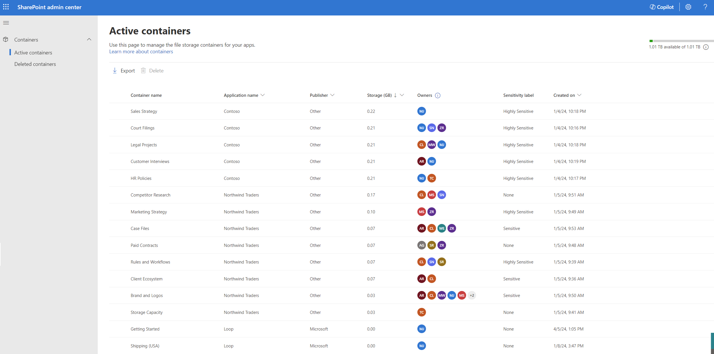
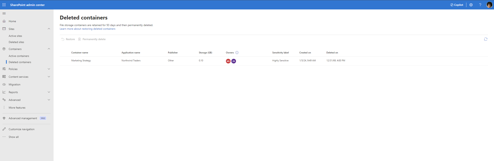
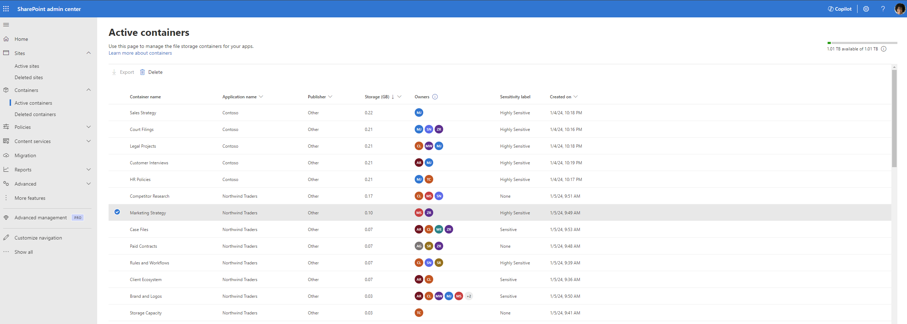
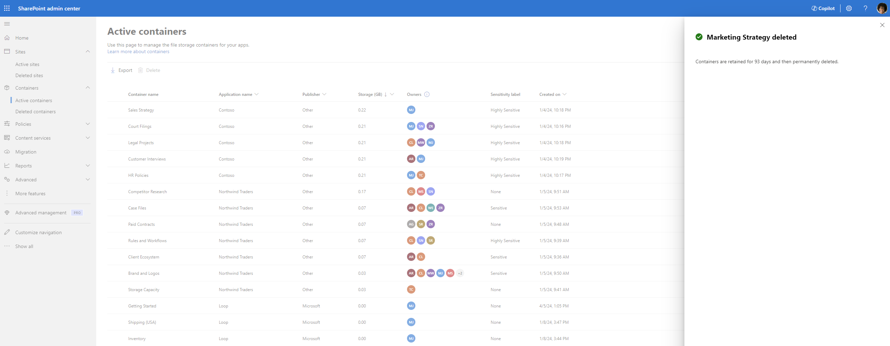
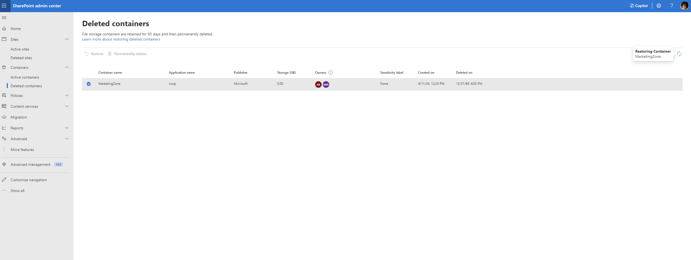
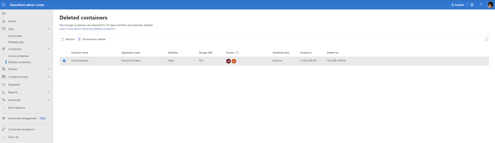
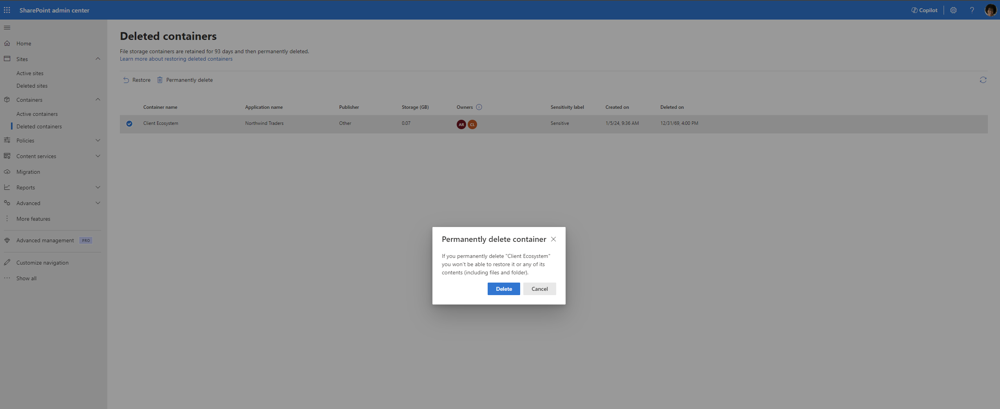

# Manage SharePoint Embedded containers in SharePoint Admin Center

The organizations that use the SharePoint Embedded applications on their Microsoft 365 (Microsoft 365) tenants are the consuming tenants and the persona that is responsible for managing these applications on their Microsoft 365 tenancy is the consuming tenant administrator (CTA). Consuming tenant administrators can manage containers through a graphical user interface (GUI) using the [SharePoint Administrator Center](https://go.microsoft.com/fwlink/?linkid=2185219).

To manage SharePoint Embedded containers, CTA need to be assigned the Microsoft 365 SharePoint Embedded Administrator role. Global Administrators in Microsoft 365 have all the permissions of the SharePoint Embedded Administrator role.  A global administrator can assign a user the SharePoint Embedded administrator role to act as a consuming tenant admin for SharePoint Embedded. This role is available in both Microsoft Entra and the Microsoft 365 Admin Center.
For information on SharePoint Embedded admin role, see [SharePoint Embedded Admin](../adminrole.md).

The following actions are supported in SharePoint Admin Center:

1. View active containers in the tenant
1. View deleted containers in the tenant
1. View detailed information of a container
1. Delete a container
1. Restore a deleted container
1. Permanently deleted a container

**Global admin** will also see "Active Containers" and "Deleted Containers" page along with Site administration pages when they sign in to SharePoint Admin Center.

**SharePoint Embedded admin** will only see "Active Containers" and "Deleted Containers" page when they sign in to SharePoint Admin Center.

## Active Containers

The Active Containers page displays all the active containers within the tenant, providing a comprehensive overview and management capabilities. This page includes the following metadata for each container:

1. **Container name :** Name of the container provided by the container owner
1. **Application name :** Name of the SharePoint Embedded application the container belongs to
1. **Publisher name :** The name of the organization that owns the application
1. **Storage :** The total storage of the files stored in the containers
1. **Owners :** Users assigned the owner role on the container
1. **Sensitivity label :** Name of the label assigned to the container
1. **Created on :** Date and time when the container was created

### View details of a container

The detailed container view provides a deeper dive into container-specific metadata, organized under two tabs:

1. **General:** This panel displays all the general metadata about a container, usage, and configuration settings.

    

1. **Membership:** This panel shows the user permissions for different users associated with the container.

> [!IMPORTANT]
> The SharePoint Embedded platform supports four distinct [roles](../../app-concepts/sharing-and-perm.md): Owner, Manager, Writer, and Reader. The SharePoint Embedded application on your tenant may not utilize all four roles and might refer to these roles using different names.
>

## Deleted Containers

The deleted containers page lists all containers in the tenants deleted container collection. It lists the following metadata:

1. Container name
1. Application name
1. Publisher name
1. Storage
1. Owners
1. Sensitivity label
1. Created on
1. **Deleted on**: Date and time when the container was deleted.

## Delete a container

> [!WARNING]
>
> Deleting a container may cause unexpected issues for the SharePoint Embedded application it belongs to and may interrupt the application's usage. This action should only be performed by admins when absolutely necessary.

Deleting a container can have implications on the functionality of a SharePoint Embedded app, Here are some examples of the potential issues that an application can encounter when deleting a container.

1. **Data Loss:** Deleting a container removes all its content. If the SharePoint Embedded application relies on the data stored within the deleted container, the app might no longer function as expected or might lose access to critical information.
1. **Broken Links:** If the SharePoint Embedded application contains links or references to the deleted container, those links become broken, leading to errors or malfunctioning features within the app.

A container can be deleted from the Active containers page for any business reason by the CTA. By default, the delete button is deactivated. On selecting a container, the delete button is activated. The CTA can then select the delete button.

This opens a side panel that warns the user about the effect on the associated SPE application due to the deletion of a container and inform the user about the restoration policy. The CTA can at this stage either cancel the panel and go back to the active containers page or proceed further with the deleting by clicking on “Delete container”.

The selected container is successfully deleted and moved into the deleted containers page.

**Deleted containers are permanently purged after 93 days unless there is a retention policy applied to the containers**

## Restore a container

A container in the deleted container collection can be restored on the Deleted containers page by selecting the corresponding containers by selecting the "Restore" link

Restoration of the container happens in the background and the status of the same is displayed on the top-right corner of the page. Upon successful restoration, the container will be available in the Active Containers page.

## Permanently delete a container

> [!WARNING]
>
> Deleting a container may cause unexpected issues for the SharePoint Embedded application it belongs to and may interrupt the application's usage. This action should only be performed by admins when absolutely necessary.

The CTA can permanently delete a deleted container from the deleted container collection if they decide to.

The CTA selects the container to be permanently deleted. The “Permanently delete” button is enabled.

Upon clicking the button, a pop-up appears. warning the CTA on the action they're performing. If sure, the CTA can proceed and select on “Delete”. Otherwise the CTA can cancel the action.

Upon clicking Delete, the container is permanently deleted and the status of the same appears in the top-right corner of the page. Upon successful deletion, the container is permanently removed from the deleted container collection and can't be restored.

## Coming Soon

1. Sort containers by created date and storage
1. Filter containers by created date, application name and publisher name
1. Edit sensitivity label of a container
1. Add and remove users to/from a container
