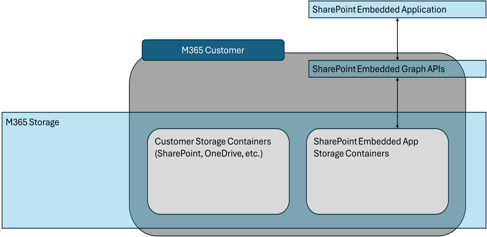
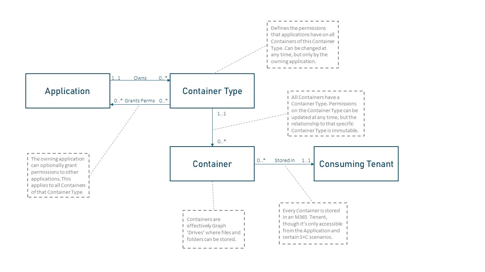

# SharePoint Embedded App Architecture

All files and documents in SharePoint Embedded are stored in Containers. All Containers are created and stored within an M365 Tenant. The ISV or LOB app then uses the Microsoft Graph API to interact with the dedicated Container(s) for that app. The Containers are part of the M365 customer’s tenant regardless of how the app is deployed.

**Container Relationship**

- Every Container type is owned by one SharePoint Embedded Application
- Only the app owning a Container type may create instances of a Container.
- Container instances must belong to a Container type.
- An app may instantiate zero or more Container instances for a given Container type.
- Apps can grant permission to other apps to create, read, update, and/or delete Container instances of Container types of the owning app , e.g. to allow backup/restore or DLP apps to operate on content in those Containers and/or create instances of the Container type. Note, the owning application is charged for storage in all instances of a Container type regardless of which app originally instantiated the Container.

### **SharePoint Embedded Containers and Container Types**
A Container Type is a SharePoint Embedded-Container level property stamped on every instance of a Container. An applications will own one or more Container Types to create Containers. 
> Read more on Container Types [here](../app-concepts/containertypes.md)

<!-- In the Microsoft ecosystem, each application needs to be registered with Azure AD to obtain a unique Azure ID (referred here as AppID or ClientID). This rule applies to all variants of the same app. For example, if a developer launches an application on the Web, iOS, and Android, that developer would register these variants as three separate apps on Azure. This will generate three AppIDs. The same Containers can be accessed by all three apps.
 -->

  

