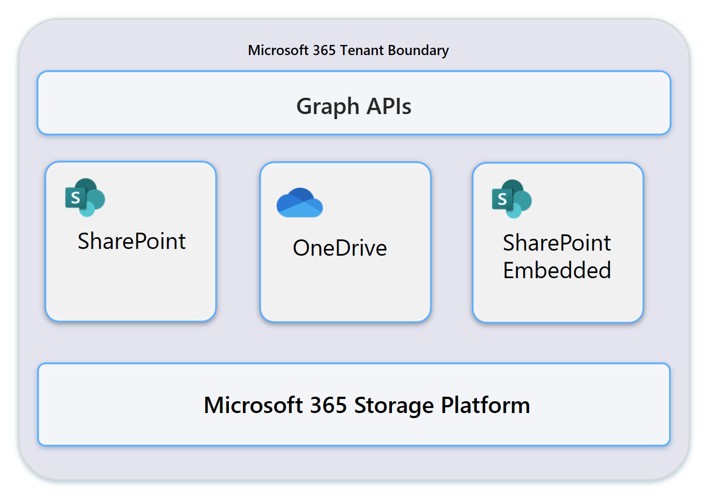
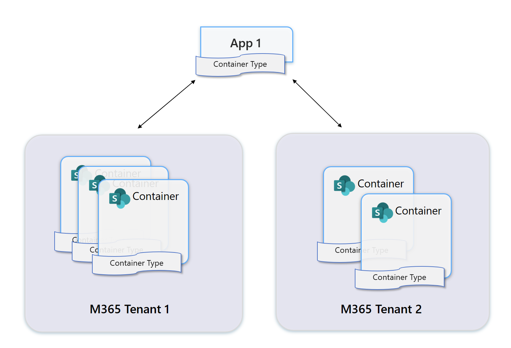

# SharePoint Embedded App Architecture

All files and documents in SharePoint Embedded are stored in Containers. All Containers are created and stored within a Microsoft 365 Tenant. The ISV or LOB app then uses the Microsoft Graph API to interact with the dedicated Container(s) for that app. The Containers are part of the Microsoft 365 customer’s tenant regardless of how the app is deployed.

## Container Relationship

- Every Container Type is owned by one SharePoint Embedded Application
- Only the app owning a Container Type may create instances of a Container.
- Container instances must belong to a Container Type.
- An app may instantiate zero or more Container instances for a given Container Type.
- Apps can grant permission to other apps to create, read, update, and/or delete Container instances of Container Types of the owning app, for example, to allow backup/restore or DLP apps to operate on content in those Containers and/or create instances of the Container Type. Note, the owning application is charged for storage in all instances of a Container Type regardless of which app originally instantiated the Container.

## SharePoint Embedded Containers and Container Types

Container Type is a property stamped on every Container instance. Each Container Type is owned by one Application; and each Application can own only one Container Type. To learn more about Container Types, see [Container Type](./containertypes.md)

All content is stored in the Consuming Tenant