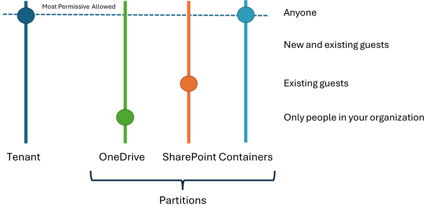

## Sharing and Permissions in SharePoint Embedded

## Sharing

The permission model used in SharePoint Embedded is different from that traditional used by SharePoint and follows the OneDrive Consumer model. I.e. Unlike SharePoint you cannot break the permission inheritance. However, you can apply “additive permissions” to the Content (files and folders) that are in a Container.

### Container Roles
Every Container has four predefined roles (that cannot be extended or modified) that users or AAD security groups can be added or removed from:
- **Owner** – Has full control over the Container
- **Manager** – As well as being to add, update, and delete content in the Container, they can also maintain permissions of the Container and the content in the Container
- **Writer** – Can add, update, and delete content in the Container
- **Reader** – Can only view content in the Container
If a user is a member of a role, then those permissions will apply to all of the content (files and folders) that in that Container. For example, if *UserA* is made a member of the Reader role, then *UserA* will be able to view and read all content (files and folders) in that Container. 

## Permissions 

### Additive Permissions
Your app may have the scenario that you may want to grant additional permissions to a user beyond what they have on the Container. For example, if *UserA* is member of the Reader role, you may want to allow that user to be able to edit a specific document in that Container. To support this scenario, you add and delete additive permissions using the Graph APIs:

Scenario | Graph API(s) | Notes
:---|:---|:---
Grant an additive permission | [POST /drives/{drive-id}/items/{item-id}/invite](https://learn.microsoft.com/graph/api/driveitem-invite?view=graph-rest-1.0&tabs=http) | The sendInvitation property must always be false.   You cannot grant additive permissions to the root folder in a Container as this is essentially the same as adding a User to a role.   You cannot use AppOnly permissions.
Retrieve permissions | [GET /drives/{drive-id}/items/{item-id}/permissions](https://learn.microsoft.com/graph/api/driveitem-invite?view=graph-rest-1.0&tabs=http)   [GET /drives/{drive-id}/items/{item-id}/permissions/{perm-id}](https://learn.microsoft.com/graph/api/driveitem-invite?view=graph-rest-1.0&tabs=http) |  
Delete an additive permission | [DELETE /drives/{drive-id}/items/{item-id}/permissions/{perm-id}](https://learn.microsoft.com/graph/api/permission-delete?view=graph-rest-1.0&tabs=http) | You can only delete the additive permission on the drive item where it was originally added.

In addition, using these APIs have the following dependencies:
- How Sharing has been configured in the Consuming Tenant
- The type of user that is invoking the API when you are using delegated authorization.

### Sharing Configuration Settings
Invoking the additive permission APIs and sharing content is dependent on the Sharing configuration settings in the Consuming Tenant. For example, if the Consuming Tenant has been configured to disable sharing to Guest Users, then your SharePoint Embedded application will not be able to be able to add Guest Users to the Container roles or grant them additive permissions.
For further information please refer to:
- [Sharing & permissions in the SharePoint modern experience - SharePoint in Microsoft 365 | Microsoft Learn](https://learn.microsoft.com/sharepoint/modern-experience-sharing-permissions#guest-sharing)
- [Manage sharing settings - SharePoint in Microsoft 365 | Microsoft Learn](https://learn.microsoft.com/sharepoint/turn-external-sharing-on-or-off)

### Container “Partition”
Note that the Sharing settings can be defined at the Tenant level as well as separately at the SharePoint Site and OneDrive “partitions”. For SharePoint Embedded, we have introduced a new “partition” called Containers that will apply to all SharePoint Embedded applications in the Consuming Tenant.
This can be configured using the PowerShell cmdlet [Set-SPOTenant](https://learn.microsoft.com/powershell/module/sharepoint-online/set-spotenant?view=sharepoint-ps) as per this example:
 
     Set-SPOTenant `
         -SharingCapability ExternalUserAndGuestSharing `
         -CoreSharingCapability ExistingExternalUserSharing `
         -OneDriveSharingCapability Disabled `
         -ContainerSharingCapability ExternalUserAndGuestSharing

 
Please note the following:
- [Microsoft.Online.SharePoint.PowerShell](https://learn.microsoft.com/powershell/sharepoint/sharepoint-online/connect-sharepoint-online) version 16.0.23701.0 or later is required to configure the Container “partition”
- Sharing settings for a “partition” can never be more permissive than the Tenant level setting. 

### Guest User Dependencies
In addition to the Sharing configuration settings, there are a couple of scenarios relating to Guest Users and sharing to be aware of:
- Guest Users can get unexpected results when granting additive permissions
- Guest Users may not be able to be added via the SharePoint Embedded App

### Guest User granting Additive Permissions
When granting additive permissions and the user invoking the API is a Guest User, then you may get unexpected results.

Admin User | User being granted additive permissions | Outcome
:--- | :---: | :---
Consuming Tenant user | New | Success
Consuming Tenant user | Existing | Success
Guest user | New | **Fails**
Guest user | Existing | Success

Note that the user being granted additive permissions indicates whether that user has previously been granted additive permissions for any content in that specific Container.
The failure scenario is expected behavior depending on the Consuming Tenant configuration settings.
If this scenario is required to also succeed for Guest Users, then the following settings need to be set to **True** using the [Set-SPOTenant](https://learn.microsoft.com/powershell/module/sharepoint-online/set-spotenant?view=sharepoint-ps) PowerShell cmdlet in the Consuming Tenant:
- AllowGuestUserShareToUsersNotInSiteCollection
	- Note that setting this to **True** also requires [SharePoint and OneDrive integration with Azure AD B2B](https://learn.microsoft.com/sharepoint/sharepoint-azureb2b-integration) to be enabled.
- ShowPeoplePickerSuggestionsForGuestUsers

### Adding Guest Users
If your SharePoint Embedded application requires the ability to add Guest Users then Sharing must be enabled on the SharePoint content root in the Consuming Tenant e.g. https://contoso.sharepoint.com.
Please note that by default, sharing is enable on the SharePoint content root. However, some Consuming Tenants may have disabled this.
If this scenario is required, then the SharePoint content root SharingCapability setting needs to be set to any value except disabled using the [Set-SPOSite](https://learn.microsoft.com/powershell/module/sharepoint-online/set-sposite?view=sharepoint-ps) PowerShell cmdlet in the Consuming Tenant:
For example: 

    Set-SPOSite -Identity https://contoso.sharepoint.com `
        -SharingCapability ExistingExternalUserSharingOnly

