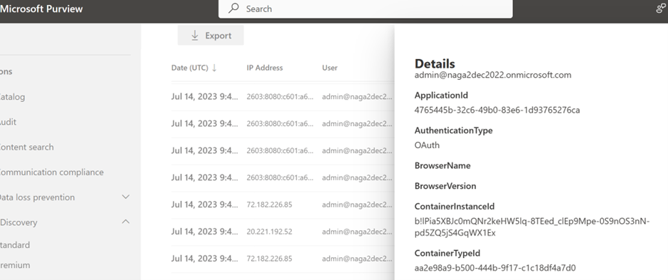
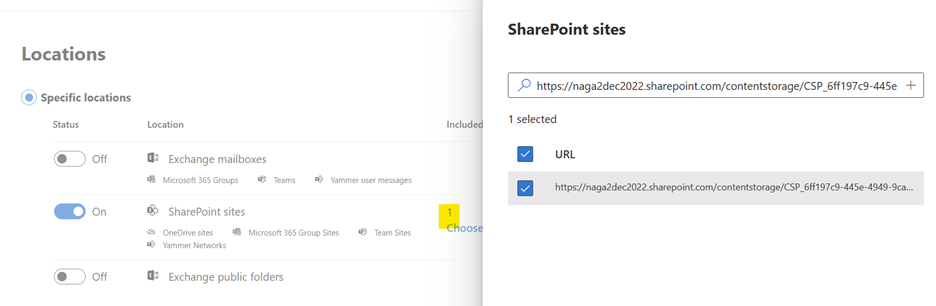

# Security and Compliance

Microsoft's SharePoint Embedded provides a faster way to create secure and compliant documents stored in various applications. SharePoint Embedded leverages Microsoft’s comprehensive compliance and data governance solutions to help organizations manage risks, protect, and govern sensitive data, and respond to regulatory requirements. Security and compliance solutions will work in a similar manner in the SharePoint Embedded platform as they do today in Microsoft 365 (M365) platform so that data is stored in a secure, protected way that meets customers’ business and compliance policies while making it easy for Compliance and SharePoint Administrators to enforce critical security and compliance policies on the content.  In this article, we describe the security and compliance policies that are supported today on content that reside in the SharePoint Embedded platform.


##  Compliance Policies using Microsoft Purview

Currently, SharePoint Embedded supports the following Compliance features under Microsoft Purview.  You can follow the below steps to retrieve the details of a container that the policy needs to be applied to.

1. View list of registered SharePoint Embedded applications registered in the specified tenant:
```
Get-SPOApplication
```
2. Retrieve list of Containers in a SharePoint Embedded application by providing the ApplicationID returned in Step #1
```
Get-SPOContainer -OwningApplicationId <OwningApplicationID>
```
3. Retrive the details of a container including the ContainerSiteURL by providing the ContainerID returned in Step #2.
```
Get-SPOContainer -OwningApplicationId <ApplicationID> -Identity<ContainerID>
```
For information on how to retrieve ContainerSiteURL to set the various Compliance policies described below at a Container level, please visit [Get-SPOContainer](/powershell/module/sharepoint-online/get-spocontainer).


* ### Audit

    Thousands of user and admin operations performed in various applications hosted in SharePoint Embedded are captured, recorded, and retained in your organization's unified audit log which can then be searched for by IT admins, insider risk teams, and compliance and legal investigators in your organization.

    Audit events are logged with additional data such as app ID, container ID etc. to help filter the Audit search results to isolate the relevant SharePoint Embedded content.

    

    For more information on Audit, please visit [Auditing solutions in Microsoft Purview](/purview/audit-solutions-overview)


* ### eDiscovery

    Electronic discovery (eDiscovery) is the process of identifying and delivering electronic information that can be used as evidence in legal cases. Compliance Admins can use eDiscovery tools in Microsoft Purview to successfully search/hold/export content in the SharePoint Embedded platform. For more information on eDiscovery, please visit [Microsoft Purview eDiscovery solutions](/purview/ediscovery).

    To perform an eDiscovery Search on all SharePoint Embedded content, Admins can click on ‘All’ SharePoint Sites when configuring the eDiscovery Search in Microsoft Purview. This enables the Search for content stored in all SharePoint Online Sites and also on all SharePoint Embedded Containers.


To limit the Search to one/few SharePoint Embedded Containers, Admins can ‘Choose sites’ under the ‘SharePoint sites’ workload and provide the desired Container URL –


 

* ### Data Lifecycle Management (DLM)

    Retaining and deleting content is often needed for compliance and regulatory requirements, but deleting content that no longer has business value also helps you manage risk and liability. SharePoint Embedded supports retention and hold policies on content stored in its applications using the Microsoft Purview portal. For more information on DLM, please visit [Learn about Microsoft Purview Data Lifecycle Management](/purview/data-lifecycle-management).


Creating a retention/hold policy on ‘All SharePoint Sites’ will automatically enforce the policy on all SharePoint Online Sites and on all SharePoint Embedded Containers.


To selectively enforce the policy on one/few SharePoint Embedded Containers, copy the Container URL and configure the policy to be selectively enforced only on that Container(s).

Since SharePoint Embedded applications are built by ISVs and Developers, it is upto the individual application to provide a mechanism through which Container owners and Admins can set retention label on a Container using the app’s UX.

* ### Data Loss Protection (DLP)

    Using Microsoft Purview, Admins can identify, monitor, and automatically protect sensitive items stored in applications using SharePoint Embedded. DLP detects sensitive items by using deep content analysis, not by just a simple text scan. For more information on DLP, please visit  [Learn about data loss prevention](/purview/dlp-learn-about-dlp).

    Like retention policies, DLP policies can be enforced on all SharePoint Online Sites and SharePoint Embedded Containers by choosing to configure the policy on ‘All SharePoint Sites’. Admins can also restrict the enforcement of a DLP policy to specific SharePoint Embedded Containers by specifying the relevant Container URL(s) during policy configuration.


## Security Features
* ### Sensitivity labels on Containers

    Global Administrators and SharePoint Administrators can set and remove sensitivity labels on a SharePoint Embedded Container by using the newly created SharePoint PowerShell cmdlet –

```
Set -SPOContainer -Identity <ContainerID/ContainerSiteURL> -SensitivityLabel <SensitivityLabelGUID>
```
<!--To learn more about the new Sensitivity Label PowerShell cmdlet and its various configurable optional parameters, please visit [<link to new Sen label cmdlet page – WIP>](learn.microsoft.com)-->

Sensitivity labels can also be set at the file level for content stored in SharePoint Embedded Containers by opening web-previewable files and choosing a label from the “Sensitivity bar” that’s available for these files. To learn more about setting sensitivity labels at a file level, please visit [Learn about sensitivity labels](/purview/sensitivity-labels).

* ## Block Download policy (Coming Soon)
  Block Download policy allows SharePoint Administrator or Global Administrator to block download of files from SharePoint Embedded Containers. This allows users to remain productive while addressing the risk of accidental data loss. Users have browser-only access with no ability to download, print, or sync files. They also won't be able to access content through apps, including the Microsoft Office desktop apps.

```
Set-SPOSite -Identity <ContainerSiteURL> -BlockDownloadPolicy $true
```
Please note that a SharePoint Advanced Management (SAM) license is needed to enforce this policy.
<!--To learn more about the new Block Download PowerShell cmdlet and its various configurable options, please visit [<link to new BDP cmdlet page – WIP>](learn.microsoft.com) -->

* ## Conditional Access policy (Coming Soon)
SharePoint Embedded supports basic Conditional Access policy configurations such as

 * AllowFullAccess: Allows full access from desktop apps, mobile apps, and the web

 * AllowLimitedAccess: Allows limited, web-only access

 * BlockAccess: Blocks Access

using the below PowerShell cmdlet. AuthorizationContext will also be supported in the near future.
```
Set-SPOContainer -Identity <ContainerSiteURL> -ConditionalAccessPolicy <SPOConditionalAccessPolicyType>
```
Please read Control access from unmanaged devices documentation to understand more about [Conditional Access Policy](/sharepoint/control-access-from-unmanaged-devices).
