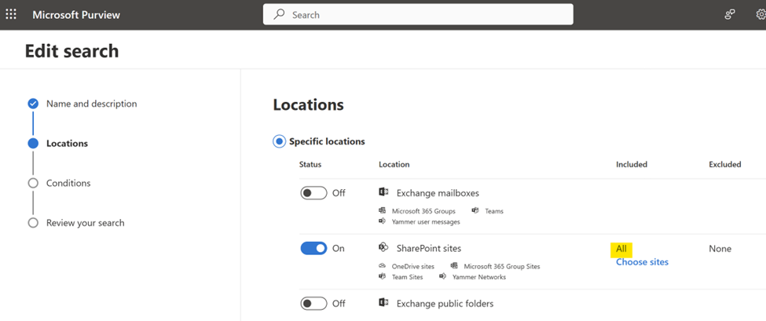
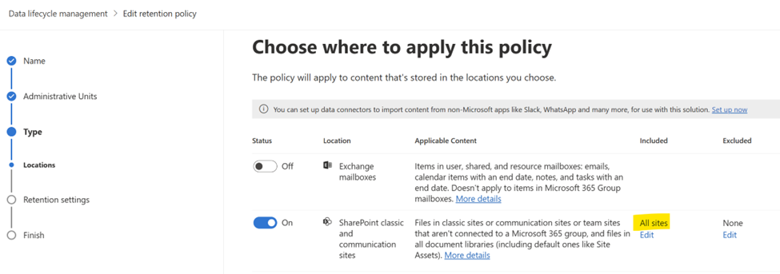

# Security and Compliance

Microsoft's SharePoint Embedded provides a faster way to create secure and compliant documents stored in various applications. SharePoint Embedded uses Microsoft’s comprehensive compliance and data governance solutions to help organizations manage risks, protect, and govern sensitive data, and respond to regulatory requirements. Security and compliance solutions will work in a similar manner in the SharePoint Embedded platform as they do today on the Microsoft 365 (Microsoft 365) platform so that data is stored in a secure, protected way that meets customers’ business and compliance policies while making it easy for Compliance and SharePoint Administrators to enforce critical security and compliance policies on the content.

In this article, we describe the security and compliance policies that are supported today on content that resides in the SharePoint Embedded platform, and their capabilities and limitations.

Since SharePoint Embedded by design doesn’t have any user interface, some Compliance scenarios necessitating user interaction aren't natively supported. The owning application that governs the Container can choose to support these scenarios and provide the optimal experience to end-users by using existing Microsoft Graph API.

## Compliance Policies using Microsoft Purview

Currently, SharePoint Embedded supports the following Compliance features under Microsoft Purview.  You can follow the below steps to retrieve the details of a container that the policy needs to be applied to.

1. View a list of registered SharePoint Embedded applications registered in the specified tenant:

    ```powershell
    Get-SPOApplication
    ```

1. Retrieve a list of Containers in a SharePoint Embedded application by providing the ApplicationID returned in Step #1

    ```powershell
    Get-SPOContainer -OwningApplicationId <OwningApplicationID>
    ```

1. Retrieve the details of a container including the ContainerSiteURL by providing the ContainerID returned in Step #2.

    ```powershell
    Get-SPOContainer -OwningApplicationId <ApplicationID> -Identity<ContainerID>
    ```

For information on how to retrieve the `ContainerSiteURL` to set the various compliance policies described below at a Container level, please visit [Get-SPOContainer](/powershell/module/sharepoint-online/get-spocontainer).

### Audit

The Audit capabilities provided by SharePoint Embedded mirror the existing Audit functionalities currently supported within SharePoint Online. All user and admin operations performed in various applications hosted in SharePoint Embedded are captured, recorded, and retained in your organization's unified audit log. For more information on Audit, please visit [Auditing solutions in Microsoft Purview](/purview/audit-solutions-overview).

In addition to existing file properties, Audit events related to SharePoint Embedded are logged with the following more data to help filter the Audit search results to isolate the relevant SharePoint Embedded content:

- `ContainerInstanceId`
- `ContainerTypeId`


### eDiscovery

Compliance Admins can use eDiscovery tools in Microsoft Purview to search/hold/export content hosted in the SharePoint Embedded platform. For more information on eDiscovery, please visit [Microsoft Purview eDiscovery solutions](/purview/ediscovery).

To perform an eDiscovery Search on all SharePoint Embedded content, Admins should select on ‘All’ SharePoint Sites when configuring the eDiscovery Search in Microsoft Purview. This enables the Search for content stored in all SharePoint Online Sites and all SharePoint Embedded Containers.



To limit the eDiscovery Search to one/few SharePoint Embedded Containers, Admins can ‘Choose sites’ under the ‘SharePoint sites’ workload and provide the desired Container URL –


### Data Lifecycle Management (DLM)

SharePoint Embedded supports retention and holds policies on content stored in its applications using the Microsoft Microsoft Purview compliance portal. For more information on DLM, please visit [Learn about Microsoft Purview Data Lifecycle Management](/purview/data-lifecycle-management).

The existing retention policy will automatically apply to all SharePoint Embedded Containers if the policy is configured for ‘All sites’. Similarly, creating a new retention/hold policy on *All* SharePoint Sites workload will automatically enforce the policy on all SharePoint Online Sites and all Containers within SharePoint Embedded.



To selectively enforce the policy on one/few SharePoint Embedded Containers, copy the Container URL and configure the policy to be selectively enforced only on those Container(s).


Since SharePoint Embedded doesn't have a built-in user interface, DLM scenarios requiring user interaction aren't natively supported. For instance, if an end user attempts to apply a retention label on a Container using a SharePoint Embedded application (app), the app governing the access to the Container must furnish that functionality. In such cases, Graph APIs for DLM functionalities can be used.

### Data Loss Protection (DLP) - Coming soon

Using Microsoft Purview, Admins can identify, monitor, and automatically protect sensitive items stored in applications using SharePoint Embedded. For more information on DLP, please visit  [Learn about data loss prevention](/purview/dlp-learn-about-dlp).

Like retention policies, DLP policies can be enforced on all SharePoint Online Sites and SharePoint Embedded Containers by choosing to configure the policy on ‘All sites’.


Admins can also restrict the enforcement of a DLP policy to specific SharePoint Embedded Containers by specifying the relevant Container URL(s) during policy configuration.


Several scenarios supported by DLP today need user interaction that isn’t natively supported by SharePoint Embedded. For instance, based on its configuration, a DLP policy that prevents external sharing may allow end users to provide a business justification to override the policy. The client app that renders this DLP-flagged file item will need to support such user interactions.

Policy tips are shown today for files hosted in SharePoint Online so that users are kept informed about DLP-flagged file items and corresponding restrictions. Similarly, for policy tips to be displayed for files hosted in SharePoint Embedded, the client app can choose to provide more support by utilizing the existing Graph APIs for this purpose.

## Security Features

### Sensitivity labels on Containers

Global Administrators and SharePoint Administrators can set and remove sensitivity labels on a SharePoint Embedded Container by using the newly created SharePoint PowerShell cmdlet:

```powershell
Set -SPOContainer -Identity <ContainerID/ContainerSiteURL> -SensitivityLabel <SensitivityLabelGUID>
```

To learn more about setting sensitivity labels, please visit [Learn about sensitivity labels](/purview/sensitivity-labels).

### Block Download policy (Coming Soon)

Block Download policy allows SharePoint Administrator or Global Administrator to block the download of files from SharePoint Embedded Containers using the below SharePoint PowerShell cmdlet –

```powershell
Set-SPOSite -Identity <ContainerSiteURL> -BlockDownloadPolicy $true
```

A SharePoint Advanced Management (SAM) license is needed to enforce this policy. Read the full documentation for advanced capabilities at [Block download policy for SharePoint sites and OneDrive](/sharepoint/block-download-from-sites).

### Conditional Access policy (Coming Soon)

SharePoint Embedded supports basic Conditional Access policy configurations such as:

- `AllowFullAccess`: Allows full access from desktop apps, mobile apps, and the web
- `AllowLimitedAccess`: Allows limited, web-only access
- `BlockAccess`: Blocks Access

These settings are available with the following PowerShell cmdlet. The `AuthorizationContext` will also be supported soon.

```powershell
Set-SPOContainer -Identity <ContainerSiteURL> -ConditionalAccessPolicy <SPOConditionalAccessPolicyType>
```

To learn more about Conditional Access Policy, please visit [Control access from unmanaged devices](/sharepoint/control-access-from-unmanaged-devices).
