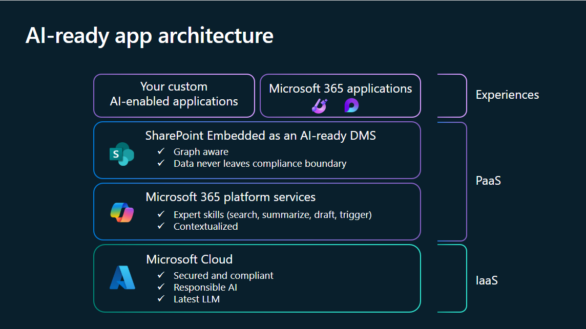
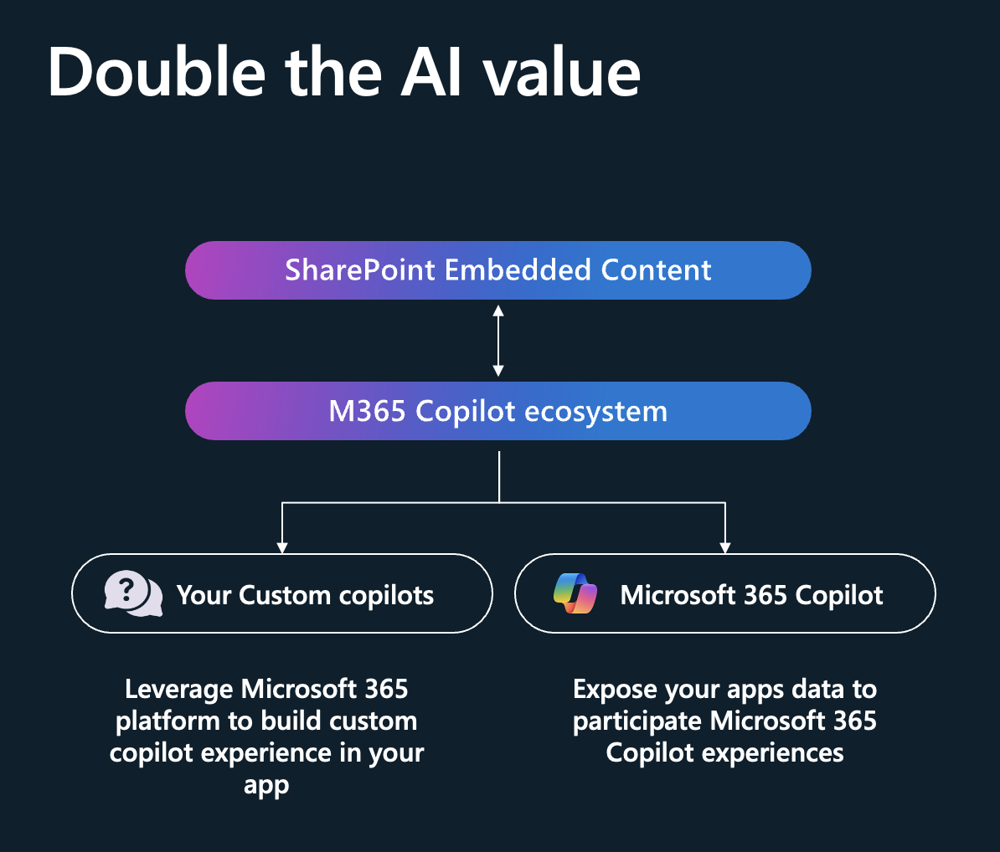
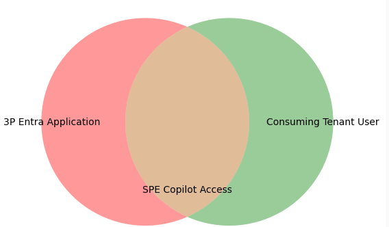
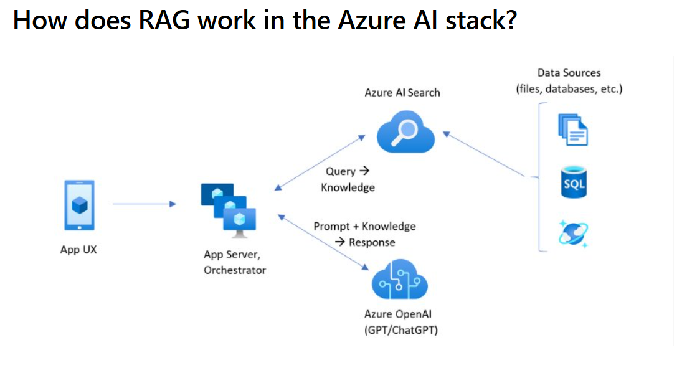
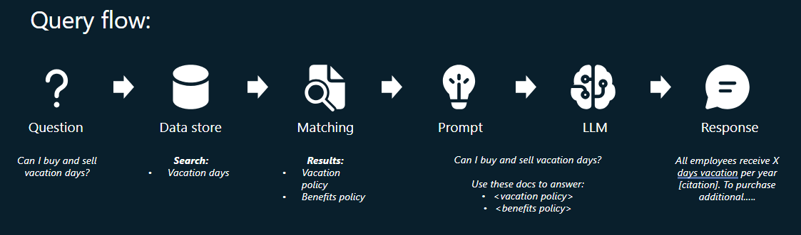
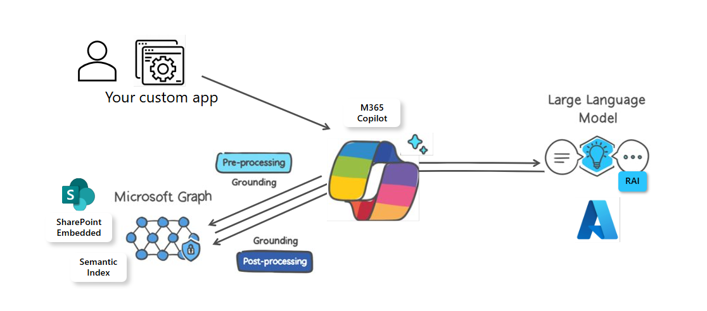
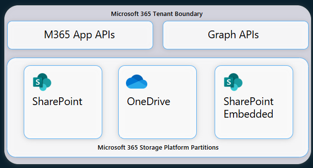

# Overview

> [!NOTE]
>
> Sharepoint Embedded Copilot is currently in public preview, the API surface and SDK are expected to change frequently.

SharePoint Embedded Copilot is a powerful tool designed to enhance the functionality of SharePoint Embedded applications by integrating advanced Microsoft 365 features ( Purview, Protection etc. )



Currently, the only way to incorporate this feature into your custom application is through our React SDK library written in TypeScript. Plans to support future runtimes will be announced. The SDK is configured with the containerid instance of your containertype, as well as the authorization and authentication token logic you provdide through a callback. It will embed itself as an iframe into your host application. By default, the iframe is given a frame-ancestors property that prevents it from being embedded by any host until configured. Details are provided below.

## Key Features



### BIlling/Licensing

Currently to use SPE copiot the consuming tenant user of the application is required to have a copiot license. In the future the license based model will be deprecating and the copilot usage will be charged on a pay-as-you-go basis to the owner of the owning tenant of the container type.

### Application Scoping

Application scoping in SharePoint Embedded Copilot (SPE Copilot) involves defining the boundaries and context within which the tool operates, ensuring its features and capabilities are tailored to meet the specific needs of different applications. This process helps customize the Copilot's functionality, making it more effective and relevant for various use cases.

When SPE Copilot users query the LLM, it will only have access to files that the `User+Application` have access to, which would mean a minima of a superset. Typically this will be the application that has been granted access over the container type which will typically be more data then just what the user has access to.



#### DiscoverabilityDisabled

This flag prevents Copilot from discovering files in the specified container type. If you have an existing container type and are setting this value to false, please wait 24 hours to ensure the container type configuration is fully propagated before creating a new container, uploading files there, and trying out Copilot on folders/files of that new container.

Here is an [example of setting the flag to false](https://learn.microsoft.com/en-us/powershell/module/sharepoint-online/set-spocontainertypeconfiguration?view=sharepoint-ps#examples)
```powershell
Set-SPOContainerTypeConfiguration -ContainerTypeId 4f0af585-8dcc-0000-223d-661eb2c604e4 -DiscoverabilityDisabled $false

```

#### DataSources

SPE Copilot has the ability to restrict the datasources it has access to, below are provided types and this [example](url-add) show's how to configure the SDK
```typescript
export type IDataSourcesProps =
  | IFileDataSource
  | IFolderDataSource
  | IDocumentLibraryDataSource
  | ISiteDataSource
  | IWorkingSetDataSource
  | IMeetingDataSource;

export enum DataSourceType {
  File = 'File',
  Folder = 'Folder',
  DocumentLibrary = 'DocumentLibrary',
  Site = 'Site',
  WorkingSet = 'WorkingSet',
  Meeting = 'Meeting'
}
```
### Semantic Index

[Learn more about semantic index for M365 copilot here](https://learn.microsoft.com/en-us/microsoftsearch/semantic-index-for-copilot)

The semantic index allows for quick and accurate searches based on the similarity of data. This means it can find the most relevant information not just by exact matches, but also by understanding the context and meaning.

### RAG ( Retrevial-Augmented-Generation )

RAG relies on having relevant source materials stored in a repository which can be queried at runtime​
At runtime, data is retrieved from the index and is used to augment the prompt sent to the LLM​:
- Lets you treat data sources as knowledge without having to train your model​
- Uses search (retrieval) results as additional context in your prompt​
- Generates the output using the prompt and the supplied context

The data is used by the LLM to inform and construct the response​



​


### Grounding

Grounding in the context of SPE Copilot refers to the process of providing input sources to the large language model (LLM) related to the user's prompt. This helps improve the specificity of the prompt and ensures that the responses are relevant and actionable to the user's specific task. The data the Copilot is grounded on will be on the contents of the container type in the SPE Copilot application. Behind the scenes SPE Copiot uses M365 copilot, [learn more about it's architecture here](https://learn.microsoft.com/en-us/copilot/microsoft-365/microsoft-365-copilot-architecture)

### Retrevial API

### M365 Boundrary 

Data is kept secure: data never leaves the tenant boundary and storage respects data residency settings​



### CSP Policies

 The Content-Security-Policy (CSP) for embedded chat hosts, ensures that only specified hosts can load the `chatembedded.aspx` page. This helps in securing the application by restricting which domains can embed the chat component. 

 It is intended to allow consuming tenant SPE admins to set an allowlist of hosts that they will allow to embed the SPE copilot in an iframe. Specifically, the value they set here will be used in a Content-Security-Policy header as a frame-ancestors value. 

> [!NOTE]
>
> If this configuration is not set, the [Content-Security-Policy](https://developer.mozilla.org/en-US/docs/Web/HTTP/Headers/Content-Security-Policy) will default be set to
> [frame-ancestors](https://developer.mozilla.org/en-US/docs/Web/HTTP/Headers/Content-Security-Policy/frame-ancestors): ‘none’ which means no one can embed the copilot. 

Below are example commands to use the [SPO Admin Powershell](https://learn.microsoft.com/en-us/powershell/module/sharepoint-online/set-spocontainertypeconfiguration?view=sharepoint-ps) to set teh `CopilotEmbeddedChatHosts` property.

```powershell
Set-SPOContainerTypeConfiguration -ContainerTypeId 4f0af585-8dcc-0000-223d-661eb2c604e4 -CopilotEmbeddedChatHosts "http://localhost:3000 https://contoso.com https://fabrikam.contoso.com" 

# This should set the container type configuration “CopilotEmbeddedChatHosts” accordingly. 
...

Get-SPOContainerTypeConfiguration -ContainerTypeId 4f0af585-8dcc-0000-223d-661eb2c604e4 

# This should return the container type configurations and their values including CopilotEmbeddedChatHosts 
```

### Consumptive Billing ( Coming Soon )

### Supported Document Types

.docx, .pptx ..etc

## Getting Started


> [!NOTE]
>
> 1. You must specify the purpose of the container type you're creating at creation time. Depending on the purpose, you may or may not need to provide your Azure Subscription ID. A container type set for trial purposes can't be converted for production; or vice versa.
> 1. You must use the latest version of SharePoint PowerShell to configure a container type. For permissions and the most current information about Windows PowerShell for SharePoint Embedded, see the documentation at [Intro to SharePoint Embedded Management Shell](/powershell/sharepoint/sharepoint-online/introduction-sharepoint-online-management-shell).
> -  Ensure that Copilot for Microsoft 365 is available for your organization. You have two ways to get a developer environment for Copilot:
>     - A sandbox Microsoft 365 tenant with Copilot (available in limited preview through [TAP membership](https://developer.microsoft.com/microsoft-365/tap)).
>     - An [eligible Microsoft 365 or Office 365 production environment](https://learn.microsoft.com/en-us/microsoft-365-copilot/extensibility/prerequisites#customers-with-existing-microsoft-365-and-copilot-licenses) with a Copilot for Microsoft 365 license.


### Quick Start

### Examples

### SPE Typescript React Application

### Customer Succes Stories

# API Documentation

[LINK_TO_API_EXTRACTOR](https://api-extractor.com/pages/setup/generating_docs/)

# Frequently Asked Questions

## Consumptive Billing

Currently you need a copilot license enabled for your user to use Sharepoint Embedded copilot. When consumptive billing is enabled you will no longer require a license however you will be required to use a Standard Container type.

***Trial Container Types expire after 30 days, for this reason we recommend starting off with Standard Container types. Currently there is no upgrade path from Trial to Standard container types.***

## Standard or Trail Container Type

Once consumptive billing is enabled, we will be disabling using this feature with Trial Container types and it will only be enabled on Standard container types going forward. Please follow this [guide](../concepts/app-concepts/containertypes.md) to get startted on creating your Standard Container type.

## Bring-Your-Own-Model


# Support

## Chat Control Feedback Dialog

## Contact Us

Please reach out to ContactSPECopilot@microsoft.com for any comments or concerns not captured in this article.