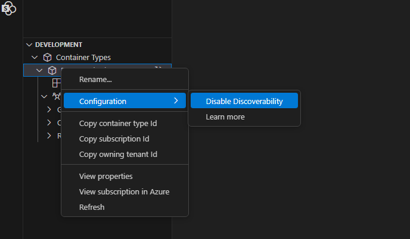
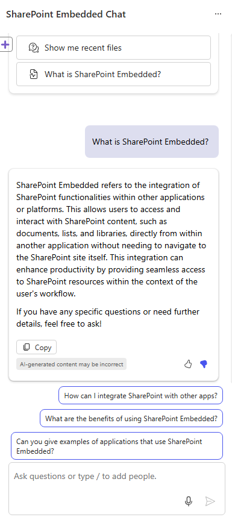
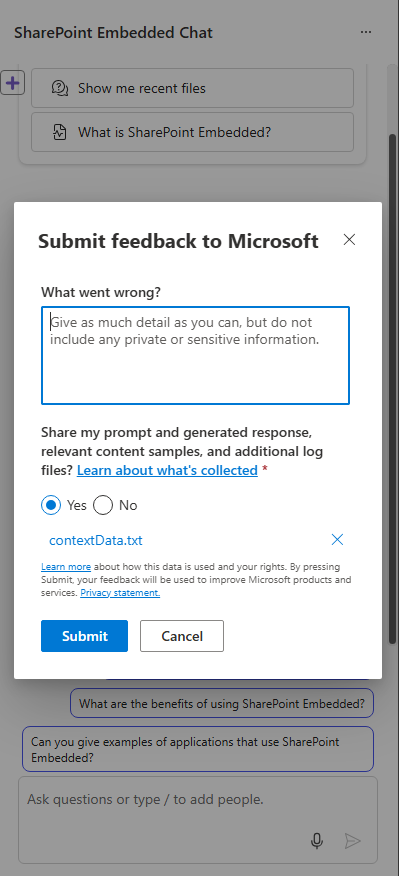

# Overview

> [!NOTE]
>
> SharePoint Embedded Declarative Agents Lite is currently in public preview, the API surface and SDK are expected to change frequently.

SharePoint Embedded Declarative Agents Lite is a powerful tool designed to enhance the functionality of SharePoint Embedded applications by integrating advanced Microsoft 365 features (Purview, Protection, etc.)


## Key Features


### Billing/Licensing

Currently, to use SPE Declarative Agent Lite, the consuming tenant user of the application is required to have an [M365 Copilot license](/copilot/microsoft-365/microsoft-365-copilot-licensing). In the future, the license-based model will be replaced with a consumption-based model. The usage of SPE Declarative Agents will be charged on a pay-as-you-go basis to your SharePoint Embedded application (that is, to the owning tenant). Stay tuned for billing model announcements during the preview period.

### Application Scoping

Application scoping in SharePoint Embedded Declarative Agents Lite (SPE DA Lite) involves defining the boundaries and context within which the tool operates, ensuring its features and capabilities are tailored to meet the specific needs of different applications. This process helps customize the Declarative Agent's functionality, making it more effective and relevant for various use cases.

When SPE DA Lite users query the LLM, it will only have access to files that the `User+Application` have access to. The effective permissions for the Declarative Agent session will be the intersection of your SharePoint Embedded application's permissions and the user's permissions.


### Semantic index

[Learn more about semantic index for M365 Copilot here](/microsoftsearch/semantic-index-for-copilot)

The semantic index allows for quick and accurate searches based on the similarity of data. This means it can find the most relevant information not just by exact matches, but also by understanding the context and meaning.

### RAG ( Retrieval-Augmented Generation )

RAG relies on having relevant source materials stored in a repository which can be queried at runtime​
At runtime, data is retrieved from the index and is used to augment the prompt sent to the LLM​:

- Lets you treat data sources as knowledge without having to train your model​
- Uses search (retrieval) results as additional context in your prompt​
- Generates the output using the prompt and the supplied context

The data is used by the LLM to inform and construct the response​


​


### Grounding

Grounding in the context of SPE DA Lite refers to the process of providing input sources to the large language model (LLM) related to the user's prompt. This helps improve the specificity of the prompt and ensures that the responses are relevant and actionable to the user's specific task. The data the Declarative Agent is grounded on will be on the contents of the container type in the SPE DA Lite application. Behind the scenes SPE Declarative Agent Lite uses M365 Copilot, [learn more about it's architecture here](/copilot/microsoft-365/microsoft-365-copilot-architecture)

### M365 Boundary

Data is kept secure: data never leaves the tenant boundary and storage respects data residency settings​.

Each container instance of a container type in the SPE partition is its own security and compliance boundary.


### Using your Declarative Agent

Currently, the only way to incorporate this feature into your custom application is through our React SDK library written in TypeScript. Plans to support additional frameworks and environments will be announced. The SDK is configured with the containerId instance of your containerType, as well as the authorization and authentication token logic you provide through a callback. It will embed itself as an iFrame into your host application. By default, the iFrame is given a `frame-ancestors` property that prevents it from being embedded by any host until configured. Details are provided below.

#### Required ContainerType Configuration

##### DiscoverabilityDisabled

This [flag](admin-exp/developer-admin/dev-admin.md#container-type-configuration-properties) prevents Declarative Agent from discovering [drive items](/graph/api/resources/driveitem) in the specified container type. If you have an existing container type and are setting this value to false, please wait 24 hours to ensure the container type configuration is fully propagated before creating a new container, uploading files there, and trying out Declarative Agent on folders/files of that new container.

Here is an example of setting the flag to false with [Set-SPOContainerTypeConfiguration](/powershell/module/SharePoint-online/set-spocontainertypeconfiguration#examples)

```powershell
Set-SPOContainerTypeConfiguration -ContainerTypeId 4f0af585-8dcc-0000-223d-661eb2c604e4 -DiscoverabilityDisabled $false
```

Discoverability can also be disabled using the Visual Studio Code SharePoint Embedded extension



##### CSP Policies

 The Content-Security-Policy (CSP) for embedded chat hosts, ensures that only specified hosts can load the `chatembedded.aspx` page. This helps in securing the application by restricting which domains can embed the chat component.

 It is intended to allow consuming tenant SPE admins to set an allowlist of hosts that they will allow to embed the SPE DA Lite in an iFrame. Specifically, the value they set here will be used in a Content-Security-Policy header as a frame-ancestors value.

> [!NOTE]
>
> If this configuration is not set, the [Content-Security-Policy](https://developer.mozilla.org/docs/Web/HTTP/Headers/Content-Security-Policy) will default be set to
> [frame-ancestors](https://developer.mozilla.org/docs/Web/HTTP/Headers/Content-Security-Policy/frame-ancestors): ‘none’ which means no one can embed the Declarative Agent.

Below are example commands to use the [Connect to SharePoint Online using PowerShell](/powershell/sharepoint/sharepoint-online/connect-sharepoint-online) commands:

- [Set-SPOApplication](/powershell/module/SharePoint-online/set-spoapplication) to set the `CopilotEmbeddedChatHosts` property.
- [Get-SPOApplication](/powershell/module/SharePoint-online/get-spoapplication) to get the `CopilotEmbeddedChatHosts` property.

```powershell
# Note this MUST be run in Windows PowerShell. It will not work in PowerShell.
Import-Module -Name "Microsoft.Online.SharePoint.PowerShell"
Connect-SPOService "https://<domain>-admin.sharepoint.com"
# Login with your admin account.
...

Set-SPOApplication -OwningApplicationId 423poi45 -CopilotEmbeddedChatHosts "http://localhost:3000 https://contoso.sharepoint.com https://fabrikam.com" 

# This will set the container type configuration “CopilotEmbeddedChatHosts” accordingly. 
...

Get-SPOApplication -OwningApplicationId <OwningApplicationId> | Select-Object CopilotEmbeddedChatHosts

OwningApplicationId             : <OwningApplicationId>
OwningApplicationName           : SharePoint Embedded App
Applications                    : {<OwningApplicationId>}
SharingCapability               : ExternalUserAndGuestSharing
OverrideTenantSharingCapability : False
CopilotEmbeddedChatHosts        : {http://localhost:*}

```

#### Optional Configuration

##### Scoping your Declarative Agent to specific content

SPE DA Lite has the ability to restrict the datasources it has access to, below are provided types and this [example](https://github.com/microsoft/SharePoint-Embedded-Samples/blob/main/Samples/spe-typescript-react-azurefunction/react-client/src/providers/ChatController.ts#L15) show's how to configure the SDK

```typescript
export type IDataSourcesProps =
  | IFileDataSource
  | IFolderDataSource
  | IDocumentLibraryDataSource
  | ISiteDataSource
  | IWorkingSetDataSource
  | IMeetingDataSource;

export enum DataSourceType {
  File = 'File',
  Folder = 'Folder',
  DocumentLibrary = 'DocumentLibrary',
  Site = 'Site',
  WorkingSet = 'WorkingSet',
  Meeting = 'Meeting'
}
```

###### Supported Document Types

[Reference - File Formats Support By Declarative Agent](https://support.microsoft.com/topic/file-formats-supported-by-copilot-1afb9a70-2232-4753-85c2-602c422af3a8)

**Documents**: PDF, DOCX, XLSX, PPTX

**Text-based Files**: RTF, TXT, CSV, LOG, INI, CONFIG

**Audio**: WAV

**Programming Languages**: PY, JS, JSX, JAVA, PHP, CS, C, CPP, CXX, H, HPP, M, COFFEE, DART, LUA, PL, PM, RB, RS, SWIFT, GO, KT, KTS, R, SCALA, T, TS, TSX

**Shell Scripts**: BASH, SH, ZSH

**Markup and Documentation**: HTML, CSS, MD, RMD, TEX, LATEX

**Database Languages**: SQL

**Data Serialization Formats**: IPYNB, JSON, TOML, YAML, YML

##### Language/Locale

An additional locale option can be passed in through the `ChatLaunchConfig` to further set the language the Copilot will respond in:

```typescript
 const [chatConfig] = React.useState<ChatLaunchConfig>({
        header: ChatController.instance.header,
        theme: ChatController.instance.theme,
        zeroQueryPrompts: ChatController.instance.zeroQueryPrompts,
        suggestedPrompts: ChatController.instance.suggestedPrompts,
        instruction: ChatController.instance.pirateMetaPrompt,
        locale: "en",
    });
```

###### Locale Options

Here are some examples of locale options you can use:

| Locale Code  | Common Name                              |
|--------------|------------------------------------------|
| af           | Afrikaans                                |
| en-gb        | English (UK)                             |
| he           | Hebrew                                   |
| kok          | Konkani                                  |
| nn-no        | Norwegian (Nynorsk)                      |
| sr-latn-rs   | Serbian (Latin, Serbia)                  |
| am-et        | Amharic                                  |
| es           | Spanish                                  |
| hi           | Hindi                                    |
| lb-lu        | Luxembourgish                            |
| or-in        | Odia (India)                             |
| sv           | Swedish                                  |
| ar           | Arabic                                   |
| es-mx        | Spanish (Mexico)                         |
| hr           | Croatian                                 |
| lo           | Lao                                      |
| pa           | Punjabi                                  |
| ta           | Tamil                                    |
| as-in        | Assamese                                 |
| et           | Estonian                                 |
| hu           | Hungarian                                |
| lt           | Lithuanian                               |
| pl           | Polish                                   |
| te           | Telugu                                   |
| az-latn-az   | Azerbaijani (Latin, Azerbaijan)          |
| eu           | Basque                                   |
| hy           | Armenian                                 |
| lv           | Latvian                                  |
| pt-br        | Portuguese (Brazil)                      |
| th           | Thai                                     |
| bg           | Bulgarian                                |
| fa           | Persian                                  |
| id           | Indonesian                               |
| mi-nz        | Maori (New Zealand)                      |
| pt-pt        | Portuguese (Portugal)                    |
| tr           | Turkish                                  |
| bs-latn-ba   | Bosnian (Latin, Bosnia and Herzegovina)  |
| fi           | Finnish                                  |
| is           | Icelandic                                |
| mk           | Macedonian                               |
| quz-pe       | Quechua (Peru)                           |
| tt           | Tatar                                    |
| ca-es-valencia | Catalan (Valencian)                    |
| fil-ph       | Filipino (Philippines)                   |
| it           | Italian                                  |
| ml           | Malayalam                                |
| ro           | Romanian                                 |
| ug           | Uyghur                                   |
| ca           | Catalan                                  |
| fr-ca        | French (Canada)                          |
| ja           | Japanese                                 |
| mr           | Marathi                                  |
| ru           | Russian                                  |
| uk           | Ukrainian                                |
| cs           | Czech                                    |
| fr           | French                                   |
| ka           | Georgian                                 |
| ms           | Malay                                    |
| sk           | Slovak                                   |
| ur           | Urdu                                     |
| cy-gb        | Welsh (UK)                               |
| ga-ie        | Irish (Ireland)                          |
| kk           | Kazakh                                   |
| mt-mt        | Maltese (Malta)                          |
| sl           | Slovenian                                |
| uz-latn-uz   | Uzbek (Latin, Uzbekistan)                |
| da           | Danish                                   |
| gd           | Scottish Gaelic                          |
| km-kh        | Khmer (Cambodia)                         |
| nb-no        | Norwegian (Bokmål)                       |
| sq           | Albanian                                 |
| vi           | Vietnamese                               |
| de           | German                                   |
| gl           | Galician                                 |
| kn           | Kannada                                  |
| ne-np        | Nepali (Nepal)                           |
| sr-cyrl-ba   | Serbian (Cyrillic, Bosnia and Herzegovina)|
| zh-cn        | Chinese (Simplified)                     |
| el           | Greek                                    |
| gu           | Gujarati                                 |
| ko           | Korean                                   |
| nl           | Dutch                                    |
| sr-cyrl-rs   | Serbian (Cyrillic, Serbia)               |
| zh-tw        | Chinese (Traditional)                    |

##### Authentication and 3P Cookies

The iFrame used by SharePoint Embedded Declarative Agents attempts to authenticate using third-party cookies. If third-party cookies are disabled in the user's browser, the iFrame will not be able to authenticate automatically. In such cases, a popup will be displayed prompting the end user to log in manually. This ensures that the authentication process can still be completed even when third-party cookies are not available.

### SPE TypeScript React Application

Follow the [quick start guide](/embedded/tutorials/spe-da-vscode.md) to get started with a prebuilt sample application.

## API Documentation

The SharePoint Embedded React TypeScript NPM Package, available at [here](https://github.com/microsoft/SharePoint-Embedded-Samples/spe-react-npm-package/api-extractor), provides the SDK for integrating SharePoint Embedded Declarative Agents into your client applications.

## Frequently Asked Questions

### Is consumption-based billing available for SPE DA Lite?

Currently you need a M365 Copilot license enabled for your user to use SharePoint Embedded Declarative Agents Lite. When consumption-based billing is enabled you will no longer require a license however, you will be required to use a Standard Container type.

***Trial Container Types expire after 30 days, for this reason we recommend starting off with Standard Container types. Currently there is no upgrade path from Trial to Standard container types.***

### Should I use a standard or trial container type?

Once consumption-based billing is enabled, we will be disabling using this feature with Trial Container types and it will only be enabled on Standard container types going forward. Please follow this [guide](../concepts/app-concepts/containertypes.md) to get started on creating your Standard Container type.

## SPE DA Lite Support

### Chat Control Feedback Dialog

If you encounter any issues with the chat control, please use the thumbs up and down feedback buttons to report the problem. This method is preferred for sending feedback because it provides us with telemetry data that helps us diagnose and troubleshoot the issue more effectively.



When you click the thumbs down button, a feedback dialog will appear. Please include any relevant information in this dialog.


