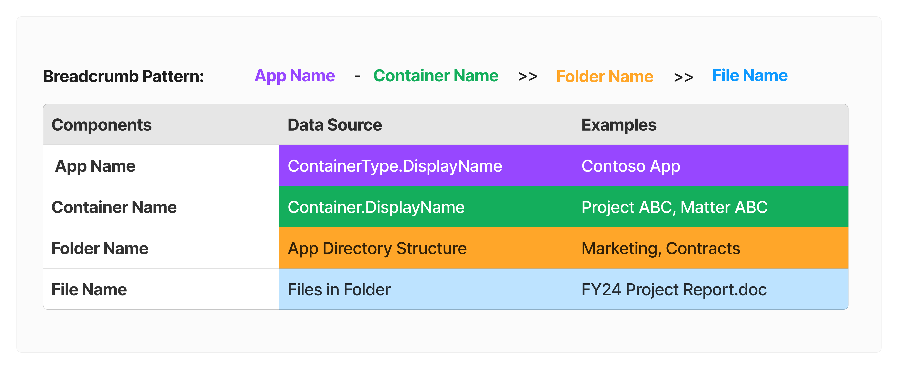
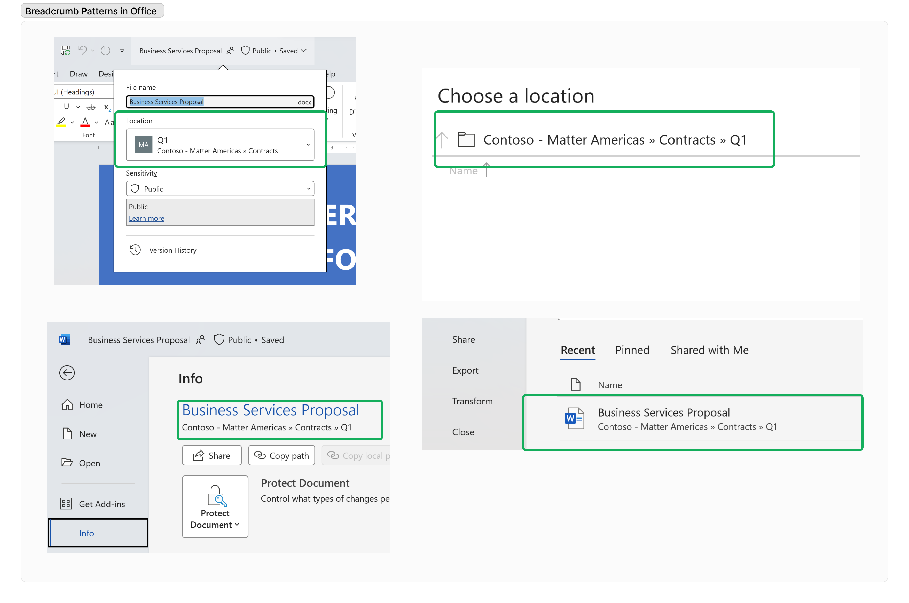

# Office file experiences for SharePoint Embedded

Office file experiences for the SharePoint Embedded platform work similarly to the Microsoft 365 platform.

## Opening Office documents from SharePoint Embedded

Office documents in SharePoint Embedded apps can be opened and edited in Office for the web or in desktop Office applications for a richer experience. AutoSave is enabled by default, automatically saving changes to Word, Excel, and PowerPoint files.

Documents stored in an archived container can’t be viewed or accessed. Applications must handle the archived state of the container by displaying an appropriate error message and guiding end users on the next steps to regain access, such as reactivating the container.

## View or restore a previous version of an Office document from SharePoint Embedded

Versioning is automatically enabled on each Word, Excel, and PowerPoint file stored in your SharePoint Embedded Apps, that helps your users to see what changes have been made in a file, compare different versions, or restore the version you want. This is incredibly important to your users if a mistake was made, a previous version is preferred, or in multi-user coauthoring scenarios when your users are collaborating with others and someone makes changes your users didn't want in a file.

## Collaborating on Office documents from SharePoint Embedded

It's simple for your users to collaborate on your SharePoint Embedded Application's Office documents – they can **Share documents** with specific peers or with people outside your organization by creating a shareable link to use wherever needed, sending an email invitation or @mention in comments to tag someone for feedback and, **Collaborate in real time** by co-authoring in Office with SharePoint Embedded Applications.

> [!NOTE]
> Mentions require target users to [have a Microsoft 365 license assigned to them](../auth.md#mention-users-in-office-documents).
>
> Mentions are restricted to people inside the consuming tenant's organization. Mentions exclude guests and users from other tenants in a multitenant setting.

### Share your documents

#### Send an email invite

Share your SharePoint Embedded documents by sending an email invitation to specific people:

- Select Share, start typing the email addresses or contact names of people you want to share with. When you begin to enter info in the box, you can also choose a contact from the list that appears.
- Include a message if you want and hit Send.

#### Create a shareable link

Creating a shareable link makes it simple to share your SharePoint Embedded document in an email, document, or IM.

- Select Share, Copy Link, and Paste the link wherever you want
- Change any permissions of the link if needed

#### Co-Author

If you want others to edit with you, you can easily share files and collaborate with trusted peers for a fresh perspective. When you need help with a presentation, you can invite trusted peers to help you get it into shape. This means that when you work on a file, they can as well. You’ll see their changes and they’ll see yours—as you make them! Use @mentions in comments to get someone's attention.

- See who else is in the document and where they're working.
- A presence indicator shows where someone is making changes. See any changes right as they're being made.
- See changes made by others and see what's happened while you were away.

#### Levels of sharing access

There are different options for sharing SharePoint Embedded Application Office Documents from:

|                                     If you want to …                                     |                                                                                                                                                                Sharing Setting to Set                                                                                                                                                                |
| ---------------------------------------------------------------------------------------- | ---------------------------------------------------------------------------------------------------------------------------------------------------------------------------------------------------------------------------------------------------------------------------------------------------------------------------------------------------- |
| Allow Anyone who receives the link access to SharePoint Embedded Application File        | **Anyone**  gives access to anyone who receives this link, whether they receive it directly from you or are forwarded from someone else. This might include people outside of your organization.                                                                                                                                                           |
| Allow anyone in your organization to access to your SharePoint Embedded Application File | **People in \<Your Organization\>**  gives anyone in your organization who has the link access to the file, whether they receive it directly from you or forwarded from someone else.                                                                                                                                                                |
| Secure your SharePoint Embedded Application docs only to specific people.                | When you need to prevent recipients from forwarding a shared link, use the **Specific People**  permission. **Specific people**  gives access only to the people you specify, although other people might already have access. If people forward the sharing invitation, only people who already have access to the item will be able to use the link. |
| Reshare the link with specific people                                                    | **People with existing access**  can be used by people who already have access to the document or folder. It doesn't change the permissions on the item. Use this if you just want to send a link to somebody who already has access.                                                                                                               |

## Breadcrumb properties on Office documents from SharePoint Embedded

Breadcrumb properties are used by Office clients to display breadcrumb-style elements within Office client UI that aid your users in associating Office files with your Application.

> [!NOTE]
> We recommend specifying 'Current Channel' to take advantage of Breadcrumb patterns and future enhancements to Office Apps. Learn more about [specifying update channels for Office Apps](/deployoffice/updates/overview-update-channels).

Breadcrumb patterns for SharePoint Embedded Application Apps are constructed from container properties configured for your Apps. The following diagram maps the container properties to breadcrumb presentation in Office clients:



Here are a few examples of SharePoint Embedded Application breadcrumb display within Office client experiences.



## Controlling where users land when opening SPE files from Microsoft 365 search

When users search for content on Microsoft 365 (for example, on Office.com or OneDrive), search results include files stored in SharePoint Embedded containers. Clicking a search result opens the file in an appropriate viewer. For file types without a built-in Microsoft viewer, the destination depends on whether your container type has a URL template configured.

The `urlTemplate` property on your container type lets you specify a URL pattern in your application that Microsoft 365 uses as the destination when a user clicks on one of your files stored in your containers in search results. Without it, users clicking non-Office, non-PDF files in search results are directed to a generic Microsoft help page rather than your application.

### How file types are handled

The destination URL for a file in search results depends on the file type, regardless of whether `urlTemplate` is set:

| File type                                            | `urlTemplate` set? | Destination when clicked in search                 |
|------------------------------------------------------|--------------------|----------------------------------------------------|
| Word, Excel, PowerPoint                              | Yes                | Opens in Office Web Apps                           |
| PDF                                                  | Yes                | Opens in the SharePoint Embedded PDF Previewer     |
| All other types                                      | Yes                | Redirected to your application via `urlTemplate`   |
| All other types                                      | No                 | Redirected to `https://aka.ms/spe-openfilelocation`|
 
### Configuring `urlTemplate`

Set `urlTemplate` on your container type using the [Update fileStorageContainerType](/graph/api/filestoragecontainertype-update) API. The value is a URL with placeholder tokens that Microsoft 365 resolves to actual item identifiers at the time a user clicks a search result.

#### URL template syntax

```
https://app.contoso.com/open?tenant={tenant-id}&drive={drive-id}&item={item-id}
```

Tokens are enclosed in curly braces and replaced with values for the specific item the user clicked. Any token that cannot be resolved is removed from the URL before the redirect occurs.

#### Supported tokens

| Token        | Value your app receives                                                                       |
|--------------|-----------------------------------------------------------------------------------------------|
| `{tenant-id}`| ID of the consuming tenant; use to make tenant-scoped Graph API calls                         |
| `{drive-id}` | Drive ID of the container; use with the Graph Files API to reference the container            |
| `{folder-id}`| ID of the item's immediate parent folder; may be absent for root-level files                  |
| `{item-id}`  | ID of the file; combine with `{drive-id}` and the Graph Files API to open or retrieve the file|


For more information on custom property tokens, see [Custom properties on fileStorageContainers](/graph/api/filestoragecontainer-post-customproperty).

#### Example

If your container type has `urlTemplate` set to:

```
https://app.contoso.com/open?t={tenant-id}&d={drive-id}&i={item-id}
```

Then when a user clicks a `.txt` file in a search result, they are redirected to something like:

```
https://app.contoso.com/open?t=72f988bf-86f1-41af-91ab-2d7cd011db47&d=b%21abc123...&i=01ABC...
```

Your application receives the tenant ID, drive ID, and item ID as query parameters and can use them to open the correct file using the Microsoft Graph Files API.

#### Setting `urlTemplate` via the Graph API

Use a PATCH request to update the container type:

```http
PATCH https://graph.microsoft.com/v1.0/storage/fileStorage/containerTypes/{containerTypeId}
Content-Type: application/json

{
  "settings": {
    "urlTemplate": "https://app.contoso.com/open?t={tenant-id}&d={drive-id}&i={item-id}"
  },
  "etag": "<etag-value>"
}
```

For the full reference, see [Update fileStorageContainerType](/graph/api/filestoragecontainertype-update).

### Fallback behavior when `urlTemplate` is not set

If `urlTemplate` is not configured on your container type, users who click on non-Office, non-PDF files in Microsoft 365 search results are redirected to `https://aka.ms/spe-openfilelocation`. This page explains that the file is stored in a third-party application and that the user should open it there directly.

If your application stores only Word, Excel, PowerPoint, and PDF files, you may not need to set `urlTemplate` at all. For applications that store any other file types, setting `urlTemplate` is strongly recommended to avoid users encountering this help page from search.

### Limitations

#### Search index updates require a re-crawl

The destination URL for each file is stored in the Microsoft 365 search index when the file is crawled. If you configure or update `urlTemplate` after files have already been indexed, existing search results continue to route to the previous destination until those files are re-crawled. Microsoft 365 performs incremental crawls automatically, but there may be a delay before all files reflect the updated URL.

#### `urlTemplate` is scoped to the container type, not individual containers

The template applies to all containers of that type across all consuming tenants. Use the `{tenant-id}` token to route users to the correct tenant context within your application.


#### `{folder-id}` reflects the item's immediate parent

For files at the root of the container, this token may not resolve and is removed from the final URL. Design your application to handle URLs where `{folder-id}` is absent.
