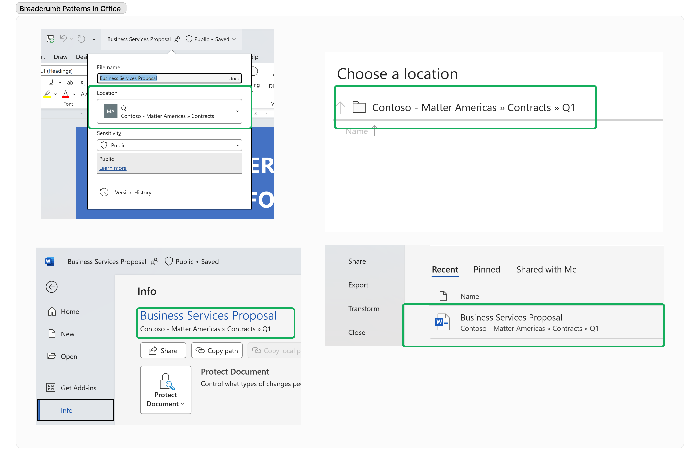

# Office file experiences for SharePoint Embedded

Office file experiences for SharePoint Embedded platform will work in a similar manner to Microsoft 365 platform.

## Opening Office documents from SharePoint Embedded

Office documents from SharePoint Embedded apps can be opened for viewing and editing in Office web, or in Office application for a richer viewing and editing experience. AutoSave feature saves your files automatically as your user's work and is enabled for each Word, Excel and PowerPoint file stored in your SharePoint Embedded Application Apps.

## View or restore a previous version of Office document from SharePoint Embedded

Versioning is automatically enabled on each Word, Excel and PowerPoint file stored in your SharePoint Embedded Apps that helps your users to see what changes have been made in a file, compare different versions, or restore the version you want. This is incredibly important to your users if a mistake was made, a previous version is preferred or in multi-user coauthoring scenarios when your users are collaborating with others and someone makes changes your users didn't want in a file.

## Collaborating on Office documents from SharePoint Embedded

It's simple for your users to collaborate on your SharePoint Embedded Application's Office documents – they can **Share documents** with specific peers or with people outside your organization by Creating a shareable link to use wherever needed, Send an email invitation or @mention in comments to tag someone for feedback and, **Collaborate in real time** by co-authoring in Office with SharePoint Embedded Applications.

### Share your documents

#### Send an email invite

Share your SharePoint Embedded documents by sending an email invitation to specific people:

- Select Share, start typing the email addresses or contact names of people you want to share with. When you begin to enter info in the box, you can also choose a contact from the list that appears.
- Include a message if you want and hit Send.

#### Create a shareable link

Creating a shareable link makes it simple to share your SharePoint Embedded document in an email, document, or IM.

- Select Share, Copy Link and Paste the link wherever you want
- Change any permissions of the link if needed

#### Co-Author

If you want others to edit with you, you can easily share files and collaborate with trusted peers for a fresh perspective. When you need help with a presentation, you can invite trusted peers to help you get it into shape. This means that when you work on a file, they can as well. You’ll see their changes and they’ll see yours—as you make them! Use @mentions in comments to get someone's attention.

- See who else is in the document and where they're working.
- A presence indicator shows where someone is making changes. See any changes right as they're being made.
- See changes made by others and see what's happened while you were away.

### Levels of sharing access

There are different options for sharing SharePoint Embedded Application Office Documents from:

|                                     If you want to …                                     |                                                                                                                                                                Sharing Setting to Set                                                                                                                                                                |
| ---------------------------------------------------------------------------------------- | ---------------------------------------------------------------------------------------------------------------------------------------------------------------------------------------------------------------------------------------------------------------------------------------------------------------------------------------------------- |
| Allow Anyone who receives the link access to SharePoint Embedded Application File        | **Anyone**  gives access to anyone who receives this link, whether they receive it directly from you or forwarded from someone else. This might include people outside of your organization.                                                                                                                                                           |
| Allow anyone in your organization to access to your SharePoint Embedded Application File | **People in \<Your Organization\>**  gives anyone in your organization who has the link access to the file, whether they receive it directly from you or forwarded from someone else.                                                                                                                                                                |
| Secure your SharePoint Embedded Application docs only to specific people.                | When you need to prevent recipients from forwarding a shared link, use the **Specific People**  permission. **Specific people**  gives access only to the people you specify, although other people might already have access. If people forward the sharing invitation, only people who already have access to the item will be able to use the link. |
| Reshare the link with specific people                                                    | **People with existing access**  can be used by people who already have access to the document or folder. It doesn't change the permissions on the item. Use this if you just want to send a link to somebody who already has access.                                                                                                               |

## Breadcrumb properties on Office documents from SharePoint Embedded

Breadcrumb properties are used by Office clients to display breadcrumb-style elements within Office client UI that aid your users in associating Office files with your Application.

> [!NOTE]
> We recommend specifying 'Current Channel' to take advantage of Breadcrumb patterns and future enhancements to Office Apps. Learn more about [specifying update channels for Office Apps](/deployoffice/updates/overview-update-channels).

Breadcrumb patterns for SharePoint Embedded Application Apps are constructed from container properties configured for your Apps. The following diagram maps the container properties to breadcrumb presentation in Office clients:

Here are few examples of SharePoint Embedded Application breadcrumb display within Office client experiences.

