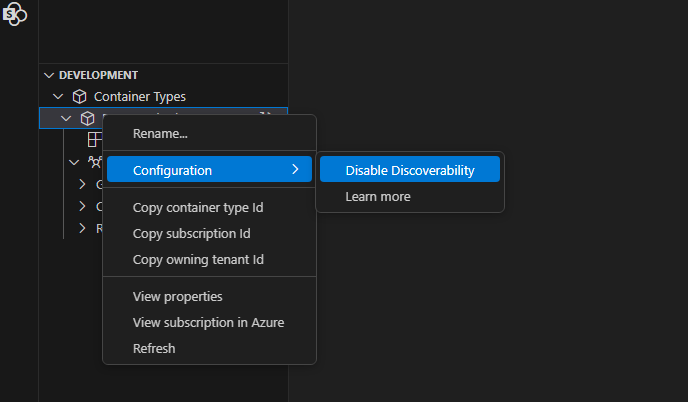
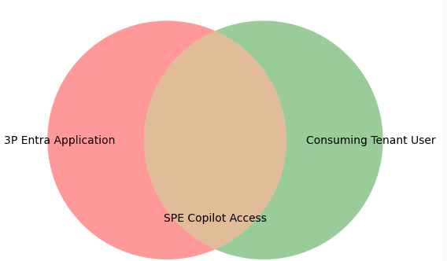
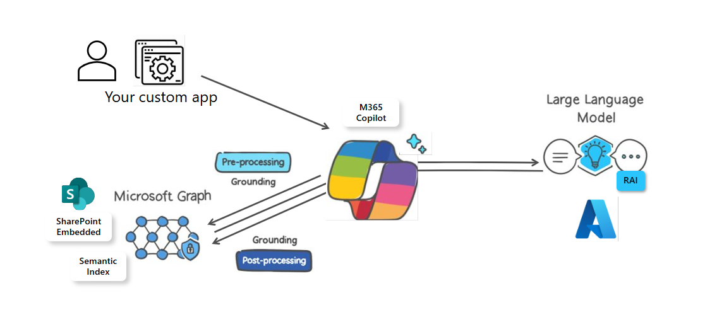
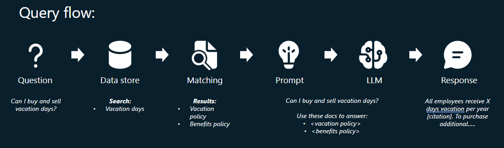

# SharePoint Embedded agent Advanced Topics Overview

This advanced guide covers how the semantic index powers Retrieval-Augmented Generation (RAG) to provide accurate, context-aware AI responses. We explore how these concepts work together to ensure your agent retrieves relevant information from your data and returns grounded answers.

## Caveats

### Configuration

#### Required Container Type Configuration

##### DiscoverabilityDisabled

The [`discoverabilityDisabled`](../../administration/developer-admin/dev-admin.md#container-type-configuration-properties) property controls whether Microsoft 365 can discover [drive items](/graph/api/resources/driveitem) within a specific container type.

If you’re updating an existing container type to set this property to `false`, allow up to **24 hours** for the configuration change to fully propagate before:

- Creating new containers,  
- Uploading files to containers, or  
- Using SPE agent to interact with folders or files.

This ensures the agent can correctly access and surface the content.

Here is an example of how to set `discoverabilityDisabled` to false with [Set-SPOContainerTypeConfiguration](/powershell/module/SharePoint-online/set-spocontainertypeconfiguration#examples)

```powershell
Set-SPOContainerTypeConfiguration -ContainerTypeId 4f0af585-8dcc-0000-223d-661eb2c604e4 -DiscoverabilityDisabled $false
```

Discoverability can also be disabled using the Visual Studio Code SharePoint Embedded extension



##### CSP Policies

The Content-Security-Policy (CSP) for embedded chat hosts ensures that only specified hosts can load the chat component. This helps in securing the application by restricting which domains can embed the chat component.

It's intended to allow consuming tenant SPE admins to set an allowlist of hosts that are permitted to embed the SPE agent in an iframe. Specifically, the value they set here is used in a Content-Security-Policy header as a frame-ancestors value.

> [!NOTE]
>
> If this configuration isn't set, the [Content-Security-Policy](https://developer.mozilla.org/docs/Web/HTTP/Headers/Content-Security-Policy) is default set to
> [frame-ancestors](https://developer.mozilla.org/docs/Web/HTTP/Headers/Content-Security-Policy/frame-ancestors): "none", which means no one can embed the agent.

Here are example commands to use the [Connect to SharePoint using PowerShell](/powershell/sharepoint/sharepoint-online/connect-sharepoint-online) commands:

- [Set-SPOApplication](/powershell/module/SharePoint-online/set-spoapplication) to set the `CopilotEmbeddedChatHosts` property.
- [Get-SPOApplication](/powershell/module/SharePoint-online/get-spoapplication) to get the `CopilotEmbeddedChatHosts` property.

```powershell
# Note this MUST be run in Windows PowerShell. It will not work in PowerShell.
Import-Module -Name "Microsoft.Online.SharePoint.PowerShell"
Connect-SPOService "https://<domain>-admin.sharepoint.com"
# Login with your admin account.
...

Set-SPOApplication -OwningApplicationId  XXXXXXXX-XXXX-XXXX-XXXX-XXXXXXXXXXXX -CopilotEmbeddedChatHosts @("http://localhost:3000", "https://contoso.sharepoint.com", "https://fabrikam.com") 

# This will set the container type configuration “CopilotEmbeddedChatHosts” accordingly. 
...

Get-SPOApplication -OwningApplicationId <OwningApplicationId> | Select-Object CopilotEmbeddedChatHosts

OwningApplicationId             : <OwningApplicationId>
OwningApplicationName           : SharePoint Embedded App
Applications                    : {<OwningApplicationId>}
SharingCapability               : ExternalUserAndGuestSharing
OverrideTenantSharingCapability : False
CopilotEmbeddedChatHosts        : {http://localhost:*}
```

#### Optional Configuration

##### Authentication and 3P Cookies

The `iframe` used by SharePoint Embedded agent authenticates users using third-party cookies. If third-party cookies are disabled in the user's browser, the iframe can't authenticate automatically. In this case, a popup prompts the user to sign in manually, ensuring that authentication can still be completed.

## Advanced Topics

### Application Scoping

Application scoping in SharePoint Embedded agent (SPE agent) involves defining the boundaries and context within which the tool operates, ensuring its features and capabilities are tailored to meet the specific needs of different applications. This process helps customize the agent's functionality, making it more effective and relevant for various use cases.

When SPE agent users query the LLM, it will only have access to files that the **User+Application** have access to. The effective permissions for the agent session will be the intersection of your SharePoint Embedded application's permissions and the user's permissions.



### Information Architecture

Files in SharePoint Embedded are naturally [semantic indexed](spe-da-adv.md#semantic-index). This semantic index underpins retrieval augmented generation [(RAG)](spe-da-adv.md#rag--retrieval-augmented-generation-) workflows by providing relevant context from your stored content at query time. In essence, it [grounds](spe-da-adv.md#grounding) the AI responses, ensuring they directly reference accurate information in your containers rather than relying on general knowledge alone.



With SharePoint Embedded agent, you can further ground the large language models (LLM) response on [specific files or drive items.](spe-da-adv.md#scoping-your-agent-to-specific-content).

### Semantic index

[Learn more about semantic index for Microsoft 365 Copilot here](/microsoftsearch/semantic-index-for-copilot)

The semantic index allows for quick and accurate searches based on data similarity. This means it can find the most relevant information not just by exact matches, but also by understanding the context and meaning.

### Retrieval-Augmented Generation (RAG)

RAG relies on having relevant source materials stored in a repository, which can be queried at runtime​, data is retrieved from the index and is used to augment the prompt sent to the large language model (LLM)​:

- Treat data sources as knowledge without having to train your model​
- Uses search (retrieval) results as additional context in your prompt​
- Generates the output using the prompt and the supplied context

The LLM uses the data to inform and construct the response.

​

### Grounding

Grounding in the context of SPE agent refers to the process of providing input sources to the large language model (LLM) related to the user's prompt. This helps improve the specificity of the prompt and ensures that the responses are relevant and actionable to the user's specific task. The data the agent is grounded on will be on the contents of the container type in the agent application. Behind the scenes SPE agent uses Microsoft 365 Copilot, [learn more about its architecture here](/copilot/microsoft-365/microsoft-365-copilot-architecture)

### Scoping your agent to specific content

SharePoint Embedded (SPE) agent has the ability to restrict the data sources it has access to, below are provided types, and this [example](https://github.com/microsoft/SharePoint-Embedded-Samples/blob/main/Samples/spe-typescript-react-azurefunction/react-client/src/providers/ChatController.ts#L15) shows how to configure the SDK

```typescript
export type IDataSourcesProps =
  | IFileDataSource
  | IFolderDataSource
  | IDocumentLibraryDataSource
  | ISiteDataSource
  | IWorkingSetDataSource
  | IMeetingDataSource;

export enum DataSourceType {
  File = 'File',
  Folder = 'Folder',
  DocumentLibrary = 'DocumentLibrary',
  Site = 'Site',
  WorkingSet = 'WorkingSet',
  Meeting = 'Meeting'
}
```

#### Supported document types for scoping

[Reference - File Formats Support By copilot](https://support.microsoft.com/topic/file-formats-supported-by-copilot-1afb9a70-2232-4753-85c2-602c422af3a8)

**Documents**: PDF, DOCX, XLSX, PPTX

**Text-based Files**: RTF, TXT, CSV, LOG, INI, CONFIG

**Audio**: WAV

**Programming Languages**: PY, JS, JSX, JAVA, PHP, CS, C, CPP, CXX, H, HPP, M, COFFEE, DART, LUA, PL, PM, RB, RS, SWIFT, GO, KT, KTS, R, SCALA, T, TS, TSX

**Shell Scripts**: BASH, SH, ZSH

**Markup and Documentation**: HTML, CSS, MD, RMD, TEX, LATEX

**Database Languages**: SQL

**Data Serialization Formats**: IPYNB, JSON, TOML, YAML, YML

##### Language/Locale

The agent `iframe` dynamically loads localization settings to ensure that the chat interface is displayed in the appropriate language. These settings are derived from SharePoint, which provides a comprehensive set of localization options.

When the agent iframe is initialized, it retrieves the current localization settings from SharePoint. These settings dictate the language and regional preferences for the chat interface, ensuring that all UI elements, messages, and interactions are presented in the user's preferred language. This seamless integration with SharePoint's localization framework allows the agent to provide a consistent an

You can have this localized by setting your language options in the SharePoint account settings: [Change your personal language and region settings - Microsoft Support](https://support.microsoft.com/en-us/office/change-your-personal-language-and-region-settings-caa1fccc-bcdb-42f3-9e5b-45957647ffd7) note, if your M365 setting is different from your Sharepoint account language settings it takes precedence, you can change your M365 language settings here: [Change your display language in Microsoft 365](https://support.microsoft.com/en-us/topic/change-your-display-language-and-time-zone-in-microsoft-365-for-business-6f238bff-5252-441e-b32b-655d5d85d15b)

An additional locale option can be passed in through the `ChatLaunchConfig` to further set the language the agent responds in:

```typescript
 const [chatConfig] = React.useState<ChatLaunchConfig>({
        header: ChatController.instance.header,
        theme: ChatController.instance.theme,
        zeroQueryPrompts: ChatController.instance.zeroQueryPrompts,
        suggestedPrompts: ChatController.instance.suggestedPrompts,
        instruction: ChatController.instance.pirateMetaPrompt,
        locale: "en",
    });
```

###### Locale Options

Here are some examples of locale options you can use:

| Locale Code  | Common Name                              |
|--------------|------------------------------------------|
| af           | Afrikaans                                |
| en-gb        | English (UK)                             |
| he           | Hebrew                                   |
| kok          | Konkani                                  |
| nn-no        | Norwegian (Nynorsk)                      |
| sr-latn-rs   | Serbian (Latin, Serbia)                  |
| am-et        | Amharic                                  |
| es           | Spanish                                  |
| hi           | Hindi                                    |
| lb-lu        | Luxembourgish                            |
| or-in        | Odia (India)                             |
| sv           | Swedish                                  |
| ar           | Arabic                                   |
| es-mx        | Spanish (Mexico)                         |
| hr           | Croatian                                 |
| lo           | Lao                                      |
| pa           | Punjabi                                  |
| ta           | Tamil                                    |
| as-in        | Assamese                                 |
| et           | Estonian                                 |
| hu           | Hungarian                                |
| lt           | Lithuanian                               |
| pl           | Polish                                   |
| te           | Telugu                                   |
| az-latn-az   | Azerbaijani (Latin, Azerbaijan)          |
| eu           | Basque                                   |
| hy           | Armenian                                 |
| lv           | Latvian                                  |
| pt-br        | Portuguese (Brazil)                      |
| th           | Thai                                     |
| bg           | Bulgarian                                |
| fa           | Persian                                  |
| id           | Indonesian                               |
| mi-nz        | Maori (New Zealand)                      |
| pt-pt        | Portuguese (Portugal)                    |
| tr           | Turkish                                  |
| bs-latn-ba   | Bosnian (Latin, Bosnia and Herzegovina)  |
| fi           | Finnish                                  |
| is           | Icelandic                                |
| mk           | Macedonian                               |
| quz-pe       | Quechua (Peru)                           |
| tt           | Tatar                                    |
| ca-es-valencia | Catalan (Valencian)                    |
| fil-ph       | Filipino (Philippines)                   |
| it           | Italian                                  |
| ml           | Malayalam                                |
| ro           | Romanian                                 |
| ug           | Uyghur                                   |
| ca           | Catalan                                  |
| fr-ca        | French (Canada)                          |
| ja           | Japanese                                 |
| mr           | Marathi                                  |
| ru           | Russian                                  |
| uk           | Ukrainian                                |
| cs           | Czech                                    |
| fr           | French                                   |
| ka           | Georgian                                 |
| ms           | Malay                                    |
| sk           | Slovak                                   |
| ur           | Urdu                                     |
| cy-gb        | Welsh (UK)                               |
| ga-ie        | Irish (Ireland)                          |
| kk           | Kazakh                                   |
| mt-mt        | Maltese (Malta)                          |
| sl           | Slovenian                                |
| uz-latn-uz   | Uzbek (Latin, Uzbekistan)                |
| da           | Danish                                   |
| gd           | Scottish Gaelic                          |
| km-kh        | Khmer (Cambodia)                         |
| nb-no        | Norwegian (Bokmål)                       |
| sq           | Albanian                                 |
| vi           | Vietnamese                               |
| de           | German                                   |
| gl           | Galician                                 |
| kn           | Kannada                                  |
| ne-np        | Nepali (Nepal)                           |
| sr-cyrl-ba   | Serbian (Cyrillic, Bosnia and Herzegovina)|
| zh-cn        | Chinese (Simplified)                     |
| el           | Greek                                    |
| gu           | Gujarati                                 |
| ko           | Korean                                   |
| nl           | Dutch                                    |
| sr-cyrl-rs   | Serbian (Cyrillic, Serbia)               |
| zh-tw        | Chinese (Traditional)                    |
