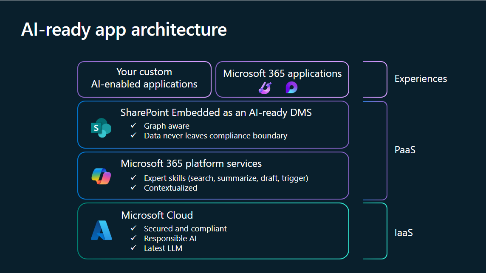
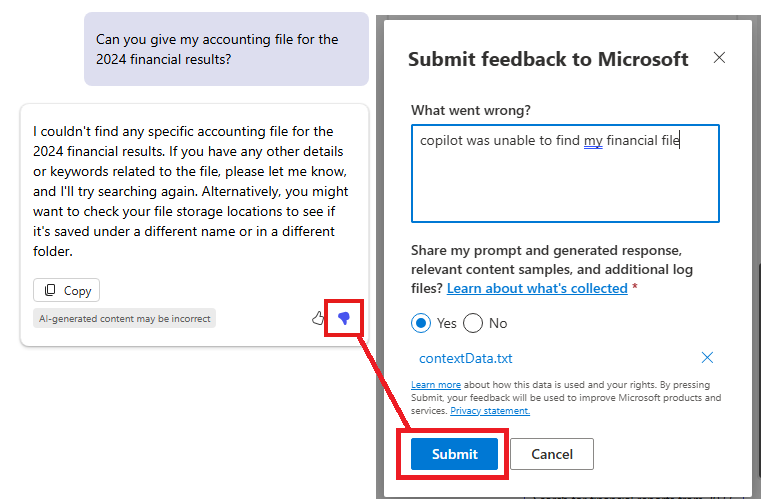

# Overview

> [!NOTE]
>
> SharePoint Embedded copilot is currently in private preview. Stay tuned for latest API and SDK changes on this page.
>
> SPE copilot consumption-based model will be available starting May 2025! Starting May 1st, standard billing model will be available to all private preview customers, and this roll out is expected to complete by May 15th. This means that starting May 15th, to use SPE copilot within an SPE application, you will need to use standard Container Type and the copilot interactions, including those from Copilot license users, will be billed to the Azure subscription associated with your Container Type. Learn more about [SharePoint Embedded billing management](/sharepoint/dev/embedded/administration/billing/billingmanagement).
>
> We are actively working on enabling Direct-to-Customer billing model for SPE copilot. Stay tuned for more announcements.

SharePoint Embedded copilot enables you to build Microsoft 365 Copilot functionality into your application through a simple SDK. This copilot chat control offers the following features:

- Reason over documents in SharePoint Embedded containers using RAG.
- Developers can configure the application code to limit the search scope to files, folders, and containers.
- Developers can customize and configure chat control including starter prompts, suggested prompts, colors and more.

Watch this demo to learn more about how to configure this functionality.

> [!VIDEO https://www.youtube.com/embed/30i7q09EtQo?si=MwLtbrGKnzv7a6My]

## Why use SharePoint Embedded copilot

SharePoint Embedded copilot harness a semantic index to power Retrieval-Augmented Generation (RAG), securely referencing your data within the Microsoft 365 boundary at query time. This ensures accurate, grounded AI responses while reducing reliance on broad knowledge models. A pay-as-you-go billing model is on the horizon, aligning costs with actual usage.

## How to use SharePoint Embedded copilot

### How to build your copilot

Currently, you can use the React SDK library written in TypeScript to build your application. Plans to support additional frameworks and environments will be announced. The SDK is configured with the containerId instance of your containerType, as well as the authorization and authentication token logic you provide through a callback. It will embed itself as an iFrame into your host application. By default, the iFrame is given a `frame-ancestors` property that prevents it from being embedded by any host until configured. Details are provided below.

#### SPE TypeScript React Application

Follow the [quick start guide](../tutorials/spe-da-vscode.md) to get started with a prebuilt sample application.

### API Documentation

The SharePoint Embedded React TypeScript NPM Package, available at [here](https://github.com/microsoft/SharePoint-Embedded-Samples/tree/feature/copilot-react-sdk/sharepointembedded-chatembedded-react/docs/index.md), provides the SDK for integrating SharePoint Embedded copilot into your client applications.

## Frequently Asked Questions

### Is consumption-based billing available for SPE copilot?

Currently you need a Microsoft 365 Copilot license enabled for your user to use SharePoint Embedded copilot. When consumption-based billing is enabled, you will no longer require a license, however, you will be required to use a Standard Container type.

***Trial Container Types expire after 30 days, for this reason we recommend starting off with Standard Container types. Currently there is no upgrade path from Trial to Standard container types.***

### Should I use a standard or trial container type?

Once consumption-based billing is enabled, we will be disabling the use of this feature with Trial Container types and it will only be enabled on Standard container types going forward. Please follow this [guide](../../getting-started/containertypes.md) to get started on creating your Standard Container type.

## SharePoint Embedded copilot  Support

### Chat Control Feedback Dialog

If you encounter any issues with the chat control, please use the thumbs up and down feedback buttons to report the problem. This method is preferred for sending feedback because it provides us with telemetry data that helps us diagnose and troubleshoot the issue more effectively.

When you click the thumbs down button, a feedback dialog will appear. Please include any relevant information in this dialog.

## Advanced Topics Overview

The [advanced topics](spe-da-adv.md) delve into how SharePoint Embedded copilot use a semantic index to facilitate Retrieval-Augmented Generation (RAG), ensuring responses are accurately grounded in your stored content. You’ll also learn how to scope your copilot to specific data sources, set up various file formats, and configure locale options to tailor the copilot experience. By exploring concepts like grounding, semantic indexing, and RAG workflows, you can optimize your copilot’s effectiveness and maintain security within the Microsoft 365 boundary.
