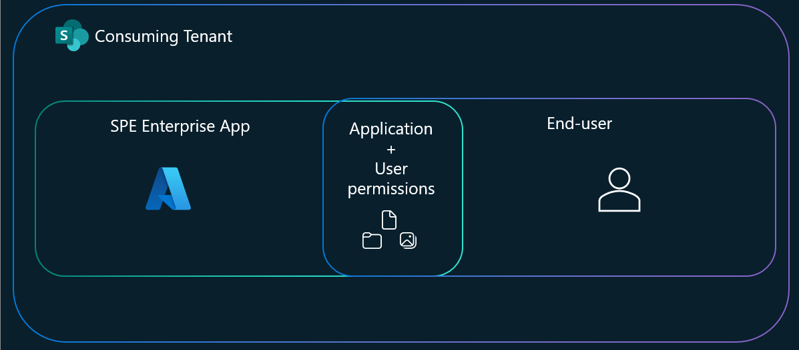

# Overview

> [!NOTE]
>
> SharePoint Embedded copilots is currently in private preview, the API surface and SDK are expected to change frequently.

SharePoint Embedded copilots is a powerful tool designed to enhance the functionality of SharePoint Embedded applications by integrating advanced Microsoft 365 features (Purview, Protection, etc.)


## Billing/Licensing

Currently, to use SPE copilot , the consuming tenant user of the application is required to have an [Microsfot 365 Copilot license](/copilot/microsoft-365/microsoft-365-copilot-licensing). In the future, the license-based model will be replaced with a consumption-based model. The usage of SPE copilots will be charged on a pay-as-you-go basis to your SharePoint Embedded application (that is, to the owning tenant). Stay tuned for billing model announcements during the preview period.

## Why use SharePoint Embedded copilots

SharePoint Embedded copilots harness a semantic index to power Retrieval-Augmented Generation (RAG), securely referencing your data within the Microsoft 365 boundary at query time. This ensures accurate, grounded AI responses while reducing reliance on broad knowledge models. A pay-as-you-go billing model is on the horizon, aligning costs with actual usage.


### Application Scoping

Application scoping in SharePoint Embedded copilots (SPE copilot) involves defining the boundaries and context within which the tool operates, ensuring its features and capabilities are tailored to meet the specific needs of different applications. This process helps customize the copilot's functionality, making it more effective and relevant for various use cases.

When SPE copilot users query the LLM, it will only have access to files that the `User+Application` have access to. The effective permissions for the copilot session will be the intersection of your SharePoint Embedded application's permissions and the user's permissions.



### Information Architecture

Files in SharePoint Embedded are naturally [semantic indexed](spe-da-adv.md#semantic-index). This semantic index underpins retrieval augmented generation [(RAG)](spe-da-adv.md#rag--retrieval-augmented-generation-) workflows by providing relevant context from your stored content at query time. In essence, it [grounds](spe-da-adv.md#grounding) the AI responses, ensuring they directly reference accurate information in your containers rather than relying on general knowledge alone.


With SharPoint Embedded copilots , you can further ground the LLMs reponses on [specific files or drive items.](spe-da-adv.md#scoping-your-copilot-to-specific-content).

### Microsoft 365 Boundary

Data is kept secure: data never leaves the tenant boundary and storage respects data residency settings​.

Each container instance of a container type in the SPE partition is its own security and compliance boundary.


## How to use SharePoint Embedded copilots

### How to build your copilot

Currently, we offer a way to incorporate this feature into your custom application is through our React SDK library written in TypeScript. Plans to support additional frameworks and environments will be announced. The SDK is configured with the containerId instance of your containerType, as well as the authorization and authentication token logic you provide through a callback. It will embed itself as an iFrame into your host application. By default, the iFrame is given a `frame-ancestors` property that prevents it from being embedded by any host until configured. Details are provided below.

#### SPE TypeScript React Application

Follow the [quick start guide](../tutorials/spe-da-vscode.md) to get started with a prebuilt sample application.

### API Documentation

The SharePoint Embedded React TypeScript NPM Package, available at [here](https://github.com/microsoft/SharePoint-Embedded-Samples/tree/feature/copilot-react-sdk/sharepointembedded-chatembedded-react/docs), provides the SDK for integrating SharePoint Embedded copilots into your client applications.

## Frequently Asked Questions

### Is consumption-based billing available for SPE copilot?

Currently you need a M365 Copilot license enabled for your user to use SharePoint Embedded copilots . When consumption-based billing is enabled you will no longer require a license however, you will be required to use a Standard Container type.

***Trial Container Types expire after 30 days, for this reason we recommend starting off with Standard Container types. Currently there is no upgrade path from Trial to Standard container types.***

### Should I use a standard or trial container type?

Once consumption-based billing is enabled, we will be disabling using this feature with Trial Container types and it will only be enabled on Standard container types going forward. Please follow this [guide](../../getting-started/containertypes.md) to get started on creating your Standard Container type.

## SharePoint Embedded copilot  Support

### Chat Control Feedback Dialog

If you encounter any issues with the chat control, please use the thumbs up and down feedback buttons to report the problem. This method is preferred for sending feedback because it provides us with telemetry data that helps us diagnose and troubleshoot the issue more effectively.

When you click the thumbs down button, a feedback dialog will appear. Please include any relevant information in this dialog.


## Caveats

### Configuration

#### Required ContainerType Configuration

##### DiscoverabilityDisabled

This [flag](../../administration/developer-admin/dev-admin.md#container-type-configuration-properties) prevents copilot from discovering [drive items](/graph/api/resources/driveitem) in the specified container type. If you have an existing container type and are setting this value to false, please wait 24 hours to ensure the container type configuration is fully propagated before creating a new container, uploading files there, and trying out copilot on folders/files of that new container.

Here is an example of setting the flag to false with [Set-SPOContainerTypeConfiguration](/powershell/module/SharePoint-online/set-spocontainertypeconfiguration#examples)

```powershell
Set-SPOContainerTypeConfiguration -ContainerTypeId 4f0af585-8dcc-0000-223d-661eb2c604e4 -DiscoverabilityDisabled $false
```

Discoverability can also be disabled using the Visual Studio Code SharePoint Embedded extension


##### CSP Policies

 The Content-Security-Policy (CSP) for embedded chat hosts, ensures that only specified hosts can load the chat component. This helps in securing the application by restricting which domains can embed the chat component.

 It is intended to allow consuming tenant SPE admins to set an allowlist of hosts that they will allow to embed the SPE copilot in an iFrame. Specifically, the value they set here will be used in a Content-Security-Policy header as a frame-ancestors value.

> [!NOTE]
>
> If this configuration is not set, the [Content-Security-Policy](https://developer.mozilla.org/docs/Web/HTTP/Headers/Content-Security-Policy) will default be set to
> [frame-ancestors](https://developer.mozilla.org/docs/Web/HTTP/Headers/Content-Security-Policy/frame-ancestors): ‘none’ which means no one can embed the copilot.

Below are example commands to use the [Connect to SharePoint Online using PowerShell](/powershell/sharepoint/sharepoint-online/connect-sharepoint-online) commands:

- [Set-SPOApplication](/powershell/module/SharePoint-online/set-spoapplication) to set the `CopilotEmbeddedChatHosts` property.
- [Get-SPOApplication](/powershell/module/SharePoint-online/get-spoapplication) to get the `CopilotEmbeddedChatHosts` property.

```powershell
# Note this MUST be run in Windows PowerShell. It will not work in PowerShell.
Import-Module -Name "Microsoft.Online.SharePoint.PowerShell"
Connect-SPOService "https://<domain>-admin.sharepoint.com"
# Login with your admin account.
...

Set-SPOApplication -OwningApplicationId 423poi45 -CopilotEmbeddedChatHosts "http://localhost:3000 https://contoso.sharepoint.com https://fabrikam.com" 

# This will set the container type configuration “CopilotEmbeddedChatHosts” accordingly. 
...

Get-SPOApplication -OwningApplicationId <OwningApplicationId> | Select-Object CopilotEmbeddedChatHosts

OwningApplicationId             : <OwningApplicationId>
OwningApplicationName           : SharePoint Embedded App
Applications                    : {<OwningApplicationId>}
SharingCapability               : ExternalUserAndGuestSharing
OverrideTenantSharingCapability : False
CopilotEmbeddedChatHosts        : {http://localhost:*}

```

#### Optional Configuration

##### Authentication and 3P Cookies

The iFrame used by SharePoint Embedded copilots attempts to authenticate using third-party cookies. If third-party cookies are disabled in the user's browser, the iFrame will not be able to authenticate automatically. In such cases, a popup will be displayed prompting the end user to log in manually. This ensures that the authentication process can still be completed even when third-party cookies are not available.

## Advanced Topics Overview

The [advanced topics](spe-da-adv.md) delve into how SharePoint Embedded copilots use a semantic index to facilitate Retrieval-Augmented Generation (RAG), ensuring responses are accurately grounded in your stored content. You’ll also learn how to scope your copilot to specific data sources, set up various file formats, and configure locale options to tailor the copilot experience. By exploring concepts like grounding, semantic indexing, and RAG workflows, you can optimize your copilot’s effectiveness and maintain security within the Microsoft 365 boundary.
