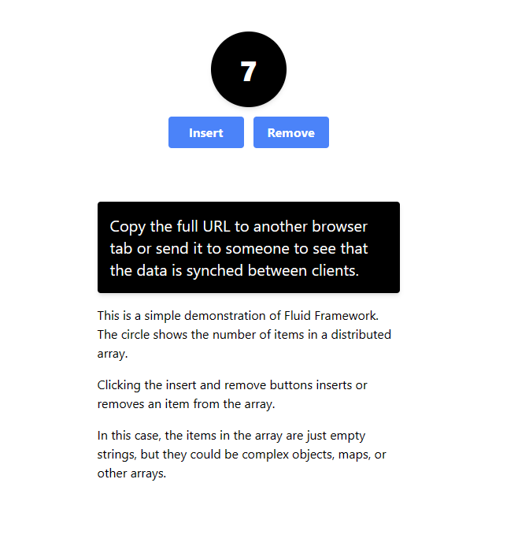

# Fluid Framework in SharePoint Embedded Applications

Integrate Fluid Framework and [SharePoint Embedded](../overview.md) to seamlessly and efficiently incorporate document collaboration into your applications.

## Background

[Fluid Framework](https://fluidframework.com/) is a collection of client libraries for distributing, synchronizing, and saving shared data. These libraries allow multiple clients to simultaneously create and operate on shared data structures in real-time. Fluid Framework allows developers to use the same practices with shared data as with local data--for example, a Fluid object works in the same way as a local TypeScript object.

## Quickstart

Start [building](https://github.com/microsoft/FluidExamples/) in the Fluid [Sample Apps Directory](https://github.com/microsoft/FluidExamples/tree/main/item-counter-spe). You need to [create](#get-started-with-sharepoint-embedded) a SharePoint Embedded application first.

### Get started with SharePoint Embedded

Try SharePoint Embedded for free by creating a container type for [trial purposes](./app-concepts/containertypes.md).

1. Set up a free trial [Microsoft 365 tenant](https://www.microsoft.com/microsoft-365/enterprise/microsoft365-plans-and-pricing). Alternatively, you can use an existing tenant if you have admin credentials.
1. Sign into the [SharePoint Embedded Visual Studio Code Extension](.././getting-started/spembedded-for-vscode.md) and follow the steps to create an application and container type for trial purposes.

## Prerequisites

To get started building with Fluid Framework, you need:

1. **Admin Credentials**: You need administrative credentials for a [Microsoft 365](https://www.microsoft.com/microsoft-365/enterprise/microsoft365-plans-and-pricing) tenant.
1. **SharePoint Embedded Application**: Ensure that you register your application in [Microsoft Entra ID](https://entra.microsoft.com/). If you don't have a SharePoint Embedded application, refer to the [earlier section](#get-started-with-sharepoint-embedded).
1. **Application (Client) ID**: Obtain the `ClientID` for your SharePoint Embedded Application.
1. **Container Type Information**:
   - Identify the `ContainerTypeId` associated with your app’s container type.
1. **Containers**:
   - Make sure you have *at least* one container created of the same container type linked to your SharePoint Embedded Application.

## Get started with Fluid

### Access App information

You need the `ClientID` from your application and the `ContainerTypeId` associated with the containers created on that application.

The `ClientID` is essential for acquiring the correct access tokens when working with Fluid Framework and documents. The `ContainerTypeId` is necessary for accessing containers associated with your SharePoint Embedded application.

If you used the [Visual Studio Code Extension](../getting-started/spembedded-for-vscode.md), you can [export](/sharepoint/dev/embedded/getting-started/spembedded-for-vscode#export-postman-environment) your Postman Environment to easily view your both your `ContainerTypeId` and `ClientID`.

Otherwise, you can access your `ContainerTypeId` by using the [`Get-SPOContainerType`](/sharepoint/dev/embedded/concepts/admin-exp/dev-admin#viewing-of-container-types) PowerShell cmdlet. Your `ClientID` is available in [Microsoft Entra ID](https://entra.microsoft.com/) by navigating to **Identity** > **App Registrations** > **Applications** > **All applications** to view your application overview.

## Run Fluid Sample App: Item Counter

Now you can test out and start building with the [Fluid Sample App](https://github.com/microsoft/FluidExamples/tree/main/item-counter-spe) Item Counter.

**Steps:**

1. Gather your `ClientID` and `ContainerTypeId` of your SharePoint Embedded Application and tenant admin credentials
1. Change to the directory where you'd like to clone the [Fluid Examples repo](https://github.com/microsoft/FluidExamples)
1. Clone the repository by executing the command: `git clone https://github.com/microsoft/FluidExamples.git`
1. Navigate to the **Item Counter** directory `cd .\FluidExamples\item-counter-spe\`
1. Create an empty **.env** file and input your `ClientID` and `ContainerTypeId` with no spaces like so:

    ```text
    SPE_CLIENT_ID=YOUR_CLIENTID

    SPE_CONTAINER_TYPE_ID=YOUR_CONTAINERTYPE_ID
    ```

1. `npm install`
1. `npm run dev`
1. Once Webpack is completed, go to `https://localhost:8080`
1. Sign in with the Admin credentials for your tenant
1. Grant admin consent for your app in the pop-up window
1. Copy the full URL to another browser tab or send it to someone who has credentials to the same tenant. These can be user credentials as long as they are on the same tenant. The live changes to the Item Counter on both browsers show that the data is synced between clients.
1. Congrats on getting your first Fluid App to run! More details can be found in the Item Counter [README](https://github.com/microsoft/FluidExamples/tree/main/item-counter-spe).

    
