# Tutorial for getting started with SharePoint Embedded agent

## Prerequisites

> [!NOTE]
>
> 1. You will need to create a SharePoint Embedded application. If you don't have one, you can easily build a sample application using the instructions [here](#getting-started-using-the-sharepoint-embedded-visual-studio-code-extension).
> 1. You must specify a standard container type at creation time. Depending on the purpose, you may or may not need to provide your Azure Subscription ID. A container type set for trial purposes can't be converted for production, or vice versa.
> 1. You must use the latest version of SharePoint PowerShell to configure a container type. For permissions and the most current information about Windows PowerShell for SharePoint Embedded, see the documentation at [Intro to SharePoint Embedded Management Shell](/powershell/SharePoint/SharePoint-online/introduction-SharePoint-online-management-shell).
>
> - Set the **CopilotChatEmbeddedHosts** property of your container type configuration to `http://localhost:8080` to be able to work through the quick start below, refer to [the CSP section above for more information](../declarative-agent/spe-da-adv.md#csp-policies)
> - Set the **DiscoverabilityDisabled** property of your container type configuration to `false` so that the agent can find the files in your created container. Refer to the [Discoverability Disabled section above for more information](../declarative-agent/spe-da-adv.md#discoverabilitydisabled).
> - Ensure that Copilot for Microsoft 365 is available for your organization. You have two ways to get a developer environment for Copilot:
>   - A sandbox Microsoft 365 tenant with M365 Copilot (available in limited preview through [TAP membership](https://developer.microsoft.com/microsoft-365/tap)).
>     - An [eligible Microsoft 365 or Office 365 production environment](/microsoft-365-copilot/extensibility/prerequisites#customers-with-existing-microsoft-365-and-copilot-licenses) with a M365 Copilot license.

## Getting started using the SharePoint Embedded SDK

### 1. Install the SDK into your React repo

```console
# Install the SDK with npm

npm install "https://download.microsoft.com/download/970802a5-2a7e-44ed-b17d-ad7dc99be312/microsoft-sharepointembedded-copilotchat-react-1.0.9.tgz"
```

#### If you want to verify checksums

In MacOS/Linux

```console
version="1.0.9";

url="https://download.microsoft.com/download/970802a5-2a7e-44ed-b17d-ad7dc99be312/microsoft-sharepointembedded-copilotchat-react-1.0.9.tgz"; 

expected_checksum="3bdf19830ffc098b253cc809f969f50fba236ad95fe85123e7b15c7cf58ecf6b"; 

package_path="microsoft-sharepointembedded-copilotchat-react-$version.tgz"; 

curl -o $package_path $url && [ "$(sha256sum $package_path | awk '{ print $1 }')" == "$expected_checksum" ] && npm install $package_path || { echo "Checksum does not match. Aborting installation."; rm $package_path; }
```

In Windows:

```powershell
$version = "1.0.9"
$url = "https://download.microsoft.com/download/970802a5-2a7e-44ed-b17d-ad7dc99be312/microsoft-sharepointembedded-copilotchat-react-1.0.9.tgz"
$expected_checksum = "3BDF19830FFC098B253CC809F969F50FBA236AD95FE85123E7B15C7CF58ECF6B"
$package_path = "microsoft-sharepointembedded-copilotchat-react-$version.tgz"

Invoke-WebRequest -Uri $url -OutFile $package_path

$calculated_checksum = Get-FileHash -Path $package_path -Algorithm SHA256 | Select-Object -ExpandProperty Hash

if ($calculated_checksum -eq $expected_checksum) {
    Write-Output "Checksum matches. Installing the package..."
    npm install $package_path
} else {
    Write-Output "Checksum does not match. Aborting installation."
}
Remove-Item $package_path
```

### 2. Create an `authProvider` object

This is an object that matches this interface:

```typescript
export interface IChatEmbeddedApiAuthProvider {
    // The hostname for your tenant. Example: https://m365x10735106.sharepoint.com
    hostname: string;
    // This function will be called when an SPO token is required
    // Scope needed: ${hostname}/Container.Selected
    getToken(): Promise<string>;
}
```

Example usage in app:

```typescript
// In your app:
import { IChatEmbeddedApiAuthProvider } from '@microsoft/sharepointembedded-copilotchat-react';

const authProvider: IChatEmbeddedApiAuthProvider = {
    hostname: 'https://m365x10735106.sharepoint.com',
    getToken: requestSPOAccessToken,
};
```

Example implementation of `getToken` (you need to customize it):

```typescript
//
async function requestSPOAccessToken() {
  // Use your app's actual msalConfig
  const msalConfig = {
    auth: {
      clientId: "{Your Entra client ID}", // this can likely point to process.env.REACT_APP_CLIENT_ID if you have set it in your .env file
    },
    cache: {
              // https://github.com/AzureAD/microsoft-authentication-library-for-js/blob/dev/lib/msal-browser/docs/caching.md
              /*
              Cache Location | Cleared on | Shared between windows/tabs | Redirect flow supported
              -----------------   ----------  -------------------------   ------------------------
              sessionStorage | window/tab close | No | Yes
              localStorage | browser close | Yes |   Yes
              memoryStorage | page |  refresh/navigation | No | No
              */
      cacheLocation: 'localStorage',
      storeAuthStateInCookie: false,
    },
  };

  const containerScopes = {
    scopes: [`${authProvider.hostname}/Container.Selected`],
    redirectUri: '/'
  };

  const pca = new msal.PublicClientApplication(msalConfig);
  let containerTokenResponse;

  // Consent FileStorageContainer.Selected scope
  try {
    // attempt silent acquisition first
    containerTokenResponse = await pca.acquireTokenSilent(containerScopes);
    return containerTokenResponse.accessToken;
  } catch (error) {
    if (error instanceof InteractionRequiredAuthError) {
      // fallback to interaction when silent call fails
      containerTokenResponse = await pca.acquireTokenPopup(containerScopes);
      return containerTokenResponse.accessToken;
    }
    else {
      console.log(error);
    }
  }
}
```

### 3. Create a React state to store your `chatApi` in

```typescript
const [chatApi, setChatApi] = React.useState<ChatEmbeddedAPI|null>(null);
```

Example:

```typescript
import React from 'react';
import { ChatEmbedded, ChatEmbeddedAPI, IChatEmbeddedApiAuthProvider } from '@microsoft/sharepointembedded-copilotchat-react';

//...
async function requestSPOAccessToken() {
  //...
}

const authProvider: IChatEmbeddedApiAuthProvider = {
  hostname: 'https://m365x10735106.sharepoint.com',
  getToken: requestSPOAccessToken,
};

function App() {
  const [chatApi, setChatApi] = React.useState<ChatEmbeddedAPI|null>(null);

  return (
    //...
  );
}
```

### 4. Add the `ChatEmbedded` component into your react app

```typescript
import React from 'react';
import { ChatEmbedded, ChatEmbeddedAPI, IChatEmbeddedApiAuthProvider } from '@microsoft/sharepointembedded-copilotchat-react';

//...
async function requestSPOAccessToken() {
  //...
}

const authProvider: IChatEmbeddedApiAuthProvider = {
  hostname: 'https://m365x10735106.sharepoint.com',
  getToken: requestSPOAccessToken,
};

function App() {
  const [chatApi, setChatApi] = React.useState<ChatEmbeddedAPI|null>(null);

  return (
    //...
    <ChatEmbedded
      onApiReady={setChatApi}
      authProvider={authProvider}
      containerId={container.id}
      style={{ width: 'calc(100% - 4px)', height: 'calc(100vh - 8px)' }}
    />
    //...
  );
}
```

### 5. Use the `chatApi` object in your state to open the chat and run it

In the example above, call it this way to open the chat.

```typescript
await chatApi.openChat();
```

You may choose to pass in launch configurations

```typescript
import { IconName, IconStyle } from './sdk/types';

//...
const zeroQueryPrompts = {
  headerText: "This is my Starter Prompt",
  promptSuggestionList: [{
    suggestionText: 'Hello',
    iconRegular: { name: IconName.ChatBubblesQuestion, style: IconStyle.Regular },
    iconHover: { name: IconName.ChatBubblesQuestion, style: IconStyle.Filled },
  }]
};

const launchConfig: ChatLaunchConfig = {
  header: 'My Awesome Chat',
  zeroQueryPrompts,
  suggestedPrompts: ["What are my files?",],
  instruction: "Response must be in the tone of a pirate",
  locale: "en",
};

await chatApi.openChat(launchConfig);
```

Full example:

```typescript
import React from 'react';
import { ChatEmbedded, ChatEmbeddedAPI, IChatEmbeddedApiAuthProvider } from '@microsoft/sharepointembedded-copilotchat-react';

//...
async function requestSPOAccessToken() {
  //...
}

const authProvider: IChatEmbeddedApiAuthProvider = {
  hostname: 'https://m365x10735106.sharepoint.com',
  getToken: requestSPOAccessToken,
};

function App() {
  const [chatApi, setChatApi] = React.useState<ChatEmbeddedAPI|null>(null);

  React.useEffect(() => {
    const openChat = async () => {
      if (!chatApi) {
        return;
      }

      await chatApi.openChat();
    };

    openChat();
  }, [chatApi]);


  return (
    //...
    <ChatEmbedded
      onApiReady={(api) => setChatApi(api)}
      authProvider={authProvider}
      containerId={container.id}
      style={{ width: 'calc(100% - 4px)', height: 'calc(100vh - 8px)' }}
    />
    //...
  );
}
```

### 6. Your AI chat should be loaded successfully

## Getting started using the SharePoint Embedded Visual Studio Code Extension

### Quick Start

> [!NOTE]
> When using standard container types with the VS Code extension, [DisableDiscoverability](../declarative-agent/spe-da-adv.md#discoverabilitydisabled) and [Grant admin consent](/entra/identity/enterprise-apps/grant-admin-consent?pivots=portal) features are currently not supported. This will need to be done using the [SPO Admin Powershell](/powershell/sharepoint/sharepoint-online/connect-sharepoint-online).

1. Follow this guide up to the [Load Sample App section](../../getting-started/spembedded-for-vscode.md#load-sample-app) with the Visual Studio Code Extension
1. Within the extension, right click on the owning application, and select `Run sample apps -> Typescript + React + Azure Functions`

    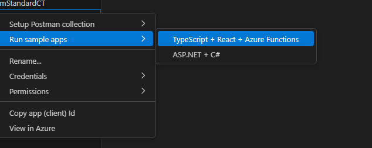

1. Allow for the extension to copy and create client secrets

    > [!CAUTION]
    > Caution for production environments, storing secrets in plain text poses a security risk.

    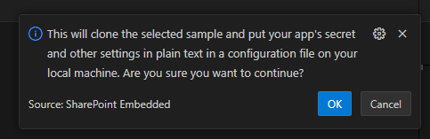

    If the application does not already have a client secret, the extension will ask to create one for you.

    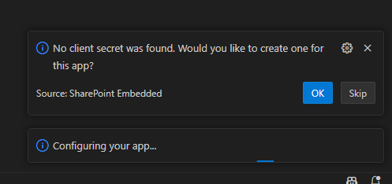
  
1. Select a folder to host the application, this will clone the following [repository for SharePoint Embedded Samples](https://github.com/microsoft/SharePoint-Embedded-Samples/tree/main/Samples/spe-typescript-react-azurefunction) into the folder

    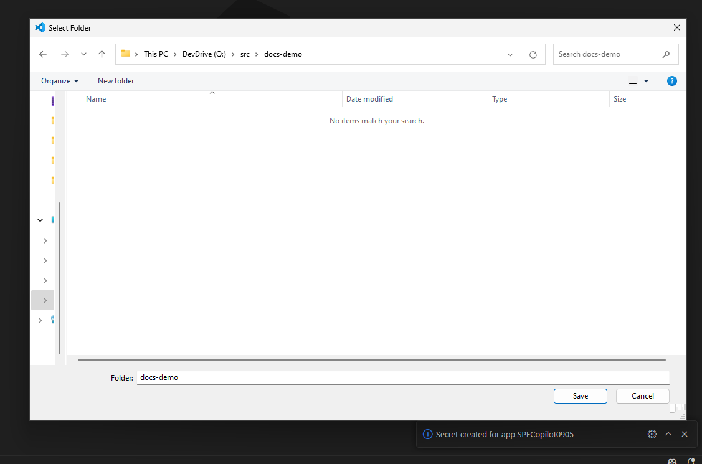

    Next, when prompted, open the folder

    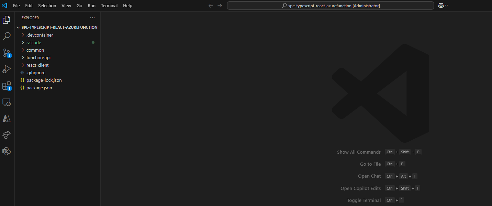

1. Navigate to `react-client\src\components\ChatSideBar.tsx` and uncomment this section

    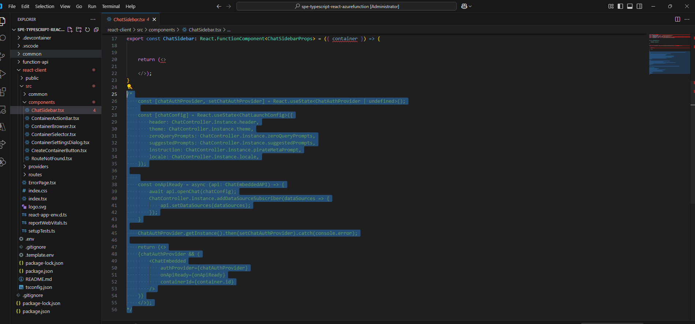

1. Navigate to `react-client\src\routes\App.tsx` and set the React state of the `showSidebar` variable to `true`

    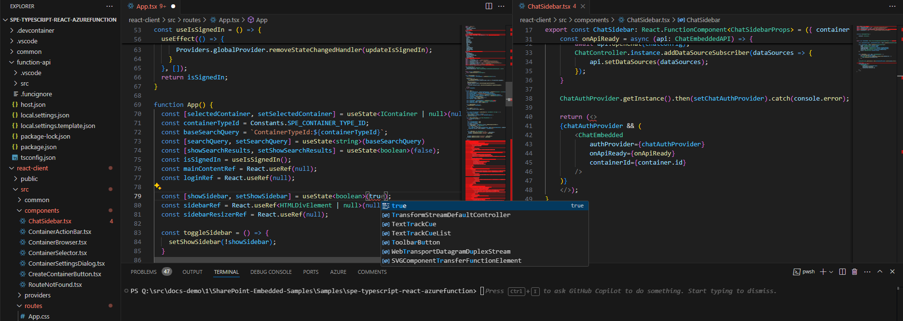

1. You can follow the instructions of the `README.md` file in the root of the project for further npm commands. Run `npm run start` in the root of the project to start your application with the SPE agent functionality enabled.

    > [!NOTE]
    > `npm run start` Should be done in the root folder of the sample project. `\SharePoint-Embedded-Samples\Samples\spe-typescript-react-azurefunction`

    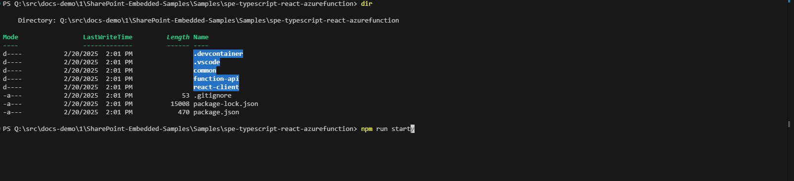

1. Sign in with a user who has a Microsoft 365 Copilot license enabled.

    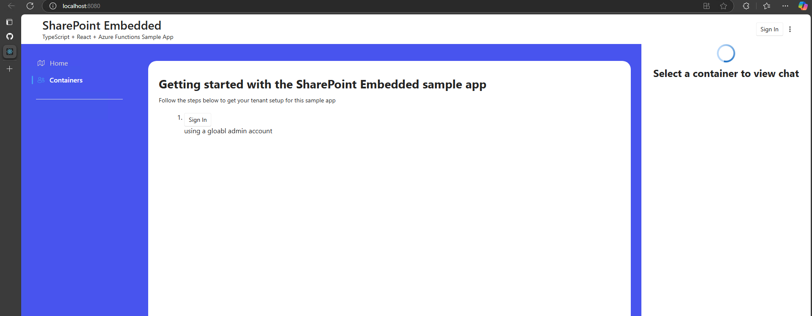

1. Navigate to the `containers` page, create one if you do not have any yet

    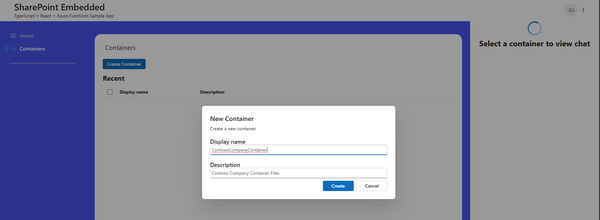

    After it has been created, you will see it here:

    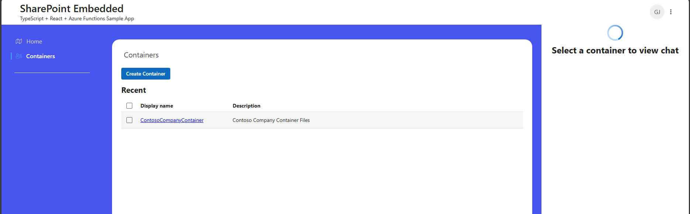

1. Click the container and upload your files. Once a container has been created and you have navigated inside it, your agent chat experience will become enabled.

    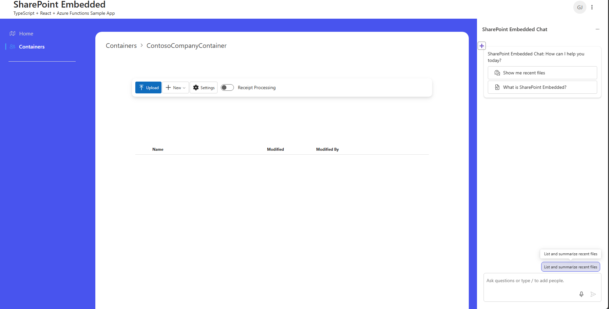

### Examples

The [SharePoint Embedded Samples](https://github.com/microsoft/SharePoint-Embedded-Samples/tree/main/Samples/spe-typescript-react-azurefunction) repository has examples for how to use SharePoint Embedded in your custom applications.
