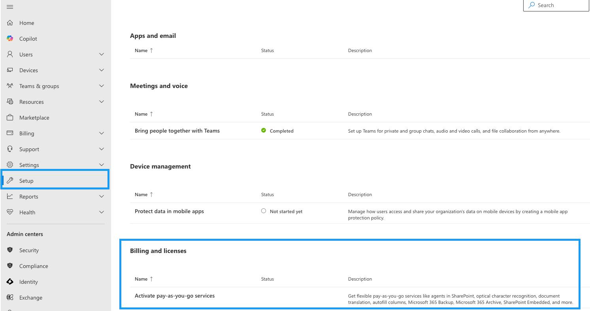
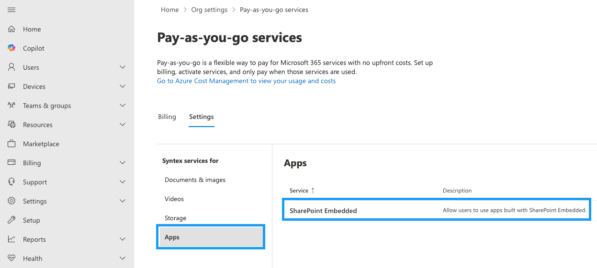

# SharePoint Embedded Container Types

A container type is a SharePoint Embedded resource that defines the relationship, access privileges, and billing accountability between a SharePoint Embedded application and a set of containers. Also, the container type defines behaviors on the set of containers.

Each container type is strongly coupled with one SharePoint Embedded application, which is referred to as the owning application. The owning application developer is responsible for creating and managing their container types. SharePoint Embedded mandates a 1:1 relationship between owning application and a container type.

Container type is represented on each container instance as an immutable property (ContainerTypeID) and is used across the entire SharePoint Embedded ecosystem, including:

- **Access authorization**: A SharePoint Embedded application must be associated with a container type to get access to container instances of that type. Once associated, the application has access to all container instances of that type. The actual access privilege is determined by the application-ContainerTypeID permission setting. The owning application by default has full access privilege to all container instances of the container type it's strongly coupled with. Learn more about [SharePoint Embedded Authorization](../development/auth.md).
- **Easy exploration**: Container type can be created for trial purposes, allowing developers to explore SharePoint Embedded application development and assess its features for free.
- **Billing**: Container types for non-trial purposes are billable and must be created with an Azure Subscription. The usage of containers is metered and charged. Learn more about [metering](../administration/billing/meters.md) and the [SharePoint Embedded billing experience](../administration/billing/billingmanagement.md).
- **Configurable behaviors**: Container type defines selected behaviors for all container instances of that type. Learn more about setting [Container type configuration](../getting-started/containertypes.md#configuring-container-types).

> [!NOTE]
>
> 1. You must specify the purpose of the container type you're creating at creation time. Depending on the purpose, you may or may not need to provide your Azure Subscription ID. A container type set for trial purposes can't be converted for production; or vice versa.
> 1. Standard and pass through container types can't be converted once created. If you want to convert a standard container type to pass through billing or vice versa, you must delete and re-create the container type.
> 1. You must use the latest version of SharePoint PowerShell to configure a container type. For permissions and the most current information about Windows PowerShell for SharePoint Embedded, see the documentation at [Intro to SharePoint Embedded Management Shell](/powershell/sharepoint/sharepoint-online/introduction-sharepoint-online-management-shell).

## Creating Container Types

SharePoint Embedded has 2 different Container Types you can create.

1.  [Trial Container Type](#trial-container-type)
1.  [Standard Container Type](#standard-container-types-non-trial)

### Prerequisites to create SharePoint Embedded container type

A new container type will be created using **SharePoint Online Management Shell**:

1. Download and install the [latest version of SharePoint Online Management Shell](https://www.microsoft.com/download/details.aspx?id=35588)
1. Open SharePoint Online Management Shell from **Start** screen, type **sharepoint**, and then select **SharePoint Online Management Shell**.
1. Connect to SPO service using `Connect-SPOService` cmdlet by providing admin credentials associated with tenancy. For information on [how to use Connect-SPOService](/powershell/module/sharepoint-online/connect-sposervice), refer the linked documentation.

### Tenant requirements

- An active instance of SharePoint is required in your Microsoft 365 tenant.
- Users who will be authenticating into SharePoint Embedded Container Types and Containers must be in Entra ID (Members and Guests)

    > [!NOTE]
    > An Office license is not required to collaborate on Microsoft Office documents stored in a container.

### Roles and Permissions

- The admin who sets up the billing relationship for SharePoint Embedded needs to have owner or contributor permissions on the Azure subscription.
- Admin needs to have a SharePoint Embedded Administrator or Global Admin role to operate billing cmdlets.

### Azure Subscription

For the standard billing container type, the global administrator or SharePoint Embedded Administrator needs to set up:

- An existing SharePoint tenancy
- An Azure subscription in the tenancy
- A resource group attached to the Azure subscription

## Trial Container Type

A container type can be created for trial/development purposes and isn't linked to any Azure billing profile. This enables developers to explore SharePoint Embedded application development and assess its features for free. For trial container types, the developer tenant is the same as the consuming tenant. 
Each developer can have only one container type in the trial status in their tenant at a time. The trial container type is valid for up to 30 days but can be removed at any time within this period. 

To create a container type for trial purposes, you can:

- Use SharePoint Embedded Visual Studio Code Extension to create the container type in just a few steps. The Visual Studio Code extension registers your container type and creates containers for you.
- Use SharePoint PowerShell. You must be a SharePoint Embedded Administrator or Global Administrator to run the following cmdlet. If you're a SharePoint Administrator, grant yourself the SharePoint Embedded Admin role as well to execute these cmdlets.

    ```powershell
    New-SPOContainerType [–TrialContainerType] [-ContainerTypeName] <String> [-OwningApplicationId] <String> [-ApplicationRedirectUrl] <String> [<CommonParameters>]
    ```

The following restrictions are applied to trial container types:

- Up to five containers of the container type can be created. This includes active containers and those in the recycle bin.
- Each container has up to 1 GB of storage space.
- The container type expires after 30 days and access to any existing containers of that container type will be removed.
- The developer must permanently delete all containers of an existing container type in trial status to create a new container type for trial. This includes containers in the deleted container collection.
- The container type is restricted to work in the developer tenant. It can't be deployed in other consuming tenants.

## Standard Container Types (non-trial)

A standard container type in SharePoint Embedded defines the relationship, access privileges, and billing profile between an application and its containers. It establishes how the application interacts with the containers, including access permissions, and is associated with a billing profile for non-trial purposes. Each tenant can have 25 container types at a time.

### Billing profile

SharePoint Embedded is a consumption-based Pay-as-you-go (PAYG) offering meaning you pay only for what you use. SharePoint Embedded provides two billing models that the tenant developing the SharePoint Embedded application can select for respective container types, tailoring it to their unique business requirements. The two billing models are Standard and Pass-through billing.

### Standard Container Type - with billing profile

With the standard billing profile, all consumption-based charges are directly billed to the tenant who owns or develops the application. The admin in the developer tenant  must establish a valid billing profile when creating a standard container type.


Each developer tenant can create up to five container types consisting of 1 trial container type and 4 standard container types or 5 standard container types.
Standard container types are created using the [New-SPOContainerType](/powershell/module/sharepoint-online/new-spocontainertype) cmdlet. 

You need the following to create a standard container type:

- Use SharePoint PowerShell. You must be a SharePoint Embedded Administrator or Global Administrator to run this cmdlet. If you're a SharePoint Administrator, grant yourself the SharePoint Embedded Admin role as well to execute these cmdlets.
- An Azure subscription and a resource group must be present in the Azure portal for regular billing. 
- An App registration must be created in Microsoft Entra ID.

To create a standard container type using an Azure billing profile, use the following cmdlets:

```powershell
New-SPOContainerType [-ContainerTypeName] <String> [-OwningApplicationId] <String> [-ApplicationRedirectUrl] <String> [<CommonParameters>]
```

Once the container type is created, add the Azure billing profile.

```powershell
Add-SPOContainerTypeBilling –ContainerTypeId <ContainerTypeId> -AzureSubscriptionId <AzureSubscriptionId> -ResourceGroup <ResourceGroup> -Region <Region>
```

> [!NOTE]
> The user or admin who sets up a billing relationship for SharePoint Embedded must have owner or contributor permissions on the Azure subscription.
>
> Every container type must have an owning application.
>
> A single-owning app can only own one container type at a time.
>
> An Azure subscription can be attached to any number of container types.
>
> If the cmdlet above fails with a SubscriptionNotRegistered error, it is because **Microsoft.Syntex** is not registered as a resource provider in the subscription. The cmdlet will send a resource provider registration request on your behalf but it will take a few minutes to be completed. Please wait 5-10 minutes and try again until the cmdlet succeeds.

### Standard Container Type - pass-through billing

With pass-through billing, consumption-based charges are billed directly to the tenant registered to use the SharePoint Embedded application (consuming tenant). Admins in the developer tenant don't need to set up an Azure billing profile when creating a pass-through SharePoint Embedded container type. 


For container types intended to be directly billed to a customer use the flag `-IsPassThroughBilling`. For the direct to customer billed container type, there's no need to attach a billing profile. 

To create a pass through billing, standard container type, use the following cmdlet:

```powershell
New-SPOContainerType [-ContainerTypeName] <String> [-OwningApplicationId] <String> [-ApplicationRedirectUrl] <String> [-IsPassThroughBilling] [<CommonParameters>]
```

Once the container type is [registered](../getting-started/register-api-documentation.md) in the consuming tenant, the consuming tenant admin (SharePoint Admin or Global Admin) needs to set up the billing profile in the consuming tenant to use the SharePoint Embedded application.

#### Set Up Billing Profile in Consuming Tenant

1. In [Microsoft 365 admin center](https://admin.microsoft.com/), select **Setup**, and the view the **Billing and licenses** section. Select **Activate pay-as-you-go services.**

    

1. Select **Go to Pay as you go services**.
1. Select **Apps** under **Syntex services for**, select **Apps** and **SharePoint Embedded**
 
    

    > [NOTE]
    The subscription configured in the Syntex services will reflect the consuming charges in the Azure billing portal.

1.  [Register the container type](#registering-container-types) using the App only authentication token.

## Configuring Container Types

The Developer Admin can set selected settings on the SharePoint Embedded container types created by using this PowerShell cmdlet.

This cmdlet allows admins to set [Microsoft 365 content discoverability](../development/content-experiences/user-experiences-overview.md) and [sharing](../development/sharing-and-perm.md) settings on container types. The setting applies to all container instances of the container type:

```powershell
Set-SPOContainerTypeConfiguration -ContainerTypeId 4f0af585-8dcc-0000-223d-661eb2c604e4 -DiscoverabilityDisabled $False
```

## Viewing Container Types

The Developer Admin can view all the SharePoint Embedded container types they created on their tenant using `Get-SPOContainerType`. This cmdlet retrieves and returns the list of container types created for a SharePoint Embedded Application in the tenant.

```powershell
Get-SPOContainerType [<CommonParameters>]
```

Example output of the `Get-SPOContainerType`  cmdlet

```powershell
ContainerTypeId     : 4f0af585-8dcc-0000-223d-661eb2c604e4
ContainerTypeName   : ContosoLegal
OwningApplicationId : a735e4af-b86e-0000-93ba-1faded6c39e1
Classification      : Standard
AzureSubscriptionId : 564e9025-f7f5-xxx9-9ddd-4cdxxxx1755
ResourceGroup       : prod-resources
Region              : EastUS
```

## Registering Container Types

To create and interact with containers, you must [register](../getting-started/register-api-documentation.md) the container type within the Consuming Tenant. The owning application defines the permissions for the container type by invoking the [registration API](../getting-started/register-api-documentation.md).

## Deleting Container Types

Developer admins can delete both trial and standard container types. To delete a container type, you must first remove all containers of that container type, including from the deleted container collection. To remove containers, refer to [Consuming Tenant Admin](../administration/consuming-tenant-admin/cta.md).
Once all the containers are deleted, Developer admins can delete the container type using `Remove-SPOContainerType`.

```powershell
Remove-SPOContainerType [-ContainerTypeId <ContainerTypeId>]
```
## SharePoint Embedded meters

To learn more about the supported pay-as-you-go meters, refer to the [SharePoint Embedded meters](../administration/billing/meters.md) article.
