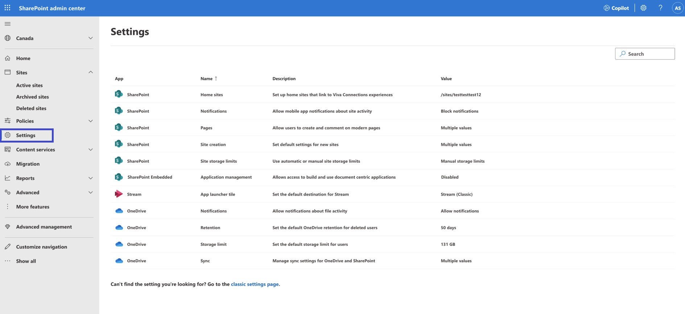
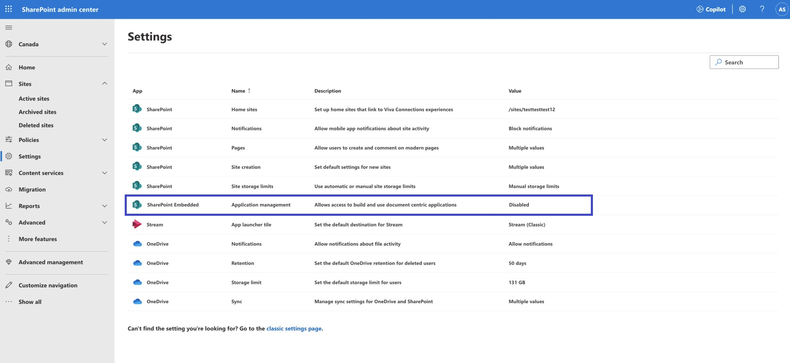
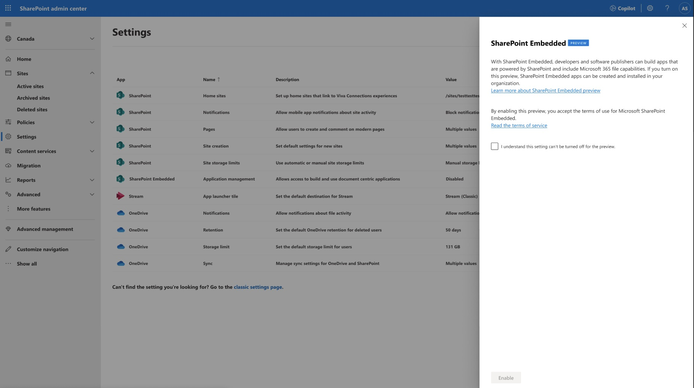
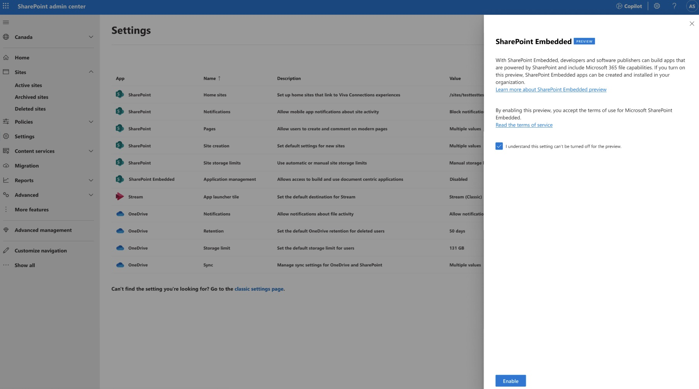
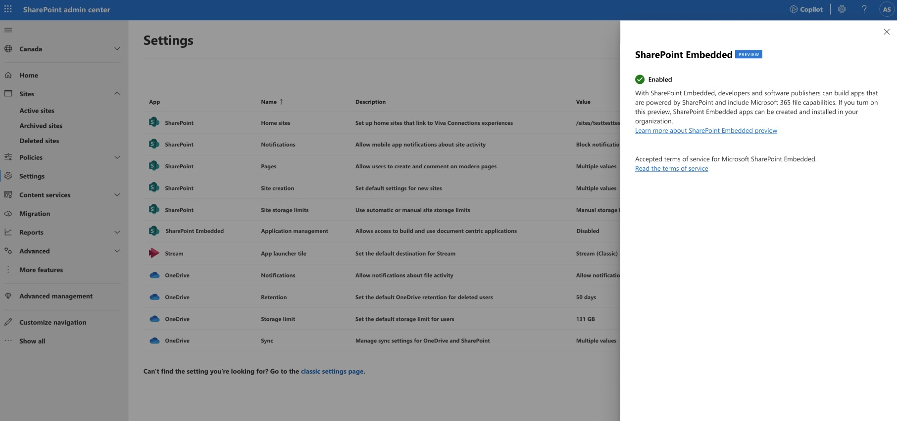

# Enable SharePoint Embedded

During Public Preview, by default, SharePoint Embedded applications will not be enabled for use on the Microsoft 365 tenant. To create or register SharePoint Embedded applications in the tenant, tenant admins must review the terms of service and enable the settings in [SharePoint admin center](https://go.microsoft.com/fwlink/?linkid=2185219). This document explains the steps to enable SharePoint Embedded applications on a Microsoft 365 tenant.

## Who can enable SharePoint Embedded?

Users assigned to the SharePoint Administrator role have access to the [SharePoint admin center](https://go.microsoft.com/fwlink/?linkid=2185219) and can enable SharePoint Embedded applications for their tenant. For information about assigning a user, the SharePoint administrator role, see [Assign admin roles in the Microsoft 365 admin center.](/microsoft-365/admin/add-users/assign-admin-roles).

Global Administrators in Microsoft 365 can assign users the SharePoint Administrator. The Global Administrator role already has all the permissions of the SharePoint Administrator role.

## Steps to Enable SharePoint Embedded

1. Sign in to [SharePoint admin center](https://go.microsoft.com/fwlink/?linkid=2185219) as a SharePoint Administrator or a Global Administrator.
1. In the SharePoint Admin Center, select **Settings** from the left-hand navigation.

    

1. Select **SharePoint Embedded** app in the settings page. The app will be “disabled” if the tenant admin has not enabled the settings before.

    

1. In the **SharePoint Embedded** panel, read the [terms of service](../terms-of-service.md) before enabling the application.

    

1. Select the check box and select on the **Enable** button to begin using your SharePoint Embedded application on the tenant.

    

Your SharePoint Embedded application is now available for use on your tenant.

## Next Steps

Once SharePoint Embedded is enabled for your organization, developers can start creating a SharePoint Embedded application by following the [SharePoint Embedded: Build an app](/sharepoint/dev/embedded/mslearn/m02-01-intro) tutorial.
