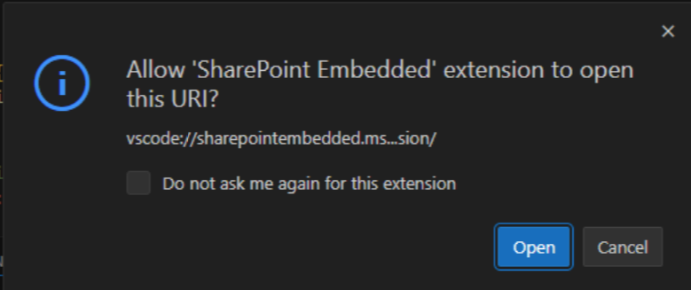
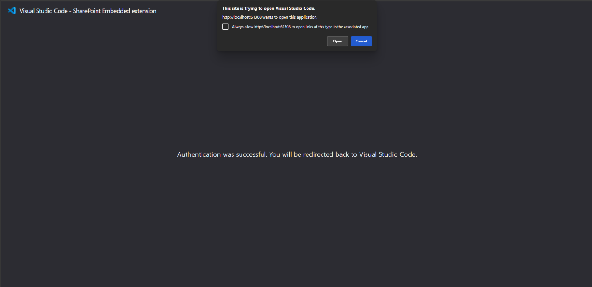
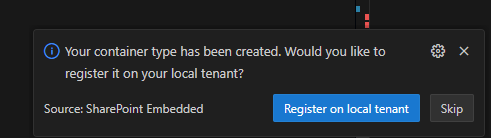
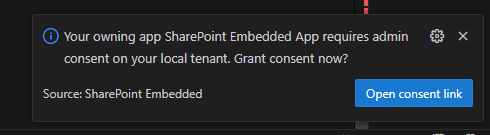
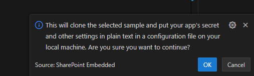
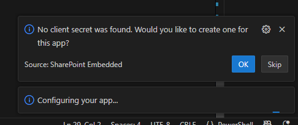
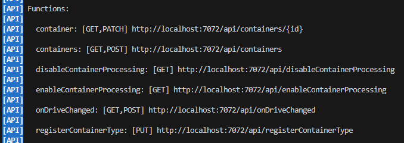
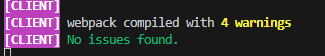
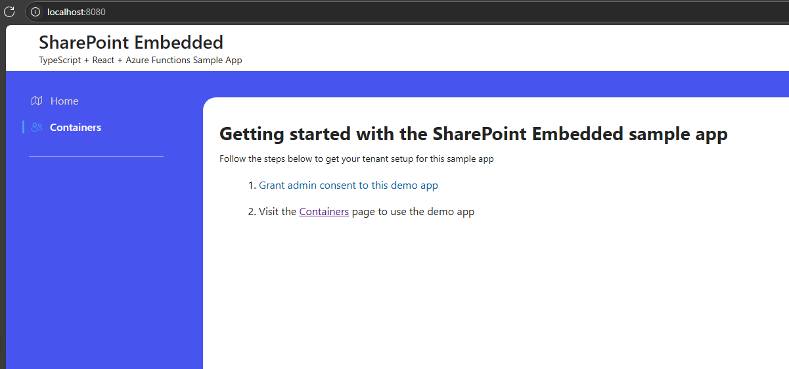

# SharePoint Embedded for Visual Studio Code

The SharePoint Embedded Visual Studio Code extension helps developers get started for free with SharePoint Embedded application development. 

> [!IMPORTANT]
> To start building with SharePoint Embedded, you'll need administrative access to a Microsoft 365 tenant.
> If you don't already have a tenant, you can get your own tenant with the [Microsoft 365 Developer Program](https://developer.microsoft.com/microsoft-365/dev-program), [Microsoft Customer Digital Experience](https://cdx.transform.microsoft.com/), or create a free trial of a [Microsoft 365 E3 license](https://www.microsoft.com/microsoft-365/enterprise/microsoft365-plans-and-pricing).

## Install SharePoint Embedded for Visual Studio Code

1. Open a new window in [Visual Studio Code](https://code.visualstudio.com/) and navigate to "**Extensions**" on the activity bar.
1. Search "SharePoint Embedded" in the Extensions view. You can also view the extension in [Visual Studio Marketplace](https://marketplace.visualstudio.com/items?itemName=SharepointEmbedded.ms-sharepoint-embedded-vscode-extension).
1. Select **"Install"** and the SharePoint Embedded icon will appear on the activity bar.
1. If already installed, please update to the latest version if one is available.
1. Select the icon to open the SharePoint Embedded view and create a container type with trial configuration.


### Sign in with admin credentials

To use the extension, you must sign in to a Microsoft 365 tenant with an administrator account.


- Authentication opens a new tab in an external browser to grant permissions

  

- Review the requested permissions carefully, then select **Accept** on the pop-up window prompting admin consent
 
  

After successful authorization, select open on the dialog to be redirected to VSCode:



## Create a container type with a trial configuration

Once signed in, you're prompted to create a [container type with trial configuration](./containertypes.md#trial-container-type). A container type lets you get started calling SharePoint Embedded APIs and building a proof-of-concept application using SharePoint Embedded. Learn more about [container types](containertypes.md).


- Select **Create Trial Container Type**
- Follow the prompts to name your container type. You can change your container type name later on.


> [!NOTE]
> SharePoint Embedded for Visual Studio Code only supports container types with trial configuration at this time. Other container types with standard or pass-through billing configurations must be created using the SharePoint Online PowerShell Module.

## Create a Microsoft Entra ID App

Every container type is owned by a Microsoft Entra ID application. The first step when creating a free trial container type is to create a new or select an existing Microsoft Entra ID application as the owning application. You can either specify the name of your new application or pick one of your existing applications. Learn more about SharePoint Embedded [app architecture](../development/app-architecture.md)

- Follow the prompts to name your new Entra application or select an existing application ID:


> [!NOTE]
> If you choose an existing application, the extension will update that app's configuration settings for it to work with both SharePoint Embedded and this extension. Doing this is NOT recommended on production applications.

After your container type is created and your application is configured, you'll be able to view your local tenant registration as a tree in the left nav-bar.

## Register your container type

After creating your container type, you'll need to register that container type on your local tenant. Learn more about container type [registration](./register-api-documentation.md).

- Follow the prompts and select **Register on local tenant** on the lower right corner of the VS Code window

  

- If you don't see the prompt, you can right-click on your `<container-type-name>` and select **Register** from the menu

  

### Grant permissions

Review permissions and follow the prompt to grant admin consent



An external browser window will pop open for you to sign-in and grant admin consent


## Create your first container

With your container type registered, you can now create your first container. Only five containers of container type can be created to upload and manage content.

- Right-click on the **Containers** drop-down from the tree in the left nav-bar and select **Create container**
- Enter a name for the container you would like to create


## Recycling Containers

You can also recycle and recover containers within the extension.


## Load Sample App

With your free trial container type created, you can use the extension to load one of the SharePoint Embedded sample apps and automatically populate the runtime configuration file with the details of your Microsoft Entra ID app and container type.


When loading the sample application, you'll be notified that it will create plain text secrets to authenticate on your local machine.



If no client secret is found on your application, it will ask if you would like to create one. Press OK to proceed.



> [!IMPORTANT]
> This isn't intended for production environments. [Find out more on how to setup Application Registration for production environments here.](https://learn.microsoft.com/entra/identity-platform/quickstart-register-app)

## Using Sample App

In your terminal, run the following command, this will start the sample application, which consists of 2 parts:

1. **React Client Application** - The frontend user interface running on port 8080
1. **Azure Function Application Server** - The backend API server that handles SharePoint Embedded operations

```console
# Navigate to your sample application directory
cd [your-path]\SharePoint-Embedded-Samples\Samples\spe-typescript-react-azurefunction

# Install dependencies and start the application
npm run start
```

> [!NOTE]
> The initial startup may take a few minutes as dependencies are installed and both applications are built. Wait for both console outputs to appear before navigating to the application.

This will install the dependencies and run the server and client application, once running, you'll see the following in the terminal, after which you can navigate to http://localhost:8080 to access the application.





Once both applications are running successfully:

1. Open your web browser and navigate to **http://localhost:8080**
1. Sign in using your Microsoft 365 administrator account (the same account used in the VS Code extension)
1. On the home page, select **"Containers"** to begin creating containers and uploading files
1. Follow the on-screen prompts to interact with your SharePoint Embedded containers



> [!IMPORTANT]
> This sample application stores authentication secrets in plain text for development purposes only. Never use this configuration in a production environment.

### Troubleshooting

If you encounter issues:

- **Port already in use**: If port 8080 is already in use, the application will automatically try the next available port
- **Dependencies not installing**: Try running `npm install` manually before `npm run start`
- **Authentication errors**: Ensure your Microsoft Entra ID app is properly configured with the correct redirect URIs

## Export Postman Environment

The [SharePoint Embedded Postman Collection](https://github.com/microsoft/SharePoint-Embedded-Samples/tree/main/Postman) allows you to explore and call the SharePoint Embedded APIs. The Collection requires an environment file with variables used for authentication and various identifiers. This extension automates the generation of this populated environment file so you can import it into Postal worker and immediately call the SharePoint Embedded APIs.


