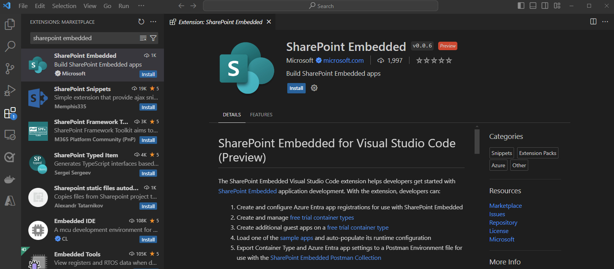
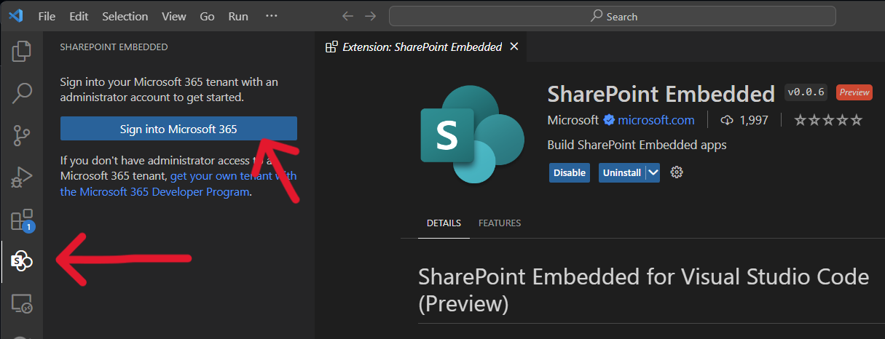
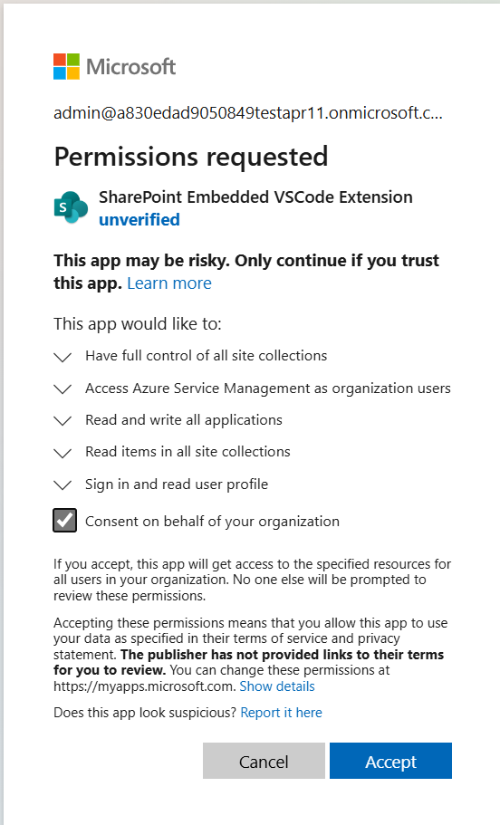
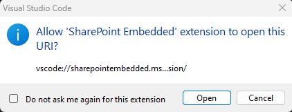

# SharePoint Embedded for Visual Studio Code

The SharePoint Embedded Visual Studio Code extension helps developers get started for free with SharePoint Embedded application development. With the extension, developers can:

1. Create and configure Microsoft Entra ID app registrations for use with SharePoint Embedded
1. Create and manage [container types for trial use](../concepts/app-concepts/containertypes.md#trial-use)
1. Create containers 
1. Add guest apps on a [container type for trial use](../concepts/app-concepts/containertypes.md#trial-use)
1. Load SharePoint Embedded [sample apps](https://github.com/microsoft/SharePoint-Embedded-Samples) and autopopulate its runtime configuration
1. Export the container type and Microsoft Entra ID app settings to a Postman Environment file for use with the [SharePoint Embedded Postman Collection](https://github.com/microsoft/SharePoint-Embedded-Samples/tree/main/Postman)

> [!IMPORTANT]
> To start building with SharePoint Embedded you will need administrative access to Microsoft 365 tenant.
> If you do not already have a tenant, you can get your own tenant with the [Microsoft 365 Developer Program](https://developer.microsoft.com/microsoft-365/dev-program), [Microsoft Customer Digital Experience](https://cdx.transform.microsoft.com/), or create a free trial of an [Microsoft 365 E3 license](https://www.microsoft.com/en-us/microsoft-365/enterprise/microsoft365-plans-and-pricing).

## Install SharePoint Embedded for Visual Studio Code

1. Open a new window in [Visual Studio Code](https://code.visualstudio.com/) and navigate to "**Extensions**" on the activity bar.
1. Search "SharePoint Embedded" in the Extensions view. You can also view the extension in [Visual Studio Marketplace](https://marketplace.visualstudio.com/items?itemName=SharepointEmbedded.ms-sharepoint-embedded-vscode-extension).
1. Press **"Install"** and the SharePoint Embedded icon will load on the activity bar.
1. Select on the icon to open the SharePoint Embedded view and create a container type with trial configuration.

## Sign in with admin credentials

To use the extension, you need to sign into a Microsoft 365 tenant with an administrator account.
If you don't already have a tenant, you can get a tenant through the [Microsoft 365 Developer Program](https://developer.microsoft.com/microsoft-365/dev-program), [Microsoft Customer Digital Experience](https://cdx.transform.microsoft.com/), or create a free trial of an [Microsoft 365 E3 license](https://www.microsoft.com/en-us/microsoft-365/enterprise/microsoft365-plans-and-pricing).

* Authentication will open a new tab in an external browser to sent to permissions
* A pop-up window will prompt permissions, select **Open**
 
 

## Create a container type with trial configuration

Once you've signed in, create a [container type with trial configuration](../concepts/app-concepts/containertypes.md#trial-use). A container type lets you get started calling SharePoint Embedded APIs and building a proof-of-concept application using SharePoint Embedded. Learn more about [containertypes](../concepts/app-concepts/containertypes.md).

> [!NOTE]
> SharePoint Embedded for Visual Studio Code only supports free trial container types at this time. Paid container types must be made using the SharePoint Online PowerShell Module.

## Create a Microsoft Entra ID App

Every container type is owned by a Microsoft Entra ID application. The first step when creating a free trial container type is to create a new or select an existing Microsoft Entra ID application as the owning application. You can either specify the name of your new application or pick one of your existing applications.

> [!NOTE]
> If you choose an existing application, the extension will update that app's configuration settings for it to work with both SharePoint Embedded and this extension. Doing this is NOT recommended on production applications.

#### Name your free trial container type

Once you have a Microsoft Entra ID application, the last step is to provide a name for your new free trial container type.

### Load Sample App

With a free trial container type created, you can use the extension to load one of the SharePoint Embedded sample apps and automatically populate the runtime configuration file with the details of your Microsoft Entra ID app and container type. This allows you to immediately run the sample app on your local machine.

### Export Postman Environment

The [SharePoint Embedded Postman Collection](https://github.com/microsoft/SharePoint-Embedded-Samples/tree/main/Postman) allows you to explore and call the SharePoint Embedded APIs. The Collection requires an environment file with variables used for authentication and various identifiers. This extension automates the generation of this populated environment file so you can import it into Postman and immediately call the SharePoint Embedded APIs.

### Add a guest app to your free trial container type

You can use the extension to add one or more guest apps to your existing free trial container type. Guest apps can be used to create different applications that have access to the same set of containers. For example, you might have one app that delivers your Web experiences, another for mobile experiences, and another for background processing. You can specify both the delegated and application permissions on each guest application you create.

