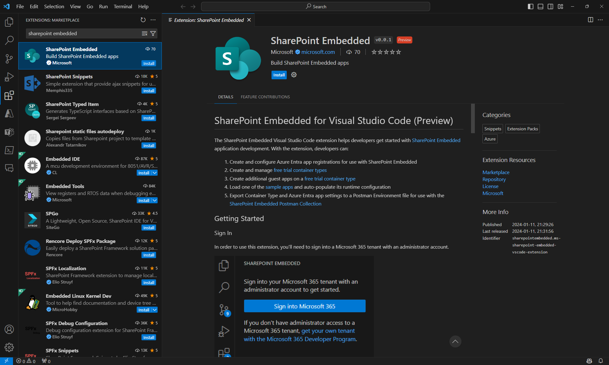

# SharePoint Embedded for Visual Studio Code

The SharePoint Embedded Visual Studio Code extension helps developers get started with SharePoint Embedded application development. With the extension, developers can:

1. Create and configure Microsoft Entra ID app registrations for use with SharePoint Embedded
2. Create and manage [free trial container types](../concepts/app-concepts/containertypes.md#trial-use)
3. Create more guest apps on a [free trial container type](../concepts/app-concepts/containertypes.md#trial-use)
4. Load one of the [sample apps](https://github.com/microsoft/SharePoint-Embedded-Samples) and auto-populate its runtime configuration
5. Export container type and Microsoft Entra ID app settings to a Postman Environment file for use with the [SharePoint Embedded Postman Collection](https://github.com/microsoft/SharePoint-Embedded-Samples/tree/main/Postman)

## Installing SharePoint Embedded for Visual Studio Code

To get started with the SharePoint Embedded Visual Studio Code extension, you need to have [Visual Studio Code](https://code.visualstudio.com/) installed on your machine.

Next, you need to install the [SharePoint Embedded Visual Studio Code extension](https://marketplace.visualstudio.com/items?itemName=SharepointEmbedded.ms-sharepoint-embedded-vscode-extension) from the Visual Studio Marketplace. You can find the extension by searching for "SharePoint Embedded" in the Visual Studio Code Extensions view, or by visiting the previous link.

Once you have installed the extension, you can access it from the Visual Studio Code Activity Bar, where you'll see a new icon for SharePoint Embedded. Clicking on the icon will open the SharePoint Embedded view, where you can perform various tasks related to SharePoint Embedded application development.

## Getting Started

### Sign In

To use the extension, you'll need to sign into a Microsoft 365 tenant with an administrator account.

If you don't have administrator access to a Microsoft 365 tenant, get your own tenant with the [Microsoft 365 Developer Program](https://developer.microsoft.com/microsoft-365/dev-program).

### Create a free trial container type

Once you've signed in, the first (and only) thing to do next is to create a [free trial container type](../concepts/app-concepts/containertypes.md#trial-use). A free trial container type lets you get started calling SharePoint Embedded APIs and building a proof-of-concept application using SharePoint Embedded.

> [!NOTE]
> SharePoint Embedded for Visual Studio Code only supports free trial container types at this time. Paid container types must be made using the SharePoint Online PowerShell Module.

#### Create a Microsoft Entra ID App

Every container type is owned by a Microsoft Entra ID application. The first step when creating a free trial container type is to create a new or select an existing Microsoft Entra ID application as the owning application. You can either specify the name of your new application or pick one of your existing applications.

> [!NOTE]
> If you choose an existing application, the extension will update that app's configuration settings for it to work with both SharePoint Embedded and this extension. Doing this is NOT recommended on production applications.

#### Name your free trial container type

Once you have a Microsoft Entra ID application, the last step is to provide a name for your new free trial container type.

### Load Sample App

With a free trial container type created, you can use the extension to load one of the SharePoint Embedded sample apps and automatically populate the runtime configuration file with the details of your Microsoft Entra ID app and container type. This allows you to immediately run the sample app on your local machine.

### Export Postman Environment

The [SharePoint Embedded Postman Collection](https://github.com/microsoft/SharePoint-Embedded-Samples/tree/main/Postman) allows you to explore and call the SharePoint Embedded APIs. The Collection requires an environment file with variables used for authentication and various identifiers. This extension automates the generation of this populated environment file so you can import it into Postman and immediately call the SharePoint Embedded APIs.

### Add a guest app to your free trial container type

You can use the extension to add one or more guest apps to your existing free trial container type. Guest apps can be used to create different applications that have access to the same set of containers. For example, you might have one app that delivers your Web experiences, another for mobile experiences, and another for background processing. You can specify both the delegated and application permissions on each guest application you create.

