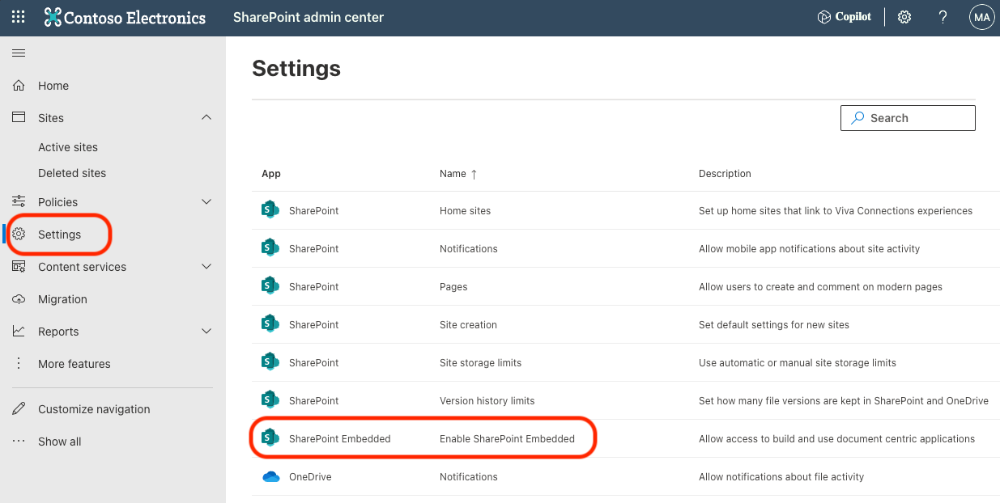

# Introduction to SharePoint repository services

SharePoint repository services is provides developers a faster way to create file and document focused applications. SharePoint repository services are powered by SharePoint. With SharePoint repository services, developers can integrate the same powerful file and document capabilities that SharePoint has to offer in their own custom applications. In this section, you’ll learn what SharePoint repository services is and what it offers developers creating custom applications.

For many years, users have enjoyed the document management capabilities included in SharePoint. Features like collaborating on a wide array of supported file types, securing content and managing the complete lifecycle of content and leveraging enterprise grade classification and enterprise content management (ECM) capabilities, SharePoint document management has been an industry leading solution for many years.

These capabilities have become standard across the industry to the point where Independent software vendors (ISVs) and developers have wanted to implement them in their custom solutions. Some organizations have recreated these capabilities in their products them while others have built their products on top of SharePoint.

But these solutions introduce a dependency on an entire product when what they really want is to leverage the document management features in SharePoint in their products and projects.

## Introducing SharePoint repository services

That’s what SharePoint repository services brings to developers. It provides a faster way for developers to create file and document focused applications. SharePoint repository services is powered by SharePoint. Developers can integrate the same powerful file and document capabilities that SharePoint has to offer in their own custom applications.

Another way to look at SharePoint repository services is your custom application leverages SharePoint for all document storage and collaboration features. This effectively uses SharePoint repository services as a “headless-API” to SharePoint’s document storage system.

## App documents stay in their Microsoft 365 tenant

When a consumer installs/registers a SharePoint repository services application in their Microsoft 365 tenant, SharePoint repository services creates another SharePoint partition. This storage partition does not have a user interface but instead, the documents in the partition is only accessible via APIs. This means that all documents will be accessible to the ISV or developer’s application, but the documents will only reside in the consumer’s Microsoft 365 tenant.

## Consumer Microsoft 365 settings apply to app documents

All documents stored in the SharePoint partition created by the SharePoint repository services app are in the consumer’s Microsoft 365 tenant and therefore are subject to the consumer’s Microsoft 365 tenant settings.

This includes settings from Microsoft Purview compliance, risk, and security settings, documents can be opened from Office clients, and customers can leverage the Office web clients to view and collaborate on the documents.

## Understanding the costs and billing for SharePoint repository services content

Microsoft 365 customers have different entitlements related to storage, usage, and features depending on the licenses the customer has purchased.

The partition created in the consumer’s Microsoft 365 tenant by a SharePoint repository services app doesn’t count towards or other Microsoft 365 entitlements. Instead, the partition in the consumer’s Microsoft 365 tenant by the SharePoint repository services app are billed separately through an Azure subscription on a pay-as-you-go metered consumption model that’s based on total storage and the number of API calls.

> [!NOTE]
> Learn more about pricing from the SharePoint repository services documentation, see insert [SharePoint repository services Overview](../overview.md).

## Getting started with SharePoint repository services

SharePoint repository services is not enabled by default on SharePoint Online tenants.

A SharePoint admin must enable SharePoint repository services from the SharePoint admin center’s settings page.

> [!IMPORTANT]
> Enabling SharePoint repository services on a SharePoint Online tenant is a one-way operation. Once SharePoint repository services is enabled in a SharePoint Online tenant, it can’t be disabled.

## Summary

SharePoint repository services is provides developers a faster way to create file and document focused applications. SharePoint repository services are powered by SharePoint. With SharePoint repository services, developers can integrate the same powerful file and document capabilities that SharePoint has to offer in their own custom applications. In this section, You learned what SharePoint repository services is and what it offers developers creating custom applications.

## Next Steps

Let's get started and continue with the next topic in this tutorial, [Hands on Lab - Enable SharePoint repository services in your Microsoft 365 SharePoint Online tenant](m01-03-hol.md), where you’ll enable SharePoint repository services on your Microsoft 365 SharePoint tenant.
