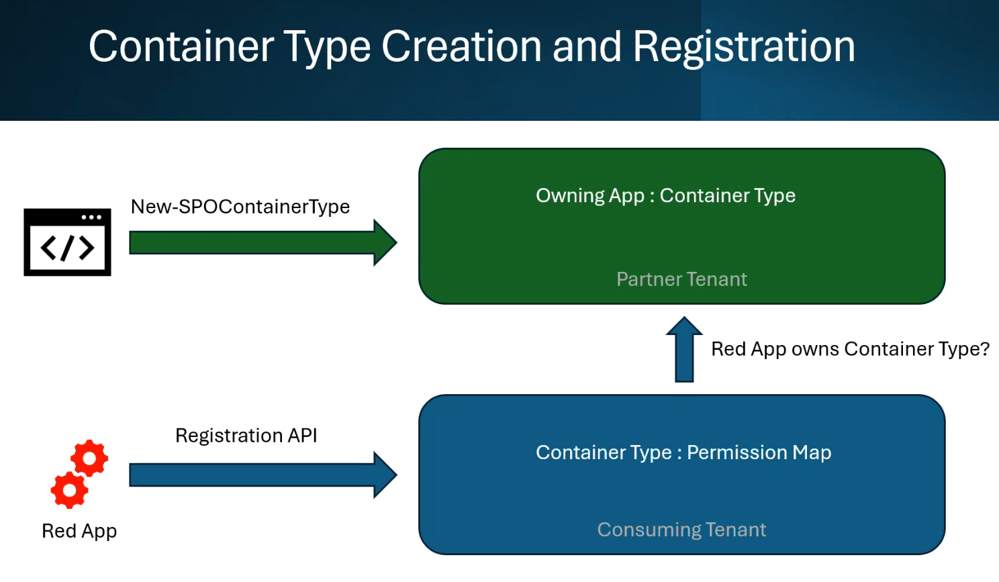
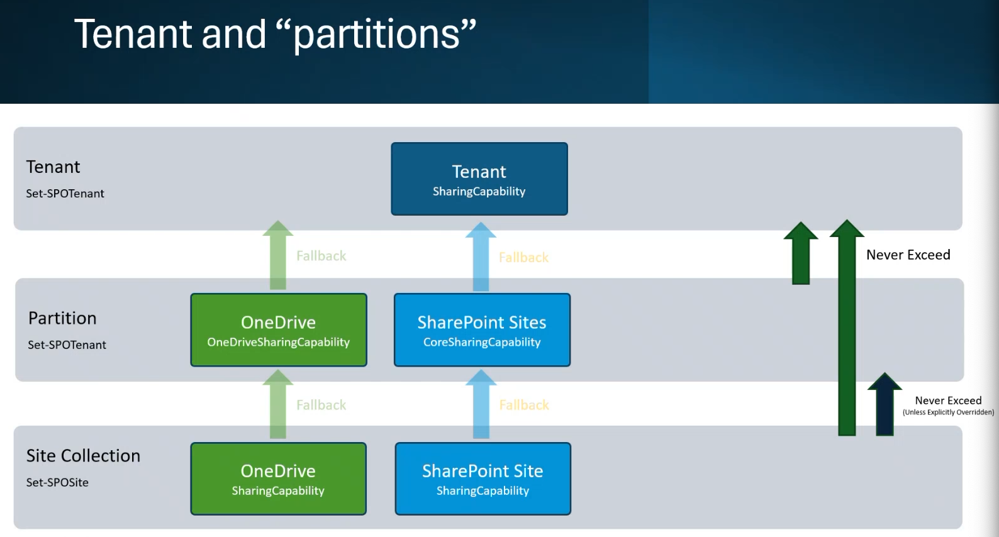
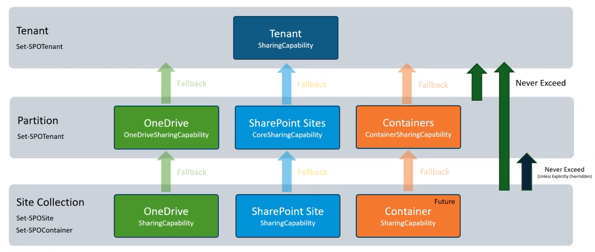

# Understand the structure of SharePoint Embedded

SharePoint Embedded introduces the concept of a storage container that the developers of custom applications use to store files and documents. The files in this Container are only accessible through the SharePoint Embedded Container. Developers use well known and established Microsoft Graph APIs to access the files and documents in these Containers. In this section, you’ll learn how SharePoint Embedded is structured and how to create a Container in your Microsoft 365 tenant.

## Understanding how SharePoint Embedded is structured

Developers and ISVs who create SharePoint Embedded apps are commonly referred to as **providers**. The customers of these applications are commonly referred to as **consumers**.

In production, the provider and consumer tenants will usually be different things. For example, a single provider can have many consumers or customers. But in development, the provider and consumer tenants can be the same thing to simplify the setup.

### SharePoint Embedded Providers

Providers who create SharePoint Embedded apps will create a few different things in the provider’s Microsoft 365 tenant’s SharePoint Embedded instance and the Microsoft 365’s associated Microsoft Entra ID tenant.

They will create the application codebase and the Microsoft Entra application. The Entra application is what the application will use authenticate and call both Microsoft Graph and SharePoint APIs for SharePoint Embedded tasks including reading and writing files in the SharePoint Embedded Containers.

Next, the provider will create a **ContainerType** in the provider’s SharePoint tenant using the SharePoint Online PowerShell `New-SPOContainerType` cmdlet. The

**Containers** created by an SharePoint Embedded application are all associated with a single immutable ContainerType’s ID. Containers contain the content within a SharePoint Embedded application.

The ContainerType has two important roles in SharePoint Embedded solutions:

1. Defines a relationship between the Microsoft Entra application and all Containers linked to the ContainerType.
1. Associates all Containers linked to it to a specific Azure Subscription for billing purposes.

> [!IMPORTANT]
> The Microsoft Entra application can have at most one (1) ContainerType associated with it.

### SharePoint Embedded Consumers

After creating the necessary resources in the provider’s tenant, including the Microsoft Entra application, the consumer tenant admin must perform the following two operations:

1. Consent to the provider’s Microsoft Entra application within their tenant and optionally, on behalf of all users in the consuming tenant.
1. Register the providers ContainerType with the consuming tenant.

The registration of the ContainerType with the consuming tenant must be done from the provider tenant and this should be done the first time the app is run in the consuming tenant.

When this happens, Microsoft looks at the Microsoft Entra application’s ID, locates the provider tenant and validate the application owns that ContainerType. This is because only the owning application can call the registration settings in the consuming tenant. It also means the provider and consuming tenant are in the same cloud, but can exist in different regions. For example, the provider and consumer tenants can be in the production or GCC High clouds, but not different clouds because Microsoft can’t reach between clouds.

If validated, the registration process will put the permission map and configuration settings in the consuming tenant.

## Understanding permissions in SharePoint Embedded

Permissions in SharePoint Embedded Container are related to SharePoint permissions, but are handled a little differently than how SharePoint implements. Like SharePoint, permissions fall back on their parent unless overridden at a more specific level.

For example, the default permissions for a document library inherit the permissions of the enclosing site, and the site’s permissions are based it’s site collection.

However, the permissions on a document library can be more restrictive. This same model is true with respect to SharePoint Embedded.

There are two significant differences with respect to permissions between SharePoint and SharePoint Embedded.

First, unlike SharePoint, permissions in SharePoint Embedded are only additive. SharePoint’s ability to enforce more restrictive permissions like removing access from a parent Container is not supported by SharePoint Embedded.

In addition, SharePoint Embedded has a defined set of roles that can be applied at the Container level:

- **Owner**: Grants full control of a Container and all content within the Container. Delegated users are automatically granted this role when creating the Container.
- **Manager:** Same as the **Writer** role, but can also maintain permissions on a Container.

    > [!IMPORTANT]
    > Managers can’t add users to the **Owner** role

- **Writer**: Add, update, and delete Container content.
- **Reader**: View Container content.

## Summary

SharePoint Embedded introduces the concept of a storage Container that the developers of custom applications use to store files and documents. The files in this Container are only accessible through the SharePoint Embedded Container. Developers use well known and established Microsoft Graph APIs to access the files and documents in these Containers. In this section, you learned how SharePoint Embedded is structured and how to create a Container in your Microsoft 365 tenant.

## Next Steps

Let's get started and continue with the next topic in this tutorial, [Hands on Lab - Setup and Configure SharePoint Embedded](m01-05-hol.md), where you'll create a Microsoft Entra application, configuring SharePoint Embedded on your SharePoint tenant, and generate your first Container Type and Container.
