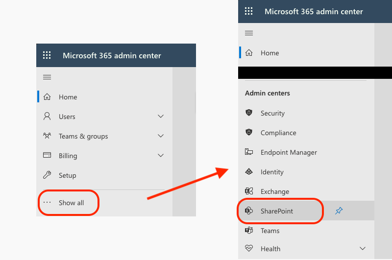
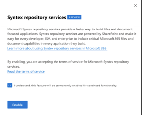

# Hands on Lab - Setup & configure the SharePoint Embedded environment and web app project

In this exercise, you’ll create a project that contains a server-side and client-side component. The server-side component is a REST API that authenticates with Microsoft Entra ID and will access SharePoint Embedded Containers using the Microsoft Graph API. The client-side component is a single-page React app that will call the REST API that exposes the contents of the SharePoint Embedded Container. At the end of this exercise, you’ll have a template project that you’ll use to add additional functionality in the following sections.

## Enable SharePoint Embedded in your Microsoft 365 SharePoint Online tenant

In order to use SharePoint Embedded to create and register Container Types, you must first enable it on your SharePoint Online tenant. This process must be done on both the provider and consuming tenants where you define your application and on any consuming tenants that will use your SharePoint Embedded app.

> [!NOTE]
> You can use the same SharePoint Online tenant as both the provider/developer and consuming tenant.

Enabling SharePoint Embedded on a SharePoint Online tenant is a one-way operation; it cannot be disabled. This is to ensure any apps you’ve created on the consuming tenant will continue to function.

Once you enable SharePoint Embedded on a SharePoint Online tenant, you will be able to create a Container Type in your provider tenant and register the Container Type in a consuming tenant.

To enable SharePoint Embedded, navigate to the Microsoft 365 admin center (`https://portal.microsoft.com`) and sign-in with the **Work and School** of your Microsoft 365 tenant’s admin account.

Select **Show All** at the bottom of the left-hand navigation, then select **Admin Centers > SharePoint**.



Next, on the SharePoint admin center, select **Settings** in the left-hand navigation. Locate and select SharePoint Embedded. Review the terms of service and select **Enable** to enable it on your SharePoint Online tenant.



If you aren’t sure if it’s already installed, try executing the `Upgrade-Module` first. If it fails, then it’s not installed so run the `Install-Module` cmdlet.

### Create the Container Type

With the latest **SharePoint Online PowerShell module** installed, the next step is to create a Container Type in your tenant.

Update the following values in the following PowerShell script, then execute the script:

- **`{{SPO_ADMIN_URL}}`**: This is the URL of your SharePoint Online admin center. You can get this by signing into the `[https://portal.microsoft.com](https://portal.microsoft.com)` with the **Work and School** of your tenant’s admin account, select **Show All** at the bottom of the left-hand navigation, then select **Admin Centers > SharePoint**. Copy the URL of the SharePoint admin center and use this value. For example, if your tenant ID is **Contoso123**, your admin url would be `https://contoso123-admin.sharepoint.com`.
- **`{{CONTAINER_TYPE_NAME}}`**: Pick a name for your new Container Type. For example, use `FirstContainerType`.
- **`{{AZURE_ENTRA_APP_ID}}`:** Set this to the value of the Microsoft Entra ID app ID, also known as the "client ID" you created previously. This value should be in your local text file.

```powershell
Import-Module "Microsoft.Online.SharePoint.PowerShell"
Connect-SPOService -Url "{{SPO_ADMIN_URL}}"
New-SPOContainerType -TrialContainerType -ContainerTypeName "{{CONTAINER_TYPE_NAME}}" -OwningApplicationId "{{AZURE_ENTRA_APP_ID}}"
```

> [!NOTE]
> Learn more about creating production or trial container types in [Admin Experiences: Developer Admin](../concepts/admin-exp/dev-admin.md).

The PowerShell script will display the details for your new Container Type, for example:

```powershell
Container Type ID:
===============================================================================
ContainerTypeId     : 3a6b1fc4-0bd9-04b3-3a2a-4843fbb60914
ContainerTypeName   : FirstContainerType
OwningApplicationId : 763cd5ea-ade4-4d2a-a143-29498920e18f
Classification      : Trial
```

Copy the `ContainerTypeId` and `ContainerTypeName` to your local text file for later use.

## Create a web app to access SharePoint Embedded Containers

With SharePoint Embedded setup, the next step is to create the application. This project consists of two projects:

- A web project to build and render the front-end React SPA app
- A server side API to host the methods that require an confidential client that will perform operations that can’t be done from the client app.

Let’s start by creating the front-end part of the project:

### Create front-end application

From a command line, navigate to the folder where you created your project and execute the following command:

```console
npx create-react-app my-first-spe-app --template typescript
```

From the command line, move into the folder **my-first-spe-app** created by the previous command and execute the following command:

```console
npm install @azure/msal-browser @fluentui/react-components @fluentui/react-icons @microsoft/mgt-react @microsoft/mgt-element @microsoft/mgt-msal2-provider -SE
```

This command will install the NPM packages:

- **[@azure/msal-browser](https://www.npmjs.com/package/@azure/msal-browser)**: Used to authenticate with Microsoft Entra ID.
- **[@microsoft/mgt-element](https://www.npmjs.com/package/@microsoft/mgt-element)**, **[@microsoft/mgt-react](https://www.npmjs.com/package/@microsoft/mgt-react)**, & **[@microsoft/mgt-msal2-provider](https://www.npmjs.com/package/@microsoft/mgt-msal2-provider)**: The Microsoft Graph Toolkit that contains UI components for React.
- **[@fluentui/react-components](https://www.npmjs.com/package/@fluentui/react-components)** & [@fluentui/react-icons](https://www.npmjs.com/package/@fluentui/react-icons): UI components from the Fluent UI v9 library.

## Create back-end application

From a command line, navigate to the folder where you created your project and execute the following command:

```console
npm install restify @azure/msal-node @microsoft/microsoft-graph-client isomorphic-fetch jsonwebtoken jwks-rsa -SE

npm install @types/restify @types/jsonwebtoken @types/isomorphic-fetch -DE
```

This command will install the NPM packages:

- **[restify](https://www.npmjs.com/package/restify)** & **@types/restify**: A Node.js-base API server and associated type declarations for TypeScript.
- **[@azure/msal-node](https://www.npmjs.com/package/@azure/msal-node)**: Used to authenticate with Microsoft Entra ID.
- **[@microsoft/microsoft-graph-client](https://www.npmjs.com/package/@microsoft/microsoft-graph-client)**: Microsoft Graph JavaScript SDK.
- **[isomorphic-fetch](https://www.npmjs.com/package/isomorphic-fetch)**: Polyfill that adds the browser `fetch` API as a global so it’s API is consistent between the client & server.
- **[jsonwebtoken](https://www.npmjs.com/package/jsonwebtoken)**: Implementation of JSON Web Tokens.
- **[jwks-rsa](https://www.npmjs.com/package/jwks-rsa)**: Library to retrieve signing keys from a JSON Web Key Set (JWKS) endpoint.

Add a TypeScript compiler configuration for the server-side project:

- Add a new folder, **./server**, to the root of the project.
- Create a new file, **tsconfig.json** in the **./server** folder and add the following code to it. This will configure the TypeScript compiler for the server-side API part of this project.

    ```json
    {
      "$schema": "http://json.schemastore.org/tsconfig",
      "compilerOptions": {
        "target": "ES2015",
        "module": "commonjs",
        "lib": [
          "es5",
          "es6",
          "dom",
          "es2015.collection"
        ],
        "esModuleInterop": true,
        "moduleResolution": "node",
        "strict": true
      }
    }
    ```

Now, let’s add a placeholder for the server-side API to this project.

- Create a new file, **index.ts** in the **./server** folder and add following code to it

    ```typescript
    import * as restify from "restify";

    const server = restify.createServer();
    server.use(restify.plugins.bodyParser());

    server.listen(process.env.port || process.env.PORT || 3001, () => {
      console.log(`\nAPI server started, ${server.name} listening to ${server.url}`);
    });

    // add CORS support
    server.pre((req, res, next) => {
      res.header('Access-Control-Allow-Origin', req.header('origin'));
      res.header('Access-Control-Allow-Headers', req.header('Access-Control-Request-Headers'));
      res.header('Access-Control-Allow-Credentials', 'true');

      if (req.method === 'OPTIONS') {
        return res.send(204);
      }

      next();
    });

    server.get('/api/echo', async(req, res, next) => {
      console.log('GET /api/echo');
      res.send(200);
      next();
    });
    ```

### Add project global settings and constants

Next, add few constants to store your deployment settings

- Create a new file, **./.env**, to store settings for your API server. Add the following to the file:

    ```text
    API_ENTRA_APP_CLIENT_ID=
    API_ENTRA_APP_CLIENT_SECRET=
    API_ENTRA_APP_AUTHORITY=

    CONTAINER_TYPE_ID=
    ```

- Create a new file **./src/common/constants.ts** to store settings for your client-side app. Add the following to the file:

    ```text
    export const CLIENT_ENTRA_APP_CLIENT_ID = '';
    export const CLIENT_ENTRA_APP_AUTHORITY = '';
    export const CLIENT_SERVER_URL = '';

    export const API_SERVER_URL = '';

    export const CONTAINER_TYPE_ID = '';
    ```

Update the values in these two files using the following guidance:

- **API_ENTRA_APP_CLIENT_ID**: This is the application (client) ID of the Microsoft Entra ID application you created previously.
- **API_ENTRA_APP_CLIENT_SECRET**: This is the application (client) secret of the Microsoft Entra ID application you created previously.
- **API_ENTRA_APP_AUTHORITY**: This is the authority of the Microsoft Entra ID application. Use `https://login.microsoftonline.com/common/`.
- **API_SERVER_URL**: This is the URL of the server-side API server. Use `http://localhost:3001`.
- **CLIENT_DOMAIN**: This is the URL of the client-side React SPA application. Use `http://localhost:3000`.
- **CLIENT_ENTRA_APP_CLIENT_ID**: This is the application (client) ID of the Microsoft Entra ID application you created previously.

    > [!NOTE]
    > In this module, this is the same value as the **API_ENTRA_APP_CLIENT_ID** as we’re using the same Microsoft Entra ID application for configuring the SharePoint Embedded app and the web application. In a production scenario, these can be two different Microsoft Entra ID applications.

- **CLIENT_ENTRA_APP_AUTHORITY**: This is the authority of the Microsoft Entra ID application. Use `https://login.microsoftonline.com/common/`.
- **CONTAINER_TYPE_ID**: This is the ID of the SharePoint Embedded Container Type that you created when setting up your environment previously.

Finally, add a new file, **./src/common/scopes.ts**, to store a list of OAuth2 scopes (permissions) that we’ll use in the client-side application:

```typescript
// microsoft graph scopes
export const GRAPH_USER_READ = 'User.Read';
export const GRAPH_USER_READ_ALL = 'User.Read.All';
export const GRAPH_FILES_READ_WRITE_ALL = 'Files.ReadWrite.All';
export const GRAPH_SITES_READ_ALL = 'Sites.Read.All';
export const GRAPH_OPENID_CONNECT_BASIC = ["openid", "profile", "offline_access"];

// SharePoint Embedded scopes
export const SPEMBEDDED_CONTAINER_MANAGE= 'Container.Manage';
export const SPEMBEDDED_FILESTORAGECONTAINER_SELECTED= 'FileStorageContainer.Selected';
```

Create a cop of this file for the API server. Save the file to the following location in the project: **./server/common/scopes.ts**.

### Configure project build

Now, let’s make some changes to the project to simplify builds and testing.

Update the scripts to simplify building the projects:

- Open a command prompt, set the current folder to the root of your project, and run the following command to install a few NPM packages used in development:

    ```console
    npm install env-cmd npm-run-all -DE
    ```

- Locate and open the **./package.json** file and update the `scripts` section to the following:

    ```json
    {
      ...
      "scripts": {
        "build:backend": "tsc -p ./server/tsconfig.json",
        "start": "run-s build:backend start:apps",
        "start:apps": "run-p start:frontend start:backend",
        "start:frontend": "npm run start-cre",
        "start:backend": "env-cmd --silent -f .env node ./server/index.js",
        "start-cre": "react-scripts start",
        "build-cre": "react-scripts build",
        "test-cre": "react-scripts test",
        "eject-cre": "react-scripts eject"
      },
      ...
    }
    ```

The following list explains what the scripts do:

- All the default create-react-app (CRE) scripts have been updated to include the `-cre` suffix in their name to indicate they’re associated with the create-react-app.
- The `start` script uses the `run-s` method from the **npm-run-all** NPM package to run two scripts sequentially:
    1. It first runs the `build` script to transpile the entire project from TypeScript to JavaScript.
    1. Then, it runs the script `start:apps`.
- The `start:apps` script runs the `start:frontend` & `start:backend` scripts in parallel using the `run-p` method from the **npm-run-all** NPM package.
- The `start:backend` script uses the **env-cmd** NPM package to inject the environment variables in the `./.env` file into the API server process.

At this point, you have a template project that you’ll use to add additional functionality in the following sections.

## Summary

In this exercise, you created a project that contains a server-side and client-side component. The server-side component is a REST API that authenticates with Microsoft Entra ID and will access SharePoint Embedded Containers using the Microsoft Graph API. The client-side component is a single-page React app that will call the REST API that exposes the contents of the SharePoint Embedded Container.

## Next Steps

Let's get started and continue with the next topic in this tutorial, [Create REST API to handle read and display operations with SharePoint Embedded](m02-04-unit.md), where you'll learn how to access SharePoint Embedded Containers through the Microsoft Graph REST APIs.
