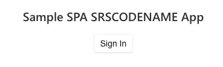
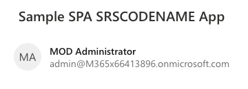
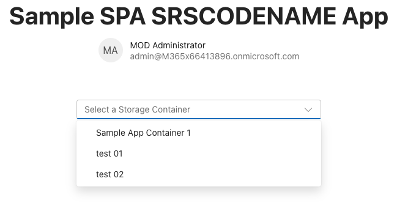
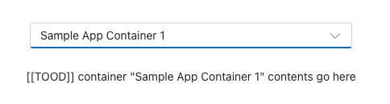
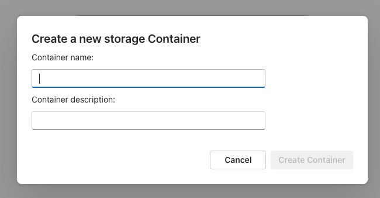
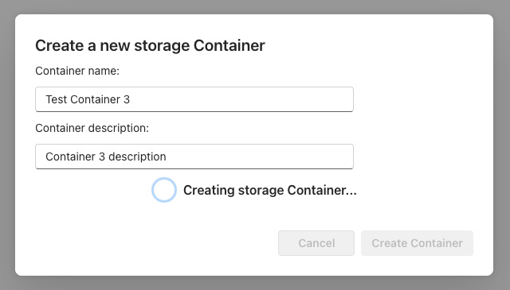
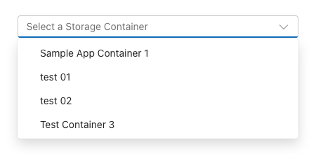

# Hands on Lab - Update app to create and list SharePoint Embedded Containers

In this exercise, you’ll update the existing project to create and retrieve SharePoint Embedded Containers.

## Add login functionality to the front-end React SPA

Let’s start by adding support for user login to the React SPA front-end project. This involves adding some configuration code for the Microsoft Authentication Library (MSAL) and configuring the Microsoft Graph Toolkit with the necessary login details.

### Setup the authentication provider

Locate and open the **./src/index.tsx** file.

Add the following imports after the existing imports:

```typescript
import { Providers } from "@microsoft/mgt-element";
import { Msal2Provider } from "@microsoft/mgt-msal2-provider";
import * as Constants from "./common/constants"
import * as Scopes from "./common/scopes";
```

Finally, add the following code before the React rendering code to configure a global MSAL provider for the Microsoft Graph Toolkit:

```typescript
Providers.globalProvider = new Msal2Provider({
  clientId: Constants.CLIENT_ENTRA_APP_CLIENT_ID,
  scopes: [
    ...Scopes.GRAPH_OPENID_CONNECT_BASIC,
    Scopes.GRAPH_USER_READ_ALL,
    Scopes.GRAPH_FILES_READ_WRITE_ALL,
    Scopes.GRAPH_SITES_READ_ALL,
    Scopes.SPEMBEDDED_FILESTORAGECONTAINER_SELECTED
  ]
});
```

### Update app homepage to handle sign-in and sign-out process

Locate and open the **./src/App.tsx** file. Remove the import for for the `logo.svg` file, then add and update the remaining imports to reflect the following code:

```typescript
import React, {
  useState, useEffect
} from "react";
import {
  Providers,
  ProviderState
} from "@microsoft/mgt-element";
import { Login } from "@microsoft/mgt-react";
import {
  FluentProvider,
  Text,
  webLightTheme
} from "@fluentui/react-components"
import './App.css';
import {
  InteractionRequiredAuthError,
  PublicClientApplication
} from "@azure/msal-browser";
import * as Scopes from "./common/scopes";
import * as Constants from "./common/constants";
```

After the import statements, add the following custom React hook to get the current user’s sign-in status:

```typescript
function useIsSignedIn() {
  const [isSignedIn, setIsSignedIn] = useState(false);

  useEffect(() => {
    const updateState = async () => {
      const provider = Providers.globalProvider;
      setIsSignedIn(provider && provider.state === ProviderState.SignedIn);
    };

    Providers.onProviderUpdated(updateState);
    updateState();

    return () => {
      Providers.removeProviderUpdatedListener(updateState);
    }
  }, []);

  return isSignedIn;
}
```

Now, update the `App` by adding the following code after the declaration:

```typescript
const isSignedIn = useIsSignedIn();

const promptForContainerConsent = async (event: CustomEvent<undefined>): Promise<void> => {
  const containerScopes = {
    scopes: [Scopes.SPEMBEDDED_FILESTORAGECONTAINER_SELECTED],
    redirectUri: `${window.location.protocol}://${window.location.hostname}${(window.location.port === '80' || window.location.port === '443') ? '' : ':' + window.location.port}`
  };

  const msalInstance = new PublicClientApplication({
    auth: {
      clientId: Constants.CLIENT_ENTRA_APP_CLIENT_ID,
      authority: Constants.CLIENT_ENTRA_APP_AUTHORITY,
    },
    cache: {
      cacheLocation: 'localStorage',
      storeAuthStateInCookie: false,
    },
  });

  msalInstance.acquireTokenSilent(containerScopes)
    .then(response => {
      console.log('tokenResponse', JSON.stringify(response));
    })
    .catch(async (error) => {
      if (error instanceof InteractionRequiredAuthError) {
        return msalInstance.acquireTokenPopup(containerScopes);
      }
    });
}
```

This code will first get the current sign-in status of the user and then configure and obtain an access token once the user selects a button in the rendering.

Lastly, update the component’s rendering by replacing the component’s `return()` statement with the following:

```tsx
return (
  <FluentProvider theme={webLightTheme}>
    <div className="App">
      <Text size={900} weight='bold'>Sample SPA SharePoint Embedded App</Text>
      <Login loginCompleted={promptForContainerConsent} />
      <div>
      </div>
    </div>
  </FluentProvider>
);
```

## Test the authentication for the React app

Now let’s test the client-side React app to ensure the authentication is working.

From the command line in the root folder of the project, run the following command:

```console
npm run start
```

The script will build the server-side & client-side projects, start them up, and launch a browser to the client-side project:



Select the **Sign In** button and sign in using the **Work and School** account with admin access to your Microsoft 365 tenant.

After signing in successfully, you’ll be redirected back to your React app displaying the name and email of the signed-in user:



Stop the server by pressing <kbd>CTRL</kbd> + <kbd>C</kbd> in the console.

## Add the ability to list and select Containers

With the basic project setup and configured to support user authentication, let’s now add support to list and select Containers in your tenant’s partition.

Container management is a privileged operation that requires an access token that must be obtained server side

Let’s start by first creating the server-side API parts to support the React app.

### Add utility method to retrieve an OBO token to call Microsoft Graph

We first need is a utility file to obtain a token using the OAuth2 On-Behalf-Of flow using our existing credential.

Create a new file **./server/auth.ts** and add the following code to it:

```typescript
import { ConfidentialClientApplication } from "@azure/msal-node";
require('isomorphic-fetch');
import * as MSGraph from '@microsoft/microsoft-graph-client';
import * as Scopes from './common/scopes';

export const getGraphToken = async (confidentialClient: ConfidentialClientApplication, token: string): Promise<[boolean, string | any]> => {
  try {
    const graphTokenRequest = {
      oboAssertion: token,
      scopes: [
        Scopes.GRAPH_SITES_READ_ALL,
        Scopes.SPEMBEDDED_FILESTORAGECONTAINER_SELECTED
      ]
    };
    const oboGraphToken = (await confidentialClient.acquireTokenOnBehalfOf(graphTokenRequest))!.accessToken;
    return [true, oboGraphToken];
  } catch (error: any) {
    const errorResult = {
      status: 500,
      body: JSON.stringify({
        message: `Unable to generate Microsoft Graph OBO token: ${error.message}`,
        providedToken: token
      })
    };
    return [false, errorResult];
  }
}
```

This will take a configured `ConfidentialClientApplication` and the user’s ID token and use the MSAL library to request a new token we can use to call Microsoft Graph.

### Add Container management to the server-side API project

Now let’s create the an handler to get a list of the Containers using Microsoft Graph to be returned back to our React app. Create a new file **./server/listContainer.ts** and add the following imports to it:

```typescript
import {
  Request,
  Response
} from "restify";
import * as MSAL from "@azure/msal-node";
require('isomorphic-fetch');
import * as MSGraph from '@microsoft/microsoft-graph-client';
import { getGraphToken } from "./auth";
```

Next, add the following code to create an instance of an MSAL `ConfidentialClientApplication` that will be used to obtain the OBO access token:

```typescript
const msalConfig: MSAL.Configuration = {
  auth: {
    clientId: process.env['API_ENTRA_APP_CLIENT_ID']!,
    authority: process.env['API_ENTRA_APP_AUTHORITY']!,
    clientSecret: process.env['API_ENTRA_APP_CLIENT_SECRET']!
  },
  system: {
    loggerOptions: {
      loggerCallback(loglevel: any, message: any, containsPii: any) {
        console.log(message);
      },
      piiLoggingEnabled: false,
      logLevel: MSAL.LogLevel.Verbose,
    }
  }
};

const confidentialClient = new MSAL.ConfidentialClientApplication(msalConfig);
```

Create and export a new function that will do the following:

- Verify the request includes an `Authorization` header with an access token it.
- Use that use that token and the `ConfidentialClientApplication` to obtain an OBO token we can use to call Microsoft Graph.
- Use the OBO token to create a new `AuthenticationProvider` client we’ll use to call Microsoft Graph.

```typescript
export const listContainers = async (req: Request, res: Response) => {
  if (!req.headers.authorization) {
    res.send(401, { message: 'No access token provided.' });
    return;
  }

  const [bearer, token] = req.headers.authorization.split(' ');

  const [graphSuccess, graphTokenRequest] = await getGraphToken(confidentialClient, token);

  if (!graphSuccess) {
    res.send(200, graphTokenRequest);
    return;
  }

  const authProvider = (callback: MSGraph.AuthProviderCallback) => {
    callback(null, graphTokenRequest);
  };
}
```

The last step is to crate the Microsoft Graph client and request all Containers that have a specific `ContainerTypeId` set. Add the following code immediacy before the function’s closing bracket:

```typescript
try {
  const graphClient = MSGraph.Client.init({
    authProvider: authProvider,
    defaultVersion: 'beta'
  });

  const graphResponse = await graphClient.api(`storage/fileStorage/containers?$filter=containerTypeId eq ${process.env["CONTAINER_TYPE_ID"]}`).get();

  res.send(200, graphResponse);
  return;
} catch (error: any) {
  res.send(500, { message: `Unable to list containers: ${error.message}` });
  return;
}
```

Add this new endpoint to our restify server. Locate and open the **./server/index.ts** file, add a single import statement to the end of the existing imports, and add a listener for HTTP GET requests to the `/api/listContainers` endpoint:

```typescript
import { listContainers } from "./listContainers";
...

server.get('/api/listContainers', async (req, res, next) => {
  try {
    const response = await listContainers(req, res);
    res.send(200, response)
  } catch (error: any) {
    res.send(500, { message: `Error in API server: ${error.message}` });
  }
  next();
});
```

### Update the React project to display our Containers

With the server-side API setup, we can update our React project to provide users an interface to select an existing Container, or create a new Container.

Start by creating a new interface, **./src/common/IContainer.ts**, with the following contents to represent the object we’ll send and receive from Microsoft Graph calls:

```typescript
export interface IContainer {
  id: string;
  displayName: string;
  containerTypeId: string;
  createdDateTime: string;
}
```

Create a new service that will be used to call our API endpoint or make direct calls from the React app to the Microsoft Graph. Create a new file **./src/services/spembedded.ts** and add the following code to it:

```typescript
import { Providers, ProviderState } from '@microsoft/mgt-element';
import * as Msal from '@azure/msal-browser';
import * as Constants from './../common/constants';
import * as Scopes from './../common/scopes';
import { IContainer } from './../common/IContainer';

export default class SRSCODENAME {
}
```

Next, add a utility function to obtain an access token we can use to call Microsoft Graph. This will create a MSAL `PublicClientApplication` that we’ll use to submit to call our server-side API. Add the following function to the SharePoint Embedded class:

```typescript
async getApiAccessToken() {
  const msalConfig: Msal.Configuration = {
    auth: {
      clientId: Constants.CLIENT_ENTRA_APP_CLIENT_ID,
      authority: Constants.CLIENT_ENTRA_APP_AUTHORITY,
    },
    cache: {
      cacheLocation: 'localStorage',
      storeAuthStateInCookie: false
    }
  };

  const scopes: Msal.SilentRequest = {
    scopes: [`api://${Constants.CLIENT_ENTRA_APP_CLIENT_ID}/${Scopes.SPEMBEDDED_CONTAINER_MANAGE}`],
    prompt: 'select_account',
    redirectUri: `${window.location.protocol}//${window.location.hostname}${(window.location.port === '80' || window.location.port === '443') ? '' : ':' + window.location.port}`
  };

  const publicClientApplication = new Msal.PublicClientApplication(msalConfig);
  await publicClientApplication.initialize();

  let tokenResponse;
  try {
    tokenResponse = await publicClientApplication.acquireTokenSilent(scopes);
    return tokenResponse.accessToken;
  } catch (error) {
    if (error instanceof Msal.InteractionRequiredAuthError) {
      tokenResponse = await publicClientApplication.acquireTokenPopup(scopes);
      return tokenResponse.accessToken;
    }
    console.log(error)
    return null;
  }
};
```

Add the following `listContainers()` method that will call our server-side API to get a list of all our Containers. This will get the access token our utility method returns and include it in calls to the server-side API. Recall that this access token is used to create a MSAL `ConfidentialClientApplication` to obtain an OBO token to call Microsoft Graph. That OBO token has more permissions granted to it that we can only get from a server-side call:

```typescript
async listContainers(): Promise<IContainer[] | undefined> {
  const api_endpoint = `${Constants.API_SERVER_URL}/api/listContainers`;

  if (Providers.globalProvider.state === ProviderState.SignedIn) {
    const token = await this.getApiAccessToken();
    const containerRequestHeaders = {
      'Authorization': `Bearer ${token}`,
      'Content-Type': 'application/json'
    };
    const containerRequestOptions = {
      method: 'GET',
      headers: containerRequestHeaders
    };
    const response = await fetch(api_endpoint, containerRequestOptions);

    if (response.ok) {
      const containerResponse = await response.json();
      return (containerResponse.value)
        ? (containerResponse.value) as IContainer[]
        : undefined;
    } else {
      console.error(`Unable to list Containers: ${JSON.stringify(response)}`);
      return undefined;
    }
  }
};
```

Now, create a new React component that will handle all our Container tasks and UI. Create a new file, **./src/components/containers.tsx**, and add the following code to it:

```typescript
import React, { useEffect, useState } from 'react';
import {
  Button,
  Dialog, DialogActions, DialogContent, DialogSurface, DialogBody, DialogTitle, DialogTrigger,
  Dropdown, Option,
  Input, InputProps, InputOnChangeData,
  Label,
  Spinner,
  makeStyles, shorthands, useId
} from '@fluentui/react-components';
import type {
  OptionOnSelectData,
  SelectionEvents
} from '@fluentui/react-combobox'
import { IContainer } from "./../common/IContainer";
import SpEmbedded from '../services/spembedded';

const SpEmbedded = new SpEmbedded();

const useStyles = makeStyles({
  root: {
    display: 'flex',
    flexDirection: 'column',
    alignItems: 'center',
    justifyContent: 'center',
    ...shorthands.padding('25px'),
  },
  containerSelector: {
    display: 'flex',
    flexDirection: 'column',
    alignItems: 'center',
    justifyContent: 'center',
    rowGap: '10px',
    ...shorthands.padding('25px'),
  },
  containerSelectorControls: {
    width: '400px',
  },
  dialogContent: {
    display: 'flex',
    flexDirection: 'column',
    rowGap: '10px',
    marginBottom: '25px'
  }
});

export const Containers = (props: any) => {
  // BOOKMARK 1 - constants & hooks

  // BOOKMARK 2 - handlers go here

  // BOOKMARK 3 - component rendering
  return (
  );
}

export default Containers;
```

> [!NOTE]
> Notice the `// BOOKMARK #` comments in the component. We’ll use these to ensure you’re adding code in the correct places.

The first step is to get a list of the Containers. Start by adding the following code before `// BOOKMARK 1`. This will set a few state values to hold the Containers retrieved from our server-side API:

```typescript
const [containers, setContainers] = useState<IContainer[]>([]);
const [selectedContainer, setSelectedContainer] = useState<IContainer | undefined>(undefined);
const containerSelector = useId('containerSelector');
```

Next, add the following React hook after `// BOOKMARK 1` to get all Containers when the page loads and set the state object that will keep track of them:

```typescript
useEffect(() => {
  (async () => {
    const containers = await SpEmbedded.listContainers();
    if (containers) {
      setContainers(containers);
    }
  })();
}, []);
```

Update the rendering by adding the following to the `return()` method after the `// BOOKMARK 3` code. This will create a `DropDown` control and a a placeholder where we’ll add a list of the contents in the selected Container:

```tsx
<div className={styles.root}>
  <div className={styles.containerSelector}>
    <Dropdown
      id={containerSelector}
      placeholder="Select a Storage Container"
      className={styles.containerSelectorControls}
      onOptionSelect={onContainerDropdownChange}>
      {containers.map((option) => (
        <Option key={option.id} value={option.id}>{option.displayName}</Option>
      ))}
    </Dropdown>
  </div>
  {selectedContainer && (`[[TOOD]] container "${selectedContainer.displayName}" contents go here`)}
</div>
```

This code uses a styling object we added to the component when we initially created it. To use the styles, add the following code immediately before the `return()` statement and `// BOOKMARK 3` comment:

```typescript
const styles = useStyles();
```

The last step is to add our new `Containers`component to the app. Locate and open the `./src/App.tsx` file and add the following import after the existing imports:

```typescript
import Containers from "./components/containers";
```

Locate the `<div></div>` markup in the component’s `return()`. Replace that markup with the following to add our `Containers` component only if the user is signed in:

```tsx
<div>
  {isSignedIn && (<Containers />)}
</div>
```

## Test listing and selecting Containers

Now let’s test the client-side React app to see the effects of our changes to list and display Containers in the React app.

From the command line in the root folder of the project, run the following command:

```console
npm run start
```

When the browser loads, sign-in using the same **Work and School** account you’ve been using.

After signing-in, the page will reload and should display a list of Containers if you’ve previously created any.



When you select a Container, notice the conditional logic will show the placeholder with the name of the Container selected:



Stop the server by pressing <kbd>CTRL</kbd> + <kbd>C</kbd> in the console.

## Add the ability to create new Containers

In this section you’ll update the server-side API and React app to create new contains from our web application.

Let’s start by first creating the server-side API parts to support the React app.

### Add support to create Containers to the server-side API project

Now let’s create the handler to get create a Container using Microsoft Graph to be returned back to our React app. Create a new file **./server/createContainer.ts** and add the following imports to it:

```typescript
import {
  Request,
  Response
} from "restify";
import * as MSAL from "@azure/msal-node";
require('isomorphic-fetch');
import * as MSGraph from '@microsoft/microsoft-graph-client';
import { getGraphToken } from "./auth";
```

Next, add the following code to create an instance of an MSAL `ConfidentialClientApplication` that will be used to obtain the OBO access token:

```typescript
const msalConfig: MSAL.Configuration = {
  auth: {
    clientId: process.env['API_ENTRA_APP_CLIENT_ID']!,
    authority: process.env['API_ENTRA_APP_AUTHORITY']!,
    clientSecret: process.env['API_ENTRA_APP_CLIENT_SECRET']!
  },
  system: {
    loggerOptions: {
      loggerCallback(loglevel: any, message: any, containsPii: any) {
        console.log(message);
      },
      piiLoggingEnabled: false,
      logLevel: MSAL.LogLevel.Verbose,
    }
  }
};

const confidentialClient = new MSAL.ConfidentialClientApplication(msalConfig);
```

Create and export a new function that will do the following:

- Verify the request includes an `Authorization` header with an access token it.
- Use that use that token and the `ConfidentialClientApplication` to obtain an OBO token we can use to call Microsoft Graph.
- Use the OBO token to create a new `AuthenticationProvider` client we’ll use to call Microsoft Graph.

```typescript
export const createContainer = async (req: Request, res: Response) => {
  if (!req.headers.authorization) {
    res.send(401, { message: 'No access token provided.' });
    return;
  }

  const [bearer, token] = req.headers.authorization.split(' ');

  const [graphSuccess, graphTokenRequest] = await getGraphToken(confidentialClient, token);

  if (!graphSuccess) {
    res.send(200, graphTokenRequest);
    return;
  }

  const authProvider = (callback: MSGraph.AuthProviderCallback) => {
    callback(null, graphTokenRequest);
  };
}
```

The last step is to crate the Microsoft Graph client and submit the request to create a new Container that have a specific `ContainerTypeId` set. Add the following code immediacy before the function’s closing bracket:

```typescript
try {
  const graphClient = MSGraph.Client.init({
    authProvider: authProvider,
    defaultVersion: 'beta'
  });

  const containerRequestData = {
    displayName: req.body!.displayName,
    description: (req.body?.description) ? req.body.description : '',
    containerTypeId: process.env["CONTAINER_TYPE_ID"]
  };

  const graphResponse = await graphClient.api(`storage/fileStorage/containers`).post(containerRequestData);

  res.send(200, graphResponse);
  return;
} catch (error: any) {
  res.send(500, { message: `Failed to create container: ${error.message}` });
  return;
}
```

Add this new endpoint to our restify server. Locate and open the **./server/index.ts** file, add a single import statement to the end of the existing imports, and add a listener for HTTP GET requests to the `/api/createContainers` endpoint:

```typescript
import { createContainer } from "./createContainer";

...

server.post('/api/createContainer', async (req, res, next) => {
  try {
    const response = await createContainer(req, res);
    res.send(200, response)
  } catch (error: any) {
    res.send(500, { message: `Error in API server: ${error.message}` });
  }
  next();
});
```

### Update the React project to create a new Container

Locate and open the file **./src/services/spembedded.ts** and add the following code the class:

```typescript
async createContainer(containerName: string, containerDescription: string = ''): Promise<IContainer | undefined> {
  const api_endpoint = `${Constants.API_SERVER_URL}/api/createContainer`;

  if (Providers.globalProvider.state === ProviderState.SignedIn) {
    const token = await this.getApiAccessToken();
    const containerRequestHeaders = {
      'Authorization': `Bearer ${token}`,
      'Content-Type': 'application/json'
    };

    const containerRequestData = {
      displayName: containerName,
      description: containerDescription
    };
    const containerRequestOptions = {
      method: 'POST',
      headers: containerRequestHeaders,
      body: JSON.stringify(containerRequestData)
    };

    const response = await fetch(api_endpoint, containerRequestOptions);

    if (response.ok) {
      const containerResponse = await response.json();
      return containerResponse as IContainer;
    } else {
      console.error(`Unable to create container: ${JSON.stringify(response)}`);
      return undefined;
    }
  }
};
```

This new method is similar to the existing `listContainers()` method, except it creates a new object and submits it as a POST to our server-side API.

The last step is to update our `Containers` component to update the UI to support creating a Container. Locate and open the **./src/components/containers.tsx** file.

For this step, we’ll use a Fluent UI React `Dialog` component. Start by adding the following state objects and UI component ID objects immediately before the `// BOOKMARK 1` comment:

```typescript
const [dialogOpen, setDialogOpen] = useState(false);
const containerName = useId('containerName');
const [name, setName] = useState('');
const containerDescription = useId('containerDescription');
const [description, setDescription] = useState('');
const [creatingContainer, setCreatingContainer] = useState(false);
```

Next, add the following code immediately before the `// BOOKMARK 2` comment. These handlers are used to update the name and description properties for the new Container from from the `Input` components that will be in the `Dialog`. They are also used to handle with the user clicks a button to create the Container:

```typescript
const handleNameChange: InputProps["onChange"] = (event: React.ChangeEvent<HTMLInputElement>, data: InputOnChangeData): void => {
  setName(data?.value);
};

const handleDescriptionChange: InputProps["onChange"] = (event: React.ChangeEvent<HTMLInputElement>, data: InputOnChangeData): void => {
  setDescription(data?.value);
};

const onContainerCreateClick = async (event: React.MouseEvent<HTMLButtonElement>): Promise<void> => {
  setCreatingContainer(true);
  const newContainer = await SpEmbedded.createContainer(name, description);

  if (newContainer) {
    setName('');
    setDescription('');
    setContainers(current => [...current, newContainer]);
    setSelectedContainer(newContainer);
    setDialogOpen(false);
  } else {
    setName('');
    setDescription('');
  }
  setCreatingContainer(false);
}
```

Finally, add the following React code immediately after the closing `</Dropdown>` element. This will create a Fluent UI React `Dialog` component that’s triggered from a button:

```tsx
<Dialog open={dialogOpen} onOpenChange={(event, data) => setDialogOpen(data.open)}>

  <DialogTrigger disableButtonEnhancement>
    <Button className={styles.containerSelectorControls} appearance='primary'>Create a new storage Container</Button>
  </DialogTrigger>

  <DialogSurface>
    <DialogBody>
      <DialogTitle>Create a new storage Container</DialogTitle>

      <DialogContent className={styles.dialogContent}>
        <Label htmlFor={containerName}>Container name:</Label>
        <Input id={containerName} className={styles.containerSelectorControls} autoFocus required
          value={name} onChange={handleNameChange}></Input>
        <Label htmlFor={containerDescription}>Container description:</Label>
        <Input id={containerDescription} className={styles.containerSelectorControls} autoFocus required
          value={description} onChange={handleDescriptionChange}></Input>
        {creatingContainer &&
          <Spinner size='medium' label='Creating storage Container...' labelPosition='after' />
        }
      </DialogContent>

      <DialogActions>
        <DialogTrigger disableButtonEnhancement>
          <Button appearance="secondary" disabled={creatingContainer}>Cancel</Button>
        </DialogTrigger>
        <Button appearance="primary"
          value={name}
          onClick={onContainerCreateClick}
          disabled={creatingContainer || (name === '')}>Create storage Container</Button>
      </DialogActions>
    </DialogBody>
  </DialogSurface>

</Dialog>
```

## Test creating new Containers

Now let’s test the client-side React app to see the effects of our changes to create Containers in the React app.

From the command line in the root folder of the project, run the following command:

```console
npm run start
```

When the browser loads, sign-in using the same **Work and School** account you’ve been using.

After signing-in, the page will reload and should now include a button to launch the dialog:


Select the **Create a new storage Container** button to open the dialog. Notice how the button is disabled until you enter a name:



Enter a name and description for the Container and select the **Create storage Container**. While creating the Container, the buttons are disabled and a `Spinner` control shows the user it’s working:



Once the dialog disappears, you’ll see the selector new displays our new Container!



Stop the server by pressing <kbd>CTRL</kbd> + <kbd>C</kbd> in the console.

## Summary

In this exercise, you updated the existing project to create and retrieve SharePoint Embedded Containers.

## Next Steps

Let's get started and continue with the next topic in this tutorial, [Hands on Lab - Update app to create and list SharePoint Embedded Containers](m02-06-unit.md), where you'll learn how to store and delete files in a SharePoint Embedded Container with Microsoft Graph REST APIs.
