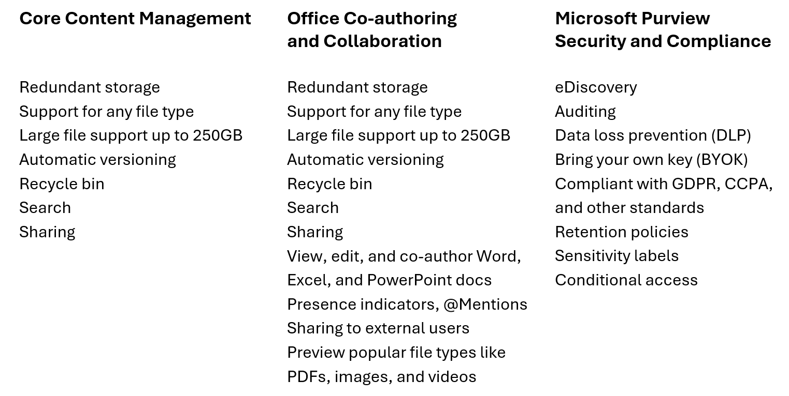

### In this article
* What is SharePoint repository services?
* When should you use SharePoint repository services?
* What can you do with SharePoint repository services?
* Key Features
* [Getting started with SharePoint repository services](./getting-started/getting-started.md)

# Overview

Microsoft SharePoint repository services are a cloud-based file and document management system suitable for use in any application. SharePoint repository services is a new API only solution which enables app developers to harness the power of the Microsoft 365 file and document storage platform for any app, and is suitable for enterprises building line of business applications and ISVs building multi-tenant applications.

## Getting Started with SharePoint repository services
Before you can start using SharePoint repository services, you'll need to setup your app structure as described above. The fastest way to do that is to follow the steps in the [Quickstart](./getting-started/getting-started.md) section of this repository. Once your basic app structure is in place, use the resources provided here to continue your app development journey. 

1. Try out the Postman collection to get familiar with SharePoint repository services APIs
1. Look at and run the Sample apps included in this repository to see Syntex repository services in action
1. Read the Concepts articles for a more in-depth understanding of Syntex repository services
1. Build your own application

## Key Benefits of SharePoint repository services
TODO: explain in bullet point form the features they get
SharePoint repository services provides a faster way to build file and document focused apps. When you build with SharePoint repository services, you instantly deliver the rich content management, security and compliance, and Office collaboration capabilities your enterprise customers demand.  If your app works with files and documents in any way, SharePoint repository services is the fastest path to being global enterprise ready.  

Powered by SharePoint, it makes it simple for every developer, ISV and enterprise, to include critical Microsoft 365 file and document capabilities in every app they build. A headless storage platform with no user experience layer and fully API driven.

## Introducing File Storage Containers
TODO: fix heading, give high-level summary
SharePoint repository services use Microsoft Graph APIs to store the files and documents your app manages in a new entity called a "File Storage Container” or Container for short.  If you’re an ISV, SharePoint repository services containers live in your customer’s M365 tenant, and if you’re an enterprise, SharePoint repository services lives in your tenant.  SharePoint repository services containers are dedicated to and accessible by just your app, so the files and documents your app depends on are isolated and secure within that tenant boundary.  
  

SharePoint repository services is used in several scenarios 

* Certain Microsoft products use SharePoint repository services to manage customer content, such as Loop and Designer. 

* ISV can use SharePoint repository services to manage their customer content within their customer’s M365 tenant 

* Enterprises can use SharePoint repository services to manage and store their own content within their own M365 tenant, but outside of regular M365 entitlements 

## Key Features
SharePoint repository services gives you, the application developer, complete control over the user experiences of your file and document centric apps. You can build a structured user experiences with engagement or workflow based apps.

TODO: make this a paragraph (condense/summarize)
Here are some examples:
- Extended Relationship Management (XRM) applications
 - Engagement based applications
 - Workflow based collaboration, with defined state 
 - Deal room applications
 - Shared research environments 
 - Applying evidence to mortgage application
 - Identity document verification 

read more on these [scenarios](./adoptions-and-use.md)

When you build your application on SharePoint repository services, you empower your customers and users with a number of key features. 

TODO: make this a paragraph (condense/summarize)

<!-- 
 -->

<!-- ### Core Content Management
- Redundant storage
- Support for any file type
- Large file support up to 250GB
- Automatic versioning
- Recycle bin
- Search
- Sharing

### Office Co-authoring and Collaboration
- View, edit, and co-author Word, Excel, and PowerPoint documents
- Presence indicators and @Mentions
- Sharing to external users
- Preview popular file types like PDFs, images, and videos

### Microsoft Purview Security and Compliance
- eDiscovery
- Auditing
- Data loss prevention (DLP)
- Bring your own key (BYOK)
- Compliant with GDPR, CCPA, and other standards
- Retention policies
- Sensitivity labels
- Conditional access -->

<!--
# Support

 Support options are available to admins who can sign in to the [Microsoft 365 admin center](https://admin.microsoft.com/) with their admin account to contact support on behalf of users in their organization.

TODO: place support
-->

 TODO: take from Build blog post to condense in those feature lists
