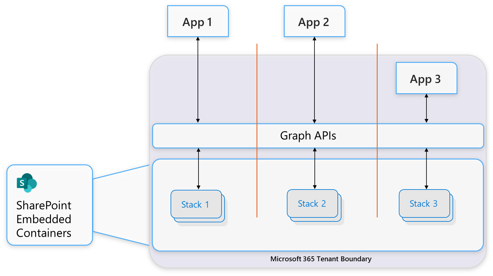
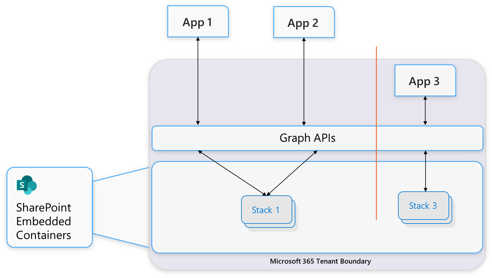

# Understand app and tenant architecture

**Applies to:** Architect

<!-- agent:
task_type: concept
audience: architect
outcome: Understand where apps are owned, where containers are created, and how tenant roles affect architecture.
next: ../plan/choose-app-model.md
-->

Use this article to map the core SharePoint Embedded architecture before you choose an app model or create a container type.

SharePoint Embedded is API-only storage built on Microsoft 365. Your application provides the user experience. Files and documents are stored in containers and accessed through Microsoft Graph.

## Architecture at a glance

SharePoint Embedded separates three concepts:

- The application that calls Microsoft Graph.
- The container type that defines application access, behavior, and billing accountability.
- The containers and files that live inside a Microsoft 365 tenant boundary.

SharePoint Embedded stores all files and documents in containers.

Applications create containers and container content within a Microsoft 365 tenant.

Applications create, manage, and interact with containers and container content through Microsoft Graph.

*Figure 1: The application calls Microsoft Graph, and Graph reads and writes files in containers that live inside the Microsoft 365 tenant boundary.*

## Developer tenant and consuming tenant

SharePoint Embedded uses two tenant roles.

| Tenant role | Meaning | Typical responsibility |
| --- | --- | --- |
| Developer tenant | The Microsoft Entra ID tenant where a container type is created. | Own the Microsoft Entra ID app registration and manage the container type. |
| Consuming tenant | The Microsoft Entra ID tenant where a container type is used. | Host containers and content for users of the application. |

The same Microsoft Entra ID tenant can be both the developer tenant and the consuming tenant for a given container type.

For example, an enterprise line-of-business (LOB) app can be owned by the enterprise tenant and used in that same tenant.

An independent software vendor (ISV) app can be owned by the ISV tenant and used in many different customer tenants.

> [!IMPORTANT]
> Containers and content are stored in the consuming tenant. They don't move into the developer tenant just because the app is owned there.

## App ownership

A SharePoint Embedded application is a Microsoft Entra ID application registration.

As an owning or guest application to a container type, the app has access to containers of that container type.

SharePoint Embedded requires a 1:1 relationship between an owning application and a container type.

This means:

- One owning app owns only one container type.
- A container type is owned by exactly one app.
- The owning app developer is responsible for creating and managing that container type.
- The owning app defines the access controls for guest apps to containers of that type.

> [!NOTE]
> Other applications can be granted access to the same container type, but the container type still has only one owning application.

## Container types

A container type is a SharePoint Embedded resource.

It defines the relationship, access privileges, and billing accountability between an application and a set of containers.

It also defines selected behaviors for all containers of that type.

Each container includes its container type as an immutable property.

Use a container type to answer these architecture questions:

- Which app owns this family of containers?
- Which tenant is accountable for billing?
- Which behavior settings apply to all containers of this type?

For more detail, see [Understand container types and containers](../plan/container-types-containers.md).

## Container type registration resource

A container type registration is also a SharePoint Embedded resource.

It represents the installation of a container type in a specific consuming tenant. It also defines selected behaviors for all containers of that type in that specific consuming tenant.

Use a container type registration to answer these architecture questions:

- Which apps can access containers of this type in a consuming tenant?
- Which tenant can create containers of this type?
- Which behavior settings apply to all containers of this type in a consuming tenant?

For more detail, see [Understand container types and containers](../plan/container-types-containers.md).

## Containers

A container is the basic storage unit in SharePoint Embedded.

A container also defines a security and compliance boundary.

Applications can create many containers for a container type inside each consuming tenant.

Each container provides a place to store files. You can think of it as similar to an API-only document library in SharePoint Online, with differences specific to SharePoint Embedded.

Containers can store many files and multiple terabytes of content, subject to SharePoint Embedded limits.

For current limits, see [Understand limits and calling patterns](../plan/limits-calling-patterns.md).

## Where files live

When a consuming tenant uses a SharePoint Embedded app, SharePoint Embedded creates a storage partition in that Microsoft 365 tenant.

The partition doesn't have a SharePoint Online user experience.

Documents in the partition are accessible through APIs and through app-provided content experiences.

Files remain inside the consumer's Microsoft 365 tenant boundary.

The consuming tenant's Microsoft 365 settings apply to app documents, including supported Microsoft Purview security and compliance policies.

For governance planning, see [Plan security, compliance, and governance](../plan/security-compliance-governance.md).

## Container type registrations

An owning app can't interact with containers in a consuming tenant until the container type is registered in that consuming tenant.

The owning application performs container type registration.

The registration specifies the permissions that the owning app and guest apps have on containers of that container type in the consuming tenant.

For full registration requirements, see [Register file storage container type application permissions](../build/register-application-permissions.md).

## Access relationships

An application's access to containers and content is determined by permissions configured during container type registration.

The owning application receives permissions for its container type when the container type is created. However, it can only interact with containers of its container type after registration in a consuming tenant.

The following diagram shows the dedicated pattern. Three applications are deployed in one tenant: two independent software vendor (ISV) apps (App 1 and App 2) and one line-of-business (LOB) app (App 3). Each app owns a separate container type and can access only the stack of containers for the container type it owns.

*Figure 2: Dedicated access. Each application owns one container type and reaches only its own containers.*

SharePoint Embedded also allows applications to access containers of container types they don't own when those permissions are granted in the container type registration.

The next diagram shows the shared pattern. App 1 and App 2 both have access to the same container type, so both apps can access the same stack of containers.

*Figure 3: Shared access. One app owns the container type, and another app is granted access to the same containers.*

Plan the access model with both application permissions and user container permissions.

For full details, see [Plan authentication and permissions](../plan/authentication-permissions.md).

## Common architecture patterns

### Enterprise LOB app

In an enterprise LOB app:

- The enterprise tenant usually owns the app registration.
- The enterprise tenant creates the container type.
- The same enterprise tenant consumes the app.
- Containers and files are stored in the enterprise tenant.
- Enterprise admins manage billing, compliance, and tenant settings.

Use this model when the app is built for internal use in one organization.

### ISV multitenant app

In an ISV app:

- The ISV tenant owns the app registration.
- The ISV tenant creates the container type.
- Customer tenants consume the app.
- Containers and files are stored in each customer tenant.
- Customer tenant settings apply to that customer's content.

Use this model when one app is used by multiple customer tenants.

The following diagram shows a worked example. Contoso is an ISV that built a human-resources app on SharePoint Embedded and deployed it into Fabrikam, an auditing firm. Fabrikam also built its own LOB auditing app. Each app has its own container type: Contoso owns the HR app and its container type, and Fabrikam owns the auditing app and its container type. Fabrikam is the consuming tenant for both apps, so both stacks of containers are stored in Fabrikam's Microsoft 365 tenant. Fabrikam owns all the data stored in its Microsoft 365 tenant, including the HR App data.

*Figure 4: An ISV app (Contoso) and an LOB app (Fabrikam) each own a container type, and both store their containers in the same consuming tenant (Fabrikam).*

For model selection, see [Choose an app model: single-tenant or multitenant](../plan/choose-app-model.md).

## Planning checklist

- Identify the developer tenant.
- Identify each consuming tenant.
- Confirm where the Microsoft Entra ID app registration lives.
- Confirm which app registration owns the container type.
- Decide whether other guest apps need access.
- Decide where containers are created.
- Confirm that content must remain in the consuming tenant.
- Plan container type registration for each consuming tenant.
- Plan billing for the container type.
- Plan authentication and admin consent.
- Plan security and compliance responsibilities.

## Next steps

Choose the app model that matches your tenant and customer relationship: [Choose an app model: single-tenant or multitenant](../plan/choose-app-model.md).
