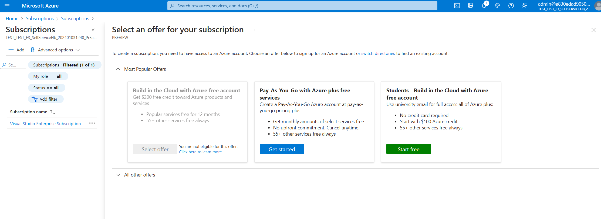
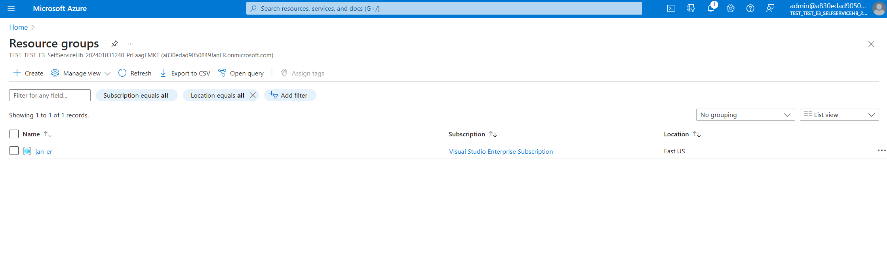
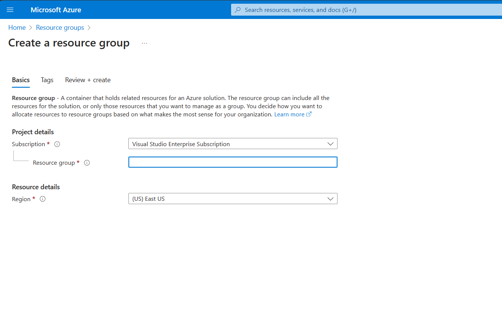

<!-- 
TODO:
- Link to a tenant that customers can use to try out trial container types (Not M365)
- Fix images for Azure Subscription Id, Resource Group, etc.
- Define steps for setting up an Azure Subscription Id (which subscription plan should customers choose if they are completely new)
- Add link to tutorial for registering application

- Add an explanation for region and resource group in SharePoint Embedded. Explain the difference that Region does NOT define what geo-location Containers can be created and stored. Explain that region basically means nothing except for the location that it is set in.
- Note: The Region Group does NOT require your Containers to live in that specified region. Your content is not restricted to the specified region
 -->


# Create a Standard Container Type in SharePoint Embedded
SharePoint Embedded [stores](../concepts/app-concepts/app-architecture.md) content securely in File Storage Containers. Each Container has a Container Type. No Containers can be created until a Container Type is created.  

The [Container Type](../concepts/app-concepts/containertypes.md), represented by a `ContainerTypeId` asssociates all Containers linked to it with a specific Azure Subscription. This article will explain how to create a Standard [Container Type](../concepts/app-concepts/containertypes.md). Read more about Container Types [here](../concepts/app-concepts/containertypes.md). If you would like to try out SharePoint Embedded for free you can quickly get started with a [Trial Container Type](https://learn.microsoft.com/en-us/sharepoint/dev/embedded/concepts/app-concepts/containertypes#sharepoint-embedded-trial-container-types).


**Pre-requisites:**
* You must have admin credentials to a M365 tenant
* You must register your application in [Microsoft Entra ID](https://learn.microsoft.com/en-us/training/modules/sharepoint-embedded-setup/5-exercise-setup-configure-sharepoint-embedded). See tutorial on how to [register an app with Microsoft Entra ID](https://learn.microsoft.com/en-us/power-apps/developer/data-platform/walkthrough-register-app-azure-active-directory).


## Set up an Azure Subscription Id, Resource Group, and Region

### 1. Set up Azure Subscription Id
Login to Azure Portal with the admin credentials of your tenant


(TODO: add the extra existing Sub id)

Navigate to [Subscriptions](https://portal.azure.com/#view/Microsoft_Azure_Billing/SubscriptionsBladeV2)


If you do not have an existing subscription set-up, click add


Choose a subscription plan. You will be prompted to add in credit card information that will be billed when you create File Storage Containers. This will set you up with an Azure Subscription Id.

### 2. Set up a Resource Group and Region
Navigate to [Resource Groups](https://portal.azure.com/#view/HubsExtension/BrowseResourceGroups) in Azure Portal.


Click "Create" to create a resource group and name it something appropiate to your application. Then click Review + Create


Make sure that:
* The appropiate Azure Subcription is selected for the resource group
* The appropiate physical region is selected. For ex. (US) East US

>> Note: The Region Group does NOT require your Containers to live in that specified region. Your content is not restricted to the specified region

Region refers to where the CT is created  for example “US-East”. This does NOT affect geographically where containers can live and does not affect geographically where applications are installed. Also, regions do not place limits on where SharePoint Embedded Applications can be used.

Click Review + Create and your validation should pass if the inputs are correct.

Now you have all the necessary resources to create a Standard Container Type which will defines the billing relationship between your Containers and Azure SubscriptionId.

<br></br>

## Create your Container Type

### 3. Use PowerShell to create a new Container Type for your Application
To learn more about the role of Container Types in SharePoint Embedded please refer to the [ContainerTypes](../concepts/app-concepts/containertypes.md) and [App Archictecture](../concepts/app-concepts/app-architecture.md) articles. To learn more about trial containers which are limited, but don't incur costs during the development of your application, see [Developer Admin](../concepts/admin-exp/dev-admin.md).

You need to install and import the latest **Microsoft.Online.SharePoint.PowerShell** module.

```powershell
Install-Module "Microsoft.Online.SharePoint.PowerShell" # if you don't have it already
# OR
Update-Module "Microsoft.Online.SharePoint.PowerShell" # if you have it already
```

Have the following information handy from [Azure Portal](portal.azure.com):
- OwningApplicationId
- AzureSubcriptionId
- Resource Group Name
- Region

With the module installed, you can run the following to create a new Container Type, replacing the `{{variables}}` as needed. For the `ContainerTypeName` choose a name that you would like for your new Container Type. Otherwise fill in the variables with the previous information from Azure Portal.

```powershell
Import-Module "Microsoft.Online.SharePoint.PowerShell"
Connect-SPOService -Url "{{SPO Admin Url}}"
$dummyGuid = [System.Guid]::NewGuid().ToString()
New-SPOContainerType -ContainerTypeName {{ContainerTypeName}} -OwningApplicationId {{OwningApplicationId}} -AzureSubscriptionId {{AzureSubscriptionId}} -ResourceGroup {{ResourceGroup}} -Region {{Region}}​
```

> [!TIP]
> To learn more about trial containers which are limited, but don't incur costs during the development of your application, see [Developer Admin](../concepts/admin-exp/dev-admin.md).

The cmdlet outputs your new `ContainerTypeId`, save this for later use.

### 3. Grant admin consent for your app

TODO: Take this out of the article and put it into the register CT article....
* this is step 1 for register

You can grant admin consent to an app by visiting the following link with the
`{{consumingTenantId}}` and `{{appId}}` values set.

```http
GET https://login.microsoftonline.com/{{consumingTenantid}}/adminconsent?client_id={{appId}}
```

## Register Your Container Type in the Consuming Tenant

### 4. Register the new Container Type

There are two options to register your new Container Type and provide application permissions.

### Calling the Register Container Type API

See the API documentation for Register File Storage Container Type Application Permissions [here](register-api.md)
* Please Note that you will need to use a cert-based access token to make this API call.
  

### Using the SharePoint Embedded Postman Collection

Use the [Postman collection](https://github.com/microsoft/SharePoint-Embedded-Samples/tree/main/Postman) from the [SharePoint Embedded Samples repo](https://github.com/microsoft/SharePoint-Embedded-Samples) to register the new Container Type on your tenant. 
* Please Note: This API call must be done using Application-only auth.

Set up the [Postman collection](https://github.com/microsoft/SharePoint-Embedded-Samples/tree/main/Postman) collection and its required Environment variables. Then use the **Register Container Type** request within the **Application > Containers** folder to complete the registration.

Once the registration is complete, you can now create Containers and manage their content using either Delegated or Application auth.
